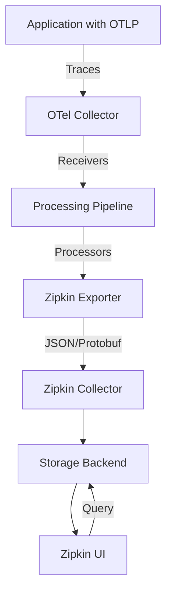

# How to Configure the Zipkin Exporter in the OpenTelemetry Collector

Author: [nawazdhandala](https://www.github.com/nawazdhandala)

Tags: OpenTelemetry, Collector, Exporters, Zipkin, Distributed Tracing, Observability

Description: Comprehensive guide to configuring the Zipkin exporter in OpenTelemetry Collector for distributed tracing, including setup, authentication, and optimization techniques.

Zipkin is one of the most widely adopted distributed tracing systems, originally developed at Twitter to help troubleshoot latency problems in microservices architectures. The OpenTelemetry Collector's Zipkin exporter allows you to send trace data to Zipkin backends, making it an excellent choice for teams already invested in the Zipkin ecosystem or those who want to leverage Zipkin's simple yet powerful UI for trace visualization.

## Why Use the Zipkin Exporter

The Zipkin exporter serves several important purposes in modern observability stacks. First, it enables gradual migration from Zipkin instrumentation to OpenTelemetry by allowing both systems to coexist. Second, it provides access to Zipkin's mature visualization tools and query capabilities. Third, it offers a lightweight tracing solution that's easier to deploy than some more complex distributed tracing platforms.

Zipkin's architecture is straightforward: applications send spans to a collector, which stores them in a backend database (such as Elasticsearch, Cassandra, or MySQL), and the Zipkin UI queries this database to display traces. The OpenTelemetry Collector fits naturally into this architecture by acting as a high-performance intermediary that can receive OTLP data and forward it in Zipkin's format.

## Understanding Zipkin Data Format

The Zipkin exporter supports multiple encoding formats for span data. The most common formats are JSON and Protobuf, with JSON being more human-readable and easier to debug, while Protobuf offers better performance and smaller payload sizes. The exporter automatically converts OpenTelemetry spans into Zipkin's span model, mapping fields like trace IDs, span IDs, timestamps, and tags appropriately.



## Basic Configuration

Here's a simple configuration to send traces from the OpenTelemetry Collector to a Zipkin server. This setup is ideal for development environments or small deployments.

```yaml
# Receive traces in OpenTelemetry Protocol format
receivers:
  otlp:
    protocols:
      grpc:
        endpoint: 0.0.0.0:4317
      http:
        endpoint: 0.0.0.0:4318

# Configure Zipkin exporter with minimal settings
exporters:
  zipkin:
    # Zipkin server endpoint (default Zipkin port is 9411)
    endpoint: http://localhost:9411/api/v2/spans

    # Data format: json or proto (protobuf)
    format: json

    # Default service name if not present in spans
    default_service_name: my-service

# Batch processor to improve performance
processors:
  batch:
    timeout: 10s
    send_batch_size: 1024

# Define the telemetry pipeline
service:
  pipelines:
    traces:
      receivers: [otlp]
      processors: [batch]
      exporters: [zipkin]
```

This configuration sets up an OTLP receiver that accepts traces via gRPC or HTTP, batches them for efficiency, and exports them to a local Zipkin instance. The JSON format is used for better debugging during initial setup.

## Production Configuration with Advanced Features

For production deployments, you'll want to add error handling, timeouts, and monitoring capabilities. Here's a more robust configuration.

```yaml
receivers:
  otlp:
    protocols:
      grpc:
        endpoint: 0.0.0.0:4317
        max_recv_msg_size_mib: 32
        keepalive:
          server_parameters:
            max_connection_idle: 11s
            max_connection_age: 12s
            max_connection_age_grace: 13s
            time: 30s
            timeout: 5s
      http:
        endpoint: 0.0.0.0:4318

exporters:
  zipkin:
    # Zipkin server endpoint with HTTPS for security
    endpoint: https://zipkin.example.com:9411/api/v2/spans

    # Use protobuf for better performance
    format: proto

    # Default service name
    default_service_name: otel-collector

    # Connection timeout
    timeout: 30s

    # HTTP client configuration
    http:
      # Maximum idle connections
      max_idle_conns: 100
      max_idle_conns_per_host: 10

      # Keep-alive duration
      idle_conn_timeout: 90s

      # TLS configuration for secure connections
      tls:
        insecure: false
        insecure_skip_verify: false
        ca_file: /etc/ssl/certs/zipkin-ca.crt
        cert_file: /etc/ssl/certs/client-cert.crt
        key_file: /etc/ssl/certs/client-key.key

      # Custom headers for authentication or routing
      headers:
        Authorization: Bearer ${ZIPKIN_API_TOKEN}
        X-Custom-Header: custom-value

    # Retry configuration for failed requests
    retry_on_failure:
      enabled: true
      initial_interval: 5s
      max_interval: 30s
      max_elapsed_time: 300s

    # Queue settings for handling backpressure
    sending_queue:
      enabled: true
      num_consumers: 10
      queue_size: 5000

processors:
  # Batch traces before sending
  batch:
    timeout: 10s
    send_batch_size: 2048
    send_batch_max_size: 4096

  # Add resource attributes
  resource:
    attributes:
      - key: deployment.environment
        value: production
        action: upsert
      - key: service.version
        value: 1.0.0
        action: upsert

  # Memory limiter to prevent OOM
  memory_limiter:
    check_interval: 1s
    limit_mib: 512
    spike_limit_mib: 128

service:
  # Enable telemetry for monitoring the collector itself
  telemetry:
    logs:
      level: info
    metrics:
      level: detailed
      address: 0.0.0.0:8888

  pipelines:
    traces:
      receivers: [otlp]
      processors: [memory_limiter, resource, batch]
      exporters: [zipkin]
```

This production-ready configuration includes several critical features:

**TLS Security**: Encrypts communication between the collector and Zipkin server to protect sensitive trace data in transit.

**Authentication**: Uses bearer tokens passed in headers to authenticate requests to secured Zipkin instances.

**Retry Logic**: Automatically retries failed exports with exponential backoff, ensuring traces aren't lost due to temporary network issues.

**Backpressure Handling**: The sending queue buffers traces when the Zipkin server is temporarily unavailable or slow to respond.

**Memory Protection**: The memory limiter prevents the collector from consuming excessive memory, which could lead to crashes.

**Resource Enrichment**: Adds contextual attributes like environment and version to all spans for better filtering and analysis.

## Multi-Backend Configuration

You can send traces to multiple Zipkin instances simultaneously for redundancy or multi-region deployments. This pattern is useful when you have Zipkin servers in different data centers or want to separate production and staging traces.

```yaml
exporters:
  # Primary Zipkin instance
  zipkin/primary:
    endpoint: https://zipkin-primary.example.com:9411/api/v2/spans
    format: proto
    timeout: 30s

  # Secondary Zipkin instance for backup
  zipkin/secondary:
    endpoint: https://zipkin-secondary.example.com:9411/api/v2/spans
    format: proto
    timeout: 30s

  # Regional Zipkin instance
  zipkin/us-west:
    endpoint: https://zipkin-uswest.example.com:9411/api/v2/spans
    format: proto
    timeout: 30s

processors:
  batch:
    timeout: 10s
    send_batch_size: 1024

service:
  pipelines:
    # Send to all Zipkin instances
    traces:
      receivers: [otlp]
      processors: [batch]
      exporters: [zipkin/primary, zipkin/secondary, zipkin/us-west]
```

Each exporter operates independently, so a failure in one backend won't affect exports to others. This provides high availability for your tracing infrastructure.

## Filtering and Sampling

Not all traces need to be sent to Zipkin. You can use processors to filter and sample traces based on various criteria, reducing storage costs and improving query performance.

```yaml
processors:
  # Probabilistic sampling - keep 10% of traces
  probabilistic_sampler:
    sampling_percentage: 10.0

  # Tail sampling - make intelligent sampling decisions
  tail_sampling:
    policies:
      # Always sample errors
      - name: error-traces
        type: status_code
        status_code:
          status_codes: [ERROR]

      # Sample slow traces (over 1 second)
      - name: slow-traces
        type: latency
        latency:
          threshold_ms: 1000

      # Sample specific services at higher rates
      - name: critical-service
        type: and
        and:
          and_sub_policy:
            - name: service-filter
              type: string_attribute
              string_attribute:
                key: service.name
                values: [payment-service, auth-service]
            - name: sample-rate
              type: probabilistic
              probabilistic:
                sampling_percentage: 50.0

      # Default sampling for everything else
      - name: default-sample
        type: probabilistic
        probabilistic:
          sampling_percentage: 5.0

  # Filter out health check traces
  filter:
    traces:
      span:
        - attributes["http.target"] == "/health"
        - attributes["http.target"] == "/ready"
        - attributes["http.target"] == "/live"

  batch:
    timeout: 10s
    send_batch_size: 1024

service:
  pipelines:
    traces:
      receivers: [otlp]
      processors: [filter, tail_sampling, batch]
      exporters: [zipkin]
```

This configuration implements a sophisticated sampling strategy that:

- Always keeps error traces for debugging
- Captures all slow operations that might indicate performance issues
- Samples critical services at higher rates
- Filters out noisy health check spans
- Applies a lower default sampling rate to reduce volume

## Tag and Attribute Transformation

Zipkin has specific conventions for span tags. You can transform OpenTelemetry attributes to match Zipkin's expectations or add custom tags.

```yaml
processors:
  # Transform attributes to Zipkin conventions
  attributes:
    actions:
      # Map OpenTelemetry semantic conventions to Zipkin tags
      - key: http.method
        action: upsert
        from_attribute: http.request.method

      - key: http.status_code
        action: upsert
        from_attribute: http.response.status_code

      - key: http.url
        action: upsert
        from_attribute: url.full

      # Add custom tags
      - key: environment
        value: production
        action: insert

      # Remove sensitive information
      - key: http.request.header.authorization
        action: delete

      - key: db.statement
        action: delete

  # Rename services for consistency
  resource:
    attributes:
      - key: service.name
        from_attribute: k8s.deployment.name
        action: upsert

  batch:
    timeout: 10s
    send_batch_size: 1024

exporters:
  zipkin:
    endpoint: http://localhost:9411/api/v2/spans
    format: json

service:
  pipelines:
    traces:
      receivers: [otlp]
      processors: [resource, attributes, batch]
      exporters: [zipkin]
```

These transformations ensure that traces display correctly in the Zipkin UI and follow consistent naming conventions across your organization.

## High Availability Setup

For mission-critical tracing infrastructure, configure the collector for high availability using load balancing and failover.

```yaml
receivers:
  otlp:
    protocols:
      grpc:
        endpoint: 0.0.0.0:4317

exporters:
  # Use load balancer endpoint that distributes across Zipkin nodes
  zipkin:
    endpoint: https://zipkin-lb.example.com:9411/api/v2/spans
    format: proto
    timeout: 30s

    retry_on_failure:
      enabled: true
      initial_interval: 5s
      max_interval: 30s
      max_elapsed_time: 300s

    sending_queue:
      enabled: true
      num_consumers: 20
      queue_size: 10000
      persistent_storage: file_storage

# File storage for persistent queue
extensions:
  file_storage:
    directory: /var/lib/otel/storage
    timeout: 10s
    compaction:
      directory: /var/lib/otel/storage
      on_start: true
      on_rebound: true
      rebound_needed_threshold_mib: 5
      rebound_trigger_threshold_mib: 3

processors:
  batch:
    timeout: 10s
    send_batch_size: 2048

service:
  extensions: [file_storage]
  pipelines:
    traces:
      receivers: [otlp]
      processors: [batch]
      exporters: [zipkin]
```

The persistent queue ensures traces are not lost even if the collector crashes or is restarted. Traces are stored on disk and retried after recovery.

## Performance Tuning

Optimize the Zipkin exporter for high-throughput scenarios with these settings.

```yaml
exporters:
  zipkin:
    endpoint: http://localhost:9411/api/v2/spans

    # Use protobuf for 30-50% better performance
    format: proto

    # Aggressive timeout for faster failure detection
    timeout: 15s

    http:
      # Increase connection pool size
      max_idle_conns: 200
      max_idle_conns_per_host: 50
      idle_conn_timeout: 90s

      # Enable compression to reduce bandwidth
      compression: gzip

    # Large queue for burst traffic
    sending_queue:
      enabled: true
      num_consumers: 50
      queue_size: 50000

processors:
  # Large batches for better throughput
  batch:
    timeout: 5s
    send_batch_size: 4096
    send_batch_max_size: 8192

  # Aggressive memory limits
  memory_limiter:
    check_interval: 1s
    limit_mib: 2048
    spike_limit_mib: 512

service:
  pipelines:
    traces:
      receivers: [otlp]
      processors: [memory_limiter, batch]
      exporters: [zipkin]
```

These settings prioritize throughput over latency, making them suitable for high-volume production environments.

## Monitoring and Troubleshooting

Monitor the health and performance of your Zipkin exporter with these telemetry settings.

```yaml
service:
  telemetry:
    logs:
      level: info
      encoding: json
      output_paths: [stdout, /var/log/otel-collector.log]
      error_output_paths: [stderr]

    metrics:
      level: detailed
      address: 0.0.0.0:8888

exporters:
  zipkin:
    endpoint: http://localhost:9411/api/v2/spans
    format: json
```

Key metrics to monitor:

- `otelcol_exporter_sent_spans`: Number of spans successfully sent
- `otelcol_exporter_send_failed_spans`: Number of failed span exports
- `otelcol_exporter_queue_size`: Current queue size
- `otelcol_exporter_queue_capacity`: Maximum queue capacity

Common troubleshooting steps:

**Connection Errors**: Verify Zipkin server is accessible and the endpoint URL is correct. Check firewall rules.

**Format Errors**: Ensure the Zipkin version supports the format you're using (proto requires Zipkin 2.8+).

**Missing Spans**: Check sampling configuration and verify spans aren't being filtered by processors.

**High Memory Usage**: Reduce batch sizes or enable the memory limiter processor.

## Integration with Kubernetes

Deploy the collector as a DaemonSet or Deployment in Kubernetes to collect traces from all pods.

```yaml
exporters:
  zipkin:
    endpoint: http://zipkin.observability.svc.cluster.local:9411/api/v2/spans
    format: proto

processors:
  # Add Kubernetes metadata to spans
  k8sattributes:
    auth_type: serviceAccount
    passthrough: false
    extract:
      metadata:
        - k8s.pod.name
        - k8s.pod.uid
        - k8s.deployment.name
        - k8s.namespace.name
        - k8s.node.name
      labels:
        - tag_name: app.label.component
          key: app.kubernetes.io/component
          from: pod

  batch:
    timeout: 10s
    send_batch_size: 1024

service:
  pipelines:
    traces:
      receivers: [otlp]
      processors: [k8sattributes, batch]
      exporters: [zipkin]
```

The k8sattributes processor enriches spans with Kubernetes metadata, making it easier to correlate traces with specific pods, deployments, and namespaces in the Zipkin UI.

## Related Resources

For more information on OpenTelemetry exporters, check out these related posts:

- [How to Configure the OpenSearch Exporter in the OpenTelemetry Collector](https://oneuptime.com/blog/post/opensearch-exporter-opentelemetry-collector/view)
- [How to Configure the Sentry Exporter in the OpenTelemetry Collector](https://oneuptime.com/blog/post/sentry-exporter-opentelemetry-collector/view)

The Zipkin exporter provides a reliable, performant way to integrate OpenTelemetry with the Zipkin ecosystem. Whether you're migrating from native Zipkin instrumentation or building a new observability stack, this exporter offers the flexibility and features needed for production deployments.
