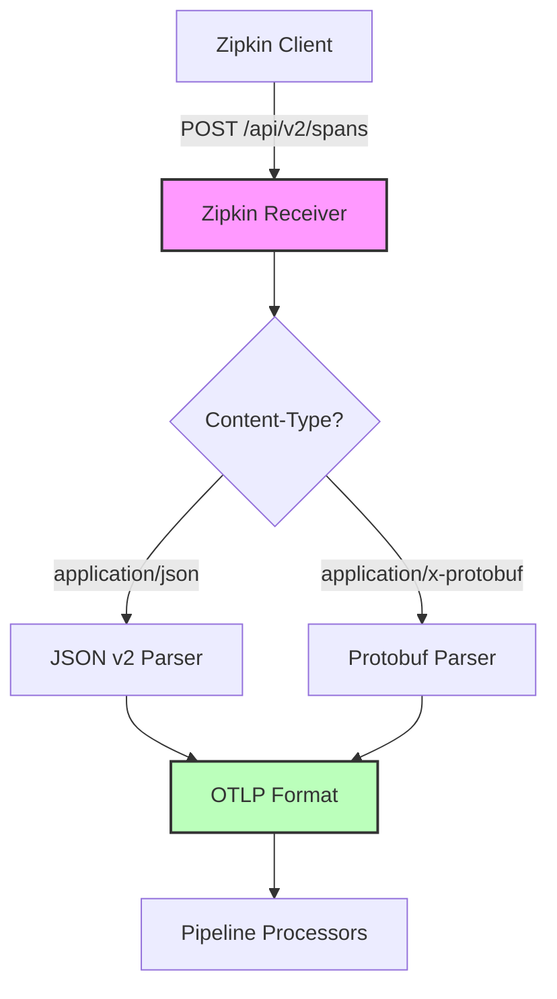
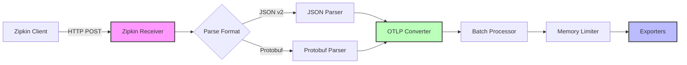

# How to Configure the Zipkin Receiver in the OpenTelemetry Collector

Author: [nawazdhandala](https://www.github.com/nawazdhandala)

Tags: OpenTelemetry, Collector, Zipkin, Distributed Tracing, Observability

Description: Complete guide to configuring the Zipkin receiver in OpenTelemetry Collector. Learn about protocol support, JSON and Protobuf formats, and production best practices.

The Zipkin receiver enables the OpenTelemetry Collector to accept trace data from Zipkin clients and instrumentation libraries. This capability is crucial for organizations migrating from Zipkin to OpenTelemetry or maintaining compatibility with existing Zipkin-based infrastructure. This guide provides practical configuration examples and best practices for running the Zipkin receiver in production.

## Understanding the Zipkin Receiver

Zipkin has been a popular distributed tracing system for many years. The Zipkin receiver in the OpenTelemetry Collector accepts trace spans in Zipkin formats, including both JSON v1, JSON v2, and Protobuf. This allows applications instrumented with Zipkin libraries to send traces to the OpenTelemetry Collector without modification.

The receiver operates as an HTTP server that accepts POST requests containing trace data. It translates Zipkin spans into OpenTelemetry's internal format, making them compatible with the rest of the collector's pipeline.

## Basic Configuration

Here's a minimal configuration to start receiving Zipkin traces:

```yaml
receivers:
  zipkin:
    # HTTP endpoint for receiving Zipkin spans
    endpoint: 0.0.0.0:9411

processors:
  batch:
    timeout: 1s
    send_batch_size: 1024

exporters:
  logging:
    verbosity: detailed

service:
  pipelines:
    traces:
      receivers: [zipkin]
      processors: [batch]
      exporters: [logging]
```

This configuration sets up the Zipkin receiver on the standard port 9411. The collector listens on all network interfaces and forwards received traces through a batch processor to a logging exporter for debugging purposes.

## Endpoint Configuration

The Zipkin receiver accepts spans at the standard Zipkin API endpoint. When clients send data to `http://your-collector:9411/api/v2/spans`, the receiver processes it automatically.

```yaml
receivers:
  zipkin:
    # Bind address and port
    endpoint: 0.0.0.0:9411

    # Parse string tags as JSON
    parse_string_tags: true
```

The `parse_string_tags` option is useful when Zipkin tags contain JSON-encoded data. When enabled, the receiver attempts to parse string tag values as JSON objects.

## Protocol Support

The Zipkin receiver automatically handles multiple formats based on the Content-Type header:



### JSON Format

Most Zipkin clients use JSON format by default. Here's an example of a Zipkin JSON span:

```json
[
  {
    "traceId": "4e441824ec2b6a44ffdc9bb9a6453df3",
    "id": "7b4c9c3e9a5f8a2d",
    "name": "get /api/users",
    "timestamp": 1609459200000000,
    "duration": 150000,
    "localEndpoint": {
      "serviceName": "frontend",
      "ipv4": "192.168.1.10"
    },
    "tags": {
      "http.method": "GET",
      "http.path": "/api/users"
    }
  }
]
```

The receiver accepts this format at the `/api/v2/spans` endpoint with `Content-Type: application/json`.

### Protobuf Format

Protobuf format offers better performance and smaller payload sizes. Configure your Zipkin clients to use Protobuf by setting the appropriate content type:

```yaml
receivers:
  zipkin:
    endpoint: 0.0.0.0:9411
    # No special configuration needed - automatically detected
```

The receiver detects Protobuf format when it receives `Content-Type: application/x-protobuf`.

## CORS Configuration

When receiving traces from browser-based applications, configure CORS to allow cross-origin requests:

```yaml
receivers:
  zipkin:
    endpoint: 0.0.0.0:9411

    # CORS settings for browser clients
    cors:
      # Allowed origins (use specific domains in production)
      allowed_origins:
        - "https://app.example.com"
        - "https://dashboard.example.com"
        - "http://localhost:3000"  # Development only

      # Allowed headers
      allowed_headers:
        - "Content-Type"
        - "Accept"
        - "Authorization"
        - "X-Requested-With"

      # Allowed methods
      allowed_methods:
        - POST
        - OPTIONS

      # Expose headers to the browser
      expose_headers:
        - "Content-Length"

      # Credentials support
      allow_credentials: true

      # Max age for preflight cache (seconds)
      max_age: 7200
```

## TLS Configuration

Secure your Zipkin receiver in production with TLS encryption:

```yaml
receivers:
  zipkin:
    endpoint: 0.0.0.0:9411

    # TLS configuration
    tls:
      # Server certificate and key
      cert_file: /etc/otel/certs/server.crt
      key_file: /etc/otel/certs/server.key

      # Client certificate verification (optional)
      client_ca_file: /etc/otel/certs/ca.crt

      # Minimum TLS version
      min_version: "1.2"

      # Maximum TLS version
      max_version: "1.3"

      # Reload certificates automatically
      reload_interval: 24h
```

With this configuration, clients must connect using HTTPS: `https://your-collector:9411/api/v2/spans`.

## Advanced Configuration Options

### Request Size Limits

Control the maximum size of incoming requests to prevent memory issues:

```yaml
receivers:
  zipkin:
    endpoint: 0.0.0.0:9411

    # Maximum request body size (default: unlimited)
    max_request_body_size: 10485760  # 10 MB

    # Include server metadata in responses
    include_metadata: true
```

### String Tag Parsing

Enable advanced tag parsing for JSON-encoded string values:

```yaml
receivers:
  zipkin:
    endpoint: 0.0.0.0:9411

    # Parse string tags as JSON structures
    parse_string_tags: true
```

This is useful when applications encode complex data structures as JSON strings in Zipkin tags. For example:

```json
{
  "tags": {
    "user.details": "{\"id\":123,\"name\":\"John\",\"role\":\"admin\"}"
  }
}
```

With `parse_string_tags: true`, this becomes a structured attribute in OpenTelemetry.

## Complete Production Configuration

Here's a production-ready configuration combining security, performance, and observability:

```yaml
receivers:
  zipkin:
    # Listen on all interfaces
    endpoint: 0.0.0.0:9411

    # Enable JSON tag parsing
    parse_string_tags: true

    # Limit request size
    max_request_body_size: 20971520  # 20 MB

    # TLS encryption
    tls:
      cert_file: /etc/otel/certs/server.crt
      key_file: /etc/otel/certs/server.key
      min_version: "1.2"
      reload_interval: 24h

    # CORS for web applications
    cors:
      allowed_origins:
        - "https://app.example.com"
      allowed_headers:
        - "Content-Type"
      max_age: 3600

processors:
  # Prevent memory overload
  memory_limiter:
    check_interval: 1s
    limit_mib: 2000
    spike_limit_mib: 400

  # Batch for efficiency
  batch:
    timeout: 1s
    send_batch_size: 2048
    send_batch_max_size: 4096

  # Add resource attributes
  resource:
    attributes:
      - key: collector.name
        value: zipkin-collector-01
        action: insert
      - key: deployment.environment
        value: production
        action: insert

  # Enrich spans with additional context
  attributes:
    actions:
      - key: receiver
        value: zipkin
        action: insert

  # Sample traces if needed
  probabilistic_sampler:
    sampling_percentage: 10.0

exporters:
  # Export to OTLP backend
  otlp:
    endpoint: backend.example.com:4317
    tls:
      insecure: false
      cert_file: /etc/otel/certs/client.crt
      key_file: /etc/otel/certs/client.key
    compression: gzip
    timeout: 10s
    retry_on_failure:
      enabled: true
      initial_interval: 1s
      max_interval: 30s

  # Export to Zipkin backend (optional)
  zipkin:
    endpoint: http://zipkin-backend:9411/api/v2/spans
    default_service_name: unknown-service
    timeout: 10s

  # Metrics for monitoring
  prometheus:
    endpoint: 0.0.0.0:8889

service:
  pipelines:
    traces:
      receivers: [zipkin]
      processors:
        - memory_limiter
        - batch
        - resource
        - attributes
        - probabilistic_sampler
      exporters: [otlp, zipkin]

  # Enable telemetry
  telemetry:
    logs:
      level: info
      encoding: json
    metrics:
      address: 0.0.0.0:8888
      level: detailed
```

## Client Configuration Examples

### Java with Brave

Configure a Java application using Brave (Zipkin's Java client):

```java
import zipkin2.reporter.AsyncReporter;
import zipkin2.reporter.urlconnection.URLConnectionSender;
import brave.Tracing;

// Configure sender to OpenTelemetry Collector
URLConnectionSender sender = URLConnectionSender.create(
    "http://otel-collector:9411/api/v2/spans"
);

// Create reporter
AsyncReporter<Span> reporter = AsyncReporter.builder(sender)
    .closeTimeout(1, TimeUnit.SECONDS)
    .build();

// Create tracing instance
Tracing tracing = Tracing.newBuilder()
    .localServiceName("my-service")
    .spanReporter(reporter)
    .build();
```

### Python with py_zipkin

Configure Python applications using py_zipkin:

```python
from py_zipkin.zipkin import zipkin_span
from py_zipkin.transport import BaseTransportHandler
import requests

class HTTPTransport(BaseTransportHandler):
    def send(self, encoded_span):
        # Send to OpenTelemetry Collector
        requests.post(
            'http://otel-collector:9411/api/v2/spans',
            data=encoded_span,
            headers={'Content-Type': 'application/json'}
        )

    def get_max_payload_bytes(self):
        return None

# Use in your application
with zipkin_span(
    service_name='python-service',
    span_name='operation_name',
    transport_handler=HTTPTransport(),
    sample_rate=100.0
):
    # Your code here
    pass
```

### Node.js with zipkin-js

Configure Node.js applications:

```javascript
const {Tracer, BatchRecorder, jsonEncoder} = require('zipkin');
const {HttpLogger} = require('zipkin-transport-http');

// Configure HTTP logger pointing to collector
const httpLogger = new HttpLogger({
  endpoint: 'http://otel-collector:9411/api/v2/spans',
  jsonEncoder: jsonEncoder.JSON_V2
});

// Create recorder and tracer
const recorder = new BatchRecorder({logger: httpLogger});
const tracer = new Tracer({
  recorder,
  localServiceName: 'nodejs-service'
});
```

## Data Flow and Architecture

Understanding the data flow helps optimize your configuration:



## Performance Optimization

### Connection Pooling

When receiving high volumes of traces, optimize HTTP connection handling:

```yaml
receivers:
  zipkin:
    endpoint: 0.0.0.0:9411

    # HTTP server tuning
    http_server_settings:
      # Read timeout
      read_timeout: 30s

      # Write timeout
      write_timeout: 30s

      # Idle timeout
      idle_timeout: 60s

      # Maximum header size
      max_header_size: 1048576  # 1 MB
```

### Batch Processing

Optimize batch processing for better throughput:

```yaml
processors:
  batch:
    # Wait up to 2 seconds or until batch size reached
    timeout: 2s

    # Send when batch reaches 4096 spans
    send_batch_size: 4096

    # Never exceed 8192 spans in a batch
    send_batch_max_size: 8192
```

## Monitoring and Debugging

### Health Checks

Implement health checks to monitor receiver status:

```yaml
extensions:
  health_check:
    endpoint: 0.0.0.0:13133
    path: /health

service:
  extensions: [health_check]
```

Check health status:

```bash
curl http://localhost:13133/health
```

### Metrics Collection

Monitor Zipkin receiver metrics:

```yaml
service:
  telemetry:
    metrics:
      address: 0.0.0.0:8888
      level: detailed
```

Key metrics to monitor:
- `otelcol_receiver_accepted_spans`: Number of spans accepted
- `otelcol_receiver_refused_spans`: Number of spans refused
- `otelcol_exporter_sent_spans`: Number of spans exported
- `otelcol_processor_batch_batch_send_size`: Batch sizes

### Debug Logging

Enable detailed logging for troubleshooting:

```yaml
service:
  telemetry:
    logs:
      level: debug
      development: true
      encoding: console
      output_paths:
        - stdout
        - /var/log/otel/collector.log
```

## Troubleshooting Common Issues

### Connection Refused

If clients cannot connect, verify the endpoint configuration:

```bash
# Check if port is listening
netstat -an | grep 9411

# Test connectivity
curl -X POST http://localhost:9411/api/v2/spans \
  -H 'Content-Type: application/json' \
  -d '[]'
```

### Parse Errors

If you see parse errors in logs, verify the Content-Type header matches the payload format:

```bash
# Test with JSON
curl -X POST http://localhost:9411/api/v2/spans \
  -H 'Content-Type: application/json' \
  -d '[{"traceId":"1234","id":"5678","name":"test"}]'
```

### CORS Issues

For browser-based applications, verify CORS headers:

```bash
curl -X OPTIONS http://localhost:9411/api/v2/spans \
  -H 'Origin: https://app.example.com' \
  -H 'Access-Control-Request-Method: POST' \
  -i
```

## Integration with OneUptime

OneUptime provides comprehensive observability for your distributed traces. Export Zipkin traces to OneUptime:

```yaml
exporters:
  otlp:
    endpoint: otlp.oneuptime.com:4317
    headers:
      x-oneuptime-token: "your-token-here"

service:
  pipelines:
    traces:
      receivers: [zipkin]
      processors: [batch]
      exporters: [otlp]
```

## Related Resources

Explore related OpenTelemetry Collector configurations:

- https://oneuptime.com/blog/post/2026-02-06-jaeger-receiver-opentelemetry-collector/view
- https://oneuptime.com/blog/post/2026-02-06-kafka-receiver-opentelemetry-collector/view

## Conclusion

The Zipkin receiver provides seamless integration between Zipkin-instrumented applications and the OpenTelemetry Collector. Its support for multiple formats and flexible configuration options make it suitable for various deployment scenarios.

Start with basic configuration and add features like TLS encryption, CORS support, and performance optimizations based on your requirements. Monitor receiver metrics and adjust batch processing parameters to achieve optimal performance for your workload.

With proper configuration, the Zipkin receiver can handle production-scale trace ingestion while maintaining compatibility with existing Zipkin infrastructure and enabling migration to OpenTelemetry.
