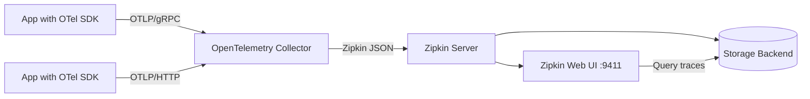

# How to Set Up Zipkin as a Trace Backend for OpenTelemetry

Author: [nawazdhandala](https://www.github.com/nawazdhandala)

Tags: OpenTelemetry, Zipkin, Distributed Tracing, Observability, Backend, Traces

Description: A practical guide to deploying Zipkin as a dedicated trace backend for OpenTelemetry, covering installation, Collector configuration, storage options, and production tuning.

---

Zipkin has been around since 2012 when Twitter open-sourced it, and it remains one of the most approachable distributed tracing systems available. If you are looking for a lightweight, battle-tested trace backend that integrates cleanly with OpenTelemetry, Zipkin is a solid choice. It supports multiple storage backends, has a clean web UI for trace exploration, and the setup process is straightforward enough that you can have a working system in under an hour.

This guide walks through setting up Zipkin as the trace storage and visualization layer behind an OpenTelemetry Collector. We will cover the architecture, deployment, Collector configuration, storage options, and tips for running Zipkin in production.

## Architecture Overview

The idea is simple. Your applications export traces using OpenTelemetry SDKs in OTLP format. The OpenTelemetry Collector receives those traces, processes them if needed, and forwards them to Zipkin using the Zipkin exporter. Zipkin then stores the trace data in its configured backend and provides a web UI for searching and visualizing traces.



This architecture gives you the flexibility of OpenTelemetry instrumentation on the application side while using Zipkin's mature storage and query capabilities on the backend side. The Collector acts as a buffer and processing layer between producers and consumers of trace data.

## Deploying Zipkin

The fastest way to get Zipkin running is with Docker. The official Zipkin image bundles everything you need, including an in-memory storage backend that works great for development and testing.

The following command starts Zipkin with default settings and exposes the UI on port 9411.

```bash
# Start Zipkin with in-memory storage for development
docker run -d \
  --name zipkin \
  -p 9411:9411 \
  openzipkin/zipkin:latest
```

For production environments, you will want to use a persistent storage backend. Zipkin supports Elasticsearch, Cassandra, and MySQL. Here is how to start Zipkin with Elasticsearch as the storage layer.

```bash
# Start Zipkin with Elasticsearch storage
docker run -d \
  --name zipkin \
  -p 9411:9411 \
  -e STORAGE_TYPE=elasticsearch \
  -e ES_HOSTS=http://elasticsearch:9200 \
  -e ES_INDEX=zipkin \
  -e ES_INDEX_REPLICAS=1 \
  -e ES_INDEX_SHARDS=3 \
  openzipkin/zipkin:latest
```

If you prefer Docker Compose, here is a complete stack with Zipkin and Elasticsearch running together.

```yaml
# docker-compose.yml - Zipkin with Elasticsearch backend
version: "3.8"
services:
  elasticsearch:
    image: elasticsearch:8.12.0
    environment:
      - discovery.type=single-node
      - xpack.security.enabled=false
      - "ES_JAVA_OPTS=-Xms512m -Xmx512m"
    ports:
      - "9200:9200"
    volumes:
      - es-data:/usr/share/elasticsearch/data

  zipkin:
    image: openzipkin/zipkin:latest
    environment:
      - STORAGE_TYPE=elasticsearch
      - ES_HOSTS=http://elasticsearch:9200
    ports:
      - "9411:9411"
    depends_on:
      - elasticsearch

volumes:
  es-data:
```

## Configuring the OpenTelemetry Collector

With Zipkin running, you need to configure the OpenTelemetry Collector to forward traces to it. The Collector needs three things: a receiver to accept OTLP traces from your applications, an optional processor for batching, and the Zipkin exporter.

Here is a complete Collector configuration that receives OTLP traces and exports them to Zipkin.

```yaml
# otel-collector-config.yaml
# OpenTelemetry Collector configuration for Zipkin backend

receivers:
  otlp:
    protocols:
      # gRPC receiver on the standard OTLP port
      grpc:
        endpoint: 0.0.0.0:4317
      # HTTP receiver for applications that prefer HTTP transport
      http:
        endpoint: 0.0.0.0:4318

processors:
  # Batch processor groups spans together before export
  # This reduces network overhead and improves throughput
  batch:
    send_batch_size: 512
    send_batch_max_size: 1024
    timeout: 5s

  # Memory limiter prevents the Collector from using too much RAM
  memory_limiter:
    check_interval: 1s
    limit_mib: 512
    spike_limit_mib: 128

exporters:
  zipkin:
    # Zipkin's v2 span ingestion endpoint
    endpoint: http://zipkin:9411/api/v2/spans
    # JSON format is human-readable and easier to debug
    format: json

  # Keep debug exporter for troubleshooting
  debug:
    verbosity: basic

service:
  pipelines:
    traces:
      receivers: [otlp]
      processors: [memory_limiter, batch]
      exporters: [zipkin, debug]
```

The batch processor is important here. Without it, the Collector would send individual spans to Zipkin one at a time, which creates unnecessary network overhead. The settings above group spans into batches of 512 and flush them every 5 seconds, whichever comes first.

## Verifying the Setup

Once both Zipkin and the Collector are running, you can verify the pipeline works by sending a test trace using the OpenTelemetry CLI tool or by running a simple instrumented application.

Here is a quick Python script that sends a test trace through the Collector to Zipkin.

```python
# test_trace.py
# Sends a sample trace through the OTel Collector to verify the Zipkin backend

from opentelemetry import trace
from opentelemetry.sdk.trace import TracerProvider
from opentelemetry.sdk.trace.export import BatchSpanProcessor
from opentelemetry.exporter.otlp.proto.grpc.trace_exporter import OTLPSpanExporter
from opentelemetry.sdk.resources import Resource

# Configure the tracer with service name metadata
resource = Resource.create({"service.name": "test-service"})
provider = TracerProvider(resource=resource)

# Point the exporter at the Collector's gRPC endpoint
exporter = OTLPSpanExporter(endpoint="localhost:4317", insecure=True)
provider.add_span_processor(BatchSpanProcessor(exporter))
trace.set_tracer_provider(provider)

tracer = trace.get_tracer("test-tracer")

# Create a parent span with a nested child span
with tracer.start_as_current_span("parent-operation") as parent:
    parent.set_attribute("http.method", "GET")
    parent.set_attribute("http.url", "/api/users")
    with tracer.start_as_current_span("database-query") as child:
        child.set_attribute("db.system", "postgresql")
        child.set_attribute("db.statement", "SELECT * FROM users")

# Flush to make sure spans are exported
provider.shutdown()
print("Test trace sent successfully")
```

After running this script, open Zipkin's UI at http://localhost:9411 and search for traces from the "test-service" service. You should see the parent span with a nested child span, complete with all the attributes you set.

## Choosing a Storage Backend

Zipkin's choice of storage backend significantly affects its performance characteristics and operational complexity. Here is a quick comparison.

In-memory storage is the default. It is great for development and testing but loses all data when Zipkin restarts. Do not use it in production.

Elasticsearch is the most popular choice for production deployments. It provides full-text search across span tags and annotations, handles high write throughput well, and scales horizontally. The trade-off is that Elasticsearch clusters require careful tuning and monitoring.

Cassandra is a strong option if you already run Cassandra in your infrastructure. It handles massive write volumes and scales linearly, but querying is less flexible than Elasticsearch.

MySQL works for smaller deployments where you want simplicity and already have MySQL expertise on your team. It will struggle at high trace volumes compared to Elasticsearch or Cassandra.

## Production Considerations

When running this setup in production, there are several things to keep in mind.

First, configure trace sampling in your applications or in the Collector. Storing every single trace from a high-traffic service gets expensive fast. A tail-sampling processor in the Collector can keep all error traces and slow traces while sampling a percentage of successful ones.

```yaml
# Add tail sampling to keep interesting traces
processors:
  tail_sampling:
    decision_wait: 10s
    policies:
      # Always keep traces with errors
      - name: errors-policy
        type: status_code
        status_code:
          status_codes: [ERROR]
      # Always keep slow traces (over 2 seconds)
      - name: latency-policy
        type: latency
        latency:
          threshold_ms: 2000
      # Sample 10% of remaining traces
      - name: probabilistic-policy
        type: probabilistic
        probabilistic:
          sampling_percentage: 10
```

Second, set up data retention. Zipkin does not automatically delete old traces, so you need to manage this yourself. With Elasticsearch, you can use Index Lifecycle Management (ILM) policies to automatically roll over and delete old indices. A common retention period is 7 to 14 days for most teams.

Third, monitor your Collector and Zipkin instances. The Collector exposes Prometheus metrics on port 8888 by default. Watch for dropped spans (which indicate back-pressure) and export errors (which indicate problems with the Zipkin connection).

## Wrapping Up

Zipkin paired with OpenTelemetry gives you a clean separation between instrumentation and trace storage. Your applications use the vendor-neutral OpenTelemetry SDKs, the Collector handles processing and routing, and Zipkin provides storage and visualization. If you ever need to switch backends, you only change the Collector configuration without touching any application code. That flexibility is one of the biggest advantages of the OpenTelemetry ecosystem, and Zipkin fits into it naturally.
