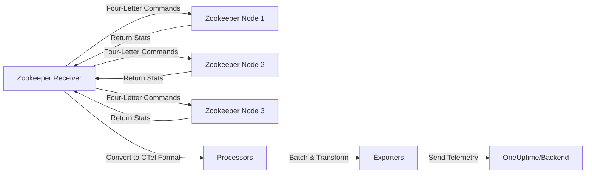

# How to Configure the Zookeeper Receiver in the OpenTelemetry Collector

Author: [nawazdhandala](https://www.github.com/nawazdhandala)

Tags: OpenTelemetry, Collector, Zookeeper, Distributed Systems, Coordination, Metrics, Observability

Description: Configure the Zookeeper receiver in OpenTelemetry Collector to monitor Apache Zookeeper clusters, track coordination service health, measure latency, and export telemetry for distributed system observability.

Apache Zookeeper is a critical coordination service for distributed systems, used by platforms like Kafka, Hadoop, and HBase for configuration management, leader election, and distributed locking. Monitoring Zookeeper is essential because failures in this coordination layer can cascade across your entire distributed infrastructure. The Zookeeper receiver in the OpenTelemetry Collector provides native integration to collect comprehensive metrics from Zookeeper nodes.

## What is the Zookeeper Receiver?

The Zookeeper receiver is a specialized OpenTelemetry Collector component that connects to Zookeeper nodes and collects performance and health metrics using Zookeeper's four-letter word commands (mntr, stat, srvr). These administrative commands expose internal Zookeeper state and statistics without requiring client library integration.

The receiver monitors critical Zookeeper aspects including:

- Node health and role (leader, follower, observer)
- Request latency and throughput
- Outstanding request queue depths
- Ephemeral node counts
- Znode data size and counts
- Connection and session statistics
- Leader election metrics
- Packet sent and received counts
- Watch counts and triggers
- Ensemble synchronization status

## How the Zookeeper Receiver Works

The receiver connects to each Zookeeper node's client port (typically 2181) and sends four-letter word commands to retrieve metrics. The responses are parsed and converted to OpenTelemetry format:



The receiver can monitor multiple Zookeeper nodes in an ensemble, tracking cluster health and identifying leader/follower performance differences.

## Prerequisites

Ensure Zookeeper's four-letter word commands are enabled. By default, they're restricted in newer Zookeeper versions for security:

```properties
# In zoo.cfg or zookeeper.properties
# Allow specific four-letter word commands
4lw.commands.whitelist=mntr,stat,srvr,ruok

# Or allow all commands (less secure, useful for development)
# 4lw.commands.whitelist=*
```

Restart Zookeeper after configuration changes. Verify commands work:

```bash
# Test the mntr (monitor) command
echo mntr | nc localhost 2181

# Test the stat command
echo stat | nc localhost 2181
```

If commands are disabled, you'll see "command is not executed because it is not in the whitelist."

## Basic Configuration

Here's a minimal configuration to start monitoring a Zookeeper node:

```yaml
# Receivers section - defines how telemetry enters the Collector
receivers:
  # Zookeeper receiver for coordination service monitoring
  zookeeper:
    # Zookeeper node endpoint (client port, typically 2181)
    endpoint: "localhost:2181"

    # Collection interval - how often to scrape metrics
    collection_interval: 30s

    # Timeout for four-letter word command responses
    timeout: 10s

    # Enable basic Zookeeper metrics
    metrics:
      zookeeper.latency.avg:
        enabled: true
      zookeeper.latency.max:
        enabled: true
      zookeeper.connection.active:
        enabled: true

# Processors - transform collected metrics
processors:
  # Batch metrics to reduce network overhead
  batch:
    timeout: 10s
    send_batch_size: 100

# Exporters - define where metrics are sent
exporters:
  # Export to OneUptime via OTLP HTTP
  otlphttp:
    endpoint: https://oneuptime.com/otlp
    headers:
      x-oneuptime-token: ${ONEUPTIME_TOKEN}

# Service section - wire components into pipelines
service:
  pipelines:
    # Metrics pipeline for Zookeeper data
    metrics:
      receivers: [zookeeper]
      processors: [batch]
      exporters: [otlphttp]
```

This basic configuration connects to a local Zookeeper instance and collects essential latency and connection metrics. For production ensembles, you'll monitor multiple nodes and enable comprehensive metrics.

## Comprehensive Metrics Configuration

For production Zookeeper monitoring, enable a full set of metrics:

```yaml
receivers:
  zookeeper:
    endpoint: "zk-node1.internal:2181"
    collection_interval: 30s
    timeout: 10s

    # Enable comprehensive Zookeeper monitoring
    metrics:
      # Latency metrics - critical for coordination service performance
      zookeeper.latency.avg:
        enabled: true
        description: "Average request latency in milliseconds"

      zookeeper.latency.min:
        enabled: true
        description: "Minimum request latency"

      zookeeper.latency.max:
        enabled: true
        description: "Maximum request latency"

      # Connection metrics - track client connections
      zookeeper.connection.active:
        enabled: true
        description: "Number of active client connections"

      # Data metrics - monitor znode storage
      zookeeper.znode.count:
        enabled: true
        description: "Total number of znodes in the namespace"

      zookeeper.data_tree.size:
        enabled: true
        description: "Total size of data tree in bytes"

      zookeeper.data_tree.ephemeral_node.count:
        enabled: true
        description: "Number of ephemeral nodes (temporary nodes)"

      # Request metrics - throughput and queue depth
      zookeeper.packet.sent:
        enabled: true
        description: "Packets sent to clients"

      zookeeper.packet.received:
        enabled: true
        description: "Packets received from clients"

      zookeeper.request.active:
        enabled: true
        description: "Outstanding requests being processed"

      zookeeper.outstanding_requests:
        enabled: true
        description: "Number of queued requests"

      # Watch metrics - event notification system
      zookeeper.watch.count:
        enabled: true
        description: "Total watches registered by clients"

      # File descriptor metrics - resource utilization
      zookeeper.file_descriptor.open:
        enabled: true
        description: "Number of open file descriptors"

      zookeeper.file_descriptor.limit:
        enabled: true
        description: "Maximum file descriptors allowed"

      # Ensemble synchronization metrics
      zookeeper.follower.count:
        enabled: true
        description: "Number of followers connected to leader"

      zookeeper.sync.pending:
        enabled: true
        description: "Pending syncs from leader to followers"

      # Server state metrics
      zookeeper.server.state:
        enabled: true
        description: "Server role (leader=1, follower=2, observer=3)"

      # Performance counters
      zookeeper.packets.sent.rate:
        enabled: true
        description: "Packet send rate"

      zookeeper.packets.received.rate:
        enabled: true
        description: "Packet receive rate"
```

This comprehensive configuration provides visibility into all aspects of Zookeeper performance and health.

## Monitoring a Zookeeper Ensemble

Zookeeper runs in ensembles (clusters) with multiple nodes. Monitor all nodes to track cluster health and identify issues:

```yaml
receivers:
  # Zookeeper node 1
  zookeeper/node1:
    endpoint: "zk-node1.internal:2181"
    collection_interval: 30s
    timeout: 10s
    metrics:
      zookeeper.latency.avg:
        enabled: true
      zookeeper.latency.max:
        enabled: true
      zookeeper.connection.active:
        enabled: true
      zookeeper.znode.count:
        enabled: true
      zookeeper.server.state:
        enabled: true
      zookeeper.follower.count:
        enabled: true
      zookeeper.outstanding_requests:
        enabled: true

  # Zookeeper node 2
  zookeeper/node2:
    endpoint: "zk-node2.internal:2181"
    collection_interval: 30s
    timeout: 10s
    metrics:
      zookeeper.latency.avg:
        enabled: true
      zookeeper.latency.max:
        enabled: true
      zookeeper.connection.active:
        enabled: true
      zookeeper.znode.count:
        enabled: true
      zookeeper.server.state:
        enabled: true
      zookeeper.follower.count:
        enabled: true
      zookeeper.outstanding_requests:
        enabled: true

  # Zookeeper node 3
  zookeeper/node3:
    endpoint: "zk-node3.internal:2181"
    collection_interval: 30s
    timeout: 10s
    metrics:
      zookeeper.latency.avg:
        enabled: true
      zookeeper.latency.max:
        enabled: true
      zookeeper.connection.active:
        enabled: true
      zookeeper.znode.count:
        enabled: true
      zookeeper.server.state:
        enabled: true
      zookeeper.follower.count:
        enabled: true
      zookeeper.outstanding_requests:
        enabled: true

# Add node-specific attributes
processors:
  attributes/node1:
    actions:
      - key: zookeeper.ensemble
        value: "production"
        action: insert
      - key: zookeeper.node
        value: "zk-node1"
        action: insert
      - key: zookeeper.node_id
        value: "1"
        action: insert

  attributes/node2:
    actions:
      - key: zookeeper.ensemble
        value: "production"
        action: insert
      - key: zookeeper.node
        value: "zk-node2"
        action: insert
      - key: zookeeper.node_id
        value: "2"
        action: insert

  attributes/node3:
    actions:
      - key: zookeeper.ensemble
        value: "production"
        action: insert
      - key: zookeeper.node
        value: "zk-node3"
        action: insert
      - key: zookeeper.node_id
        value: "3"
        action: insert

  batch:
    timeout: 10s

exporters:
  otlphttp:
    endpoint: https://oneuptime.com/otlp
    headers:
      x-oneuptime-token: ${ONEUPTIME_TOKEN}

service:
  pipelines:
    metrics/node1:
      receivers: [zookeeper/node1]
      processors: [attributes/node1, batch]
      exporters: [otlphttp]

    metrics/node2:
      receivers: [zookeeper/node2]
      processors: [attributes/node2, batch]
      exporters: [otlphttp]

    metrics/node3:
      receivers: [zookeeper/node3]
      processors: [attributes/node3, batch]
      exporters: [otlphttp]
```

This configuration monitors all three nodes in the ensemble and tags metrics with ensemble and node identifiers, making it easy to compare performance across nodes or identify the current leader.

## Production-Ready Configuration with Resilience

Here's a complete production configuration with error handling and optimization:

```yaml
receivers:
  zookeeper/node1:
    endpoint: "zk-node1.internal:2181"
    collection_interval: 30s

    # Timeout for command responses - prevent hanging
    timeout: 10s

    # Retry failed connections
    retry_on_failure:
      enabled: true
      initial_interval: 5s
      max_interval: 30s
      max_elapsed_time: 300s

    metrics:
      # Critical performance metrics
      zookeeper.latency.avg:
        enabled: true
      zookeeper.latency.max:
        enabled: true
      zookeeper.connection.active:
        enabled: true
      zookeeper.znode.count:
        enabled: true
      zookeeper.outstanding_requests:
        enabled: true
      zookeeper.server.state:
        enabled: true

      # Resource metrics
      zookeeper.file_descriptor.open:
        enabled: true
      zookeeper.file_descriptor.limit:
        enabled: true

      # Ensemble health
      zookeeper.follower.count:
        enabled: true
      zookeeper.sync.pending:
        enabled: true

  zookeeper/node2:
    endpoint: "zk-node2.internal:2181"
    collection_interval: 30s
    timeout: 10s
    retry_on_failure:
      enabled: true
      initial_interval: 5s
      max_interval: 30s
      max_elapsed_time: 300s
    metrics:
      zookeeper.latency.avg:
        enabled: true
      zookeeper.latency.max:
        enabled: true
      zookeeper.connection.active:
        enabled: true
      zookeeper.znode.count:
        enabled: true
      zookeeper.outstanding_requests:
        enabled: true
      zookeeper.server.state:
        enabled: true
      zookeeper.file_descriptor.open:
        enabled: true
      zookeeper.file_descriptor.limit:
        enabled: true
      zookeeper.follower.count:
        enabled: true
      zookeeper.sync.pending:
        enabled: true

  zookeeper/node3:
    endpoint: "zk-node3.internal:2181"
    collection_interval: 30s
    timeout: 10s
    retry_on_failure:
      enabled: true
      initial_interval: 5s
      max_interval: 30s
      max_elapsed_time: 300s
    metrics:
      zookeeper.latency.avg:
        enabled: true
      zookeeper.latency.max:
        enabled: true
      zookeeper.connection.active:
        enabled: true
      zookeeper.znode.count:
        enabled: true
      zookeeper.outstanding_requests:
        enabled: true
      zookeeper.server.state:
        enabled: true
      zookeeper.file_descriptor.open:
        enabled: true
      zookeeper.file_descriptor.limit:
        enabled: true
      zookeeper.follower.count:
        enabled: true
      zookeeper.sync.pending:
        enabled: true

processors:
  # Add environment and ensemble labels
  attributes/common:
    actions:
      - key: environment
        value: production
        action: insert
      - key: zookeeper.ensemble
        value: prod-zk-ensemble
        action: insert

  attributes/node1:
    actions:
      - key: zookeeper.node
        value: zk-node1
        action: insert

  attributes/node2:
    actions:
      - key: zookeeper.node
        value: zk-node2
        action: insert

  attributes/node3:
    actions:
      - key: zookeeper.node
        value: zk-node3
        action: insert

  # Detect resource attributes (hostname, cloud provider)
  resourcedetection:
    detectors: [env, system, docker]
    timeout: 5s

  # Batch for efficiency
  batch:
    timeout: 30s
    send_batch_size: 1000

exporters:
  otlphttp:
    endpoint: https://oneuptime.com/otlp
    headers:
      x-oneuptime-token: ${ONEUPTIME_TOKEN}
    compression: gzip
    timeout: 30s

    # Retry configuration
    retry_on_failure:
      enabled: true
      initial_interval: 5s
      max_interval: 30s
      max_elapsed_time: 300s

    # Buffer metrics during backend outages
    sending_queue:
      enabled: true
      num_consumers: 10
      queue_size: 5000

service:
  pipelines:
    metrics/node1:
      receivers: [zookeeper/node1]
      processors: [resourcedetection, attributes/common, attributes/node1, batch]
      exporters: [otlphttp]

    metrics/node2:
      receivers: [zookeeper/node2]
      processors: [resourcedetection, attributes/common, attributes/node2, batch]
      exporters: [otlphttp]

    metrics/node3:
      receivers: [zookeeper/node3]
      processors: [resourcedetection, attributes/common, attributes/node3, batch]
      exporters: [otlphttp]
```

This configuration includes timeouts, retries, buffering, and comprehensive error handling to ensure reliable metric collection.

## Monitoring Zookeeper Used by Kafka

Kafka depends heavily on Zookeeper for cluster coordination. When monitoring Zookeeper for Kafka, focus on metrics that affect Kafka health:

```yaml
receivers:
  zookeeper/kafka_zk:
    endpoint: "kafka-zk.internal:2181"
    collection_interval: 20s
    timeout: 10s

    metrics:
      # Latency - critical for Kafka performance
      zookeeper.latency.avg:
        enabled: true
      zookeeper.latency.max:
        enabled: true

      # Connections - Kafka brokers connect to ZK
      zookeeper.connection.active:
        enabled: true

      # Ephemeral nodes - Kafka uses these for broker registration
      zookeeper.data_tree.ephemeral_node.count:
        enabled: true

      # Znodes - Kafka creates many znodes for topics, partitions, etc.
      zookeeper.znode.count:
        enabled: true

      # Outstanding requests - queue depth affects Kafka operations
      zookeeper.outstanding_requests:
        enabled: true

      # Leader state - important for ensemble health
      zookeeper.server.state:
        enabled: true

processors:
  attributes:
    actions:
      - key: service
        value: kafka-zookeeper
        action: insert
      - key: kafka.cluster
        value: production-kafka
        action: insert

  batch:
    timeout: 10s

exporters:
  otlphttp:
    endpoint: https://oneuptime.com/otlp
    headers:
      x-oneuptime-token: ${ONEUPTIME_TOKEN}

service:
  pipelines:
    metrics:
      receivers: [zookeeper/kafka_zk]
      processors: [attributes, batch]
      exporters: [otlphttp]
```

Monitor Zookeeper latency spikes closely, as they directly impact Kafka broker responsiveness and can cause cluster instability.

## Security Configuration

Secure your Zookeeper monitoring:

### Zookeeper Access Control

If Zookeeper has SASL authentication enabled, configure the receiver accordingly:

```yaml
receivers:
  zookeeper:
    endpoint: "secure-zk.internal:2181"
    collection_interval: 30s
    timeout: 10s

    # SASL authentication (if Zookeeper requires it)
    auth:
      sasl:
        mechanism: "DIGEST-MD5"
        username: "${ZK_MONITOR_USER}"
        password: "${ZK_MONITOR_PASSWORD}"

    metrics:
      zookeeper.latency.avg:
        enabled: true
      zookeeper.connection.active:
        enabled: true
```

Set credentials in environment variables:

```bash
export ZK_MONITOR_USER="monitor"
export ZK_MONITOR_PASSWORD="SecurePassword123!"
```

### Network Security

Restrict access to Zookeeper client ports:

```bash
# In Zookeeper zoo.cfg, bind to specific interface
clientPortAddress=10.0.0.50

# Use firewall rules to allow only Collector hosts
iptables -A INPUT -p tcp --dport 2181 -s 10.0.0.100 -j ACCEPT
iptables -A INPUT -p tcp --dport 2181 -j DROP
```

### Four-Letter Command Whitelist

Enable only necessary commands in zoo.cfg:

```properties
# Only allow monitoring commands
4lw.commands.whitelist=mntr,stat,srvr,ruok
```

## Alerting on Critical Zookeeper Conditions

Configure alerts for critical Zookeeper scenarios:

**High Latency**: Alert when average or max latency exceeds thresholds (e.g., >100ms), indicating performance degradation or overload.

**Ensemble Split**: Alert when follower count drops, suggesting network partitions or node failures.

**Outstanding Requests Growing**: Alert when outstanding request queue grows, indicating Zookeeper is overloaded or slow.

**File Descriptor Exhaustion**: Alert when open FDs approach limit, which can prevent new connections.

**Leader Election in Progress**: Alert on server state changes, indicating ensemble instability.

**Connection Churn**: Alert on rapid connection creation/deletion, suggesting client issues.

These metrics integrate with alerting systems in observability platforms like OneUptime.

## Troubleshooting

### Connection Failures

If the receiver can't connect to Zookeeper:

1. Verify Zookeeper is running: `echo ruok | nc localhost 2181` (should return "imok")
2. Check four-letter word commands are enabled in zoo.cfg
3. Verify network connectivity and firewall rules
4. Review Zookeeper logs: typically in `$ZK_HOME/logs/zookeeper.log`

Enable debug logging:

```yaml
service:
  telemetry:
    logs:
      level: debug
```

### Command Whitelist Issues

If commands are rejected:

1. Check zoo.cfg has appropriate whitelist: `4lw.commands.whitelist=mntr,stat,srvr,ruok`
2. Restart Zookeeper after configuration changes
3. Test commands manually: `echo mntr | nc localhost 2181`

### Missing Metrics

If some metrics don't appear:

1. Verify Zookeeper version supports the metric (some are version-specific)
2. Check if metric is only available on leader nodes (follower.count only on leader)
3. Review Collector logs for parsing errors

### Performance Impact

Zookeeper monitoring is lightweight, but if concerned:

1. Increase collection_interval to reduce query frequency
2. Use timeout to prevent slow commands from blocking
3. Monitor fewer nodes if ensemble is very large
4. Watch Zookeeper's own latency metrics for impact

## Monitoring the Receiver

Enable Collector internal metrics to monitor the Zookeeper receiver:

```yaml
service:
  telemetry:
    metrics:
      level: detailed
      readers:
        - periodic:
            exporter:
              otlp:
                protocol: http/protobuf
                endpoint: https://oneuptime.com/otlp
                headers:
                  x-oneuptime-token: ${ONEUPTIME_TOKEN}
```

Watch these internal metrics:

- `otelcol_receiver_accepted_metric_points`: Successful collections
- `otelcol_receiver_refused_metric_points`: Collection failures
- `otelcol_scraper_errored_metric_points`: Scraper errors

## Related Topics

For comprehensive distributed system monitoring:

- [How to Configure the RabbitMQ Receiver in OpenTelemetry Collector](https://oneuptime.com/blog/post/2026-02-06-rabbitmq-receiver-opentelemetry-collector/view)
- [How to Configure the SQL Query Receiver in OpenTelemetry Collector](https://oneuptime.com/blog/post/2026-02-06-sql-query-receiver-opentelemetry-collector/view)
- [OpenTelemetry Collector: What It Is and When You Need It](https://oneuptime.com/blog/post/2025-09-18-what-is-opentelemetry-collector-and-why-use-one/view)
- [How to collect internal metrics from OpenTelemetry Collector](https://oneuptime.com/blog/post/2025-01-22-how-to-collect-opentelemetry-collector-internal-metrics/view)

## Summary

The Zookeeper receiver provides essential monitoring for Apache Zookeeper coordination services. By leveraging Zookeeper's four-letter word commands, the receiver collects comprehensive metrics about ensemble health, request latency, connection counts, znode storage, and synchronization status.

Configure the receiver to monitor all nodes in your Zookeeper ensemble, enable comprehensive metrics, and tag data appropriately for filtering and analysis. Follow security best practices by whitelisting only necessary commands and restricting network access to monitoring systems.

Zookeeper is critical infrastructure for distributed systems like Kafka, Hadoop, and HBase. Monitoring Zookeeper health prevents cascading failures across your entire platform. Track latency, outstanding requests, ensemble synchronization, and resource utilization to ensure reliable coordination services.

Need a powerful backend for your Zookeeper metrics? OneUptime provides native OpenTelemetry support with advanced visualization, correlation, and alerting capabilities designed for distributed system observability.
