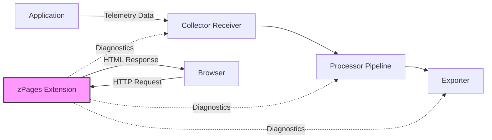

# How to Configure the zPages Extension in the OpenTelemetry Collector

Author: [nawazdhandala](https://www.github.com/nawazdhandala)

Tags: OpenTelemetry, Collector, Extension, ZPages, Debugging, Observability

Description: Learn how to configure and use the zPages extension in the OpenTelemetry Collector for real-time debugging and monitoring of telemetry pipelines with live trace sampling and aggregation views.

The zPages extension in the OpenTelemetry Collector provides a powerful debugging interface that allows you to inspect and troubleshoot Collector components in real-time. Originally developed as part of the OpenCensus project, zPages offers browser-based diagnostic views without requiring external dependencies or backend systems.

## What is the zPages Extension?

The zPages extension exposes live diagnostic data from the OpenTelemetry Collector through a web interface. It provides insights into the Collector service, configured pipelines, active extensions, feature gates, and instrumented component operations. This makes it an invaluable tool during development, testing, and production troubleshooting.

Unlike traditional observability backends that require data export and storage, zPages operates entirely within the collector process, providing immediate visibility into Collector diagnostics.

## Key Features of zPages

The zPages extension offers several diagnostic pages:

**TraceZ Page**: Displays Collector trace operations bucketed by latency, including running span samples and error samples. It helps identify slow operations, deadlocks, instrumentation problems, and errors in instrumented Collector components.

**ServiceZ, PipelineZ, ExtensionZ, and FeatureZ Pages**: Show the Collector service, configured pipelines, active extensions, and feature gates.

**ExpvarZ Page**: Optionally exposes Go runtime and component state through expvar when the `expvar.enabled` setting is enabled.

These pages update continuously, providing real-time insights into your Collector's behavior and performance characteristics.

## Architecture Overview

Here's how the zPages extension integrates with the OpenTelemetry Collector:


```mermaid
graph LR
    A[Application] -->|Telemetry Data| B[Collector Receiver]
    B --> C[Processor Pipeline]
    C --> D[Exporter]
    E[zPages Extension] -.->|Diagnostics| B
    E -.->|Diagnostics| C
    E -.->|Diagnostics| D
    F[Browser] -->|HTTP Request| E
    E -->|HTML Response| F
    style E fill:#f9f,stroke:#333,stroke-width:2px
```

The zPages extension operates in the collector process as a diagnostic component, exposing live information from instrumented Collector components without interfering with data processing or export operations.

## Basic Configuration

To enable the zPages extension in your OpenTelemetry Collector, you need to define it in the extensions section and reference it in the service configuration.

Here's a minimal configuration that enables zPages on the default endpoint:

```yaml
# Basic zPages configuration

extensions:
  # Enable the zPages extension with default settings
  zpages:
    # The endpoint where zPages will be served
    # Default is localhost:55679
    endpoint: localhost:55679

# Receivers define how telemetry data enters the collector
receivers:
  otlp:
    protocols:
      grpc:
        endpoint: 0.0.0.0:4317
      http:
        endpoint: 0.0.0.0:4318

# Processors transform telemetry data
processors:
  batch:
    timeout: 10s
    send_batch_size: 1024

# Exporters send telemetry data to backends
exporters:
  debug:
    verbosity: detailed

# Service configuration ties everything together
service:
  # Extensions must be declared in the service section
  extensions: [zpages]

  pipelines:
    traces:
      receivers: [otlp]
      processors: [batch]
      exporters: [debug]
```

After starting the collector with this configuration, you can access the zPages interface by navigating to `http://localhost:55679/debug/tracez` in your web browser.

## Advanced Configuration Options

The zPages extension supports several configuration options for customization:

```yaml
extensions:
  zpages:
    # Network endpoint for the zPages server
    # Use 0.0.0.0 to allow access from other machines
    endpoint: 0.0.0.0:55679

    # TLS configuration for secure access
    tls:
      # Path to the server certificate
      cert_file: /path/to/cert.pem
      # Path to the server private key
      key_file: /path/to/key.pem
      # Minimum TLS version (1.0, 1.1, 1.2, 1.3)
      min_version: "1.2"
      # Maximum TLS version
      max_version: "1.3"

receivers:
  otlp:
    protocols:
      grpc:
        endpoint: 0.0.0.0:4317

processors:
  # Memory limiter prevents the collector from running out of memory
  memory_limiter:
    check_interval: 1s
    limit_mib: 512

  # Batch processor reduces the number of outgoing requests
  batch:
    timeout: 10s
    send_batch_size: 1024

exporters:
  otlp:
    endpoint: backend.example.com:4317
    tls:
      insecure: false

service:
  extensions: [zpages]

  pipelines:
    traces:
      receivers: [otlp]
      processors: [memory_limiter, batch]
      exporters: [otlp]
```

## Production Configuration

For production environments, you should restrict access to zPages since it exposes internal telemetry data. Here's a production-ready configuration:

```yaml
extensions:
  zpages:
    # Bind to localhost only to prevent external access
    endpoint: 127.0.0.1:55679

    # Enable TLS for secure access
    tls:
      cert_file: /etc/otel/certs/zpages.crt
      key_file: /etc/otel/certs/zpages.key
      min_version: "1.2"
      # Require client certificates for mutual TLS
      client_ca_file: /etc/otel/certs/ca.crt

receivers:
  otlp:
    protocols:
      grpc:
        endpoint: 0.0.0.0:4317
        tls:
          cert_file: /etc/otel/certs/server.crt
          key_file: /etc/otel/certs/server.key

processors:
  # Memory limiter with conservative settings
  memory_limiter:
    check_interval: 1s
    limit_mib: 2048
    spike_limit_mib: 512

  # Batch processor for efficient export
  batch:
    timeout: 10s
    send_batch_size: 2048

  # Resource processor adds consistent metadata
  resource:
    attributes:
      - key: environment
        value: production
        action: upsert

exporters:
  otlp/backend:
    endpoint: backend.example.com:4317
    tls:
      insecure: false
      cert_file: /etc/otel/certs/client.crt
      key_file: /etc/otel/certs/client.key

  # Fallback debug exporter for troubleshooting
  debug:
    verbosity: normal
    sampling_initial: 10
    sampling_thereafter: 100

service:
  extensions: [zpages]

  pipelines:
    traces:
      receivers: [otlp]
      processors: [memory_limiter, resource, batch]
      exporters: [otlp/backend, debug]
```

## Using the TraceZ Interface

Once zPages is running, access the TraceZ page at `http://localhost:55679/debug/tracez`. This page displays Collector trace operations organized by latency buckets:

**Latency Buckets**: Spans are automatically categorized into buckets such as 0us, 10us, 100us, 1ms, 10ms, 100ms, 1s, 10s, and 1m. This helps identify performance outliers quickly.

**Sample Spans**: Click on any latency bucket to view sample spans within that range. Each sample shows span names, durations, and attributes.

**Error Samples**: A dedicated section shows spans that encountered errors, making it easy to identify and diagnose failures.

**Running Spans**: View spans that are currently running inside the collector, useful for detecting stuck or long-running operations.

## Integration with Kubernetes

When running the OpenTelemetry Collector in Kubernetes, you can expose zPages through a Service for internal debugging:

```yaml
extensions:
  zpages:
    # Bind to all interfaces for Kubernetes access
    endpoint: 0.0.0.0:55679

receivers:
  otlp:
    protocols:
      grpc:
        endpoint: 0.0.0.0:4317

processors:
  batch:
    timeout: 10s

exporters:
  otlp:
    endpoint: backend:4317

service:
  extensions: [zpages]

  pipelines:
    traces:
      receivers: [otlp]
      processors: [batch]
      exporters: [otlp]
```

Create a Kubernetes Service to access zPages:

```yaml
apiVersion: v1
kind: Service
metadata:
  name: otel-collector-zpages
  namespace: observability
spec:
  selector:
    app: otel-collector
  ports:
    - name: zpages
      port: 55679
      targetPort: 55679
  type: ClusterIP
```

Then use kubectl port-forward to access zPages from your local machine:

```bash
kubectl port-forward -n observability svc/otel-collector-zpages 55679:55679
```

## Troubleshooting Common Issues

**zPages Not Accessible**: Verify that the endpoint is correctly configured and that no firewall rules block the port. Check collector logs for binding errors.

**No TraceZ Data Visible**: Ensure that the relevant Collector components are instrumented and that internal telemetry tracing is not disabled. The zPages extension is incompatible with `service::telemetry::traces::level` set to `none`.

**High Memory Usage**: zPages stores diagnostic samples in memory. If your collector is handling high volumes of operations, monitor memory usage and increase collector memory limits if needed.

## Best Practices

Use zPages as a debugging tool during development and troubleshooting, but avoid relying on it as a primary monitoring solution. For production monitoring, export telemetry data to dedicated observability backends.

Restrict zPages access in production environments by binding to localhost or using mutual TLS authentication. The interface exposes sensitive telemetry data that could reveal application internals.

Combine zPages with other collector extensions like the health check extension and pprof extension for comprehensive collector observability.

## Related Resources

For more information about OpenTelemetry Collector extensions, check out these related posts:

- [How to Configure Bearer Token Auth Extension in the OpenTelemetry Collector](https://oneuptime.com/blog/post/2026-02-06-bearer-token-auth-extension-opentelemetry-collector/view)
- [How to Configure Basic Auth Extension in the OpenTelemetry Collector](https://oneuptime.com/blog/post/2026-02-06-basic-auth-extension-opentelemetry-collector/view)

The zPages extension provides an essential debugging capability for OpenTelemetry Collector deployments. By offering real-time visibility into instrumented Collector components and pipeline configuration, it helps teams quickly identify and resolve issues without requiring external tools or complex setup procedures.
