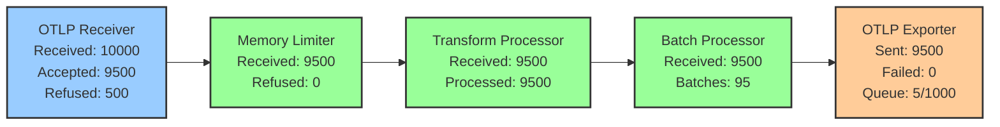

# How to Use zPages for Live Debugging of the Collector

Author: [nawazdhandala](https://www.github.com/nawazdhandala)

Tags: OpenTelemetry, Collector, zPages, Debugging, Live Monitoring, Troubleshooting

Description: Learn how to leverage OpenTelemetry zPages extension for real-time collector debugging, pipeline monitoring, and performance analysis with practical examples.

The zPages extension provides a web-based interface for live debugging and monitoring of the OpenTelemetry Collector. Unlike static logs that require parsing and analysis, zPages offer real-time visibility into collector internals, making it invaluable for troubleshooting active issues and understanding runtime behavior.

## Understanding zPages

zPages originated in the OpenCensus project and provide lightweight, always-available debugging endpoints. The collector's zPages implementation includes several specialized pages for different aspects of collector operation.

Available zPages include:
- ServiceZ: Overall collector health and version information
- PipelineZ: Pipeline configuration and data flow statistics
- ExtensionZ: Extension status and health
- FeatureZ: Enabled features and capabilities

These pages refresh dynamically, showing current collector state without requiring log analysis or metric queries.

## Enabling zPages Extension

Adding zPages to your collector configuration requires minimal setup:

```yaml
# Basic zPages configuration
extensions:
  # zPages extension provides web-based debugging interface
  zpages:
    # HTTP endpoint for accessing zPages
    endpoint: 0.0.0.0:55679

receivers:
  otlp:
    protocols:
      grpc:
        endpoint: 0.0.0.0:4317
      http:
        endpoint: 0.0.0.0:4318

processors:
  batch:
    timeout: 10s
    send_batch_size: 100

exporters:
  otlp:
    endpoint: backend.example.com:4317

service:
  # Extensions must be listed in service section
  extensions: [zpages]

  pipelines:
    traces:
      receivers: [otlp]
      processors: [batch]
      exporters: [otlp]

    metrics:
      receivers: [otlp]
      processors: [batch]
      exporters: [otlp]

    logs:
      receivers: [otlp]
      processors: [batch]
      exporters: [otlp]
```

After starting the collector with this configuration, access zPages by navigating to `http://localhost:55679/debug/` in a web browser.

## Production Deployment Considerations

In production environments, restrict zPages access to prevent unauthorized information disclosure:

```yaml
# Production zPages configuration with network restrictions
extensions:
  zpages:
    # Bind to localhost only for local access
    endpoint: 127.0.0.1:55679

receivers:
  otlp:
    protocols:
      grpc:
        endpoint: 0.0.0.0:4317

processors:
  batch:
    timeout: 10s

exporters:
  otlp:
    endpoint: backend.example.com:4317

service:
  extensions: [zpages]

  pipelines:
    traces:
      receivers: [otlp]
      processors: [batch]
      exporters: [otlp]
```

For Kubernetes deployments, use port forwarding to access zPages securely:

```bash
# Forward zPages port to local machine
kubectl port-forward -n observability deployment/otel-collector 55679:55679

# Access zPages at http://localhost:55679/debug/
```

Alternatively, use a network policy to restrict access:

```yaml
# Kubernetes deployment with zPages
apiVersion: apps/v1
kind: Deployment
metadata:
  name: otel-collector
  namespace: observability
spec:
  replicas: 3
  selector:
    matchLabels:
      app: otel-collector
  template:
    metadata:
      labels:
        app: otel-collector
    spec:
      containers:
      - name: otel-collector
        image: otel/opentelemetry-collector-contrib:latest
        ports:
        - name: otlp-grpc
          containerPort: 4317
        - name: otlp-http
          containerPort: 4318
        # zPages port for debugging
        - name: zpages
          containerPort: 55679
---
# Service exposing only OTLP ports externally
apiVersion: v1
kind: Service
metadata:
  name: otel-collector
  namespace: observability
spec:
  type: LoadBalancer
  selector:
    app: otel-collector
  ports:
  - name: otlp-grpc
    port: 4317
    targetPort: 4317
  - name: otlp-http
    port: 4318
    targetPort: 4318
  # zPages NOT exposed externally
---
# Internal service for zPages access
apiVersion: v1
kind: Service
metadata:
  name: otel-collector-debug
  namespace: observability
spec:
  type: ClusterIP
  selector:
    app: otel-collector
  ports:
  - name: zpages
    port: 55679
    targetPort: 55679
```

This configuration exposes OTLP endpoints externally while keeping zPages accessible only within the cluster.

## Navigating the zPages Interface

The zPages main page provides links to all available debugging pages:

```
OpenTelemetry Collector zPages

Available Pages:
- /debug/servicez     - Service information and health
- /debug/pipelinez    - Pipeline statistics and data flow
- /debug/extensionz   - Extension status
- /debug/featurez     - Enabled features

Collector Version: 0.96.0
Uptime: 2h 34m 15s
```

Each page provides specific insights into different aspects of collector operation.

## Using ServiceZ Page

ServiceZ displays overall collector health, version information, and uptime:

```
ServiceZ - Service Information

Version: 0.96.0
Build Date: 2026-01-15
Git Commit: a1b2c3d4
Uptime: 2h 34m 15s

Service Status: Running
Config Checksum: e5f6a7b8
Last Config Reload: 2026-02-06 08:00:00

System Information:
- Go Version: go1.21.6
- OS/Arch: linux/amd64
- CPUs: 8
- Memory (RSS): 456 MB
- Goroutines: 142
```

ServiceZ helps verify:
- Collector version matches expected deployment
- Uptime indicates stability (or recent restarts)
- Configuration checksum confirms correct config loaded
- Resource usage shows memory consumption and goroutine count

High goroutine counts may indicate goroutine leaks or high concurrency. Compare current values with baseline measurements to identify anomalies.

## Using PipelineZ Page

PipelineZ provides the most detailed debugging information, showing real-time statistics for each pipeline:

```
PipelineZ - Pipeline Statistics

Pipeline: traces/main
Status: Running
Receivers:
  - otlp
    Status: Running
    Data Received: 1,234,567 spans
    Data Accepted: 1,234,567 spans
    Data Refused: 0 spans
    Data Dropped: 0 spans

Processors:
  - memory_limiter
    Status: Running
    Data Received: 1,234,567 spans
    Data Accepted: 1,234,567 spans
    Data Refused: 0 spans
  - batch
    Status: Running
    Data Received: 1,234,567 spans
    Batches Sent: 12,345 batches
    Average Batch Size: 100 spans

Exporters:
  - otlp
    Status: Running
    Data Sent: 1,234,567 spans
    Data Failed: 0 spans
    Queue Size: 45 batches
    Queue Capacity: 1000 batches
```

PipelineZ statistics reveal:
- Data flow through each pipeline component
- Refused data indicating backpressure
- Dropped data indicating errors or capacity limits
- Queue utilization showing export performance
- Batch sizes and frequencies

## Troubleshooting with PipelineZ

PipelineZ statistics directly indicate common issues:

**Issue: Data not reaching backend**

```
Pipeline: traces/main

Receivers:
  - otlp
    Data Received: 5,000 spans
    Data Accepted: 5,000 spans

Processors:
  - batch
    Data Received: 5,000 spans
    Batches Sent: 50 batches

Exporters:
  - otlp
    Data Sent: 0 spans          <- No data exported
    Data Failed: 5,000 spans    <- All exports failing
    Queue Size: 1000 batches    <- Queue is full
```

**Diagnosis**: Exporter failing to send data. Queue filled up and now drops data. Check backend connectivity and exporter logs.

**Issue: Memory limiter refusing data**

```
Pipeline: traces/main

Receivers:
  - otlp
    Data Received: 10,000 spans
    Data Accepted: 7,500 spans
    Data Refused: 2,500 spans   <- Data refused at receiver

Processors:
  - memory_limiter
    Data Received: 7,500 spans
    Data Refused: 2,500 spans   <- Memory pressure causing refusals
```

**Diagnosis**: Memory limiter activating due to memory pressure. Increase memory allocation or reduce data volume. See https://oneuptime.com/blog/post/troubleshoot-memory-issues-oom-kills-collector/view for details.

**Issue: Processing bottleneck**

```
Pipeline: traces/main

Receivers:
  - otlp
    Data Received: 100,000 spans
    Data Accepted: 100,000 spans

Processors:
  - transform
    Data Received: 100,000 spans
    Processing Time: 45s        <- Slow processing
  - batch
    Data Received: 100,000 spans
    Batches Sent: 1000 batches

Exporters:
  - otlp
    Data Sent: 100,000 spans
    Queue Size: 950 batches     <- Queue filling up
```

**Diagnosis**: Transform processor is slow, causing queue buildup. Optimize transformation logic or increase collector resources.

## Monitoring Multiple Pipelines

Complex collector configurations use multiple pipelines. PipelineZ shows all pipelines simultaneously:

```yaml
# Configuration with multiple pipelines
receivers:
  otlp:
    protocols:
      grpc:
        endpoint: 0.0.0.0:4317

processors:
  # Processor for high-priority data
  batch/fast:
    timeout: 1s
    send_batch_size: 50

  # Processor for standard data
  batch/standard:
    timeout: 10s
    send_batch_size: 500

  # Filter for high-priority services
  filter/high_priority:
    traces:
      span:
        - 'resource.attributes["service.tier"] == "critical"'

  # Filter for standard services
  filter/standard:
    traces:
      span:
        - 'resource.attributes["service.tier"] != "critical"'

exporters:
  otlp/high_priority:
    endpoint: critical-backend.example.com:4317

  otlp/standard:
    endpoint: standard-backend.example.com:4317

extensions:
  zpages:
    endpoint: 0.0.0.0:55679

service:
  extensions: [zpages]

  pipelines:
    # High-priority pipeline
    traces/high_priority:
      receivers: [otlp]
      processors: [filter/high_priority, batch/fast]
      exporters: [otlp/high_priority]

    # Standard pipeline
    traces/standard:
      receivers: [otlp]
      processors: [filter/standard, batch/standard]
      exporters: [otlp/standard]
```

PipelineZ displays statistics for both pipelines:

```
PipelineZ - Pipeline Statistics

Pipeline: traces/high_priority
Status: Running
Receivers: otlp - 5,000 spans received
Processors:
  filter/high_priority - 500 spans accepted
  batch/fast - 10 batches sent (avg 50 spans)
Exporters: otlp/high_priority - 500 spans sent

Pipeline: traces/standard
Status: Running
Receivers: otlp - 5,000 spans received
Processors:
  filter/standard - 4,500 spans accepted
  batch/standard - 9 batches sent (avg 500 spans)
Exporters: otlp/standard - 4,500 spans sent
```

This view confirms that filtering correctly routes data to appropriate pipelines and that each pipeline processes data as configured.

## Understanding Data Flow Visualization

PipelineZ statistics map to the data flow architecture:



Each component's statistics appear in PipelineZ, allowing you to trace data through the entire pipeline and identify where issues occur.

## Using ExtensionZ Page

ExtensionZ displays status for all enabled extensions:

```
ExtensionZ - Extension Status

Extension: zpages
Status: Running
Endpoint: 0.0.0.0:55679
Requests Served: 1,234

Extension: health_check
Status: Running
Endpoint: 0.0.0.0:13133
Health Checks: 5,678 (all passing)

Extension: pprof
Status: Running
Endpoint: 0.0.0.0:1777
Profile Requests: 12
```

ExtensionZ confirms extensions are running and accessible. If an extension shows as stopped or failed, check logs for initialization errors.

## Using FeatureZ Page

FeatureZ lists enabled features and capabilities:

```
FeatureZ - Feature Information

Enabled Features:
- Trace Pipeline
- Metric Pipeline
- Log Pipeline
- Batch Processing
- Memory Limiting
- OTLP Receiver (gRPC)
- OTLP Receiver (HTTP)
- OTLP Exporter
- Debug Exporter

Feature Gates:
- telemetry.useOtelForInternalMetrics: enabled
- component.UseLocalHostAsDefaultHost: enabled
```

FeatureZ helps verify that expected features are available and feature gates are configured correctly.

## Combining zPages with Other Tools

zPages work best when combined with other debugging tools:

```yaml
# Comprehensive debugging configuration
extensions:
  # zPages for live monitoring
  zpages:
    endpoint: 0.0.0.0:55679

  # Health check for readiness probes
  health_check:
    endpoint: 0.0.0.0:13133

  # pprof for performance profiling
  pprof:
    endpoint: 0.0.0.0:1777

receivers:
  otlp:
    protocols:
      grpc:
        endpoint: 0.0.0.0:4317

processors:
  memory_limiter:
    check_interval: 1s
    limit_mib: 1536
    spike_limit_mib: 512

  batch:
    timeout: 10s
    send_batch_size: 100

exporters:
  # Debug exporter for inspecting data
  debug:
    verbosity: normal

  otlp:
    endpoint: backend.example.com:4317

service:
  extensions: [zpages, health_check, pprof]

  telemetry:
    logs:
      level: info
      encoding: json

    # Internal metrics for detailed monitoring
    metrics:
      level: detailed
      address: 0.0.0.0:8888

  pipelines:
    traces:
      receivers: [otlp]
      processors: [memory_limiter, batch]
      exporters: [debug, otlp]
```

Use this comprehensive setup for troubleshooting:

1. **zPages** for real-time pipeline statistics
2. **pprof** for performance profiling: https://oneuptime.com/blog/post/profile-collector-pprof-extension/view
3. **Debug exporter** for data inspection: https://oneuptime.com/blog/post/debug-exporter-troubleshoot-collector-pipelines/view
4. **Internal logs** for detailed event history: https://oneuptime.com/blog/post/read-interpret-collector-internal-logs/view
5. **Internal metrics** for time-series performance data

## Accessing zPages in Different Environments

Different deployment environments require different access methods:

**Local development**:

```bash
# Start collector locally
./otelcol-contrib --config=config.yaml

# Access zPages directly
curl http://localhost:55679/debug/servicez
# Or open in browser: http://localhost:55679/debug/
```

**Docker deployment**:

```yaml
# docker-compose.yml with zPages port exposed
version: '3.8'
services:
  otel-collector:
    image: otel/opentelemetry-collector-contrib:latest
    command: ["--config=/etc/otel-collector/config.yaml"]
    volumes:
      - ./config.yaml:/etc/otel-collector/config.yaml
    ports:
      - "4317:4317"
      - "4318:4318"
      # Expose zPages port
      - "55679:55679"
```

```bash
# Access zPages
curl http://localhost:55679/debug/pipelinez
# Or open in browser: http://localhost:55679/debug/
```

**Kubernetes deployment**:

```bash
# Port forward to access zPages
kubectl port-forward -n observability deployment/otel-collector 55679:55679

# Access zPages
curl http://localhost:55679/debug/pipelinez
# Or open in browser: http://localhost:55679/debug/

# Alternative: Use kubectl exec to access from within pod
kubectl exec -n observability deployment/otel-collector -it -- curl localhost:55679/debug/servicez
```

**Remote server with SSH access**:

```bash
# SSH tunnel to remote collector
ssh -L 55679:localhost:55679 user@collector-host.example.com

# Access zPages through tunnel
curl http://localhost:55679/debug/pipelinez
# Or open in browser: http://localhost:55679/debug/
```

## Automating zPages Monitoring

While zPages provide a web interface for humans, you can also query them programmatically for automation:

```bash
# Fetch pipeline statistics as JSON
curl -s http://localhost:55679/debug/pipelinez | grep -A 50 "Pipeline:"

# Monitor exporter queue size
watch 'curl -s http://localhost:55679/debug/pipelinez | grep "Queue Size"'

# Check for refused data
curl -s http://localhost:55679/debug/pipelinez | grep "Refused"

# Alert on high queue utilization
#!/bin/bash
QUEUE_SIZE=$(curl -s http://localhost:55679/debug/pipelinez | grep "Queue Size" | grep -oP '\d+' | head -1)
QUEUE_CAPACITY=$(curl -s http://localhost:55679/debug/pipelinez | grep "Queue Capacity" | grep -oP '\d+' | head -1)
UTILIZATION=$((100 * QUEUE_SIZE / QUEUE_CAPACITY))

if [ $UTILIZATION -gt 80 ]; then
    echo "WARNING: Exporter queue at ${UTILIZATION}% capacity"
    # Send alert
fi
```

Note that zPages HTML output is designed for human consumption. For programmatic access, prefer using the collector's internal metrics endpoint (`http://localhost:8888/metrics`) which provides structured Prometheus-format metrics.

## Interpreting Pipeline Statistics

Understanding what different statistics indicate helps diagnose issues:

**Data Received vs Data Accepted**: The difference indicates refused data. Non-zero refusals suggest backpressure from downstream components.

**Data Accepted vs Data Sent**: For exporters, this difference indicates failed exports. Investigate exporter logs and backend connectivity.

**Queue Size vs Queue Capacity**: High queue utilization indicates the exporter cannot keep up with incoming data. This may be temporary during traffic spikes or indicate persistent performance issues.

**Batches Sent and Average Batch Size**: Compare against configured batch parameters. Low batch sizes may indicate insufficient data volume or short timeouts triggering early sends.

## Real-World Troubleshooting Scenarios

**Scenario 1: Sudden traffic spike**

Check PipelineZ during a traffic spike:

```
Before Spike:
  Receivers: 1,000 spans/min
  Queue Size: 10/1000

During Spike:
  Receivers: 50,000 spans/min
  Queue Size: 950/1000        <- Queue filling up
  Data Refused: 1,000 spans   <- Starting to refuse data

After Spike:
  Receivers: 1,000 spans/min
  Queue Size: 200/1000        <- Draining back to normal
```

PipelineZ confirms the collector handled the spike appropriately, temporarily building queue depth but not failing catastrophically.

**Scenario 2: Backend outage**

Monitor PipelineZ during backend downtime:

```
Backend Available:
  Exporter Queue: 50/1000
  Data Failed: 0

Backend Down:
  Exporter Queue: 1000/1000   <- Queue full
  Data Failed: 5,000 spans    <- Exports failing

Backend Recovered:
  Exporter Queue: 500/1000    <- Draining
  Data Failed: 0              <- Exports succeeding
```

This shows the collector buffering data during the outage and resuming normal operation after recovery.

**Scenario 3: Configuration change impact**

Compare PipelineZ before and after configuration changes:

```
Before (batch timeout: 10s, size: 100):
  Batches Sent: 1,000/hour
  Average Batch Size: 100 spans
  Queue Size: 100/1000

After (batch timeout: 5s, size: 50):
  Batches Sent: 2,400/hour     <- More frequent sends
  Average Batch Size: 50 spans <- Smaller batches
  Queue Size: 30/1000          <- Lower queue depth
```

PipelineZ confirms the configuration change had the intended effect of more frequent, smaller batches.

## Performance Impact of zPages

zPages add minimal overhead to collector operation. The extension maintains statistics asynchronously and only generates HTML when pages are requested.

Typical overhead:
- Memory: Less than 10 MB
- CPU: Negligible when not accessed
- CPU during access: Minimal, comparable to serving a static web page

This minimal impact makes zPages suitable for production use, provided access is properly restricted.

## Limitations and Alternatives

While powerful, zPages have limitations:

**No historical data**: zPages show current state only. For historical analysis, use collector internal metrics with a time-series database.

**No alerting**: zPages are read-only monitoring tools. Implement alerting using metrics exported to monitoring systems.

**Limited data visualization**: zPages provide tables of statistics but no graphs. Use Grafana or similar tools with collector metrics for visualization.

**No authentication**: zPages have no built-in authentication. Rely on network restrictions for access control.

For these capabilities, combine zPages with a complete observability stack:

```yaml
receivers:
  otlp:
    protocols:
      grpc:
        endpoint: 0.0.0.0:4317

  # Scrape collector's own metrics
  prometheus:
    config:
      scrape_configs:
        - job_name: 'otel-collector'
          scrape_interval: 10s
          static_configs:
            - targets: ['localhost:8888']

processors:
  batch:
    timeout: 10s

exporters:
  otlp:
    endpoint: backend.example.com:4317

  # Export collector metrics for historical analysis
  prometheusremotewrite:
    endpoint: http://prometheus.example.com:9090/api/v1/write

extensions:
  zpages:
    endpoint: 0.0.0.0:55679

  health_check:
    endpoint: 0.0.0.0:13133

service:
  extensions: [zpages, health_check]

  telemetry:
    metrics:
      level: detailed
      address: 0.0.0.0:8888

  pipelines:
    traces:
      receivers: [otlp]
      processors: [batch]
      exporters: [otlp]

    # Pipeline for collector's own metrics
    metrics:
      receivers: [prometheus]
      processors: [batch]
      exporters: [prometheusremotewrite]
```

This configuration uses zPages for live debugging while exporting metrics for historical analysis and alerting.

## Conclusion

The zPages extension provides real-time visibility into OpenTelemetry Collector operations, making it an essential tool for troubleshooting and monitoring. PipelineZ's detailed statistics reveal data flow issues, queue buildups, and processing bottlenecks immediately, without requiring log analysis or metric queries. Combined with other debugging tools like pprof, debug exporters, and internal logs, zPages enable comprehensive collector observability.

For complementary troubleshooting techniques, see https://oneuptime.com/blog/post/profile-collector-pprof-extension/view for performance profiling, https://oneuptime.com/blog/post/debug-exporter-troubleshoot-collector-pipelines/view for data inspection, and https://oneuptime.com/blog/post/read-interpret-collector-internal-logs/view for log analysis.
