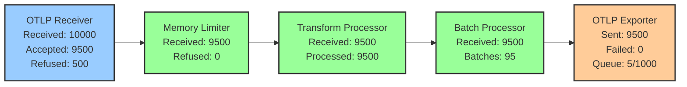

# How to Use zPages for Live Debugging of the Collector

Author: [nawazdhandala](https://www.github.com/nawazdhandala)

Tags: OpenTelemetry, Collector, ZPages, Debugging, Live Monitoring, Troubleshooting

Description: Learn how to leverage OpenTelemetry zPages extension for real-time collector debugging, pipeline monitoring, and performance analysis with practical examples.

The zPages extension provides a web-based interface for live debugging and monitoring of the OpenTelemetry Collector. Unlike static logs that require parsing and analysis, zPages offer real-time visibility into collector internals, making it invaluable for troubleshooting active issues and understanding runtime behavior.

## Understanding zPages

zPages originated in the OpenCensus project and provide lightweight, always-available debugging endpoints. The collector's zPages implementation includes several specialized pages for different aspects of collector operation.

Available zPages include:
- ServiceZ: Overall collector service, build, and runtime information
- PipelineZ: Pipeline configuration, component wiring, and mutation status
- ExtensionZ: Active extensions
- FeatureZ: Available feature gates, their status, and descriptions
- TraceZ: Internal trace samples grouped by latency and error status
- ExpvarZ: Go expvar data, when expvar is enabled in the zPages extension

These pages show current collector state without requiring log analysis or a backend. For live counters such as accepted spans, refused data, exporter failures, and queue size, use the collector's internal metrics endpoint.

## Enabling zPages Extension

Adding zPages to your collector configuration requires minimal setup:

```yaml
# Basic zPages configuration

extensions:
  # zPages extension provides web-based debugging interface
  zpages:
    # HTTP endpoint for accessing zPages
    endpoint: 0.0.0.0:55679

receivers:
  otlp:
    protocols:
      grpc:
        endpoint: 0.0.0.0:4317
      http:
        endpoint: 0.0.0.0:4318

processors:
  batch:
    timeout: 10s
    send_batch_size: 100

exporters:
  otlp:
    endpoint: backend.example.com:4317

service:
  # Extensions must be listed in service section
  extensions: [zpages]

  pipelines:
    traces:
      receivers: [otlp]
      processors: [batch]
      exporters: [otlp]

    metrics:
      receivers: [otlp]
      processors: [batch]
      exporters: [otlp]

    logs:
      receivers: [otlp]
      processors: [batch]
      exporters: [otlp]
```

After starting the collector with this configuration, access zPages by navigating to `http://localhost:55679/debug/` in a web browser.

## Production Deployment Considerations

In production environments, restrict zPages access to prevent unauthorized information disclosure:

```yaml
# Production zPages configuration with network restrictions
extensions:
  zpages:
    # Bind to localhost only for local access
    endpoint: 127.0.0.1:55679

receivers:
  otlp:
    protocols:
      grpc:
        endpoint: 0.0.0.0:4317

processors:
  batch:
    timeout: 10s

exporters:
  otlp:
    endpoint: backend.example.com:4317

service:
  extensions: [zpages]

  pipelines:
    traces:
      receivers: [otlp]
      processors: [batch]
      exporters: [otlp]
```

For Kubernetes deployments, use port forwarding to access zPages securely:

```bash
# Forward zPages port to local machine
kubectl port-forward -n observability deployment/otel-collector 55679:55679

# Access zPages at http://localhost:55679/debug/
```

Alternatively, use a network policy to restrict access:

```yaml
# Kubernetes deployment with zPages
apiVersion: apps/v1
kind: Deployment
metadata:
  name: otel-collector
  namespace: observability
spec:
  replicas: 3
  selector:
    matchLabels:
      app: otel-collector
  template:
    metadata:
      labels:
        app: otel-collector
    spec:
      containers:
      - name: otel-collector
        image: otel/opentelemetry-collector-contrib:latest
        ports:
        - name: otlp-grpc
          containerPort: 4317
        - name: otlp-http
          containerPort: 4318
        # zPages port for debugging
        - name: zpages
          containerPort: 55679
---
# Service exposing only OTLP ports externally
apiVersion: v1
kind: Service
metadata:
  name: otel-collector
  namespace: observability
spec:
  type: LoadBalancer
  selector:
    app: otel-collector
  ports:
  - name: otlp-grpc
    port: 4317
    targetPort: 4317
  - name: otlp-http
    port: 4318
    targetPort: 4318
  # zPages NOT exposed externally
---
# Internal service for zPages access
apiVersion: v1
kind: Service
metadata:
  name: otel-collector-debug
  namespace: observability
spec:
  type: ClusterIP
  selector:
    app: otel-collector
  ports:
  - name: zpages
    port: 55679
    targetPort: 55679
```

This configuration exposes OTLP endpoints externally while keeping zPages accessible only within the cluster.

## Navigating the zPages Interface

The zPages main page provides links to all available debugging pages:

```text
OpenTelemetry Collector zPages

Available Pages:
- /debug/servicez     - Service information and health
- /debug/pipelinez    - Pipeline configuration and component wiring
- /debug/extensionz   - Extension status
- /debug/featurez     - Enabled features
- /debug/tracez       - Internal trace samples and latency buckets

Collector Version: 0.96.0
Uptime: 2h 34m 15s
```

Each page provides specific insights into different aspects of collector operation.

## Using ServiceZ Page

ServiceZ displays service, build, and runtime information:

```text
ServiceZ - Service Information

Version: 0.96.0
Build Date: 2026-01-15
Git Commit: a1b2c3d4
Uptime: 2h 34m 15s

Service Status: Running

System Information:
- Go Version: go1.21.6
- OS/Arch: linux/amd64
- CPUs: 8
- Memory (RSS): 456 MB
- Goroutines: 142
```

ServiceZ helps verify:
- Collector version matches expected deployment
- Uptime indicates stability (or recent restarts)
- Resource usage shows memory consumption and goroutine count

High goroutine counts may indicate goroutine leaks or high concurrency. Compare current values with baseline measurements to identify anomalies.

## Using PipelineZ Page

PipelineZ shows how each pipeline is assembled, including pipeline type, whether data can be mutated, and the receivers, processors, and exporters used by each pipeline:

```text
PipelineZ - Pipeline Configuration

Pipeline: traces/main
Type: traces
Data Mutated: true
Receivers:
  - otlp

Processors:
  - memory_limiter
  - batch

Exporters:
  - otlp
```

PipelineZ reveals:
- Which pipelines are active
- Which components are connected to each pipeline
- Whether processors in the pipeline may mutate telemetry
- Whether the collector loaded the expected receiver, processor, and exporter instances

## Troubleshooting with PipelineZ

Use PipelineZ to confirm pipeline wiring, then use internal metrics for live counters. The collector exposes metrics such as accepted and refused receiver items, exporter send failures, and exporter queue size at the internal telemetry endpoint.

**Issue: Data not reaching backend**

```text
otelcol_receiver_accepted_spans 5000
otelcol_exporter_sent_spans 0
otelcol_exporter_send_failed_spans 5000
otelcol_exporter_queue_size 1000
otelcol_exporter_queue_capacity 1000
```

**Diagnosis**: Exporter failing to send data. Queue filled up and now drops data. Check backend connectivity and exporter logs.

**Issue: Memory limiter refusing data**

```text
otelcol_receiver_accepted_spans 7500
otelcol_receiver_refused_spans 2500
```

**Diagnosis**: The collector is refusing data. If the memory limiter is configured, memory pressure is a common cause. Increase memory allocation or reduce data volume. See https://oneuptime.com/blog/post/2026-02-06-troubleshoot-memory-issues-oom-kills-collector/view for details.

**Issue: Processing bottleneck**

```text
otelcol_processor_incoming_items{processor="transform"} 100000
otelcol_processor_outgoing_items{processor="transform"} 100000
otelcol_exporter_queue_size 950
otelcol_exporter_queue_capacity 1000
```

**Diagnosis**: Queue buildup alongside expensive processors can indicate that processing or export cannot keep up. Use pprof and component logs to identify whether transformation logic, exporter latency, or backend performance is the bottleneck.

## Monitoring Multiple Pipelines

Complex collector configurations use multiple pipelines. PipelineZ shows all pipelines simultaneously:

```yaml
# Configuration with multiple pipelines
receivers:
  otlp:
    protocols:
      grpc:
        endpoint: 0.0.0.0:4317

processors:
  # Processor for high-priority data
  batch/fast:
    timeout: 1s
    send_batch_size: 50

  # Processor for standard data
  batch/standard:
    timeout: 10s
    send_batch_size: 500

  # Filter for high-priority services
  filter/high_priority:
    error_mode: ignore
    traces:
      span:
        - 'resource.attributes["service.tier"] != "critical"'

  # Filter for standard services
  filter/standard:
    error_mode: ignore
    traces:
      span:
        - 'resource.attributes["service.tier"] == "critical"'

exporters:
  otlp/high_priority:
    endpoint: critical-backend.example.com:4317

  otlp/standard:
    endpoint: standard-backend.example.com:4317

extensions:
  zpages:
    endpoint: 0.0.0.0:55679

service:
  extensions: [zpages]

  pipelines:
    # High-priority pipeline
    traces/high_priority:
      receivers: [otlp]
      processors: [filter/high_priority, batch/fast]
      exporters: [otlp/high_priority]

    # Standard pipeline
    traces/standard:
      receivers: [otlp]
      processors: [filter/standard, batch/standard]
      exporters: [otlp/standard]
```

PipelineZ displays both pipelines and their component wiring:

```text
PipelineZ - Pipeline Configuration

Pipeline: traces/high_priority
Type: traces
Receivers: otlp
Processors: filter/high_priority, batch/fast
Exporters: otlp/high_priority

Pipeline: traces/standard
Type: traces
Receivers: otlp
Processors: filter/standard, batch/standard
Exporters: otlp/standard
```

This view confirms that both pipelines loaded with the expected filters, batch processors, and exporters. Use internal metrics to confirm the number of spans accepted, refused, and exported by each component.

## Understanding Data Flow Visualization

PipelineZ maps to the data flow architecture, while internal metrics provide the counters:


```mermaid
graph LR
    A[OTLP Receiver<br/>Received: 10000<br/>Accepted: 9500<br/>Refused: 500] --> B[Memory Limiter<br/>Received: 9500<br/>Refused: 0]
    B --> C[Transform Processor<br/>Received: 9500<br/>Processed: 9500]
    C --> D[Batch Processor<br/>Received: 9500<br/>Batches: 95]
    D --> E[OTLP Exporter<br/>Sent: 9500<br/>Failed: 0<br/>Queue: 5/1000]

    style A fill:#9cf,stroke:#333,stroke-width:2px
    style B fill:#9f9,stroke:#333,stroke-width:2px
    style C fill:#9f9,stroke:#333,stroke-width:2px
    style D fill:#9f9,stroke:#333,stroke-width:2px
    style E fill:#fc9,stroke:#333,stroke-width:2px
```

PipelineZ shows the component path through the pipeline. Internal metrics provide the live counters needed to identify where issues occur.

## Using ExtensionZ Page

ExtensionZ displays active extensions:

```text
ExtensionZ - Extension Status

Extension: zpages
Status: Running

Extension: health_check
Status: Running

Extension: pprof
Status: Running
```

ExtensionZ confirms which extensions are active. If an expected extension is missing, check the service extension list and startup logs for initialization errors.

## Using FeatureZ Page

FeatureZ lists feature gates, their current status, and descriptions:

```text
FeatureZ - Feature Information

Feature Gates:
- example.feature.gate: enabled
- another.feature.gate: disabled
```

FeatureZ helps verify that feature gates are configured correctly.

## Combining zPages with Other Tools

zPages work best when combined with other debugging tools:

```yaml
# Comprehensive debugging configuration
extensions:
  # zPages for live monitoring
  zpages:
    endpoint: 0.0.0.0:55679

  # Health check for readiness probes
  health_check:
    endpoint: 0.0.0.0:13133

  # pprof for performance profiling
  pprof:
    endpoint: 0.0.0.0:1777

receivers:
  otlp:
    protocols:
      grpc:
        endpoint: 0.0.0.0:4317

processors:
  memory_limiter:
    check_interval: 1s
    limit_mib: 1536
    spike_limit_mib: 512

  batch:
    timeout: 10s
    send_batch_size: 100

exporters:
  # Debug exporter for inspecting data
  debug:
    verbosity: normal

  otlp:
    endpoint: backend.example.com:4317

service:
  extensions: [zpages, health_check, pprof]

  telemetry:
    logs:
      level: info
      encoding: json

    # Internal metrics for detailed monitoring
    metrics:
      level: detailed
      readers:
        - pull:
            exporter:
              prometheus:
                host: '0.0.0.0'
                port: 8888

  pipelines:
    traces:
      receivers: [otlp]
      processors: [memory_limiter, batch]
      exporters: [debug, otlp]
```

Use this comprehensive setup for troubleshooting:

1. **zPages** for live pipeline structure, extension, feature gate, and internal trace views
2. **pprof** for performance profiling: https://oneuptime.com/blog/post/2026-02-06-profile-collector-pprof-extension/view
3. **Debug exporter** for data inspection: https://oneuptime.com/blog/post/2026-02-06-debug-exporter-troubleshoot-collector-pipelines/view
4. **Internal logs** for detailed event history: https://oneuptime.com/blog/post/2026-02-06-read-interpret-collector-internal-logs/view
5. **Internal metrics** for time-series performance data

## Accessing zPages in Different Environments

Different deployment environments require different access methods:

**Local development**:

```bash
# Start collector locally
./otelcol-contrib --config=config.yaml

# Access zPages directly
curl http://localhost:55679/debug/servicez
# Or open in browser: http://localhost:55679/debug/
```

**Docker deployment**:

```yaml
# docker-compose.yml with zPages port exposed
version: '3.8'
services:
  otel-collector:
    image: otel/opentelemetry-collector-contrib:latest
    command: ["--config=/etc/otel-collector/config.yaml"]
    volumes:
      - ./config.yaml:/etc/otel-collector/config.yaml
    ports:
      - "4317:4317"
      - "4318:4318"
      # Expose zPages port
      - "55679:55679"
```

```bash
# Access zPages
curl http://localhost:55679/debug/pipelinez
# Or open in browser: http://localhost:55679/debug/
```

**Kubernetes deployment**:

```bash
# Port forward to access zPages
kubectl port-forward -n observability deployment/otel-collector 55679:55679

# Access zPages
curl http://localhost:55679/debug/pipelinez
# Or open in browser: http://localhost:55679/debug/

# Alternative: Use kubectl exec to access from within pod
kubectl exec -n observability deployment/otel-collector -it -- curl localhost:55679/debug/servicez
```

**Remote server with SSH access**:

```bash
# SSH tunnel to remote collector
ssh -L 55679:localhost:55679 user@collector-host.example.com

# Access zPages through tunnel
curl http://localhost:55679/debug/pipelinez
# Or open in browser: http://localhost:55679/debug/
```

## Automating zPages Monitoring

While zPages provide a web interface for humans, you can also query them programmatically for automation:

```bash
# Fetch pipeline wiring from zPages
curl -s http://localhost:55679/debug/pipelinez | grep -A 50 "Pipeline"

# Monitor exporter queue size
watch 'curl -s http://localhost:8888/metrics | grep "otelcol_exporter_queue_size"'

# Check for refused data
curl -s http://localhost:8888/metrics | grep "otelcol_receiver_refused"

# Alert on high queue utilization
#!/bin/bash
QUEUE_SIZE=$(curl -s http://localhost:8888/metrics | awk '/otelcol_exporter_queue_size/ && !/^#/ {print $NF; exit}')
QUEUE_CAPACITY=$(curl -s http://localhost:8888/metrics | awk '/otelcol_exporter_queue_capacity/ && !/^#/ {print $NF; exit}')
UTILIZATION=$((100 * QUEUE_SIZE / QUEUE_CAPACITY))

if [ $UTILIZATION -gt 80 ]; then
    echo "WARNING: Exporter queue at ${UTILIZATION}% capacity"
    # Send alert
fi
```

Note that zPages HTML output is designed for human consumption. For programmatic access, prefer using the collector's internal metrics endpoint (`http://localhost:8888/metrics`) which provides structured Prometheus-format metrics.

## Interpreting Internal Metrics

Understanding what different internal metrics indicate helps diagnose issues:

**Receiver accepted vs receiver refused**: Non-zero refused items suggest errors or backpressure from downstream components.

**Receiver accepted vs exporter sent**: A sustained gap can indicate failed exports, queued data, or processors that intentionally drop data. Investigate exporter logs, backend connectivity, and processor configuration.

**Queue Size vs Queue Capacity**: High queue utilization indicates the exporter cannot keep up with incoming data. This may be temporary during traffic spikes or indicate persistent performance issues.

**Batch processor metrics**: Compare batch send size and timeout-trigger metrics against configured batch parameters. Low batch sizes may indicate insufficient data volume or short timeouts triggering early sends.

## Real-World Troubleshooting Scenarios

**Scenario 1: Sudden traffic spike**

Check internal metrics during a traffic spike:

```text
Before Spike:
  Receivers: 1,000 spans/min
  Queue Size: 10/1000

During Spike:
  Receivers: 50,000 spans/min
  Queue Size: 950/1000        <- Queue filling up
  Data Refused: 1,000 spans   <- Starting to refuse data

After Spike:
  Receivers: 1,000 spans/min
  Queue Size: 200/1000        <- Draining back to normal
```

Internal metrics confirm whether the collector handled the spike appropriately, temporarily building queue depth but not failing catastrophically.

**Scenario 2: Backend outage**

Monitor internal metrics during backend downtime:

```text
Backend Available:
  Exporter Queue: 50/1000
  Data Failed: 0

Backend Down:
  Exporter Queue: 1000/1000   <- Queue full
  Data Failed: 5,000 spans    <- Exports failing

Backend Recovered:
  Exporter Queue: 500/1000    <- Draining
  Data Failed: 0              <- Exports succeeding
```

This shows the collector buffering data during the outage and resuming normal operation after recovery.

**Scenario 3: Configuration change impact**

Compare internal metrics before and after configuration changes:

```text
Before (batch timeout: 10s, size: 100):
  Batches Sent: 1,000/hour
  Average Batch Size: 100 spans
  Queue Size: 100/1000

After (batch timeout: 5s, size: 50):
  Batches Sent: 2,400/hour     <- More frequent sends
  Average Batch Size: 50 spans <- Smaller batches
  Queue Size: 30/1000          <- Lower queue depth
```

Internal metrics confirm whether the configuration change had the intended effect of more frequent, smaller batches.

## Performance Impact of zPages

zPages are intended for lightweight in-process diagnostics. The extension serves HTML only when pages are requested, but TraceZ records internal spans and the extension should still be treated as an operational debugging endpoint.

This design makes zPages suitable for production troubleshooting, provided access is properly restricted.

## Limitations and Alternatives

While powerful, zPages have limitations:

**No historical data**: zPages show current state only. For historical analysis, use collector internal metrics with a time-series database.

**No alerting**: zPages are read-only monitoring tools. Implement alerting using metrics exported to monitoring systems.

**Limited data visualization**: zPages provide simple diagnostic pages, not dashboards or graphs. Use Grafana or similar tools with collector metrics for visualization.

**No authentication**: zPages have no built-in authentication. Rely on network restrictions for access control.

For these capabilities, combine zPages with a complete observability stack:

```yaml
receivers:
  otlp:
    protocols:
      grpc:
        endpoint: 0.0.0.0:4317

  # Scrape collector's own metrics
  prometheus:
    config:
      scrape_configs:
        - job_name: 'otel-collector'
          scrape_interval: 10s
          static_configs:
            - targets: ['localhost:8888']

processors:
  batch:
    timeout: 10s

exporters:
  otlp:
    endpoint: backend.example.com:4317

  # Export collector metrics for historical analysis
  prometheusremotewrite:
    endpoint: http://prometheus.example.com:9090/api/v1/write

extensions:
  zpages:
    endpoint: 0.0.0.0:55679

  health_check:
    endpoint: 0.0.0.0:13133

service:
  extensions: [zpages, health_check]

  telemetry:
    metrics:
      level: detailed
      readers:
        - pull:
            exporter:
              prometheus:
                host: '0.0.0.0'
                port: 8888

  pipelines:
    traces:
      receivers: [otlp]
      processors: [batch]
      exporters: [otlp]

    # Pipeline for collector's own metrics
    metrics:
      receivers: [prometheus]
      processors: [batch]
      exporters: [prometheusremotewrite]
```

This configuration uses zPages for live debugging while exporting metrics for historical analysis and alerting.

## Conclusion

The zPages extension provides live visibility into OpenTelemetry Collector operations, making it a useful tool for troubleshooting and monitoring. PipelineZ reveals pipeline wiring and component configuration, while internal metrics reveal data flow issues, queue buildups, and exporter failures. Combined with other debugging tools like pprof, debug exporters, and internal logs, zPages enable comprehensive collector observability.

For complementary troubleshooting techniques, see https://oneuptime.com/blog/post/2026-02-06-profile-collector-pprof-extension/view for performance profiling, https://oneuptime.com/blog/post/2026-02-06-debug-exporter-troubleshoot-collector-pipelines/view for data inspection, and https://oneuptime.com/blog/post/2026-02-06-read-interpret-collector-internal-logs/view for log analysis.
