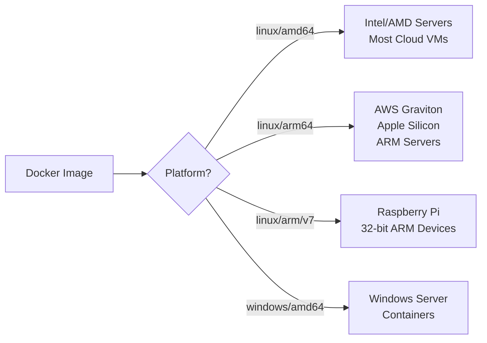

# How to Check the OS and Architecture of a Docker Image

Author: [nawazdhandala](https://github.com/nawazdhandala)

Tags: Docker, Images, Architecture, Multi-Platform, DevOps, ARM, AMD64

Description: Discover how to check the operating system and CPU architecture of any Docker image using inspect, manifest, and registry commands.

---

Docker images are built for specific operating systems and CPU architectures. An image compiled for linux/amd64 will not run natively on a linux/arm64 machine. With the rise of ARM-based servers and Apple Silicon development machines, checking an image's platform compatibility has become a routine task.

This guide covers several methods to determine what OS and architecture a Docker image targets, whether it sits on your local machine or in a remote registry.

## Why Platform Information Matters

Running an image on the wrong architecture causes failures. Docker Desktop on Apple Silicon can emulate amd64 images through QEMU, but the performance penalty is significant. In production, running an emulated image can cut throughput in half or worse.

Knowing the platform before pulling an image saves bandwidth, avoids cryptic runtime errors, and helps you pick the right variant for your infrastructure.

## Method 1: docker inspect

For images already pulled to your local machine, `docker inspect` gives you the OS and architecture directly.

```bash
# Check the OS and architecture of a local image
docker inspect --format '{{.Os}}/{{.Architecture}}' nginx:latest
```

The output looks like:

```
linux/amd64
```

You can also extract more detailed platform information including the variant field, which matters for ARM images.

```bash
# Get full platform details including variant (important for ARM)
docker inspect --format 'OS: {{.Os}}, Arch: {{.Architecture}}, Variant: {{.Variant}}' nginx:latest
```

For ARM images, the variant distinguishes between v6, v7, and v8 (which is arm64).

## Method 2: docker image inspect with JSON

If you want the full picture in a structured format, pipe the output through jq.

```bash
# Extract all platform-related fields in JSON format
docker inspect nginx:latest | jq '.[0] | {Os: .Os, Architecture: .Architecture, Variant: .Variant}'
```

This returns clean JSON:

```json
{
  "Os": "linux",
  "Architecture": "amd64",
  "Variant": ""
}
```

## Method 3: docker manifest inspect

This is the most powerful method because it works with remote images without downloading them. It also reveals all available platforms for multi-architecture images.

```bash
# Enable experimental CLI features (needed for manifest inspect)
export DOCKER_CLI_EXPERIMENTAL=enabled

# Inspect the manifest of a remote image
docker manifest inspect nginx:latest
```

For multi-platform images, this returns a manifest list showing every supported platform.

```bash
# Parse the manifest to show all supported platforms
docker manifest inspect nginx:latest | jq '.manifests[] | {platform: .platform, digest: .digest}'
```

The output lists each platform variant:

```json
{
  "platform": {
    "architecture": "amd64",
    "os": "linux"
  },
  "digest": "sha256:abc123..."
}
{
  "platform": {
    "architecture": "arm64",
    "os": "linux",
    "variant": "v8"
  },
  "digest": "sha256:def456..."
}
```

## Method 4: docker buildx imagetools

The `buildx imagetools` subcommand provides another way to inspect remote image metadata.

```bash
# Inspect a remote image's platform details using buildx
docker buildx imagetools inspect nginx:latest
```

This outputs something like:

```
Name:      docker.io/library/nginx:latest
MediaType: application/vnd.oci.image.index.v1+json
Digest:    sha256:abc123...

Manifests:
  Name:        docker.io/library/nginx:latest@sha256:def456...
  MediaType:   application/vnd.oci.image.manifest.v1+json
  Platform:    linux/amd64

  Name:        docker.io/library/nginx:latest@sha256:ghi789...
  MediaType:   application/vnd.oci.image.manifest.v1+json
  Platform:    linux/arm64
```

You can filter for specific fields using the `--format` flag.

```bash
# Get just the platform list in a clean format
docker buildx imagetools inspect --format '{{range .Manifest.Manifests}}{{.Platform.OS}}/{{.Platform.Architecture}} {{end}}' nginx:latest
```

## Method 5: Query the Registry API Directly

For registries that support the Docker Registry V2 API, you can fetch manifest information using curl.

```bash
# Get an auth token for Docker Hub
TOKEN=$(curl -s "https://auth.docker.io/token?service=registry.docker.io&scope=repository:library/nginx:pull" | jq -r .token)

# Fetch the manifest list (fat manifest) which contains platform info
curl -s \
  -H "Authorization: Bearer $TOKEN" \
  -H "Accept: application/vnd.docker.distribution.manifest.list.v2+json" \
  "https://registry-1.docker.io/v2/library/nginx/manifests/latest" | jq '.manifests[] | .platform'
```

This approach works without having Docker installed at all, which is useful in CI environments or restricted systems.

## Method 6: Use skopeo

Skopeo is a standalone tool for working with container images and registries. It does not require a Docker daemon.

```bash
# Install skopeo (on Ubuntu/Debian)
sudo apt-get install skopeo

# Inspect a remote image without pulling it
skopeo inspect --raw docker://nginx:latest | jq '.manifests[] | .platform'
```

For a single-platform image, use the non-raw inspect:

```bash
# Get OS and architecture for a single-platform image
skopeo inspect docker://nginx:latest | jq '{Os: .Os, Architecture: .Architecture}'
```

## Checking Multiple Images at Once

In real-world environments, you often need to audit the platform of many images. Here is a script that checks all local images.

```bash
#!/bin/bash
# check-platforms.sh - List the platform of all local Docker images
# Outputs a table of image name, OS, and architecture

printf "%-50s %-10s %-10s\n" "IMAGE" "OS" "ARCH"
printf "%-50s %-10s %-10s\n" "-----" "--" "----"

docker images --format '{{.Repository}}:{{.Tag}}' | while read -r image; do
    # Skip images with <none> tag
    if [[ "$image" == *"<none>"* ]]; then
        continue
    fi

    os=$(docker inspect --format '{{.Os}}' "$image" 2>/dev/null)
    arch=$(docker inspect --format '{{.Architecture}}' "$image" 2>/dev/null)
    printf "%-50s %-10s %-10s\n" "$image" "$os" "$arch"
done
```

## Multi-Platform Build Considerations

Understanding image platforms becomes especially important when you build multi-platform images with `docker buildx`.

```bash
# Build an image for multiple platforms
docker buildx build --platform linux/amd64,linux/arm64 -t myapp:latest --push .
```

After pushing, verify the platforms are correct:

```bash
# Verify multi-platform image was built correctly
docker buildx imagetools inspect myapp:latest
```

## Platform Compatibility Chart

Here is a quick reference for common platform combinations:



## Common Issues and Troubleshooting

When you see this error, it means the image does not support your platform:

```
WARNING: The requested image's platform (linux/amd64) does not match the detected host platform (linux/arm64/v8)
```

Fix it by pulling the correct platform variant:

```bash
# Explicitly pull the image for your platform
docker pull --platform linux/arm64 nginx:latest

# Or specify the platform when running
docker run --platform linux/arm64 nginx:latest
```

## Conclusion

Checking the OS and architecture of a Docker image takes just a single command in most cases. Use `docker inspect` for local images and `docker manifest inspect` or `docker buildx imagetools inspect` for remote images. When working without Docker, tools like skopeo and direct registry API calls get the job done.

As multi-platform deployments become the norm, making platform checks a standard part of your workflow prevents frustrating compatibility issues in both development and production.
