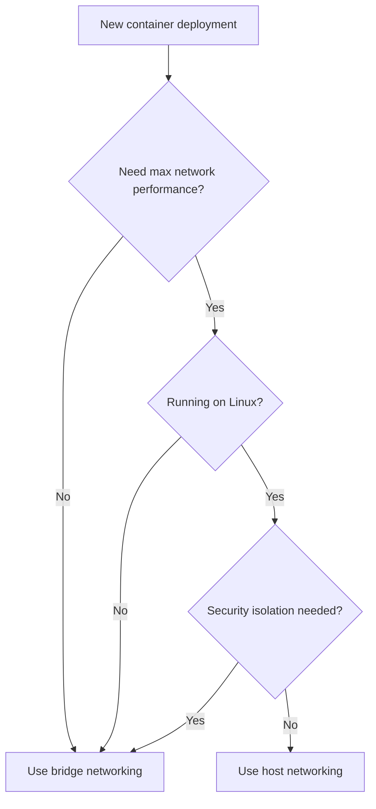

# How to Choose Between Bridge and Host Networking Modes

Author: [nawazdhandala](https://github.com/nawazdhandala)

Tags: docker, networking, bridge network, host network, container networking, docker compose

Description: Understand Docker bridge and host networking modes with practical examples and performance benchmarks

---

Docker networking often confuses developers who are new to containers. Two modes dominate production usage: bridge networking (the default) and host networking. They behave very differently in terms of isolation, port handling, and performance. Choosing the wrong one can introduce subtle bugs, security gaps, or unnecessary latency. This guide breaks down both modes with working examples so you can pick the right one for each use case.

## How Bridge Networking Works

Bridge mode is Docker's default. When you start a container without specifying a network mode, Docker connects it to a virtual bridge network called `docker0`. Each container gets its own IP address on an internal subnet, and Docker handles NAT (network address translation) to route traffic between the container and the outside world.

```bash
# Start a container on the default bridge network
docker run -d --name web -p 8080:80 nginx

# The container gets its own internal IP address
docker inspect web --format '{{.NetworkSettings.IPAddress}}'
# Output: 172.17.0.2

# Port 80 inside the container maps to port 8080 on the host
curl http://localhost:8080
```

The key point: bridge networking creates an isolated network namespace. The container cannot see the host's network interfaces directly, and the host cannot reach the container without explicit port mappings.

With Docker Compose, containers on the same bridge network can reach each other by service name:

```yaml
# docker-compose.yml - Containers communicate by service name on the bridge network
services:
  web:
    image: nginx
    ports:
      - "8080:80"  # Expose to host

  api:
    image: myapp
    ports:
      - "3000:3000"
    # Can reach the database at hostname "db" on port 5432
    environment:
      DATABASE_URL: postgresql://user:pass@db:5432/mydb

  db:
    image: postgres:16
    # No ports mapping - only accessible from other containers on this network
    environment:
      POSTGRES_PASSWORD: pass
      POSTGRES_USER: user
      POSTGRES_DB: mydb
```

Notice that the `db` service has no `ports` mapping. It is only reachable by other containers on the same Docker Compose network, not from the host. This is a security advantage of bridge networking.

## How Host Networking Works

Host mode removes the network namespace entirely. The container shares the host's network stack directly. No NAT, no port mapping, no virtual bridge. The container's processes bind directly to the host's network interfaces.

```bash
# Start a container with host networking
docker run -d --name web --network host nginx

# The container uses the host's IP directly
# No port mapping needed or possible - nginx binds directly to port 80
curl http://localhost:80

# The container shares the host's network interfaces
docker exec web ip addr show
# Shows the SAME interfaces as the host machine
```

With Docker Compose:

```yaml
# docker-compose.yml - Host networking mode
services:
  web:
    image: nginx
    network_mode: host
    # No "ports" section needed - the container IS the host network
```

Important limitation: host networking only works on Linux. On macOS and Windows, Docker runs inside a VM, so `--network host` connects to the VM's network, not your actual machine's network. This makes it essentially useless for local development on non-Linux systems.

## Network Isolation Comparison

Let's see the difference in isolation clearly:

```bash
# Bridge mode: container has its own network namespace
docker run --rm alpine ip addr show
# Shows: lo (loopback) and eth0 (virtual interface with 172.17.x.x)

# Host mode: container shares host network namespace
docker run --rm --network host alpine ip addr show
# Shows: all host interfaces (eth0, wlan0, docker0, etc.)
```

```bash
# Bridge mode: container cannot see host services by default
docker run --rm alpine ping host.docker.internal
# Works on Docker Desktop, fails on Linux without extra configuration

# Host mode: container sees everything the host sees
docker run --rm --network host alpine ping localhost
# Reaches host services directly
```

## Performance Comparison

Host networking avoids the NAT overhead that bridge mode introduces. For most applications, this difference is negligible. But for high-throughput, low-latency workloads, it matters.

```bash
# Benchmark with iperf3: Bridge mode
# Start iperf3 server on the host
iperf3 -s -p 5201 &

# Run client in bridge mode
docker run --rm -it networkstatic/iperf3 -c host.docker.internal -p 5201

# Run client in host mode
docker run --rm -it --network host networkstatic/iperf3 -c localhost -p 5201
```

Typical results on a modern Linux server:

| Mode | Throughput | Latency Overhead |
|---|---|---|
| Host | ~40 Gbps | ~0 us |
| Bridge (default) | ~20-30 Gbps | ~20-50 us |
| Bridge (custom) | ~25-35 Gbps | ~15-40 us |

The throughput difference comes from iptables NAT rules that bridge mode traverses for every packet. For a web API handling a few thousand requests per second, you will never notice. For a message broker processing millions of messages per second, host mode's zero-overhead networking is worth the trade-off.

## Custom Bridge Networks

The default `docker0` bridge has limitations. Custom bridge networks provide DNS resolution between containers, better isolation, and more control:

```bash
# Create a custom bridge network
docker network create --driver bridge mynetwork

# Start containers on the custom network
docker run -d --name api --network mynetwork myapi
docker run -d --name db --network mynetwork postgres:16

# Containers can reach each other by name (DNS works on custom bridges)
docker exec api ping db
# Resolves "db" to its container IP automatically
```

Compare this to the default bridge, where DNS does not work:

```bash
# Default bridge: DNS resolution fails between containers
docker run -d --name api1 myapi
docker run -d --name db1 postgres:16
docker exec api1 ping db1
# FAILS: "ping: bad address 'db1'"
# Must use IP addresses on the default bridge
```

Always use custom bridge networks instead of the default bridge. Docker Compose creates custom networks automatically, which is one reason it is preferred for multi-container setups.

## Security Implications

Bridge networking provides defense in depth. A compromised container in bridge mode cannot directly access host services or sniff host network traffic. It is sandboxed within its own network namespace.

Host networking removes that boundary. A container in host mode can:

- Bind to any port on the host
- See all network traffic on host interfaces
- Access services listening on localhost
- Potentially interfere with other containers or host processes

```yaml
# Secure setup: use bridge networking with explicit port exposure
services:
  # Public-facing service exposes only what it needs
  nginx:
    image: nginx
    ports:
      - "443:443"  # Only HTTPS exposed

  # Internal service has no port exposure to the host
  api:
    image: myapi
    # No ports section - only reachable from nginx on the internal network
    expose:
      - "3000"

  # Database is completely isolated
  db:
    image: postgres:16
    # No ports, no expose - only reachable by service name within the network
```

## When to Choose Bridge Networking

Use bridge mode (the default) when:

- You want network isolation between containers and the host
- You need to control which ports are exposed
- You run multiple services that might use the same port numbers
- Security and multi-tenancy matter
- You develop on macOS or Windows (host mode does not work properly)
- You use Docker Compose (it creates bridge networks automatically)

This covers the vast majority of use cases. Bridge networking is the right default.

## When to Choose Host Networking

Use host mode when:

- You need maximum network throughput with zero NAT overhead
- Your application binds to many dynamic ports (media servers, SIP applications)
- You run network monitoring tools that need to see host interfaces
- Performance benchmarks show that bridge NAT is a measurable bottleneck
- You run on Linux exclusively (host mode on Docker Desktop is ineffective)

```yaml
# Legitimate host networking use cases
services:
  # Prometheus node exporter needs access to host network metrics
  node-exporter:
    image: prom/node-exporter
    network_mode: host
    pid: host

  # High-performance message broker
  kafka:
    image: confluentinc/cp-kafka
    network_mode: host
    environment:
      KAFKA_ADVERTISED_LISTENERS: PLAINTEXT://192.168.1.100:9092
```

## Decision Summary



Start with bridge networking. It is the safer, more portable, and more flexible option. Move to host networking only after you have measured a real performance problem and confirmed that NAT overhead is the cause. In ten years of running containers, I have found that fewer than 5% of workloads genuinely benefit from host mode.
