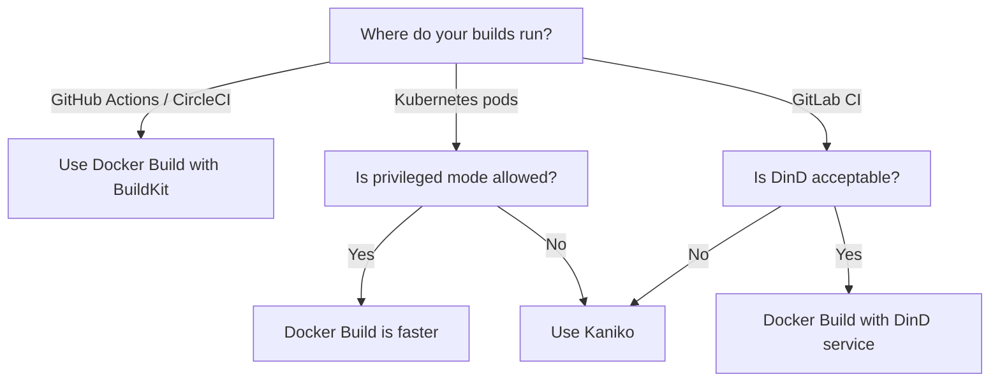

# How to Choose Between Kaniko and Docker Build in CI/CD

Author: [nawazdhandala](https://github.com/nawazdhandala)

Tags: docker, kaniko, ci/cd, container builds, devops, kubernetes, github actions

Description: Compare Kaniko and Docker build for CI/CD pipelines and learn when to use each approach

---

Building Docker images inside CI/CD pipelines presents a fundamental challenge: your build process itself runs inside a container, but Docker traditionally needs access to the Docker daemon. This creates the "Docker-in-Docker" problem that has plagued DevOps teams for years. Two dominant solutions exist today - standard Docker build (with Docker-in-Docker or socket mounting) and Google's Kaniko. Each takes a completely different approach, and picking the right one can significantly affect your build speed, security, and pipeline complexity.

## How Docker Build Works in CI/CD

The traditional approach uses the Docker CLI and daemon. In CI/CD, this typically means one of two setups:

**Docker-in-Docker (DinD):** Run a full Docker daemon inside your CI container. The inner daemon handles builds independently from the host.

**Docker socket mounting:** Mount the host's `/var/run/docker.sock` into the build container. The CI container uses the host's Docker daemon directly.

Here is a GitHub Actions workflow using standard Docker build:

```yaml
# .github/workflows/build.yml - Standard Docker build with GitHub Actions
name: Build and Push
on:
  push:
    branches: [main]

jobs:
  build:
    runs-on: ubuntu-latest
    steps:
      - uses: actions/checkout@v4

      - name: Log in to container registry
        uses: docker/login-action@v3
        with:
          registry: ghcr.io
          username: ${{ github.actor }}
          password: ${{ secrets.GITHUB_TOKEN }}

      # Use Docker Buildx for advanced build features
      - name: Set up Docker Buildx
        uses: docker/setup-buildx-action@v3

      # Build and push with layer caching enabled
      - name: Build and push image
        uses: docker/build-push-action@v5
        with:
          context: .
          push: true
          tags: ghcr.io/myorg/myapp:${{ github.sha }}
          cache-from: type=gha
          cache-to: type=gha,mode=max
```

And a GitLab CI example using Docker-in-Docker:

```yaml
# .gitlab-ci.yml - Docker build using DinD service
build:
  image: docker:24.0
  services:
    - docker:24.0-dind  # Runs a Docker daemon as a sidecar
  variables:
    DOCKER_TLS_CERTDIR: "/certs"
  script:
    - docker login -u $CI_REGISTRY_USER -p $CI_REGISTRY_PASSWORD $CI_REGISTRY
    - docker build -t $CI_REGISTRY_IMAGE:$CI_COMMIT_SHA .
    - docker push $CI_REGISTRY_IMAGE:$CI_COMMIT_SHA
```

## How Kaniko Works

Kaniko takes a fundamentally different approach. It does not use the Docker daemon at all. Instead, it executes Dockerfile commands in userspace, building the image filesystem layer by layer without any privileged access. Kaniko runs as a regular container and pushes the resulting image directly to a registry.

Here is a GitLab CI pipeline using Kaniko:

```yaml
# .gitlab-ci.yml - Kaniko build without Docker daemon
build:
  image:
    name: gcr.io/kaniko-project/executor:v1.22.0-debug
    entrypoint: [""]  # Override default entrypoint
  script:
    # Create registry credentials file
    - mkdir -p /kaniko/.docker
    - echo "{\"auths\":{\"${CI_REGISTRY}\":{\"auth\":\"$(printf '%s:%s' "${CI_REGISTRY_USER}" "${CI_REGISTRY_PASSWORD}" | base64 | tr -d '\n')\"}}}" > /kaniko/.docker/config.json

    # Run Kaniko executor to build and push
    - /kaniko/executor
        --context "${CI_PROJECT_DIR}"
        --dockerfile "${CI_PROJECT_DIR}/Dockerfile"
        --destination "${CI_REGISTRY_IMAGE}:${CI_COMMIT_SHA}"
        --cache=true
        --cache-repo="${CI_REGISTRY_IMAGE}/cache"
```

And a Kubernetes Job running Kaniko:

```yaml
# kaniko-build-job.yaml - Run Kaniko as a Kubernetes Job
apiVersion: batch/v1
kind: Job
metadata:
  name: kaniko-build
spec:
  template:
    spec:
      containers:
        - name: kaniko
          image: gcr.io/kaniko-project/executor:v1.22.0
          args:
            - "--dockerfile=Dockerfile"
            - "--context=git://github.com/myorg/myapp.git#refs/heads/main"
            - "--destination=ghcr.io/myorg/myapp:latest"
            - "--cache=true"
          volumeMounts:
            - name: docker-config
              mountPath: /kaniko/.docker
      volumes:
        - name: docker-config
          secret:
            secretName: registry-credentials  # K8s secret with registry auth
      restartPolicy: Never
```

## Security Comparison

This is where Kaniko shines. Docker build in CI/CD requires one of two risky setups:

**DinD requires `--privileged` mode.** This gives the container full host kernel access. A compromised build could escape the container and attack the host system.

**Socket mounting exposes the host daemon.** Any process with access to the Docker socket effectively has root access to the host machine.

Kaniko needs neither. It runs entirely in userspace without privilege escalation. For organizations with strict security requirements, regulated industries, or shared CI infrastructure, this difference is significant.

```yaml
# Kubernetes pod security: Kaniko works with restricted policies
apiVersion: v1
kind: Pod
metadata:
  name: kaniko-builder
spec:
  securityContext:
    runAsNonRoot: false  # Kaniko needs root inside its own container
    # But NO privileged flag, no host access, no socket mounting
  containers:
    - name: kaniko
      image: gcr.io/kaniko-project/executor:v1.22.0
      securityContext:
        privileged: false  # No privileged mode needed
        allowPrivilegeEscalation: false
```

## Build Speed Comparison

Standard Docker build generally wins on speed for several reasons:

1. Docker's build cache is stored locally on the build host and persists between runs.
2. BuildKit (Docker's modern builder) supports parallel stage execution out of the box.
3. Layer caching with BuildKit is highly optimized.

Kaniko's caching works differently. It stores cache layers in a container registry, which means every cache hit involves a network round trip to pull the layer.

```bash
# Benchmark: time both approaches on the same Dockerfile

# Docker build with BuildKit cache
time docker build --build-arg BUILDKIT_INLINE_CACHE=1 -t myapp:docker .

# Kaniko build with registry cache
time docker run \
  -v $(pwd):/workspace \
  gcr.io/kaniko-project/executor:v1.22.0 \
  --context=/workspace \
  --no-push \
  --cache=true \
  --cache-repo=myregistry/cache
```

In practice, Docker build is 20-40% faster for most workloads. The gap narrows when builds are cache-cold (first build on a fresh runner), since both tools must download base images from the network.

## Feature Comparison

| Feature | Docker Build (BuildKit) | Kaniko |
|---|---|---|
| Privileged mode required | Yes (DinD) or socket mount | No |
| Multi-stage builds | Full support | Full support |
| Build arguments | Full support | Full support |
| Layer caching | Local + registry + GHA | Registry only |
| Parallel stages | Yes (BuildKit) | Limited |
| Build secrets | `--mount=type=secret` | `--build-arg` only |
| Multi-platform builds | `--platform` flag | Single platform |
| Dockerfile support | Full specification | Most features |
| Build speed | Faster | Slower |

## When to Choose Docker Build

Standard Docker build with BuildKit is the right choice when:

- You run builds on dedicated, trusted CI runners (self-hosted GitHub Actions runners, your own Jenkins nodes).
- Build speed is a top priority and you need fast layer caching.
- You need multi-platform builds (`linux/amd64`, `linux/arm64`).
- You rely on BuildKit-specific features like secret mounts or SSH forwarding.
- Your CI platform provides native Docker support (GitHub Actions, CircleCI).

```bash
# Multi-platform build - only possible with Docker buildx, not Kaniko
docker buildx build \
  --platform linux/amd64,linux/arm64 \
  --push \
  -t myregistry/myapp:latest .
```

## When to Choose Kaniko

Kaniko is the better choice when:

- Security policies prohibit privileged containers or Docker socket access.
- You build images inside Kubernetes pods (shared cluster, no DinD).
- Your CI environment does not have Docker installed.
- You need to run builds in environments where Docker daemon is unavailable.
- Compliance requirements mandate unprivileged build processes.

## GitHub Actions Configuration

For GitHub Actions specifically, Docker build is almost always the better option since the runners include Docker natively:

```yaml
# Optimized GitHub Actions build with full caching
name: Optimized Build
on: push

jobs:
  build:
    runs-on: ubuntu-latest
    steps:
      - uses: actions/checkout@v4
      - uses: docker/setup-buildx-action@v3

      # Use GitHub Actions cache backend for fast layer reuse
      - uses: docker/build-push-action@v5
        with:
          context: .
          push: false
          tags: myapp:test
          cache-from: type=gha
          cache-to: type=gha,mode=max
          # Build secrets handled securely
          secrets: |
            npm_token=${{ secrets.NPM_TOKEN }}
```

## Making the Decision



For most teams, Docker build with BuildKit remains the default recommendation. It is faster, has broader feature support, and works natively in popular CI platforms. Switch to Kaniko when security constraints demand unprivileged builds, particularly in shared Kubernetes clusters where DinD is not an option.

The worst choice is sticking with the legacy Docker builder (without BuildKit) or running DinD without TLS. If your current setup uses either pattern, migrating to BuildKit or Kaniko will improve both security and performance regardless of which one you pick.
