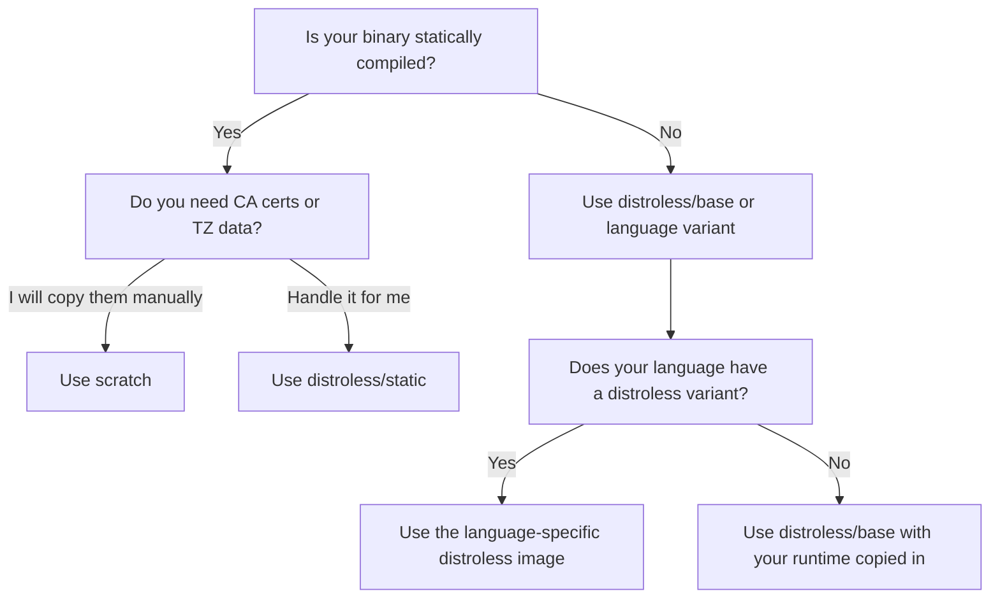

# How to Choose Between Scratch and Distroless Base Images

Author: [nawazdhandala](https://github.com/nawazdhandala)

Tags: docker, scratch, distroless, base images, container security, image optimization

Description: A practical guide to choosing between scratch and distroless Docker base images for production containers

---

When you strip a Docker image down to its absolute minimum, two options surface: `scratch` and Google's distroless images. Both produce tiny, secure containers. But they serve different use cases, and picking the wrong one can cost you hours of debugging. This guide walks through the real differences so you can make the right call for your project.

## What Is the scratch Image?

The `scratch` image is Docker's empty image. It contains nothing at all - no shell, no libc, no package manager, no filesystem utilities. When you build `FROM scratch`, you start from a completely blank slate.

This works well for statically compiled binaries that carry all their dependencies within themselves. Go programs compiled with `CGO_ENABLED=0` are the classic example.

Here is a minimal Go application built on scratch:

```dockerfile
# Build stage: compile the Go binary with static linking
FROM golang:1.22-alpine AS builder
WORKDIR /app
COPY go.mod go.sum ./
RUN go mod download
COPY . .
RUN CGO_ENABLED=0 GOOS=linux go build -ldflags="-s -w" -o /app/server .

# Runtime stage: bare-minimum image with just the binary
FROM scratch
COPY --from=builder /app/server /server
COPY --from=builder /etc/ssl/certs/ca-certificates.crt /etc/ssl/certs/
EXPOSE 8080
ENTRYPOINT ["/server"]
```

Notice you need to manually copy CA certificates if your application makes HTTPS calls. Scratch gives you nothing for free.

## What Are Distroless Images?

Google's distroless images (`gcr.io/distroless/*`) sit one step above scratch. They include a minimal set of runtime libraries but still exclude shells, package managers, and most OS utilities. The project provides variants for several languages:

- `gcr.io/distroless/static-debian12` - for statically compiled binaries
- `gcr.io/distroless/base-debian12` - includes glibc for dynamically linked binaries
- `gcr.io/distroless/java21-debian12` - includes the Java 21 runtime
- `gcr.io/distroless/python3-debian12` - includes the Python 3 runtime
- `gcr.io/distroless/nodejs22-debian12` - includes Node.js 22

Here is the same Go application using distroless:

```dockerfile
# Build stage: compile the Go binary
FROM golang:1.22-alpine AS builder
WORKDIR /app
COPY go.mod go.sum ./
RUN go mod download
COPY . .
RUN CGO_ENABLED=0 GOOS=linux go build -ldflags="-s -w" -o /app/server .

# Runtime stage: distroless includes CA certs and timezone data
FROM gcr.io/distroless/static-debian12
COPY --from=builder /app/server /server
EXPOSE 8080
ENTRYPOINT ["/server"]
```

The difference is subtle but important. Distroless already bundles CA certificates, timezone data, and a minimal `/etc/passwd` file. You skip the manual setup that scratch demands.

## Size Comparison

Let's put real numbers on this. Build both variants and compare:

```bash
# Build the scratch-based image
docker build -t myapp:scratch -f Dockerfile.scratch .

# Build the distroless-based image
docker build -t myapp:distroless -f Dockerfile.distroless .

# Compare sizes side by side
docker images --format "table {{.Repository}}:{{.Tag}}\t{{.Size}}" | grep myapp
```

Typical results for a simple Go HTTP server:

| Base Image | Final Size |
|---|---|
| scratch | ~7 MB |
| distroless/static | ~9 MB |
| distroless/base | ~20 MB |
| alpine | ~12 MB |
| debian:slim | ~80 MB |

Scratch wins on raw size by a couple megabytes. Whether that gap matters depends on your deployment pipeline and registry costs.

## Security Considerations

Both options dramatically reduce your attack surface compared to full OS images. No shell means an attacker who gains code execution inside the container cannot simply drop into bash and poke around. No package manager means they cannot install tools.

However, distroless has one security advantage over scratch: Google regularly rebuilds and patches distroless images. If a vulnerability surfaces in the base libraries, you get a fix by pulling the latest tag. With scratch, your binary is the entire attack surface, which can be simpler to audit but also means you own every dependency.

Run a vulnerability scan on both to see the difference:

```bash
# Scan the scratch image - should find zero OS-level CVEs
docker scout cves myapp:scratch

# Scan the distroless image - may find a few low-severity findings
docker scout cves myapp:distroless
```

## Debugging Challenges

Here is where the practical differences bite. With scratch, you cannot exec into the container at all:

```bash
# This will fail because there is no shell
docker exec -it mycontainer /bin/sh
```

Distroless provides a `debug` variant that includes busybox:

```bash
# Use the debug tag for troubleshooting
# This variant includes a busybox shell at /busybox/sh
FROM gcr.io/distroless/static-debian12:debug
```

```bash
# Now you can exec into the container
docker exec -it mycontainer /busybox/sh
```

For production, use the non-debug variant. For staging environments where you might need to inspect the container, the debug tag is a practical compromise.

## When to Choose scratch

Pick scratch when all of these conditions hold:

1. Your binary is fully statically linked (no dynamic library dependencies).
2. You have handled CA certificates, timezone data, and user/group files yourself.
3. You want the smallest possible image.
4. Your team is comfortable debugging without container exec access.
5. You are building Go, Rust, or C/C++ applications compiled with musl.

A Rust example with scratch:

```dockerfile
# Build stage: compile a static Rust binary using musl
FROM rust:1.77-alpine AS builder
RUN apk add --no-cache musl-dev
WORKDIR /app
COPY Cargo.toml Cargo.lock ./
COPY src ./src
RUN cargo build --release --target x86_64-unknown-linux-musl

# Runtime: completely empty base image
FROM scratch
COPY --from=builder /app/target/x86_64-unknown-linux-musl/release/myapp /myapp
COPY --from=builder /etc/ssl/certs/ca-certificates.crt /etc/ssl/certs/
USER 1000
ENTRYPOINT ["/myapp"]
```

## When to Choose Distroless

Pick distroless when any of these apply:

1. Your application needs glibc (most C libraries, Python extensions, Java).
2. You want CA certificates, timezone data, and user setup handled automatically.
3. You need language-specific runtimes (Java, Python, Node.js).
4. You want Google's regular security patching for base layers.
5. You occasionally need debug access in non-production environments.

A Java example with distroless:

```dockerfile
# Build stage: compile the Java application with Maven
FROM maven:3.9-eclipse-temurin-21 AS builder
WORKDIR /app
COPY pom.xml .
RUN mvn dependency:go-offline
COPY src ./src
RUN mvn package -DskipTests

# Runtime: distroless Java image includes JRE 21
FROM gcr.io/distroless/java21-debian12
COPY --from=builder /app/target/myapp.jar /app/myapp.jar
EXPOSE 8080
ENTRYPOINT ["java", "-jar", "/app/myapp.jar"]
```

## Decision Flowchart



## Hybrid Approach

Some teams use scratch in production and distroless debug images in staging. You can control this with build arguments:

```dockerfile
# Allow switching base images via build argument
ARG BASE_IMAGE=gcr.io/distroless/static-debian12
FROM golang:1.22-alpine AS builder
WORKDIR /app
COPY . .
RUN CGO_ENABLED=0 go build -o /server .

FROM ${BASE_IMAGE}
COPY --from=builder /server /server
ENTRYPOINT ["/server"]
```

```bash
# Production: use scratch for minimum size
docker build --build-arg BASE_IMAGE=scratch -t myapp:prod .

# Staging: use distroless debug for troubleshooting
docker build --build-arg BASE_IMAGE=gcr.io/distroless/static-debian12:debug -t myapp:staging .
```

## Final Recommendations

For Go and Rust teams that compile static binaries and want absolute minimal images, scratch is the right choice. You accept the trade-off of manual certificate management and zero debugging tools in exchange for the smallest possible container.

For Java, Python, Node.js, and any language needing dynamic libraries, distroless is the practical winner. It gives you a near-minimal image with the runtime dependencies already sorted out.

Both options beat `alpine` and `debian:slim` on security posture. The real mistake is not choosing between scratch and distroless - it is leaving your production containers on full OS images when they do not need to be.
