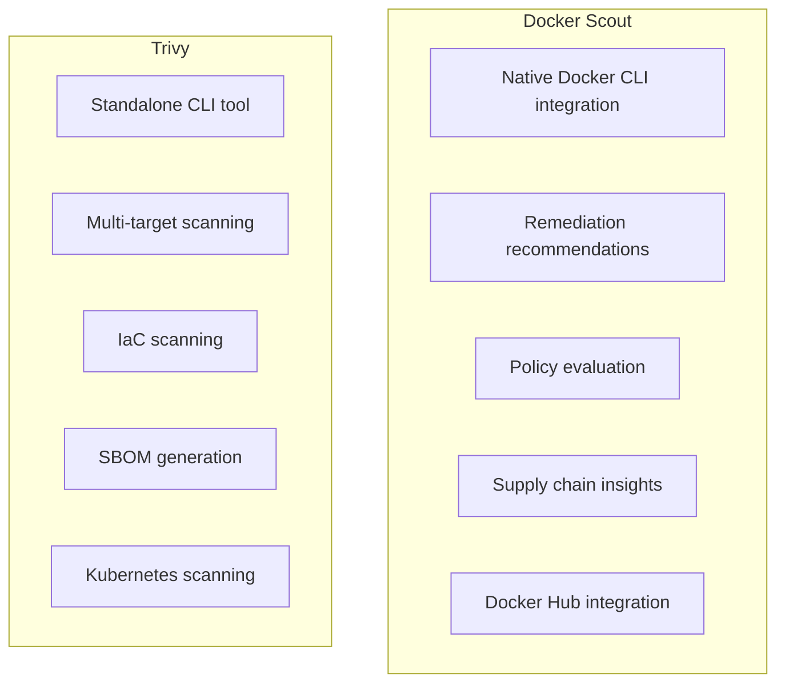

# How to Compare Docker Scout vs Trivy for Vulnerability Scanning

Author: [nawazdhandala](https://github.com/nawazdhandala)

Tags: Docker, Docker Scout, Trivy, Vulnerability Scanning, Container Security, DevOps, CI/CD

Description: A practical comparison of Docker Scout and Trivy for container vulnerability scanning, covering features, setup, and real-world usage patterns.

---

Container images ship with hundreds of packages, and any one of them could contain a known vulnerability. Scanning your images before they reach production is no longer optional. Two tools dominate this space right now: Docker Scout and Trivy. Both find vulnerabilities. Both integrate into CI/CD pipelines. But they take fundamentally different approaches, and the right choice depends on your workflow.

This guide walks through both tools side by side with real commands, real output, and honest tradeoffs.

## Docker Scout Overview

Docker Scout is Docker's native vulnerability scanning tool, built directly into Docker Desktop and the Docker CLI. It analyzes images by comparing package metadata against multiple vulnerability databases and provides remediation advice tied to your specific base image.

Install or verify Docker Scout is available:

```bash
# Check if Docker Scout is available (comes with Docker Desktop 4.17+)
docker scout version

# If you need the CLI plugin separately
curl -sSfL https://raw.githubusercontent.com/docker/scout-cli/main/install.sh | sh
```

Run your first scan with Docker Scout:

```bash
# Scan a local image for CVEs
docker scout cves myapp:latest

# Scan with a specific output format
docker scout cves --format sarif myapp:latest > scout-results.sarif

# Quick overview without the full CVE list
docker scout quickview myapp:latest
```

## Trivy Overview

Trivy is an open-source vulnerability scanner from Aqua Security. It scans container images, filesystems, git repositories, and Kubernetes clusters. It pulls vulnerability data from multiple sources including NVD, GitHub Advisory Database, and OS-specific databases.

Install Trivy:

```bash
# macOS with Homebrew
brew install trivy

# Linux with apt
sudo apt-get install wget apt-transport-https gnupg lsb-release
wget -qO - https://aquasecurity.github.io/trivy-repo/deb/public.key | sudo apt-key add -
echo deb https://aquasecurity.github.io/trivy-repo/deb $(lsb_release -sc) main | sudo tee -a /etc/apt/sources.list.d/trivy.list
sudo apt-get update && sudo apt-get install trivy

# Run as a Docker container (no install required)
docker run --rm -v /var/run/docker.sock:/var/run/docker.sock aquasec/trivy image myapp:latest
```

Run your first scan with Trivy:

```bash
# Scan a local image
trivy image myapp:latest

# Scan with JSON output for CI/CD integration
trivy image --format json --output trivy-results.json myapp:latest

# Scan only for HIGH and CRITICAL vulnerabilities
trivy image --severity HIGH,CRITICAL myapp:latest
```

## Feature Comparison

Here is a side-by-side breakdown of the key differences.



### Vulnerability Database Sources

Docker Scout pulls from a curated set of advisory databases and adds its own analysis layer. It correlates vulnerabilities with base image recommendations, so you do not just see the problem but also the fix path.

Trivy aggregates from NVD, GitHub Advisories, Red Hat OVAL, Debian Security Tracker, Alpine SecDB, and several others. Its database updates frequently and can be downloaded for air-gapped environments.

Compare database freshness:

```bash
# Check Docker Scout's data freshness
docker scout cves --only-fixed alpine:3.19 2>&1 | head -20

# Check Trivy's database status
trivy image --download-db-only
trivy --version
```

### Scanning Speed

Let's measure both against the same image:

```bash
# Time Docker Scout
time docker scout cves nginx:1.25 --format json > /dev/null 2>&1

# Time Trivy (first run downloads the database, so run twice)
trivy image --download-db-only
time trivy image nginx:1.25 --format json > /dev/null 2>&1
```

Trivy tends to be faster on subsequent scans because it caches the vulnerability database locally. Docker Scout relies on API calls to Docker's backend, which adds network latency but means you always have the freshest data.

### Output Formats

Both tools support multiple output formats for different use cases.

```bash
# Docker Scout output formats
docker scout cves myapp:latest --format sarif    # For GitHub Security tab
docker scout cves myapp:latest --format json     # For programmatic parsing
docker scout cves myapp:latest --format markdown  # For human-readable reports

# Trivy output formats
trivy image myapp:latest --format table          # Default, human-readable
trivy image myapp:latest --format json           # Structured data
trivy image myapp:latest --format sarif          # For GitHub Security tab
trivy image myapp:latest --format cyclonedx      # SBOM in CycloneDX format
trivy image myapp:latest --format spdx-json      # SBOM in SPDX format
trivy image myapp:latest --format template --template "@contrib/html.tpl"  # HTML report
```

## CI/CD Integration

### GitHub Actions with Docker Scout

```yaml
# .github/workflows/scout-scan.yml
name: Docker Scout Scan
on:
  push:
    branches: [main]

jobs:
  scan:
    runs-on: ubuntu-latest
    steps:
      - uses: actions/checkout@v4

      - name: Build image
        run: docker build -t myapp:${{ github.sha }} .

      # Authenticate with Docker Hub for Scout access
      - name: Docker Login
        uses: docker/login-action@v3
        with:
          username: ${{ secrets.DOCKERHUB_USERNAME }}
          password: ${{ secrets.DOCKERHUB_TOKEN }}

      # Run Docker Scout and fail on critical vulnerabilities
      - name: Analyze with Docker Scout
        uses: docker/scout-action@v1
        with:
          command: cves
          image: myapp:${{ github.sha }}
          only-severities: critical,high
          exit-code: true
```

### GitHub Actions with Trivy

```yaml
# .github/workflows/trivy-scan.yml
name: Trivy Scan
on:
  push:
    branches: [main]

jobs:
  scan:
    runs-on: ubuntu-latest
    steps:
      - uses: actions/checkout@v4

      - name: Build image
        run: docker build -t myapp:${{ github.sha }} .

      # Run Trivy and upload results to GitHub Security tab
      - name: Scan with Trivy
        uses: aquasecurity/trivy-action@master
        with:
          image-ref: myapp:${{ github.sha }}
          format: sarif
          output: trivy-results.sarif
          severity: CRITICAL,HIGH

      - name: Upload SARIF
        uses: github/codeql-action/upload-sarif@v3
        with:
          sarif_file: trivy-results.sarif
```

## Scanning Beyond Container Images

This is where Trivy pulls ahead significantly. Docker Scout focuses on container images. Trivy scans almost anything.

```bash
# Trivy can scan your filesystem for vulnerabilities in dependencies
trivy fs --scanners vuln .

# Scan a git repository directly
trivy repo https://github.com/your-org/your-app

# Scan Infrastructure as Code files for misconfigurations
trivy config ./terraform/

# Scan a running Kubernetes cluster
trivy k8s --report summary cluster
```

Docker Scout stays focused on the container image supply chain but goes deeper there:

```bash
# Docker Scout shows the full dependency tree
docker scout cves --format packages myapp:latest

# Compare two image versions to see what changed
docker scout compare myapp:v2 --to myapp:v1

# Get base image update recommendations
docker scout recommendations myapp:latest
```

## When to Choose Docker Scout

Pick Docker Scout if your team already uses Docker Desktop and Docker Hub. The integration is seamless. The remediation advice saves real time because it tells you exactly which base image version fixes a given CVE. Policy evaluation lets you set org-wide rules that get enforced automatically.

Docker Scout also shines when you need supply chain visibility. It maps out where your packages come from and how they relate to each other.

## When to Choose Trivy

Pick Trivy if you need a single tool that scans everything. Container images, filesystems, IaC templates, Kubernetes clusters, and git repos all work with one binary. Trivy requires no authentication or subscription for basic scanning, which makes it popular in open-source projects.

Trivy also wins in air-gapped environments. You can download the vulnerability database once and use it offline. Docker Scout requires API connectivity.

## Using Both Together

There is nothing stopping you from running both. In fact, using two scanners with different databases catches more vulnerabilities than either one alone.

```bash
# A combined scanning script
#!/bin/bash
IMAGE="myapp:latest"

echo "Running Docker Scout..."
docker scout cves "$IMAGE" --format json > scout-results.json 2>/dev/null

echo "Running Trivy..."
trivy image "$IMAGE" --format json --output trivy-results.json

# Compare unique CVE counts
SCOUT_CVES=$(jq '[.vulnerabilities[].id] | unique | length' scout-results.json)
TRIVY_CVES=$(jq '[.Results[].Vulnerabilities[]?.VulnerabilityID] | unique | length' trivy-results.json)

echo "Docker Scout found: $SCOUT_CVES unique CVEs"
echo "Trivy found: $TRIVY_CVES unique CVEs"
```

## Final Thoughts

Both Docker Scout and Trivy are production-ready vulnerability scanners. Docker Scout gives you a polished experience within the Docker ecosystem, with actionable fix recommendations. Trivy gives you breadth, scanning anything you throw at it with zero cost and no vendor lock-in. Many teams start with Trivy for its flexibility and add Docker Scout later for its remediation guidance. Whichever you choose, the important thing is that you scan consistently and act on the results.
