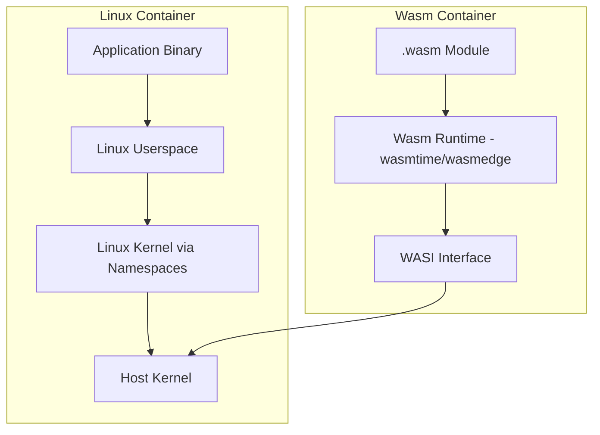

# How to Compare Wasm Containers vs Linux Containers

Author: [nawazdhandala](https://github.com/nawazdhandala)

Tags: docker, WebAssembly, wasm, linux containers, WASI, containerd, cloud native, edge computing

Description: Compare WebAssembly containers with traditional Linux containers across performance, security, portability, and practical use cases.

---

The container world is getting a new runtime. WebAssembly (Wasm) started as a browser technology for running near-native-speed code on the web, but it has expanded beyond browsers into server-side workloads. Docker now supports Wasm containers alongside traditional Linux containers, and the technology is backed by standards like WASI (WebAssembly System Interface). Solomon Hykes, Docker's co-founder, famously said that if Wasm had existed in 2008, Docker might not have been created.

But should you drop Linux containers for Wasm? Probably not yet, at least not for everything. This guide compares the two approaches across the dimensions that matter: performance, security, portability, ecosystem maturity, and practical use cases.

## What Are Wasm Containers?

A Wasm container packages a WebAssembly module along with its metadata and runs it using a Wasm runtime instead of a Linux kernel. The Wasm module is compiled from languages like Rust, Go, C/C++, or Python into the portable `.wasm` binary format.



Docker integrates Wasm through containerd shims. When you run a Wasm container, Docker delegates to a Wasm runtime (like WasmEdge or Wasmtime) instead of runc.

## Running Your First Wasm Container in Docker

Docker Desktop supports Wasm containers through the containerd integration.

```bash
# Enable Wasm support in Docker Desktop
# Go to Settings > Features in development > Enable Wasm
# Or use the CLI to enable containerd image store

# Run a Wasm container
docker run --rm --runtime=io.containerd.wasmedge.v1 \
  --platform wasi/wasm \
  secondstate/rust-example-hello:latest
```

Build a simple Wasm container from Rust.

```rust
// src/main.rs - Simple Wasm application
fn main() {
    println!("Hello from WebAssembly!");

    // Access environment variables through WASI
    for (key, value) in std::env::vars() {
        println!("{}: {}", key, value);
    }

    // Read from stdin (WASI provides this)
    println!("Wasm containers can do real I/O through WASI");
}
```

```dockerfile
# Dockerfile.wasm - Build a Wasm container
FROM rust:1.75 AS build

# Install the wasm32-wasi target
RUN rustup target add wasm32-wasi

WORKDIR /src
COPY . .

# Compile to WebAssembly
RUN cargo build --target wasm32-wasi --release

# The "runtime" stage - just the wasm binary
FROM scratch
COPY --from=build /src/target/wasm32-wasi/release/myapp.wasm /myapp.wasm
ENTRYPOINT ["/myapp.wasm"]
```

```bash
# Build the Wasm image
docker buildx build --platform wasi/wasm -t my-wasm-app -f Dockerfile.wasm .

# Run it with the Wasm runtime
docker run --rm --runtime=io.containerd.wasmedge.v1 --platform wasi/wasm my-wasm-app
```

## Size Comparison

Wasm containers are dramatically smaller than Linux containers.

```bash
# Compare image sizes

# Linux container for a simple Go HTTP server
# Typical size: 10-50 MB (Alpine-based), 100+ MB (Ubuntu-based)
docker images my-go-server

# Wasm container for the same HTTP server
# Typical size: 1-5 MB
docker images my-wasm-server
```

| Application | Linux Container (Alpine) | Wasm Container |
|-------------|-------------------------|----------------|
| Hello World | ~7 MB | ~200 KB |
| HTTP Server | ~15 MB | ~2 MB |
| REST API | ~30 MB | ~5 MB |
| Image processing | ~50 MB | ~8 MB |

The size difference comes from Wasm containers not needing a Linux userspace, filesystem, or OS libraries. They contain just the compiled Wasm module.

## Startup Time

Wasm containers start significantly faster than Linux containers.

```bash
# Benchmark Linux container startup
time docker run --rm alpine echo "done"
# Typical: 300-800ms

# Benchmark Wasm container startup
time docker run --rm --runtime=io.containerd.wasmedge.v1 --platform wasi/wasm \
  my-wasm-hello
# Typical: 10-50ms
```

Wasm modules are designed for instant startup. There is no kernel boot, no init system, and no process tree to set up. The runtime loads the module and begins execution immediately.

This makes Wasm ideal for:
- Serverless functions where cold start time matters
- Edge computing where resources are constrained
- Request-per-container architectures
- Auto-scaling workloads that need rapid scale-out

## Security Model

The security models differ fundamentally.

### Linux Container Security

Linux containers rely on kernel namespaces, cgroups, seccomp profiles, and AppArmor/SELinux. The kernel is shared between the host and all containers, which creates a large attack surface.

```bash
# A Linux container with restricted capabilities
docker run --rm \
  --security-opt no-new-privileges \
  --cap-drop ALL \
  --read-only \
  alpine sh -c "id && whoami"
```

Known risks:
- Container escape through kernel vulnerabilities
- Privilege escalation if capabilities are not properly restricted
- Shared kernel means one vulnerability affects all containers

### Wasm Security

Wasm uses a capability-based security model. By default, a Wasm module has NO access to the host system. Every capability (file access, network, environment variables) must be explicitly granted.

```bash
# A Wasm container with explicit directory access
docker run --rm \
  --runtime=io.containerd.wasmedge.v1 \
  --platform wasi/wasm \
  -v /data:/data \
  my-wasm-app
# The Wasm runtime only allows access to /data, nothing else
```

Security advantages of Wasm:
- Deny-by-default capability model
- Memory safety enforced by the Wasm runtime (no buffer overflows)
- No kernel sharing between host and modules
- Smaller attack surface (no OS libraries to exploit)
- Sandboxed execution with formal verification possible

## Runtime Performance

Once running, the performance characteristics differ.

```bash
# CPU-intensive benchmark comparison
# Linux container running a computation
time docker run --rm my-linux-bench compute --iterations 1000000

# Wasm container running the same computation
time docker run --rm --runtime=io.containerd.wasmedge.v1 --platform wasi/wasm \
  my-wasm-bench compute --iterations 1000000
```

| Metric | Linux Containers | Wasm Containers |
|--------|-----------------|-----------------|
| CPU throughput | Native speed | 80-95% of native |
| Memory usage | OS + app | App only |
| I/O performance | Native kernel I/O | WASI abstraction layer |
| Networking | Full TCP/IP stack | Limited WASI sockets |
| Startup latency | 300ms-2s | 10-50ms |

Wasm computation speed is close to native but not quite there. The WASI interface for I/O adds a small overhead. For I/O-bound applications the difference is negligible, while for CPU-bound workloads Linux containers retain a slight edge.

## Ecosystem and Language Support

This is where Linux containers have a massive advantage.

### Linux Containers

- Run any language, any framework, any binary compiled for Linux
- Millions of images on Docker Hub
- Mature tooling for building, debugging, monitoring
- Every orchestration platform supports them
- Every CI/CD system integrates with them

### Wasm Containers

Languages with good Wasm/WASI support:
- **Rust** - first-class support, best ecosystem
- **C/C++** - supported through Emscripten and wasi-sdk
- **Go** - TinyGo has wasi target, standard Go has experimental support
- **Python** - works through componentize-py but limited
- **JavaScript** - works through engines like SpiderMonkey compiled to Wasm

Languages with limited or no Wasm support:
- Java (early stage through GraalVM)
- .NET (experimental)
- Ruby (experimental)
- PHP (experimental)

```bash
# Building a Go app for Wasm with TinyGo
tinygo build -target=wasi -o myapp.wasm main.go

# Building a C app for Wasm with wasi-sdk
/opt/wasi-sdk/bin/clang --sysroot=/opt/wasi-sdk/share/wasi-sysroot \
  -o myapp.wasm main.c
```

## When to Choose Wasm Over Linux Containers

Wasm containers make sense for specific use cases today:

**Edge computing.** Small binary sizes and fast startup times are critical at the edge where resources are limited and scaling needs to be instant.

**Serverless functions.** Cold start time dominates serverless costs. Wasm functions start in milliseconds versus hundreds of milliseconds for Linux containers.

**Plugin systems.** Wasm provides a safe way to run untrusted third-party code with capability-based permissions.

**Multi-tenant platforms.** The strong isolation model and low overhead let you run more tenants per host with better security boundaries.

```bash
# Example: Running Wasm functions at the edge with Spin
spin new http-rust my-edge-function
spin build
spin up
```

## When to Stick with Linux Containers

Linux containers remain the better choice for:

- **Existing applications.** If it runs on Linux, it runs in a Linux container without modification.
- **Complex dependencies.** Applications needing specific OS packages, native libraries, or system services.
- **Database workloads.** Wasm has no support for running PostgreSQL, MySQL, or other databases.
- **Full networking.** Applications needing raw sockets, specific protocols, or advanced networking.
- **Mature tooling requirements.** Production monitoring, debugging, and observability tools are built for Linux containers.

## Running Both Together

Docker supports running Wasm and Linux containers side by side.

```yaml
# docker-compose.yml - Mixed Wasm and Linux workloads
version: "3.8"

services:
  # Wasm-based API gateway (fast startup, low resources)
  api-gateway:
    image: my-wasm-gateway
    platform: wasi/wasm
    runtime: io.containerd.wasmedge.v1
    ports:
      - "8080:8080"

  # Traditional Linux container for the backend
  backend:
    image: my-backend:latest
    ports:
      - "3000:3000"
    environment:
      - DATABASE_URL=postgres://db:5432/myapp

  # Linux container for the database
  db:
    image: postgres:16-alpine
    volumes:
      - pgdata:/var/lib/postgresql/data

volumes:
  pgdata:
```

## The Future Outlook

The Wasm container ecosystem is growing rapidly. The Component Model standard will enable Wasm modules written in different languages to interoperate. WASI Preview 2 significantly expands the system interface to cover HTTP, sockets, and filesystems more completely. Kubernetes is adding native Wasm support through projects like Spin, Fermyon, and runwasi.

Linux containers are not going anywhere. They run the overwhelming majority of containerized workloads and will continue to do so. Wasm containers will grow alongside them, taking over specific niches where their strengths - tiny size, instant startup, strong sandboxing, and cross-platform portability - provide clear advantages.

## Conclusion

Wasm containers and Linux containers are not competitors but complementary technologies. Linux containers excel at running any application with full OS capabilities and a mature ecosystem. Wasm containers shine where small size, fast startup, and strong sandboxing matter most. Today, use Linux containers as your default and evaluate Wasm for edge computing, serverless functions, and plugin systems. As the Wasm ecosystem matures and language support broadens, expect the line between these two worlds to blur, with Docker serving as the unified platform for both.
