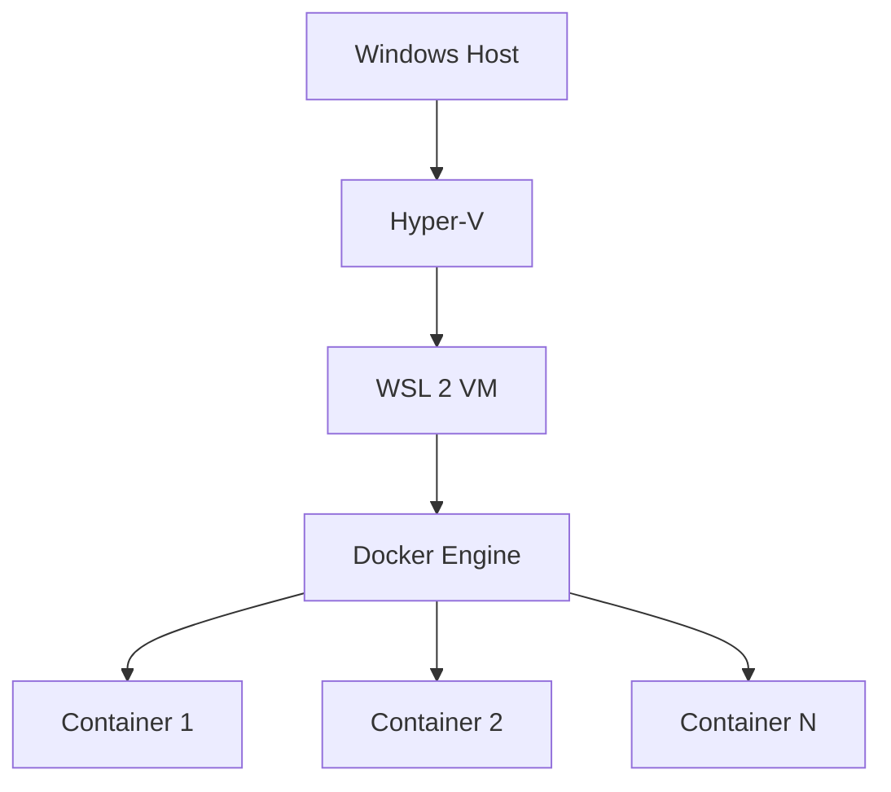

# How to Configure Docker Desktop Memory and CPU Limits on Windows

Author: [nawazdhandala](https://github.com/nawazdhandala)

Tags: Docker, Docker Desktop, Windows, WSL 2, Memory, CPU, Performance

Description: Configure Docker Desktop memory and CPU limits on Windows using WSL 2 backend settings for optimal container performance.

---

Docker Desktop on Windows runs containers through the WSL 2 (Windows Subsystem for Linux) backend by default. Resource management on Windows works differently from macOS because WSL 2 has its own memory and CPU management layer. Understanding how Docker Desktop, WSL 2, and Windows interact is essential for getting good container performance without slowing down your Windows desktop.

This guide covers configuring resource limits through both Docker Desktop settings and WSL 2 configuration, monitoring resource usage, and troubleshooting common performance problems on Windows.

## How Resource Management Works on Windows

Docker Desktop on Windows uses WSL 2 as its backend. WSL 2 runs a lightweight Linux kernel in a Hyper-V virtual machine. Docker's containers run inside this VM. The resource management chain looks like this:



WSL 2 manages memory dynamically by default. It can claim up to 50% of your system memory (or 8 GB, whichever is less) and grows on demand. It can also reclaim unused memory and return it to Windows. CPU cores are shared, meaning WSL 2 can use all cores but Windows processes can preempt it.

## Configuring Docker Desktop Resource Settings

Open Docker Desktop, click the gear icon, and go to "Resources." On Windows with WSL 2, the resource settings you see depend on your Docker Desktop version.

Newer versions of Docker Desktop on WSL 2 defer resource management to the WSL 2 configuration file (`.wslconfig`). You may see a message saying "Resource allocation is managed by WSL 2."

```bash
# Check which backend Docker Desktop uses
docker info --format '{{.OperatingSystem}}'
# Output: Docker Desktop (if using Docker Desktop with WSL 2)
```

## Configuring WSL 2 Resource Limits

The primary way to control Docker's resource usage on Windows is through the `.wslconfig` file in your Windows user profile directory.

Create or edit the file at `C:\Users\<YourUsername>\.wslconfig`:

```ini
# C:\Users\YourUsername\.wslconfig
# WSL 2 resource configuration

[wsl2]
# Limit to 4 CPU cores
processors=4

# Limit to 8 GB of RAM
memory=8GB

# Set swap to 2 GB
swap=2GB

# Set swap file location (optional)
swapFile=C:\\temp\\wsl-swap.vhdx

# Enable localhost forwarding (access container ports from Windows)
localhostForwarding=true

# Disable page reporting to reclaim memory more aggressively
pageReporting=false

# Nested virtualization (needed for some container workloads)
nestedVirtualization=true
```

After saving the file, restart WSL 2 for changes to take effect.

```powershell
# Restart WSL 2 (this stops all running containers)
wsl --shutdown

# Wait a few seconds, then start Docker Desktop again
# Or restart WSL manually
wsl
```

## Recommended Settings by System Configuration

**16 GB Windows PC - Standard Development:**

```ini
[wsl2]
processors=4
memory=6GB
swap=2GB
```

**32 GB Windows PC - Heavy Development:**

```ini
[wsl2]
processors=8
memory=16GB
swap=4GB
```

**8 GB Windows PC - Minimal:**

```ini
[wsl2]
processors=2
memory=3GB
swap=1GB
```

**64 GB Windows Workstation - Kubernetes and Large Stacks:**

```ini
[wsl2]
processors=12
memory=32GB
swap=8GB
```

Always leave at least 4 GB of RAM for Windows itself. Running Windows with too little available memory causes system-wide slowdowns and can trigger Windows' own memory management problems.

## Monitoring Resource Usage

Check how Docker containers use resources on Windows.

```powershell
# From PowerShell: Check WSL 2 memory usage
wsl --status

# From PowerShell: Check Docker resource usage
docker stats --no-stream --format "table {{.Name}}\t{{.CPUPerc}}\t{{.MemUsage}}\t{{.MemPerc}}"

# Check total resources Docker sees
docker info --format "CPUs: {{.NCPU}}, Memory: {{.MemTotal}}"
```

```bash
# From inside WSL 2: Check memory allocation
free -h

# Check CPU information
nproc
cat /proc/cpuinfo | grep "model name" | head -1
```

You can also use Windows Task Manager to see WSL 2's resource consumption. Look for the "Vmmem" process, which represents the WSL 2 virtual machine. If Vmmem uses too much memory, your `.wslconfig` limits are either not set or not restrictive enough.

```powershell
# Check Vmmem process memory usage from PowerShell
Get-Process vmmem -ErrorAction SilentlyContinue | Select-Object Name, @{N='MemoryGB';E={[math]::Round($_.WorkingSet64/1GB, 2)}}
```

## Fixing WSL 2 Memory Not Being Released

A common complaint on Windows is that WSL 2 claims memory and does not release it back to Windows, even when containers stop. This happens because the Linux kernel caches filesystem data aggressively.

```bash
# Inside WSL 2: Drop filesystem caches to free memory
echo 3 | sudo tee /proc/sys/vm/drop_caches

# Check memory before and after
free -h
```

To make this automatic, enable memory reclamation in `.wslconfig`.

```ini
# C:\Users\YourUsername\.wslconfig
[wsl2]
memory=8GB

[experimental]
# Automatically reclaim cached memory
autoMemoryReclaim=gradual
```

The `autoMemoryReclaim` option (available in newer Windows builds) tells WSL 2 to periodically release cached memory back to Windows.

## Hyper-V Backend (Legacy)

If you use the older Hyper-V backend instead of WSL 2, resource settings are configured directly in Docker Desktop.

```powershell
# Check if using Hyper-V or WSL 2 backend
docker info --format '{{.Isolation}}'
```

For Hyper-V backend, open Docker Desktop Settings > Resources and use the sliders:

- **CPUs**: Number of virtual processors
- **Memory**: RAM allocated to the Docker VM
- **Swap**: Swap space
- **Disk image size**: Virtual hard disk limit

Changes require a Docker Desktop restart.

## Per-Container Limits on Windows

Regardless of global settings, apply limits to individual containers.

```powershell
# Run a container with specific resource limits
docker run -d --name mydb --cpus="2" --memory="1g" --memory-swap="1.5g" postgres:16-alpine

# Verify the limits are applied
docker inspect mydb --format "CPUs: {{.HostConfig.NanoCpus}}, Memory: {{.HostConfig.Memory}}"
```

In Docker Compose:

```yaml
# docker-compose.yml - Per-service resource limits
services:
  database:
    image: postgres:16-alpine
    deploy:
      resources:
        limits:
          cpus: '2.0'
          memory: 1G
        reservations:
          cpus: '0.5'
          memory: 512M
    environment:
      POSTGRES_PASSWORD: devpassword
```

## Troubleshooting Performance Issues

**Slow file access with mounted volumes:**

Files stored on the Windows filesystem (C: drive) accessed through WSL 2 mounts (`/mnt/c/`) are slow. Move your project files into the WSL 2 filesystem for much better performance.

```bash
# Slow: accessing Windows filesystem from WSL 2
ls /mnt/c/Users/me/projects/myapp

# Fast: using WSL 2's native filesystem
ls ~/projects/myapp

# Clone your project inside WSL 2 for best performance
cd ~ && git clone https://github.com/org/myapp.git
```

**Docker Desktop uses too much CPU at idle:**

```powershell
# Check what is consuming CPU inside WSL 2
wsl -d docker-desktop top -bn1 | head -20

# If buildkit is consuming CPU, prune its cache
docker builder prune -f
```

**Container exits with code 137 (OOM kill):**

```bash
# Check if a container was OOM killed
docker inspect --format '{{.State.OOMKilled}}' <container-name>

# Increase memory in .wslconfig and restart WSL
```

## Disk Space Management

Docker's virtual disk on Windows grows but does not automatically shrink. Over time, it can consume significant space.

```powershell
# Check Docker disk usage
docker system df

# Clean up unused resources
docker system prune -a -f --volumes

# Find Docker's virtual disk file (WSL 2)
wsl --list --verbose
# The disk is typically at:
# C:\Users\<username>\AppData\Local\Docker\wsl\disk\docker_data.vhdx

# Check its size
Get-Item "$env:LOCALAPPDATA\Docker\wsl\disk\docker_data.vhdx" | Select-Object Length, @{N='SizeGB';E={[math]::Round($_.Length/1GB, 2)}}
```

To reclaim space after pruning Docker resources:

```powershell
# Shut down WSL 2 first
wsl --shutdown

# Compact the virtual disk (requires admin PowerShell)
Optimize-VHD -Path "$env:LOCALAPPDATA\Docker\wsl\disk\docker_data.vhdx" -Mode Full
```

Proper resource configuration on Windows requires attention to both Docker Desktop settings and WSL 2 configuration. The `.wslconfig` file is your primary tool for controlling how much of your system Docker can consume. Start with reasonable limits, monitor the Vmmem process in Task Manager, and adjust based on your workflow's actual needs.
