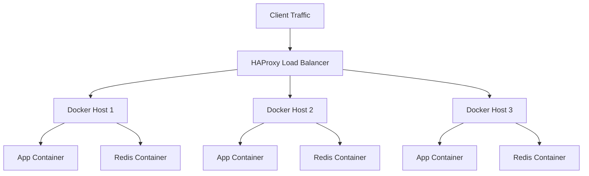

# How to Configure Docker for High Availability Without Orchestration

Author: [nawazdhandala](https://github.com/nawazdhandala)

Tags: Docker, High Availability, Production, Load Balancing, Failover, DevOps

Description: Build a highly available Docker deployment across multiple hosts without Kubernetes or Docker Swarm using proven tools.

---

Not every project needs Kubernetes. Not every team needs Docker Swarm. Sometimes you have two or three servers, a handful of services, and you want them to stay up when one server goes down. This guide covers building high availability for Docker containers using straightforward tools: a load balancer, health checks, shared storage, and restart policies.

## Architecture Overview

The high availability setup uses multiple Docker hosts behind a load balancer. Each host runs identical containers. If one host fails, the load balancer routes traffic to the surviving hosts.



## Setting Up HAProxy as the Load Balancer

HAProxy handles traffic distribution and health checking. Install it on a dedicated machine or use a cloud load balancer.

Create the HAProxy configuration:

```cfg
# /etc/haproxy/haproxy.cfg
# Load balancer configuration for Docker high availability

global
    log /dev/log local0
    maxconn 4096
    daemon

defaults
    log     global
    mode    http
    option  httplog
    option  dontlognull
    timeout connect 5000ms
    timeout client  50000ms
    timeout server  50000ms
    retries 3
    option  redispatch

# Stats dashboard for monitoring backend health
listen stats
    bind *:8404
    stats enable
    stats uri /stats
    stats refresh 10s
    stats auth admin:secretpassword

# Frontend that receives all incoming traffic
frontend http_front
    bind *:80
    default_backend app_servers

# Backend pool of Docker hosts
backend app_servers
    balance roundrobin
    option httpchk GET /health
    http-check expect status 200

    # Each Docker host runs the app container on port 8080
    # Health checks run every 3 seconds, 2 failures marks a server as down
    server docker1 192.168.1.10:8080 check inter 3s fall 2 rise 3
    server docker2 192.168.1.11:8080 check inter 3s fall 2 rise 3
    server docker3 192.168.1.12:8080 check inter 3s fall 2 rise 3
```

Start HAProxy:

```bash
# Start HAProxy with the configuration
sudo systemctl start haproxy
sudo systemctl enable haproxy
```

## Configuring Docker Hosts for Reliability

Each Docker host needs settings that maximize container uptime.

Configure the Docker daemon on every host:

```json
{
  "live-restore": true,
  "log-driver": "json-file",
  "log-opts": {
    "max-size": "50m",
    "max-file": "5"
  },
  "storage-driver": "overlay2",
  "default-ulimits": {
    "nofile": {
      "Name": "nofile",
      "Hard": 65536,
      "Soft": 65536
    }
  },
  "max-concurrent-downloads": 10,
  "max-concurrent-uploads": 5
}
```

The `live-restore: true` setting keeps containers running during Docker daemon restarts. This is critical for maintenance operations.

Apply on each host:

```bash
# Write the daemon config and restart Docker
sudo cp daemon.json /etc/docker/daemon.json
sudo systemctl restart docker
```

## Container Restart Policies

Every production container must have a restart policy. Without one, a container that crashes stays dead until someone manually restarts it.

Use `unless-stopped` for most production workloads:

```bash
# Run the application container with automatic restart
docker run -d \
  --name app \
  --restart unless-stopped \
  -p 8080:8080 \
  --health-cmd="curl -f http://localhost:8080/health || exit 1" \
  --health-interval=10s \
  --health-timeout=5s \
  --health-retries=3 \
  --memory="512m" \
  --cpus="1.0" \
  myapp:latest
```

The restart policy options are:

- `no` - Never restart (default, not for production)
- `on-failure[:max-retries]` - Restart only when the container exits with a non-zero code
- `always` - Always restart, including after Docker daemon restart
- `unless-stopped` - Like `always`, but respects manual `docker stop` commands

For services that should recover from crashes but not restart after deliberate stops, `unless-stopped` is the right choice.

## Shared Storage with GlusterFS

When containers need persistent data that survives host failures, you need shared storage. GlusterFS creates a distributed filesystem across your Docker hosts.

Install GlusterFS on all hosts:

```bash
# Install GlusterFS on each Docker host
sudo apt-get update
sudo apt-get install -y glusterfs-server
sudo systemctl start glusterd
sudo systemctl enable glusterd
```

Create the cluster from the first host:

```bash
# From host 1, add the other hosts as peers
sudo gluster peer probe 192.168.1.11
sudo gluster peer probe 192.168.1.12

# Verify the peer status
sudo gluster peer status
```

Create a replicated volume:

```bash
# Create a replicated volume across all 3 hosts
# Data is replicated to every host for redundancy
sudo gluster volume create app-data replica 3 \
  192.168.1.10:/data/gluster/brick1 \
  192.168.1.11:/data/gluster/brick1 \
  192.168.1.12:/data/gluster/brick1

# Start the volume
sudo gluster volume start app-data
```

Mount the volume on each host:

```bash
# Mount the GlusterFS volume on each host
sudo mkdir -p /mnt/app-data
sudo mount -t glusterfs localhost:/app-data /mnt/app-data

# Add to fstab for persistence across reboots
echo "localhost:/app-data /mnt/app-data glusterfs defaults,_netdev 0 0" | sudo tee -a /etc/fstab
```

Now use the shared mount in your containers:

```bash
# Run the app with shared storage
docker run -d \
  --name app \
  --restart unless-stopped \
  -p 8080:8080 \
  -v /mnt/app-data/uploads:/app/uploads \
  myapp:latest
```

## Docker Compose for Multi-Container Services

Most real applications need more than one container. Use Docker Compose to define the full stack on each host.

Create a compose file for the application stack:

```yaml
# docker-compose.yml - Application stack for each Docker host
version: "3.9"

services:
  app:
    image: myapp:latest
    restart: unless-stopped
    ports:
      - "8080:8080"
    environment:
      - DATABASE_URL=postgresql://db.internal:5432/myapp
      - REDIS_URL=redis://localhost:6379
    volumes:
      - /mnt/app-data/uploads:/app/uploads
    healthcheck:
      test: ["CMD", "curl", "-f", "http://localhost:8080/health"]
      interval: 10s
      timeout: 5s
      retries: 3
    deploy:
      resources:
        limits:
          cpus: "2.0"
          memory: 1G

  redis:
    image: redis:7-alpine
    restart: unless-stopped
    command: redis-server --appendonly yes --maxmemory 256mb
    volumes:
      - redis-data:/data
    healthcheck:
      test: ["CMD", "redis-cli", "ping"]
      interval: 10s
      timeout: 5s
      retries: 3

volumes:
  redis-data:
```

Deploy the stack on each host:

```bash
# Start the application stack
docker compose up -d

# Verify all services are healthy
docker compose ps
```

## Automated Deployment Across Hosts

Use a simple script to deploy updates to all hosts:

```bash
#!/bin/bash
# deploy-all.sh - Deploy a new version to all Docker hosts
# Usage: ./deploy-all.sh myapp:2.0

NEW_IMAGE=$1
HOSTS=("192.168.1.10" "192.168.1.11" "192.168.1.12")
SSH_KEY="~/.ssh/deploy_key"

if [ -z "$NEW_IMAGE" ]; then
    echo "Usage: $0 <image:tag>"
    exit 1
fi

for HOST in "${HOSTS[@]}"; do
    echo "=== Deploying to $HOST ==="

    # Pull the new image
    ssh -i "$SSH_KEY" deploy@"$HOST" "docker pull $NEW_IMAGE"

    # Update the running container
    ssh -i "$SSH_KEY" deploy@"$HOST" \
      "cd /opt/app && sed -i 's|image: myapp:.*|image: $NEW_IMAGE|' docker-compose.yml && docker compose up -d"

    # Wait for health check to pass
    echo "Waiting for $HOST to become healthy..."
    for i in $(seq 1 30); do
        if curl -sf "http://$HOST:8080/health" > /dev/null 2>&1; then
            echo "$HOST is healthy."
            break
        fi
        sleep 2
    done

    # Pause between hosts so the load balancer always has healthy backends
    echo "Waiting 15 seconds before next host..."
    sleep 15
done

echo "Deployment complete on all hosts."
```

## Monitoring Host Health

Set up a cron job on each host to monitor container health and send alerts:

```bash
#!/bin/bash
# check-health.sh - Monitor container health and alert on failures
# Run via cron every minute: * * * * * /opt/scripts/check-health.sh

CONTAINERS=("app" "redis")
ALERT_WEBHOOK="https://hooks.slack.com/services/YOUR/WEBHOOK/URL"

for CONTAINER in "${CONTAINERS[@]}"; do
    STATUS=$(docker inspect --format='{{.State.Health.Status}}' "$CONTAINER" 2>/dev/null)

    if [ "$STATUS" != "healthy" ]; then
        HOST=$(hostname)
        MESSAGE="ALERT: Container '$CONTAINER' on $HOST is $STATUS"
        echo "$MESSAGE"

        # Send alert to Slack
        curl -s -X POST "$ALERT_WEBHOOK" \
          -H "Content-Type: application/json" \
          -d "{\"text\": \"$MESSAGE\"}"
    fi
done
```

## Database High Availability

For databases, avoid running the primary database in Docker across multiple hosts. Instead, use a managed database service or run database replication:

```yaml
# docker-compose.db.yml - PostgreSQL with streaming replication
version: "3.9"

services:
  postgres-primary:
    image: postgres:16-alpine
    restart: unless-stopped
    environment:
      POSTGRES_PASSWORD: secretpass
      POSTGRES_REPLICATION_USER: replicator
      POSTGRES_REPLICATION_PASSWORD: replpass
    volumes:
      - /mnt/app-data/postgres:/var/lib/postgresql/data
    ports:
      - "5432:5432"
```

Run the primary on one host and read replicas on the others. Your application should use connection pooling and handle failover at the application level or through a tool like PgBouncer.

## Summary

High availability without orchestration requires more manual work but gives you full control. The key components are:

- A load balancer (HAProxy) that health-checks backends
- Docker restart policies on every container
- Live restore for daemon maintenance
- Shared storage (GlusterFS) for persistent data
- Sequential deployment scripts that maintain capacity
- Monitoring and alerting for quick response

This approach works well for 2-5 Docker hosts. Beyond that scale, the operational burden of manual management grows, and orchestration tools start earning their complexity budget.
