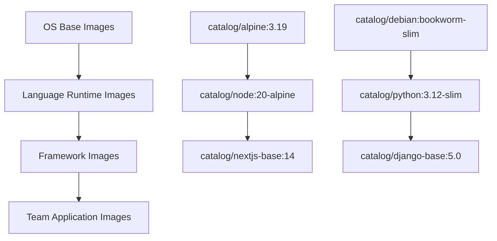

# How to Create a Docker Image Catalog for Your Organization

Author: [nawazdhandala](https://github.com/nawazdhandala)

Tags: Docker, Images, Registry, Catalog, DevOps, Organization, Governance

Description: Build an internal Docker image catalog to standardize base images, improve security, and streamline container development across your teams.

---

As organizations scale their container adoption, teams independently choose base images, build custom variants, and push them to various registries. Without a central catalog, you end up with dozens of redundant images, inconsistent security practices, and no visibility into what is actually running in production.

An image catalog solves this. It provides a curated, documented, and governed collection of approved images that teams can trust and build upon. This guide walks through building one from scratch.

## Why You Need an Image Catalog

Consider a company with ten development teams. Without a catalog, you might find three teams using `node:18-bullseye`, two using `node:18-alpine`, one using `node:20-bookworm`, and four building from `ubuntu:22.04` with Node.js installed manually. Security patches require updating all these variants. Nobody knows which images are current.

An image catalog solves this by providing:

- A single source of truth for approved base images
- Consistent security scanning and patching
- Reduced image sprawl and duplicate effort
- Clear ownership and update responsibilities
- Faster onboarding for new teams

## Choosing a Registry

Your catalog lives in a container registry. The choice depends on your infrastructure.

```bash
# Option 1: Self-hosted registry for full control
docker run -d -p 5000:5000 --name registry \
  -v /data/registry:/var/lib/registry \
  registry:2

# Option 2: Use a managed registry
# AWS ECR, Google Artifact Registry, Azure Container Registry, or Docker Hub
```

For most organizations, a managed registry reduces operational burden. Set up a dedicated namespace or project for your catalog images.

```bash
# Create an ECR repository for a catalog image
aws ecr create-repository \
  --repository-name catalog/node-base \
  --image-scanning-configuration scanOnPush=true \
  --encryption-configuration encryptionType=AES256
```

## Defining Your Image Hierarchy

Structure your catalog with clear naming conventions and a logical hierarchy.



A typical hierarchy has three or four levels:

1. **OS Base Images** - Hardened operating system images
2. **Language Runtime Images** - OS base plus language runtimes
3. **Framework Images** - Runtime plus common frameworks and tools
4. **Application Templates** - Framework plus application scaffolding

## Building Base Images

Start with your OS base images. These form the foundation of everything else.

```dockerfile
# catalog/alpine/Dockerfile
# Hardened Alpine base with standard security configuration
FROM alpine:3.19

# Install common security packages and CA certificates
RUN apk update && \
    apk add --no-cache \
    ca-certificates \
    tzdata \
    curl \
    && rm -rf /var/cache/apk/*

# Create a non-root user for applications
RUN addgroup -g 1001 appgroup && \
    adduser -u 1001 -G appgroup -D appuser

# Add standard labels for catalog metadata
LABEL org.opencontainers.image.vendor="MyCompany" \
      org.opencontainers.image.source="https://github.com/myorg/image-catalog" \
      catalog.tier="base" \
      catalog.owner="platform-team" \
      catalog.support-level="full"

# Set security defaults
USER appuser
WORKDIR /app
```

Build and push it:

```bash
# Build the base image with proper tagging
docker build -t myregistry.example.com/catalog/alpine:3.19 \
  -t myregistry.example.com/catalog/alpine:3.19-$(date +%Y%m%d) \
  -f catalog/alpine/Dockerfile .

# Push both tags
docker push myregistry.example.com/catalog/alpine:3.19
docker push myregistry.example.com/catalog/alpine:3.19-$(date +%Y%m%d)
```

## Building Language Runtime Images

Layer language runtimes on top of your base images.

```dockerfile
# catalog/node/Dockerfile
# Node.js runtime built on the catalog Alpine base
FROM myregistry.example.com/catalog/alpine:3.19

USER root

# Install Node.js from official Alpine packages
RUN apk add --no-cache nodejs=20.11.0-r0 npm=10.2.5-r0

# Configure npm for production use
RUN npm config set fund false && \
    npm config set update-notifier false

# Add catalog labels
LABEL catalog.tier="runtime" \
      catalog.language="nodejs" \
      catalog.language-version="20.11.0" \
      catalog.owner="platform-team"

# Switch back to non-root user
USER appuser
WORKDIR /app

# Set sensible Node.js defaults
ENV NODE_ENV=production
```

## Creating a Catalog Manifest

Document your catalog in a structured format that tools can consume.

```yaml
# catalog.yaml - Central catalog definition
catalog:
  name: "MyCompany Docker Image Catalog"
  registry: "myregistry.example.com"
  owner: "platform-team@mycompany.com"

images:
  - name: catalog/alpine
    description: "Hardened Alpine Linux base image"
    tier: base
    current_version: "3.19"
    supported_versions: ["3.19", "3.18"]
    deprecated_versions: ["3.17"]
    owner: platform-team
    update_frequency: monthly
    security_scan: required

  - name: catalog/node
    description: "Node.js runtime on hardened Alpine"
    tier: runtime
    current_version: "20.11.0"
    supported_versions: ["20.11.0", "18.19.0"]
    deprecated_versions: ["16.20.2"]
    base_image: catalog/alpine:3.19
    owner: platform-team
    update_frequency: weekly
    security_scan: required

  - name: catalog/python
    description: "Python runtime on hardened Debian"
    tier: runtime
    current_version: "3.12.1"
    supported_versions: ["3.12.1", "3.11.7"]
    deprecated_versions: ["3.10.13"]
    base_image: catalog/debian:bookworm-slim
    owner: platform-team
    update_frequency: weekly
    security_scan: required
```

## Automating Catalog Builds

Use CI/CD to automatically rebuild catalog images when base images update or vulnerabilities are found.

```yaml
# .github/workflows/catalog-build.yml
name: Build Catalog Images
on:
  schedule:
    - cron: '0 6 * * 1'  # Every Monday at 6 AM
  workflow_dispatch:

jobs:
  build-base:
    runs-on: ubuntu-latest
    strategy:
      matrix:
        image: [alpine, debian]
    steps:
      - uses: actions/checkout@v4

      - name: Build base image
        run: |
          docker build -t myregistry.example.com/catalog/${{ matrix.image }}:latest \
            -f catalog/${{ matrix.image }}/Dockerfile .

      - name: Scan for vulnerabilities
        run: |
          docker scout cves --exit-code --only-severity critical \
            myregistry.example.com/catalog/${{ matrix.image }}:latest

      - name: Push if scan passes
        run: |
          docker push myregistry.example.com/catalog/${{ matrix.image }}:latest

  build-runtimes:
    needs: build-base
    runs-on: ubuntu-latest
    strategy:
      matrix:
        image: [node, python, go]
    steps:
      - uses: actions/checkout@v4

      - name: Build runtime image
        run: |
          docker build -t myregistry.example.com/catalog/${{ matrix.image }}:latest \
            -f catalog/${{ matrix.image }}/Dockerfile .

      - name: Scan and push
        run: |
          docker scout cves --exit-code --only-severity critical \
            myregistry.example.com/catalog/${{ matrix.image }}:latest
          docker push myregistry.example.com/catalog/${{ matrix.image }}:latest
```

## Enforcing Catalog Usage

Provide tools that validate Dockerfiles reference catalog images.

```bash
#!/bin/bash
# validate-dockerfile.sh - Check that a Dockerfile uses catalog base images
# Usage: ./validate-dockerfile.sh path/to/Dockerfile

DOCKERFILE=$1
CATALOG_REGISTRY="myregistry.example.com/catalog"

# Extract FROM instructions (handling multi-stage builds)
FROM_IMAGES=$(grep "^FROM" "$DOCKERFILE" | awk '{print $2}' | grep -v "AS")

VALID=true
for image in $FROM_IMAGES; do
    if [[ "$image" != "${CATALOG_REGISTRY}"* ]] && [[ "$image" != "scratch" ]]; then
        echo "VIOLATION: $image is not from the catalog registry"
        echo "  Use an image from ${CATALOG_REGISTRY}/ instead"
        VALID=false
    else
        echo "OK: $image"
    fi
done

if [ "$VALID" = false ]; then
    echo ""
    echo "Dockerfile validation failed. All base images must come from the catalog."
    exit 1
fi
```

Run this in CI as a pre-build check:

```bash
# Validate before building
./validate-dockerfile.sh Dockerfile && docker build -t myapp .
```

## Documenting the Catalog

Create a browsable catalog page that teams can reference. A simple approach uses a static site generated from your catalog.yaml.

```bash
#!/bin/bash
# generate-catalog-docs.sh - Generate catalog documentation
# Reads catalog.yaml and produces markdown documentation

echo "# Docker Image Catalog"
echo ""
echo "Last updated: $(date)"
echo ""

# Parse catalog.yaml and generate docs for each image
yq '.images[]' catalog.yaml | while read -r image; do
    name=$(echo "$image" | yq '.name')
    desc=$(echo "$image" | yq '.description')
    version=$(echo "$image" | yq '.current_version')

    echo "## $name"
    echo "$desc"
    echo ""
    echo "Current version: \`$version\`"
    echo ""
    echo "\`\`\`dockerfile"
    echo "FROM myregistry.example.com/${name}:${version}"
    echo "\`\`\`"
    echo ""
done
```

## Versioning Strategy

Use a clear versioning scheme so teams know exactly what they are getting.

```bash
# Tag format: registry/catalog/name:version-builddate
# Examples:
myregistry.example.com/catalog/node:20.11.0-20260115
myregistry.example.com/catalog/node:20.11.0            # Points to latest build
myregistry.example.com/catalog/node:20                  # Points to latest 20.x
```

Never use `latest` in production Dockerfiles. Always pin to a specific version.

## Conclusion

A Docker image catalog transforms container management from chaos into a governed, secure, and efficient process. Start small with a few base images and one or two language runtimes. Add automation to keep images current and scanned. Enforce catalog usage through CI validation. Over time, your catalog becomes the foundation that every team builds upon, reducing duplication, improving security, and accelerating development.
