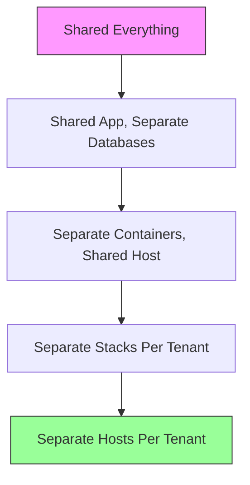

# How to Design a Multi-Tenant Docker Architecture

Author: [nawazdhandala](https://github.com/nawazdhandala)

Tags: Docker, Multi-Tenancy, SaaS, Container Architecture, Isolation, Microservices, DevOps

Description: Design multi-tenant Docker architectures with proper isolation strategies, from shared containers to dedicated stacks per tenant.

---

Multi-tenancy means serving multiple customers (tenants) from the same application infrastructure. Every SaaS product faces this challenge. The question is never whether to support multiple tenants, but how to isolate them from each other while keeping operational costs manageable.

Docker gives you flexible isolation options. You can share containers across tenants, run separate containers per tenant, or deploy entirely separate stacks. Each approach has different trade-offs in cost, isolation, and complexity. This guide walks through each model with practical Docker implementations.

## Understanding Isolation Levels

Multi-tenant architectures fall on a spectrum from fully shared to fully isolated.



Moving from left to right increases isolation and cost. Most production systems land somewhere in the middle.

## Model 1: Shared Containers, Tenant Routing

The simplest approach shares all infrastructure. A single set of containers serves all tenants. Tenant data is separated at the application level, usually through a tenant ID on every database query.

Docker Compose for a shared multi-tenant application:

```yaml
# docker-compose.yml
version: "3.8"

services:
  app:
    image: my-saas-app:latest
    ports:
      - "443:3000"
    environment:
      DATABASE_URL: postgresql://postgres:secret@db:5432/saas_app
      REDIS_URL: redis://redis:6379
      TENANT_MODE: shared
    deploy:
      replicas: 3
      resources:
        limits:
          memory: 512M
          cpus: "1.0"
    depends_on:
      db:
        condition: service_healthy

  db:
    image: postgres:16-alpine
    environment:
      POSTGRES_PASSWORD: secret
      POSTGRES_DB: saas_app
    volumes:
      - pgdata:/var/lib/postgresql/data
    healthcheck:
      test: ["CMD-SHELL", "pg_isready -U postgres"]
      interval: 5s
      timeout: 3s
      retries: 5

  redis:
    image: redis:7-alpine
    volumes:
      - redis-data:/data

volumes:
  pgdata:
  redis-data:
```

Tenant isolation happens in the application code. Every query includes the tenant ID:

```python
# Middleware that extracts tenant from request and sets context
class TenantMiddleware:
    def __init__(self, app):
        self.app = app

    async def __call__(self, scope, receive, send):
        # Extract tenant from subdomain or header
        host = dict(scope.get("headers", [])).get(b"host", b"").decode()
        tenant_id = host.split(".")[0]  # acme.myapp.com -> acme
        scope["tenant_id"] = tenant_id
        await self.app(scope, receive, send)
```

**Pros**: Cheapest to run, simplest to deploy.
**Cons**: No resource isolation between tenants. One noisy tenant affects everyone. A bug can leak data between tenants.

## Model 2: Shared App, Separate Databases

A step up in isolation gives each tenant their own database while sharing the application tier.

Docker Compose with a per-tenant database provisioning approach:

```yaml
version: "3.8"

services:
  app:
    image: my-saas-app:latest
    ports:
      - "443:3000"
    environment:
      TENANT_MODE: separate_db
      DB_HOST: db
      DB_PORT: 5432
      TENANT_CONFIG_URL: redis://redis:6379/0
    depends_on:
      - db
      - redis

  db:
    image: postgres:16-alpine
    environment:
      POSTGRES_PASSWORD: secret
    volumes:
      - pgdata:/var/lib/postgresql/data
      - ./init-tenants.sql:/docker-entrypoint-initdb.d/init.sql

  redis:
    image: redis:7-alpine
    volumes:
      - redis-data:/data

volumes:
  pgdata:
  redis-data:
```

The initialization script creates separate databases per tenant:

```sql
-- init-tenants.sql
-- Creates separate databases for each tenant

CREATE DATABASE tenant_acme;
CREATE DATABASE tenant_globex;
CREATE DATABASE tenant_initech;

-- Create a dedicated user per tenant for extra isolation
CREATE USER acme_user WITH PASSWORD 'acme_secret';
GRANT ALL PRIVILEGES ON DATABASE tenant_acme TO acme_user;

CREATE USER globex_user WITH PASSWORD 'globex_secret';
GRANT ALL PRIVILEGES ON DATABASE tenant_globex TO globex_user;
```

A script to dynamically provision new tenants:

```bash
#!/bin/bash
# provision-tenant.sh
# Creates a new database and user for a tenant

TENANT_ID="$1"
DB_PASSWORD=$(openssl rand -base64 24)

if [ -z "$TENANT_ID" ]; then
  echo "Usage: ./provision-tenant.sh <tenant_id>"
  exit 1
fi

# Create the database and user inside the running Postgres container
docker compose exec db psql -U postgres -c "
  CREATE DATABASE tenant_${TENANT_ID};
  CREATE USER ${TENANT_ID}_user WITH PASSWORD '${DB_PASSWORD}';
  GRANT ALL PRIVILEGES ON DATABASE tenant_${TENANT_ID} TO ${TENANT_ID}_user;
"

# Store connection info in Redis
docker compose exec redis redis-cli SET "tenant:${TENANT_ID}:db_url" \
  "postgresql://${TENANT_ID}_user:${DB_PASSWORD}@db:5432/tenant_${TENANT_ID}"

echo "Tenant ${TENANT_ID} provisioned successfully"
```

**Pros**: Data isolation at the database level. Easier backup/restore per tenant. Tenant deletion is clean.
**Cons**: Database connection pooling gets complicated. Still share compute resources.

## Model 3: Separate Container Stacks Per Tenant

For maximum isolation while sharing hardware, deploy a complete container stack per tenant.

A template Compose file for tenant-specific stacks:

```yaml
# docker-compose.tenant.yml
# Template for per-tenant deployment
version: "3.8"

services:
  app:
    image: my-saas-app:latest
    environment:
      TENANT_ID: ${TENANT_ID}
      DATABASE_URL: postgresql://postgres:${DB_PASSWORD}@db:5432/${TENANT_ID}
    networks:
      - tenant-net
      - proxy-net
    deploy:
      resources:
        limits:
          memory: ${MEMORY_LIMIT:-256M}
          cpus: "${CPU_LIMIT:-0.5}"
    labels:
      - "traefik.enable=true"
      - "traefik.http.routers.${TENANT_ID}.rule=Host(`${TENANT_ID}.myapp.com`)"
      - "traefik.http.services.${TENANT_ID}.loadbalancer.server.port=3000"

  db:
    image: postgres:16-alpine
    environment:
      POSTGRES_PASSWORD: ${DB_PASSWORD}
      POSTGRES_DB: ${TENANT_ID}
    volumes:
      - db-data:/var/lib/postgresql/data
    networks:
      - tenant-net

networks:
  tenant-net:
    internal: true
  proxy-net:
    external: true

volumes:
  db-data:
```

A script to deploy a new tenant stack:

```bash
#!/bin/bash
# deploy-tenant.sh
# Deploys a complete application stack for a new tenant

TENANT_ID="$1"
PLAN="${2:-basic}"

if [ -z "$TENANT_ID" ]; then
  echo "Usage: ./deploy-tenant.sh <tenant_id> [plan]"
  exit 1
fi

# Set resource limits based on plan
case "$PLAN" in
  basic)
    export MEMORY_LIMIT="256M"
    export CPU_LIMIT="0.5"
    ;;
  pro)
    export MEMORY_LIMIT="1G"
    export CPU_LIMIT="2.0"
    ;;
  enterprise)
    export MEMORY_LIMIT="4G"
    export CPU_LIMIT="4.0"
    ;;
esac

export TENANT_ID
export DB_PASSWORD=$(openssl rand -base64 24)

echo "Deploying stack for tenant: $TENANT_ID (plan: $PLAN)"

# Deploy using project name to isolate resources
docker compose \
  -p "tenant-${TENANT_ID}" \
  -f docker-compose.tenant.yml \
  up -d

echo "Tenant $TENANT_ID deployed at https://${TENANT_ID}.myapp.com"
```

## Routing with Traefik

Use Traefik as a reverse proxy to route requests to the correct tenant stack:

```yaml
# docker-compose.proxy.yml
version: "3.8"

services:
  traefik:
    image: traefik:v3.0
    command:
      - "--providers.docker=true"
      - "--providers.docker.exposedbydefault=false"
      - "--entrypoints.web.address=:80"
      - "--entrypoints.websecure.address=:443"
      - "--certificatesresolvers.letsencrypt.acme.email=admin@myapp.com"
      - "--certificatesresolvers.letsencrypt.acme.storage=/letsencrypt/acme.json"
      - "--certificatesresolvers.letsencrypt.acme.httpchallenge.entrypoint=web"
    ports:
      - "80:80"
      - "443:443"
    volumes:
      - /var/run/docker.sock:/var/run/docker.sock:ro
      - letsencrypt:/letsencrypt
    networks:
      - proxy-net

networks:
  proxy-net:
    name: proxy-net

volumes:
  letsencrypt:
```

Traefik automatically discovers tenant containers by their labels and routes `acme.myapp.com` to the acme tenant stack and `globex.myapp.com` to the globex stack.

## Monitoring Multi-Tenant Resources

Track per-tenant resource usage to enforce limits and plan capacity:

```bash
#!/bin/bash
# tenant-usage.sh
# Reports resource usage for each tenant stack

for PROJECT in $(docker compose ls --format json | jq -r '.[].Name' | grep "^tenant-"); do
  TENANT=$(echo "$PROJECT" | sed 's/tenant-//')
  echo "=== Tenant: $TENANT ==="

  docker compose -p "$PROJECT" ps --format "table {{.Name}}\t{{.Status}}"

  # Get resource stats
  docker stats --no-stream --format "table {{.Name}}\t{{.CPUPerc}}\t{{.MemUsage}}" \
    $(docker compose -p "$PROJECT" ps -q) 2>/dev/null

  echo ""
done
```

## Tenant Lifecycle Management

Handle tenant onboarding, offboarding, and upgrades:

```bash
#!/bin/bash
# manage-tenant.sh
# Manages tenant lifecycle operations

ACTION="$1"
TENANT_ID="$2"

case "$ACTION" in
  suspend)
    echo "Suspending tenant $TENANT_ID"
    docker compose -p "tenant-${TENANT_ID}" stop
    ;;

  resume)
    echo "Resuming tenant $TENANT_ID"
    docker compose -p "tenant-${TENANT_ID}" start
    ;;

  backup)
    echo "Backing up tenant $TENANT_ID"
    docker compose -p "tenant-${TENANT_ID}" exec -T db \
      pg_dump -U postgres "$TENANT_ID" | gzip > "backups/${TENANT_ID}_$(date +%Y%m%d).sql.gz"
    ;;

  delete)
    echo "Deleting tenant $TENANT_ID"
    docker compose -p "tenant-${TENANT_ID}" down -v
    ;;

  upgrade)
    echo "Upgrading tenant $TENANT_ID to latest"
    docker compose -p "tenant-${TENANT_ID}" pull
    docker compose -p "tenant-${TENANT_ID}" up -d
    ;;

  *)
    echo "Usage: ./manage-tenant.sh {suspend|resume|backup|delete|upgrade} <tenant_id>"
    ;;
esac
```

## Choosing the Right Model

| Factor | Shared | Separate DB | Separate Stack |
|--------|--------|-------------|----------------|
| Cost per tenant | Lowest | Medium | Highest |
| Data isolation | Application-level | Database-level | Full |
| Resource isolation | None | None | Full |
| Noisy neighbor risk | High | Medium | None |
| Deployment complexity | Simple | Medium | Complex |
| Custom config per tenant | Limited | Moderate | Full |
| Best for | Small tenants | Mid-market | Enterprise |

## Conclusion

Multi-tenant Docker architecture is about finding the right balance between isolation and cost. Start with shared infrastructure for small tenants where cost matters most. Move to separate databases when data isolation becomes a compliance requirement. Deploy full tenant stacks for enterprise customers who need resource isolation and custom configuration. Docker Compose project names and Traefik routing make it practical to manage hundreds of tenant stacks from a single host. Design your system so you can move tenants between isolation levels as their needs grow.
