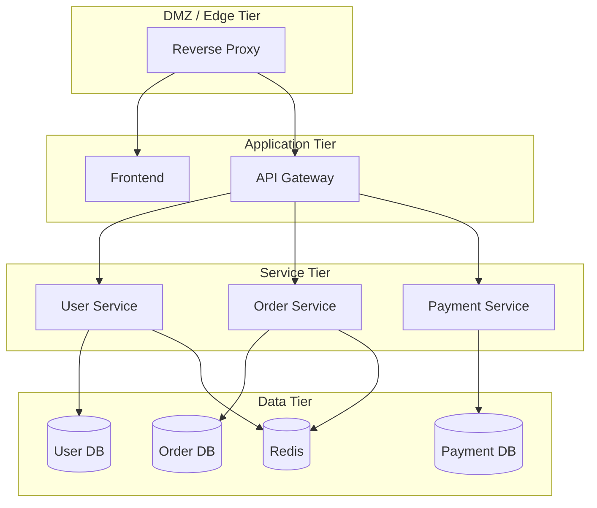

# How to Design Docker Networks for Microservices

Author: [nawazdhandala](https://github.com/nawazdhandala)

Tags: Docker, Networking, Microservices, Network Design, Service Mesh, Container Security, DevOps

Description: Design Docker network topologies for microservice architectures with proper segmentation, isolation, and service-to-service communication.

---

Microservices split a monolith into independently deployable services. Each service needs to communicate with specific other services while being isolated from the rest. Docker networks are the mechanism that enforces these communication boundaries. A well-designed network topology makes your microservice architecture secure, debuggable, and performant.

This guide walks through network design patterns for microservices, from simple flat networks to sophisticated multi-tier topologies.

## The Problem with Flat Networks

The simplest approach puts all containers on a single network. Every container can reach every other container.

```yaml
# DON'T do this in production
services:
  frontend:
    networks: [everything]
  api:
    networks: [everything]
  user-db:
    networks: [everything]
  order-db:
    networks: [everything]
  payment-service:
    networks: [everything]

networks:
  everything:
```

This works for development, but in production it means the frontend container can directly access every database. If an attacker compromises the frontend, they have unrestricted access to all backend services. Flat networks violate the principle of least privilege.

## Tiered Network Design

The most common pattern organizes networks into tiers based on exposure level.



Implement this four-tier network architecture in Docker Compose:

```yaml
version: "3.8"

services:
  # Edge tier - publicly accessible
  traefik:
    image: traefik:v3.0
    ports:
      - "80:80"
      - "443:443"
    volumes:
      - /var/run/docker.sock:/var/run/docker.sock:ro
    networks:
      - edge

  # Application tier
  frontend:
    image: my-frontend:latest
    labels:
      - "traefik.enable=true"
      - "traefik.http.routers.frontend.rule=Host(`app.example.com`)"
    networks:
      - edge

  api-gateway:
    image: my-api-gateway:latest
    labels:
      - "traefik.enable=true"
      - "traefik.http.routers.api.rule=Host(`api.example.com`)"
    networks:
      - edge       # Receives traffic from Traefik
      - services   # Forwards to backend services

  # Service tier
  user-service:
    image: my-user-service:latest
    networks:
      - services   # Reachable from API gateway
      - user-data  # Can reach its own database

  order-service:
    image: my-order-service:latest
    networks:
      - services
      - order-data

  payment-service:
    image: my-payment-service:latest
    networks:
      - services
      - payment-data

  # Data tier - each service has its own data network
  user-db:
    image: postgres:16-alpine
    environment:
      POSTGRES_DB: users
      POSTGRES_PASSWORD: ${USER_DB_PASS}
    volumes:
      - user-db-data:/var/lib/postgresql/data
    networks:
      - user-data

  order-db:
    image: postgres:16-alpine
    environment:
      POSTGRES_DB: orders
      POSTGRES_PASSWORD: ${ORDER_DB_PASS}
    volumes:
      - order-db-data:/var/lib/postgresql/data
    networks:
      - order-data

  payment-db:
    image: postgres:16-alpine
    environment:
      POSTGRES_DB: payments
      POSTGRES_PASSWORD: ${PAYMENT_DB_PASS}
    volumes:
      - payment-db-data:/var/lib/postgresql/data
    networks:
      - payment-data

  redis:
    image: redis:7-alpine
    networks:
      - services  # Shared cache accessible by all services

networks:
  edge:
    # Public-facing network
  services:
    internal: true  # No internet access
  user-data:
    internal: true
  order-data:
    internal: true
  payment-data:
    internal: true

volumes:
  user-db-data:
  order-db-data:
  payment-db-data:
```

With this design, the order service cannot access the user database. The payment database is only reachable from the payment service. If an attacker compromises the frontend, they cannot reach any database directly.

## Database-Per-Service Isolation

Each microservice should own its data. Docker networks enforce this by placing each service and its database on an exclusive network.

The key rules:
1. Each service gets its own data network
2. Only that service connects to its data network
3. Services communicate through a shared service network, never through each other's databases

Verify network isolation with a quick test:

```bash
# This should SUCCEED - order-service is on the order-data network
docker compose exec order-service nc -zv order-db 5432

# This should FAIL - order-service is NOT on the user-data network
docker compose exec order-service nc -zv user-db 5432
```

## Cross-Project Communication

When microservices span multiple Docker Compose projects (which is common in larger systems), use external networks for cross-project communication.

Create a shared network for services across projects:

```bash
docker network create --driver bridge shared-services
```

In the user service project, connect to the shared network:

```yaml
# user-service/docker-compose.yml
services:
  user-service:
    image: my-user-service:latest
    networks:
      - shared
      - internal

  user-db:
    image: postgres:16-alpine
    networks:
      - internal

networks:
  shared:
    external: true
    name: shared-services
  internal:
    internal: true
```

In the order service project, also connect to the same shared network:

```yaml
# order-service/docker-compose.yml
services:
  order-service:
    image: my-order-service:latest
    environment:
      USER_SERVICE_URL: http://user-service:3001
    networks:
      - shared
      - internal

  order-db:
    image: postgres:16-alpine
    networks:
      - internal

networks:
  shared:
    external: true
    name: shared-services
  internal:
    internal: true
```

The order service can now call the user service by name over the shared network, but neither service can access the other's database.

## Network Aliases for Service Versioning

When rolling out a new version of a service, use network aliases to maintain backward compatibility.

Use network aliases to run multiple versions of a service simultaneously:

```yaml
services:
  user-service-v1:
    image: my-user-service:v1
    networks:
      services:
        aliases:
          - user-service  # Both versions respond to "user-service"

  user-service-v2:
    image: my-user-service:v2
    networks:
      services:
        aliases:
          - user-service
          - user-service-v2  # Can also be reached explicitly
```

This lets you gradually shift traffic from v1 to v2 by adjusting which version is running.

## Overlay Networks for Multi-Host Microservices

When your microservices span multiple Docker hosts (using Swarm), use overlay networks.

Create overlay networks for a multi-host microservice deployment:

```bash
# Create overlay networks (requires Swarm mode)
docker network create --driver overlay --attachable edge-overlay
docker network create --driver overlay --attachable --internal services-overlay
docker network create --driver overlay --attachable --internal data-overlay
```

Overlay networks encrypt traffic between hosts by default when you add the `--opt encrypted` flag:

```bash
docker network create \
  --driver overlay \
  --attachable \
  --internal \
  --opt encrypted \
  secure-services-overlay
```

## Network Performance Tuning

For high-throughput microservices, tune network settings.

Create a network with optimized MTU for your infrastructure:

```yaml
networks:
  high-performance:
    driver: bridge
    driver_opts:
      com.docker.network.driver.mtu: 9000  # Jumbo frames
```

For latency-sensitive services, consider host networking:

```yaml
services:
  latency-sensitive-service:
    image: my-fast-service:latest
    network_mode: host  # Bypasses Docker networking overhead
```

Host networking removes the network namespace overhead but sacrifices isolation. Use it sparingly for services where microseconds matter.

## Monitoring Network Traffic

Add a monitoring network for observability services that need to scrape metrics from all tiers:

```yaml
services:
  prometheus:
    image: prom/prometheus:latest
    networks:
      - monitoring
      - edge
      - services  # Needs access to scrape all services

  grafana:
    image: grafana/grafana:latest
    networks:
      - monitoring
      - edge

networks:
  monitoring:
    internal: true
```

Prometheus needs to be on every network it scrapes. This is one of the few legitimate reasons for a container to join multiple networks.

## Documenting Your Network Topology

As your microservice network grows, document it. Here is a template:

```yaml
# network-map.yml
# Documents which services are on which networks

networks:
  edge:
    purpose: "Public-facing services"
    internet_access: true
    services: [traefik, frontend, api-gateway]

  services:
    purpose: "Service-to-service communication"
    internet_access: false
    services: [api-gateway, user-service, order-service, payment-service, redis]

  user-data:
    purpose: "User service data isolation"
    internet_access: false
    services: [user-service, user-db]

  order-data:
    purpose: "Order service data isolation"
    internet_access: false
    services: [order-service, order-db]

  payment-data:
    purpose: "Payment service data isolation"
    internet_access: false
    services: [payment-service, payment-db]
```

## Quick Checklist

Before deploying, verify your network design:

- Every database is on an internal network reachable only by its owner service
- No database is on a network with internet access
- The reverse proxy connects only to services it needs to route to
- Services use internal networks for inter-service communication
- Shared caches are on the service tier network, not the data tier
- Monitoring services have read-only access to the networks they scrape

## Conclusion

Docker network design for microservices boils down to one principle: give each container access to exactly the networks it needs and nothing more. Start with tiered networks (edge, services, data) and add per-service data networks as you grow. Use internal networks to prevent unwanted internet access. Test your isolation by verifying that containers cannot reach services they should not access. This approach scales from a handful of services to hundreds, and the isolation it provides is essential for production security.
