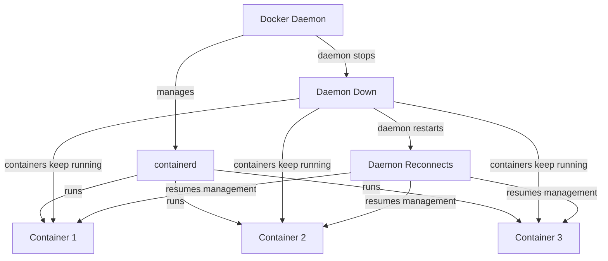

# How to Enable Docker Container Live Restore

Author: [nawazdhandala](https://github.com/nawazdhandala)

Tags: Docker, Live Restore, Production, High Availability, DevOps, Uptime

Description: Configure Docker live restore to keep containers running during Docker daemon restarts and upgrades.

---

Every Docker daemon restart kills all running containers by default. That means upgrading Docker on a production server causes downtime for every service running on it. Live restore changes this behavior. With live restore enabled, containers keep running even when the Docker daemon stops or restarts. This is essential for production servers where you need to patch and upgrade Docker without disrupting workloads.

## How Live Restore Works

When live restore is active, the Docker daemon detaches from running containers before shutting down. The containers continue to run under the containerd runtime. When the daemon starts back up, it reconnects to those existing containers and resumes managing them.

The key insight is that Docker containers do not actually need the Docker daemon to keep running. The daemon is a management layer. The actual container processes are managed by containerd and runc underneath. Live restore takes advantage of this architecture.



## Enabling Live Restore

The configuration lives in the Docker daemon configuration file.

Edit or create the daemon configuration:

```bash
# Open the Docker daemon config file
sudo nano /etc/docker/daemon.json
```

Add the live-restore option:

```json
{
  "live-restore": true
}
```

If you already have other settings in daemon.json, just add the `live-restore` key alongside them:

```json
{
  "storage-driver": "overlay2",
  "log-driver": "json-file",
  "log-opts": {
    "max-size": "10m",
    "max-file": "5"
  },
  "live-restore": true
}
```

Apply the configuration by reloading the Docker daemon:

```bash
# Reload the Docker daemon configuration without restarting
sudo systemctl reload docker
```

Note the use of `reload` instead of `restart`. A reload applies configuration changes without stopping the daemon. If you use `restart` here, existing containers will stop and start again since live restore was not yet active.

## Verifying Live Restore Is Active

Confirm the setting took effect:

```bash
# Check if live-restore is enabled in the daemon info
docker info | grep -i "live restore"
```

You should see:

```
 Live Restore Enabled: true
```

## Testing Live Restore

Before trusting live restore in production, test it. Start a container and verify it survives a daemon restart.

Launch a test container:

```bash
# Start a simple web server container for testing
docker run -d \
  --name live-restore-test \
  -p 8080:80 \
  nginx:alpine
```

Verify it responds:

```bash
# Confirm the container is serving traffic
curl -s http://localhost:8080 | head -5
```

Now restart the Docker daemon:

```bash
# Restart the Docker daemon - containers should survive this
sudo systemctl restart docker
```

Check if the container is still running:

```bash
# Verify the container survived the daemon restart
docker ps --filter name=live-restore-test
```

Test that it still serves traffic:

```bash
# Confirm the container is still responding after daemon restart
curl -s http://localhost:8080 | head -5
```

If everything works, the container stayed up through the daemon restart. Clean up the test container:

```bash
# Remove the test container
docker rm -f live-restore-test
```

## What Happens During a Daemon Restart

With live restore enabled, here is the sequence of events when the daemon restarts:

1. The daemon receives a stop signal
2. It saves the state of all running containers
3. It disconnects from containerd without stopping containers
4. The daemon process exits
5. Containers continue running under containerd
6. The new daemon process starts
7. It reads the saved container state
8. It reconnects to all running containers through containerd
9. Normal management resumes

During steps 4-7, you cannot run `docker` commands. The CLI will return errors about the daemon being unavailable. But your applications inside containers keep serving requests without interruption.

## Handling Network During Live Restore

Container networking mostly survives daemon restarts, but there are some considerations.

Port mappings continue to work because they are implemented through iptables rules that persist independently of the daemon. Published ports remain accessible throughout the restart.

However, Docker DNS resolution for container names can briefly fail during the restart window. If container A tries to resolve container B by name while the daemon is down, the resolution may fail.

To mitigate DNS issues, use retry logic in your applications:

```bash
# Example: a container start command with DNS retry logic
docker run -d \
  --name app \
  --restart unless-stopped \
  --dns-opt timeout:2 \
  --dns-opt attempts:5 \
  myapp:latest
```

## Live Restore Limitations

Live restore has boundaries you need to understand:

**Daemon version changes.** Live restore works when restarting the same version of Docker. If you upgrade Docker to a different version, containers will restart. The daemon detects the version mismatch and recreates containers. This still causes less downtime than a clean restart because the container filesystems are preserved.

**Swarm mode incompatibility.** Live restore does not work with Docker Swarm mode. If your node is a Swarm manager or worker, enabling live restore causes conflicts. Swarm has its own mechanisms for handling daemon restarts.

**Container configuration changes.** Any changes to daemon-level settings (like default network or DNS configuration) only apply to new containers. Existing containers that survived a live restore keep their original configuration.

**Long daemon downtime.** If the daemon stays down for an extended period (hours), containers continue running but their state can drift. Logs may not be captured for the period the daemon was absent. Health checks do not execute without the daemon.

## Automating Docker Upgrades with Live Restore

Here is a practical script for upgrading Docker on a production server with minimal disruption:

```bash
#!/bin/bash
# docker-upgrade.sh - Upgrade Docker with live restore
# Containers stay running throughout the upgrade process

set -e

echo "Current Docker version:"
docker version --format '{{.Server.Version}}'

echo "Checking live restore is enabled..."
LIVE_RESTORE=$(docker info --format '{{.LiveRestoreEnabled}}')
if [ "$LIVE_RESTORE" != "true" ]; then
    echo "ERROR: Live restore is not enabled. Enable it first."
    exit 1
fi

echo "Recording running containers..."
docker ps --format '{{.Names}}' > /tmp/containers-before-upgrade.txt

echo "Stopping Docker daemon (containers will keep running)..."
sudo systemctl stop docker

echo "Upgrading Docker packages..."
sudo apt-get update
sudo apt-get install -y docker-ce docker-ce-cli containerd.io

echo "Starting Docker daemon..."
sudo systemctl start docker

echo "Waiting for daemon to reconnect..."
sleep 5

echo "New Docker version:"
docker version --format '{{.Server.Version}}'

echo "Checking containers..."
docker ps --format '{{.Names}}' > /tmp/containers-after-upgrade.txt

# Compare container lists
DIFF=$(diff /tmp/containers-before-upgrade.txt /tmp/containers-after-upgrade.txt || true)
if [ -z "$DIFF" ]; then
    echo "All containers survived the upgrade."
else
    echo "WARNING: Container differences detected:"
    echo "$DIFF"
fi
```

Make the script executable and run it during a maintenance window:

```bash
# Make the upgrade script executable
chmod +x docker-upgrade.sh

# Run the upgrade
sudo ./docker-upgrade.sh
```

## Monitoring Container Status During Restarts

Set up a simple external monitor that checks container health independently of Docker:

```bash
#!/bin/bash
# external-monitor.sh - Monitor containers from outside Docker
# Uses direct HTTP checks, not Docker commands

# List of services to check: name and port
declare -A SERVICES
SERVICES[web]=8080
SERVICES[api]=3000
SERVICES[cache]=6379

while true; do
    for SERVICE in "${!SERVICES[@]}"; do
        PORT=${SERVICES[$SERVICE]}
        if nc -z localhost $PORT 2>/dev/null; then
            echo "$(date) - $SERVICE (port $PORT): UP"
        else
            echo "$(date) - $SERVICE (port $PORT): DOWN"
        fi
    done
    sleep 5
done
```

Run this monitor on a separate terminal or machine during Docker daemon restarts to confirm containers truly stay available.

## Production Checklist

Before relying on live restore in production, verify these items:

- Live restore is enabled and tested on staging first
- All critical containers have restart policies set (`--restart unless-stopped`)
- Applications handle brief DNS resolution failures gracefully
- External monitoring checks service availability directly, not through Docker
- Your upgrade scripts record container state before and after daemon restarts
- You have tested the full upgrade workflow at least once on a non-production server

Live restore is a straightforward feature that removes one of the most annoying operational pain points with Docker. Enable it on every production server that does not run Swarm mode, and you will never again dread a Docker daemon upgrade.
