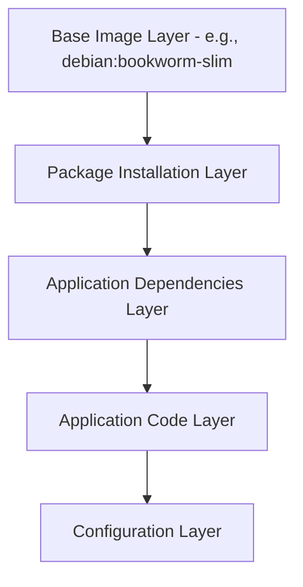

# How to Find the Base Image of a Docker Image

Author: [nawazdhandala](https://github.com/nawazdhandala)

Tags: Docker, Images, Base Image, Dockerfile, DevOps, Container Registry

Description: Learn multiple techniques to discover the base image of any Docker image, including inspect commands, history analysis, and registry lookups.

---

Every Docker image builds on top of another image. That foundation is called the base image. Knowing which base image sits beneath your containers matters for security audits, compliance checks, and debugging. If a vulnerability shows up in a base image, you need to know which of your images are affected.

This guide walks through several practical methods to uncover the base image of any Docker image on your system or in a remote registry.

## Why Identifying the Base Image Matters

When you pull a third-party image from Docker Hub and run it in production, you inherit every package, library, and potential vulnerability from its base image. Security teams regularly need to answer questions like: "Are any of our containers built on an affected version of Alpine?" or "Which images still use Ubuntu 20.04?"

Without knowing the base image, you cannot answer these questions. You also cannot make informed decisions about upgrades or patches.

## Method 1: Check the Dockerfile

The most direct approach is reading the Dockerfile itself. The `FROM` instruction at the top tells you exactly which base image was used.

```bash
# If you have the Dockerfile locally, just read the FROM line
grep "^FROM" Dockerfile
```

The output might look like this:

```
FROM node:20-alpine
```

This tells you the base image is `node:20-alpine`. But what if you do not have the Dockerfile? That is where the next methods come in.

## Method 2: Use docker history

The `docker history` command shows every layer in an image. The bottom-most layers belong to the base image.

```bash
# Show the full history of an image without truncating output
docker history --no-trunc nginx:latest
```

The output displays each layer along with the command that created it. Look at the earliest layers. They typically correspond to the base image.

```bash
# Show history in a more compact format with sizes
docker history --format "table {{.ID}}\t{{.CreatedBy}}\t{{.Size}}" nginx:latest
```

The layer created by an `ADD` command with a large file size is usually the base operating system layer. Layers marked as `<missing>` for the image ID indicate they came from the base image rather than being built locally.

## Method 3: Use docker inspect

The `docker inspect` command provides detailed JSON metadata about an image. While it does not always directly name the base image, it gives you useful clues.

```bash
# Inspect an image and look for parent and layer information
docker inspect nginx:latest | jq '.[0].RootFS.Layers'
```

This shows an array of layer digests. You can compare these digests with known base images to identify which one was used.

```bash
# Compare the first few layers of your image with a suspected base image
docker inspect nginx:latest | jq '.[0].RootFS.Layers[:3]'
docker inspect debian:bookworm-slim | jq '.[0].RootFS.Layers'
```

If the layers from `debian:bookworm-slim` appear as the first layers in `nginx:latest`, then Debian Bookworm Slim is the base image.

## Method 4: Use Docker Scout

Docker Scout can identify the base image and provide recommendations for updates.

```bash
# Analyze an image with Docker Scout to find its base image
docker scout recommendations nginx:latest
```

Scout returns information about the detected base image, the current version, and whether a newer version exists. This is one of the most reliable automated methods.

## Method 5: Check Image Labels and Annotations

Some images include labels or annotations that record the base image information.

```bash
# Check for labels that might indicate the base image
docker inspect --format '{{json .Config.Labels}}' nginx:latest | jq .
```

Look for labels with keys like `org.opencontainers.image.base.name` or `org.opencontainers.image.base.digest`. The OCI image specification encourages image authors to include these annotations.

```bash
# Specifically look for OCI base image annotations
docker inspect --format '{{index .Config.Labels "org.opencontainers.image.base.name"}}' myimage:latest
```

## Method 6: Query the Docker Hub API

For images hosted on Docker Hub, you can query the API to get details about how the image was built.

```bash
# Fetch the Dockerfile or build details from Docker Hub
# First, get an authentication token
TOKEN=$(curl -s "https://auth.docker.io/token?service=registry.docker.io&scope=repository:library/nginx:pull" | jq -r .token)

# Then fetch the manifest
curl -s -H "Authorization: Bearer $TOKEN" \
  -H "Accept: application/vnd.docker.distribution.manifest.v2+json" \
  "https://registry-1.docker.io/v2/library/nginx/manifests/latest"
```

The manifest contains layer digests that you can cross-reference with known base images.

## Method 7: Use a Layer Comparison Script

You can automate the comparison of layers between your image and candidate base images with a simple script.

```bash
#!/bin/bash
# compare-base.sh - Compare layers between an image and candidate base images
# Usage: ./compare-base.sh <target-image> <candidate-base-1> [candidate-base-2] ...

TARGET=$1
shift
TARGET_LAYERS=$(docker inspect "$TARGET" | jq -r '.[0].RootFS.Layers[]')

for CANDIDATE in "$@"; do
    echo "Checking against $CANDIDATE..."
    CANDIDATE_LAYERS=$(docker inspect "$CANDIDATE" | jq -r '.[0].RootFS.Layers[]')

    # Check if all candidate layers appear at the start of the target
    MATCH=true
    while IFS= read -r layer; do
        if ! echo "$TARGET_LAYERS" | grep -q "$layer"; then
            MATCH=false
            break
        fi
    done <<< "$CANDIDATE_LAYERS"

    if [ "$MATCH" = true ]; then
        echo "  MATCH: $CANDIDATE is likely the base image"
    else
        echo "  NO MATCH"
    fi
done
```

Run it like this:

```bash
# Pull candidate base images and compare
docker pull alpine:3.19
docker pull debian:bookworm-slim
./compare-base.sh nginx:latest alpine:3.19 debian:bookworm-slim
```

## Method 8: Explore with Dive

The `dive` tool provides an interactive view of image layers. It can help you visually identify where the base image ends and your application layers begin.

```bash
# Install dive and explore an image interactively
dive nginx:latest
```

Dive shows each layer alongside the filesystem changes it introduces. The initial layers that set up the operating system and core packages belong to the base image. You can read more about this approach in our post on [using Dive to explore Docker image layers](https://oneuptime.com/blog/post/2026-02-08-how-to-use-dive-to-explore-docker-image-layers/view).

## Understanding the Layer Stack

Docker images are built as a stack of read-only layers. The base image forms the foundation.



Each `RUN`, `COPY`, or `ADD` instruction in a Dockerfile creates a new layer on top of the base. When you identify the boundary between base image layers and your own layers, you have found the base image.

## Practical Tips

Keep these points in mind when tracking base images across your organization:

1. Always pin your base image versions in Dockerfiles. Use `FROM node:20.11.0-alpine3.19` instead of `FROM node:latest`.
2. Store base image information as labels in your images during the build process.
3. Use automated scanning tools that track base image provenance.
4. Create a base image inventory and review it regularly for security updates.

```bash
# Add base image metadata as a label during build
docker build --label "org.opencontainers.image.base.name=node:20.11.0-alpine3.19" -t myapp:1.0 .
```

## Conclusion

Finding the base image of a Docker image is not always straightforward, but several tools and techniques make it manageable. Start with the Dockerfile if you have it. Use `docker history` and `docker inspect` for local images. Leverage Docker Scout for automated detection. For a comprehensive view, compare layer digests between your image and candidate base images.

Keeping track of base images is a fundamental part of container security and maintenance. Build this practice into your CI/CD pipeline, and you will always know what foundations your applications rest on.
