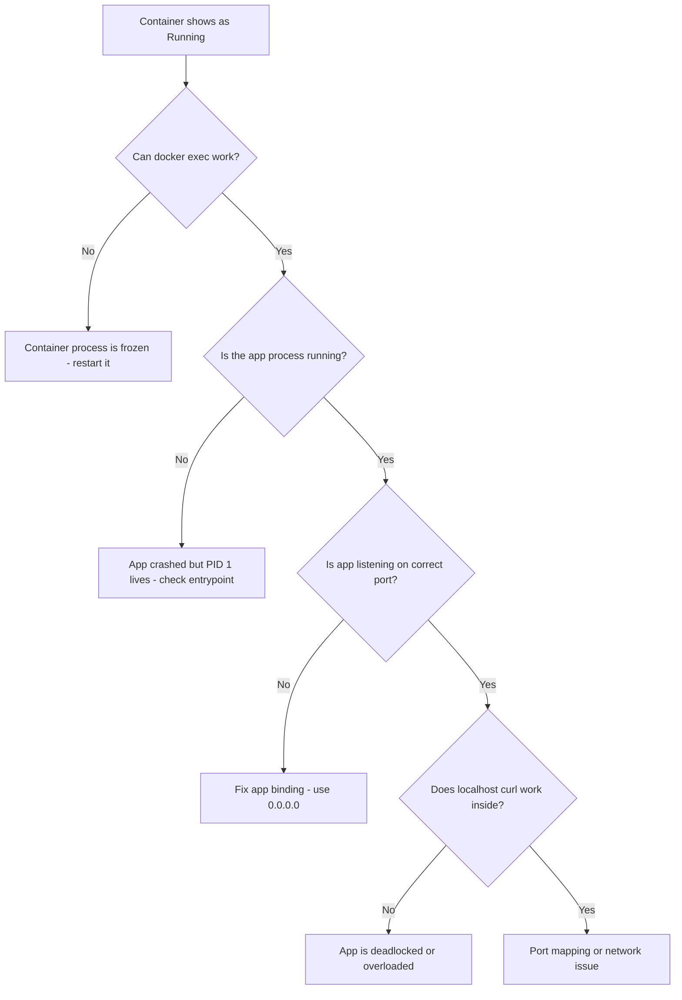

# How to Fix Docker Container Running But Not Responding

Author: [nawazdhandala](https://github.com/nawazdhandala)

Tags: docker, troubleshooting, container, unresponsive, health check, debugging, performance

Description: Diagnose and fix Docker containers that show as running but do not respond to requests, covering health checks, resource limits, and debugging techniques.

---

Your monitoring says the container is running. `docker ps` shows it in the "Up" state. But when you try to hit the service, nothing comes back. No response, no error, just a timeout. This is one of the trickiest Docker issues because all the obvious indicators say everything is fine while the application inside the container is completely stuck.

Let's break down the common causes and how to get to the bottom of this.

## Step 1: Confirm the Problem

First, verify what "not responding" actually means. Is the application not accepting connections? Is it accepting connections but not returning data? Is it returning errors?

```bash
# Check if the container is actually running
docker ps --filter name=my-container

# Check if the port mapping is correct
docker port my-container

# Test connectivity from the host
curl -v http://localhost:8080/health

# Test connectivity from inside the container
docker exec my-container curl -v http://localhost:8080/health
```

If `docker exec` itself hangs, the container's process is likely frozen. If `docker exec` works but the curl fails, the application inside is the problem.

## Cause 1: Application Deadlock or Infinite Loop

The most common reason a container runs but does not respond is that the application process is stuck. It could be a deadlock, an infinite loop, or a thread pool exhaustion.

Check what the process is doing:

```bash
# View the main process and its threads
docker exec my-container ps aux

# Check the process's current system calls (what it's stuck on)
docker exec my-container strace -p 1 -c -t 2>&1 | head -50

# If strace is not available, check /proc directly
docker exec my-container cat /proc/1/status
docker exec my-container cat /proc/1/stack
```

For Java applications, take a thread dump:

```bash
# Get a thread dump from a Java application
docker exec my-container jstack 1

# Or send SIGQUIT to trigger a thread dump
docker exec my-container kill -3 1
docker logs my-container | tail -100
```

For Node.js applications, check the event loop:

```bash
# Inspect a Node.js process with diagnostic report
docker exec my-container node -e "process.report.writeReport('/tmp/report.json')"
docker cp my-container:/tmp/report.json ./report.json
```

## Cause 2: Out of Memory Inside the Container

The container might be running but the application has consumed all available memory, causing it to thrash or become unresponsive. Docker's OOM killer might not have triggered yet if the memory limit is not set.

```bash
# Check current memory usage of the container
docker stats my-container --no-stream

# Check memory limits
docker inspect my-container --format '{{.HostConfig.Memory}}'

# Look for OOM events in Docker events
docker events --filter container=my-container --since 1h
```

If the container is using all its allocated memory, either increase the limit or fix the memory leak:

```yaml
# docker-compose.yml with memory limits that trigger OOM killer cleanly
services:
  app:
    image: myapp:latest
    deploy:
      resources:
        limits:
          memory: 512M
        reservations:
          memory: 256M
```

## Cause 3: Port Mapping Misconfiguration

The container might be perfectly healthy but listening on a different port or interface than expected.

```bash
# Check what ports the container process is actually listening on
docker exec my-container ss -tlnp

# Or use netstat if ss is not available
docker exec my-container netstat -tlnp

# Compare with Docker's port mapping
docker inspect my-container --format '{{json .NetworkSettings.Ports}}' | python3 -m json.tool
```

A common mistake is the application binding to `127.0.0.1` inside the container instead of `0.0.0.0`. When an application binds to localhost inside the container, it only accepts connections from within the container itself.

```bash
# Wrong: application binds to localhost (unreachable from outside)
docker exec my-container ss -tlnp | grep 127.0.0.1

# Right: application should bind to 0.0.0.0 (reachable from outside)
docker exec my-container ss -tlnp | grep 0.0.0.0
```

Fix this in your application configuration:

```yaml
# docker-compose.yml - make sure the app binds to 0.0.0.0
services:
  app:
    image: myapp:latest
    ports:
      - "8080:8080"
    environment:
      - HOST=0.0.0.0  # Many frameworks default to 127.0.0.1
```

## Cause 4: Health Check Passing Despite Application Failure

If you have a basic health check, it might pass even when the application is not functioning correctly. A health check that just verifies the port is open does not tell you if the application can process requests.

Improve your health checks:

```yaml
# docker-compose.yml with a meaningful health check
services:
  app:
    image: myapp:latest
    healthcheck:
      test: ["CMD", "curl", "-f", "http://localhost:8080/health"]
      interval: 15s
      timeout: 5s
      retries: 3
      start_period: 30s
```

For applications without curl installed:

```dockerfile
# Dockerfile with a health check using wget (available in alpine)
FROM node:18-alpine
HEALTHCHECK --interval=15s --timeout=5s --retries=3 --start-period=30s \
  CMD wget --no-verbose --tries=1 --spider http://localhost:8080/health || exit 1
```

## Cause 5: DNS Resolution Hanging

If your application tries to resolve a hostname at startup or on each request, and DNS is not working, it may hang waiting for DNS to time out.

```bash
# Test DNS from inside the container
docker exec my-container nslookup google.com

# Check DNS configuration
docker exec my-container cat /etc/resolv.conf
```

If DNS is slow or broken, add explicit DNS options to reduce timeout:

```yaml
# docker-compose.yml with DNS timeout configuration
services:
  app:
    image: myapp:latest
    dns:
      - 8.8.8.8
    dns_opt:
      - timeout:2
      - attempts:2
```

## Cause 6: Filesystem Full or Read-Only

If the container's filesystem is full or has become read-only, the application may hang on any write operation (logging, temp files, session storage).

```bash
# Check filesystem usage inside the container
docker exec my-container df -h

# Check if the filesystem is read-only
docker exec my-container touch /tmp/test-write && echo "writable" || echo "read-only"

# Check Docker's disk usage
docker system df
```

## Cause 7: Network Plugin or Driver Issues

If you use a custom network driver or overlay network, the networking layer itself might be broken while the container appears to be running.

```bash
# Check the network the container is attached to
docker inspect my-container --format '{{json .NetworkSettings.Networks}}' | python3 -m json.tool

# Test basic network connectivity from the container
docker exec my-container ping -c 2 8.8.8.8
docker exec my-container wget -qO- http://ifconfig.me
```

## Debugging Flowchart

Follow this sequence to narrow down the cause:



## Quick Recovery

When you need the service back up immediately:

```bash
# Option 1: Restart the container
docker restart my-container

# Option 2: Kill and recreate (preserves volume data)
docker rm -f my-container
docker compose up -d my-container

# Option 3: Scale to add a new instance while debugging the stuck one
docker compose up -d --scale app=2
```

## Summary

A Docker container that shows as running but does not respond is almost always an application-level problem, not a Docker problem. The container runtime is doing its job by keeping the process alive. Start by checking whether `docker exec` works. If it does, investigate inside the container: check the process state, memory usage, port bindings, and DNS. If `docker exec` hangs, the process is truly frozen, and a restart is your best immediate option. For long-term prevention, implement meaningful health checks that test actual application functionality, not just whether a port is open. Combine health checks with proper resource limits so Docker can detect and restart unhealthy containers automatically.
