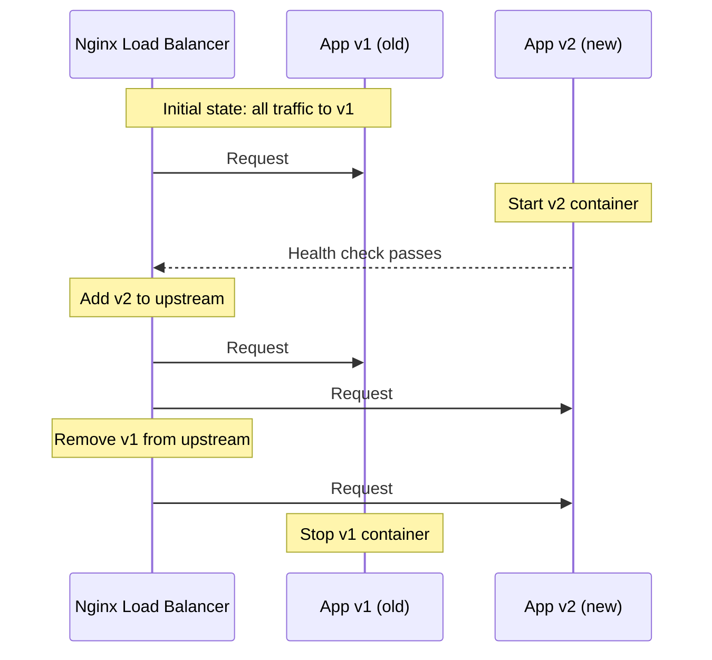

# How to Implement Docker Container Rolling Updates Manually

Author: [nawazdhandala](https://github.com/nawazdhandala)

Tags: Docker, Rolling Updates, Deployment, Zero Downtime, Production, DevOps

Description: Implement zero-downtime rolling updates for Docker containers without Kubernetes or Swarm using scripts and a reverse proxy.

---

Rolling updates let you deploy new versions of your application without any downtime. Kubernetes and Docker Swarm handle this automatically, but plenty of teams run plain Docker on single servers or small clusters. You do not need an orchestrator to achieve zero-downtime deployments. A reverse proxy and a few scripts get the job done.

This guide shows you how to build a manual rolling update system using Docker, Nginx, and bash scripts.

## The Rolling Update Pattern

The basic idea is simple: start the new version alongside the old one, shift traffic to the new version, then stop the old one. At no point is there zero instances running.



## Setting Up the Reverse Proxy

Nginx acts as the traffic router. It forwards requests to whichever containers are in the upstream pool.

Create the Nginx configuration:

```nginx
# /etc/nginx/conf.d/app.conf
# Dynamic upstream configuration loaded from a separate file

upstream app_backend {
    # This file gets rewritten during deployments
    include /etc/nginx/upstream.conf;
}

server {
    listen 80;
    server_name app.example.com;

    location / {
        proxy_pass http://app_backend;
        proxy_set_header Host $host;
        proxy_set_header X-Real-IP $remote_addr;
        proxy_set_header X-Forwarded-For $proxy_add_x_forwarded_for;
        proxy_connect_timeout 5s;
        proxy_read_timeout 30s;
    }

    # Health check endpoint for the proxy itself
    location /nginx-health {
        return 200 "ok";
    }
}
```

Create the initial upstream configuration:

```nginx
# /etc/nginx/upstream.conf
# Current backend containers - updated by deployment script
server 127.0.0.1:8001;
```

Run Nginx as a Docker container:

```bash
# Start the Nginx reverse proxy
docker run -d \
  --name nginx-lb \
  --network host \
  -v /etc/nginx/conf.d:/etc/nginx/conf.d:ro \
  -v /etc/nginx/upstream.conf:/etc/nginx/upstream.conf:ro \
  nginx:alpine
```

## Deploying the Initial Version

Start your application on port 8001:

```bash
# Deploy the initial version of the application
docker run -d \
  --name app-blue \
  -p 8001:8080 \
  --health-cmd="curl -f http://localhost:8080/health || exit 1" \
  --health-interval=5s \
  --health-timeout=3s \
  --health-retries=3 \
  myapp:1.0
```

## The Rolling Update Script

Here is the complete deployment script that handles the update process:

```bash
#!/bin/bash
# rolling-deploy.sh - Zero-downtime rolling deployment for Docker containers
# Usage: ./rolling-deploy.sh myapp:2.0

set -e

NEW_IMAGE=$1
HEALTH_ENDPOINT="/health"
HEALTH_TIMEOUT=60
NGINX_UPSTREAM="/etc/nginx/upstream.conf"

if [ -z "$NEW_IMAGE" ]; then
    echo "Usage: $0 <new-image:tag>"
    exit 1
fi

# Determine current and next slot
# We alternate between "blue" (port 8001) and "green" (port 8002)
if docker ps --format '{{.Names}}' | grep -q "app-blue"; then
    CURRENT_NAME="app-blue"
    CURRENT_PORT=8001
    NEW_NAME="app-green"
    NEW_PORT=8002
else
    CURRENT_NAME="app-green"
    CURRENT_PORT=8002
    NEW_NAME="app-blue"
    NEW_PORT=8001
fi

echo "Current: $CURRENT_NAME on port $CURRENT_PORT"
echo "Deploying: $NEW_NAME on port $NEW_PORT with image $NEW_IMAGE"

# Step 1: Pull the new image
echo "Pulling new image..."
docker pull "$NEW_IMAGE"

# Step 2: Start the new container
echo "Starting new container..."
docker run -d \
  --name "$NEW_NAME" \
  -p "$NEW_PORT:8080" \
  --health-cmd="curl -f http://localhost:8080${HEALTH_ENDPOINT} || exit 1" \
  --health-interval=5s \
  --health-timeout=3s \
  --health-retries=3 \
  "$NEW_IMAGE"

# Step 3: Wait for the new container to become healthy
echo "Waiting for health check..."
SECONDS_WAITED=0
while true; do
    HEALTH=$(docker inspect --format='{{.State.Health.Status}}' "$NEW_NAME" 2>/dev/null || echo "unknown")
    if [ "$HEALTH" = "healthy" ]; then
        echo "New container is healthy."
        break
    fi
    if [ $SECONDS_WAITED -ge $HEALTH_TIMEOUT ]; then
        echo "ERROR: Health check timed out after ${HEALTH_TIMEOUT}s. Rolling back."
        docker rm -f "$NEW_NAME"
        exit 1
    fi
    sleep 2
    SECONDS_WAITED=$((SECONDS_WAITED + 2))
    echo "  Waiting... ($SECONDS_WAITED/${HEALTH_TIMEOUT}s, status: $HEALTH)"
done

# Step 4: Add new container to Nginx upstream (both old and new)
echo "Adding new container to load balancer..."
cat > "$NGINX_UPSTREAM" <<EOF
# Both containers active during transition
server 127.0.0.1:${CURRENT_PORT};
server 127.0.0.1:${NEW_PORT};
EOF

# Reload Nginx to pick up the new upstream
docker exec nginx-lb nginx -s reload
echo "Both containers now receiving traffic. Waiting 10 seconds..."
sleep 10

# Step 5: Remove old container from upstream
echo "Removing old container from load balancer..."
cat > "$NGINX_UPSTREAM" <<EOF
# Only new container active
server 127.0.0.1:${NEW_PORT};
EOF

docker exec nginx-lb nginx -s reload
echo "Traffic shifted to new container. Waiting 10 seconds for connections to drain..."
sleep 10

# Step 6: Stop and remove the old container
echo "Stopping old container..."
docker stop "$CURRENT_NAME"
docker rm "$CURRENT_NAME"

echo "Deployment complete. $NEW_NAME is now serving all traffic on port $NEW_PORT."
```

Make it executable and deploy:

```bash
# Make the deployment script executable
chmod +x rolling-deploy.sh

# Deploy a new version
./rolling-deploy.sh myapp:2.0
```

## Adding Rollback Capability

Things go wrong. Your deployment script should support quick rollbacks.

Create a rollback script that reverses the last deployment:

```bash
#!/bin/bash
# rollback.sh - Revert to the previous container version
# Usage: ./rollback.sh

set -e

NGINX_UPSTREAM="/etc/nginx/upstream.conf"

# Find the currently running container
CURRENT=$(docker ps --format '{{.Names}}' --filter "name=app-" | head -1)

if [ -z "$CURRENT" ]; then
    echo "ERROR: No running app container found."
    exit 1
fi

# Get the previous image from Docker history
PREVIOUS_IMAGE=$(docker inspect --format='{{.Config.Image}}' "$CURRENT")
echo "Current container: $CURRENT running $PREVIOUS_IMAGE"

# Check if there is a stopped previous container
STOPPED=$(docker ps -a --format '{{.Names}}' --filter "name=app-" --filter "status=exited" | head -1)

if [ -z "$STOPPED" ]; then
    echo "ERROR: No previous container found to roll back to."
    exit 1
fi

PREVIOUS_PORT=$(docker inspect --format='{{range $p, $conf := .HostConfig.PortBindings}}{{(index $conf 0).HostPort}}{{end}}' "$STOPPED")

echo "Rolling back to: $STOPPED on port $PREVIOUS_PORT"

# Restart the previous container
docker start "$STOPPED"

# Wait for it to be healthy
echo "Waiting for previous container to become healthy..."
sleep 15

# Shift traffic
if [ -n "$PREVIOUS_PORT" ]; then
    cat > "$NGINX_UPSTREAM" <<EOF
server 127.0.0.1:${PREVIOUS_PORT};
EOF
    docker exec nginx-lb nginx -s reload
fi

# Stop the current (bad) container
CURRENT_PORT=$(docker inspect --format='{{range $p, $conf := .HostConfig.PortBindings}}{{(index $conf 0).HostPort}}{{end}}' "$CURRENT")
docker stop "$CURRENT"

echo "Rollback complete. $STOPPED is now serving traffic."
```

## Scaling to Multiple Instances

For applications that need multiple instances behind the load balancer, extend the script to manage numbered containers:

```bash
#!/bin/bash
# rolling-deploy-scaled.sh - Rolling update across multiple instances
# Usage: ./rolling-deploy-scaled.sh myapp:2.0 3

NEW_IMAGE=$1
INSTANCE_COUNT=${2:-2}
BASE_PORT=8001
NGINX_UPSTREAM="/etc/nginx/upstream.conf"

echo "Deploying $NEW_IMAGE across $INSTANCE_COUNT instances..."

# Update one instance at a time
for i in $(seq 1 "$INSTANCE_COUNT"); do
    PORT=$((BASE_PORT + i - 1))
    CONTAINER_NAME="app-instance-$i"

    echo "--- Updating instance $i ($CONTAINER_NAME on port $PORT) ---"

    # Remove this instance from the load balancer
    # Build upstream config without this instance
    UPSTREAM_CONTENT=""
    for j in $(seq 1 "$INSTANCE_COUNT"); do
        if [ "$j" -ne "$i" ]; then
            UPSTREAM_CONTENT="${UPSTREAM_CONTENT}server 127.0.0.1:$((BASE_PORT + j - 1));\n"
        fi
    done
    echo -e "$UPSTREAM_CONTENT" > "$NGINX_UPSTREAM"
    docker exec nginx-lb nginx -s reload
    sleep 5

    # Stop and replace this instance
    docker stop "$CONTAINER_NAME" 2>/dev/null || true
    docker rm "$CONTAINER_NAME" 2>/dev/null || true

    docker run -d \
      --name "$CONTAINER_NAME" \
      -p "$PORT:8080" \
      --health-cmd="curl -f http://localhost:8080/health || exit 1" \
      --health-interval=5s \
      "$NEW_IMAGE"

    # Wait for health
    sleep 15

    # Add back to load balancer
    UPSTREAM_CONTENT=""
    for j in $(seq 1 "$INSTANCE_COUNT"); do
        UPSTREAM_CONTENT="${UPSTREAM_CONTENT}server 127.0.0.1:$((BASE_PORT + j - 1));\n"
    done
    echo -e "$UPSTREAM_CONTENT" > "$NGINX_UPSTREAM"
    docker exec nginx-lb nginx -s reload

    echo "Instance $i updated successfully."
    sleep 5
done

echo "All $INSTANCE_COUNT instances updated to $NEW_IMAGE."
```

## Connection Draining

The scripts above include a sleep period for connection draining, but you can be more precise. Before removing a container from the upstream, check that active connections have completed:

```bash
# Check active connections to a specific port before removing from upstream
# Wait until connections drop to zero
wait_for_drain() {
    local PORT=$1
    local TIMEOUT=30
    local WAITED=0

    while true; do
        # Count established connections to the target port
        CONNS=$(ss -tn state established "( dport = :$PORT )" | wc -l)
        if [ "$CONNS" -le 1 ]; then  # 1 accounts for the header line
            echo "All connections drained from port $PORT"
            return 0
        fi
        if [ $WAITED -ge $TIMEOUT ]; then
            echo "WARNING: $CONNS connections still active after ${TIMEOUT}s"
            return 1
        fi
        sleep 1
        WAITED=$((WAITED + 1))
    done
}
```

## Putting It All Together

Manual rolling updates work well for small-to-medium deployments. The approach scales to a handful of servers by running the same scripts via SSH or a tool like Ansible. For larger deployments, this is where orchestrators like Kubernetes earn their keep. But for a single server or a small cluster, these scripts give you zero-downtime deployments without additional infrastructure complexity.

The key principles are: always have at least one healthy instance running, verify health before shifting traffic, and keep the ability to roll back quickly.
