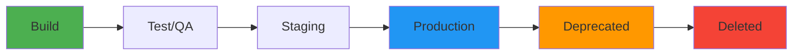

# How to Implement Docker Image Lifecycle Policies

Author: [nawazdhandala](https://github.com/nawazdhandala)

Tags: Docker, Images, Lifecycle, Policy, Registry, DevOps, Governance, Automation

Description: Implement lifecycle policies for Docker images to automate retention, cleanup, and promotion across environments effectively.

---

Docker images need lifecycle management just like any other artifact. Without policies governing how images are created, stored, promoted, and retired, registries grow unbounded, old vulnerable images linger in production, and nobody knows which version is current.

Lifecycle policies bring order to this chaos. They define rules for how long images are retained, when they get promoted between environments, and when they should be deleted. This guide covers practical implementations across popular registries and custom solutions.

## The Image Lifecycle

Every Docker image passes through distinct phases. Understanding these phases is the first step toward managing them.



Each phase has different retention requirements. Development images might live for days. Production images might need to be retained for years due to compliance requirements.

## Defining Your Lifecycle Policy

Start by documenting your requirements in a policy document.

```yaml
# image-lifecycle-policy.yaml
# Defines retention and promotion rules for Docker images

policies:
  development:
    description: "Images from feature branches and local builds"
    retention:
      max_age_days: 7
      max_count: 50
    auto_delete: true
    scan_required: false

  staging:
    description: "Images promoted from development for integration testing"
    retention:
      max_age_days: 30
      max_count: 100
    auto_delete: true
    scan_required: true
    max_critical_cves: 0

  production:
    description: "Images deployed to production environments"
    retention:
      max_age_days: 365
      max_count: null  # Keep all within age limit
    auto_delete: false  # Manual approval required
    scan_required: true
    max_critical_cves: 0
    max_high_cves: 0

  archive:
    description: "Retired production images kept for compliance"
    retention:
      max_age_days: 2555  # 7 years
      max_count: null
    auto_delete: true
    storage_class: "cold"
```

## AWS ECR Lifecycle Policies

Amazon ECR has built-in lifecycle policy support. Define rules directly on your repositories.

```bash
# Create a lifecycle policy for an ECR repository
aws ecr put-lifecycle-policy \
  --repository-name myapp \
  --lifecycle-policy-text '{
    "rules": [
      {
        "rulePriority": 1,
        "description": "Keep only 5 dev images",
        "selection": {
          "tagStatus": "tagged",
          "tagPrefixList": ["dev-"],
          "countType": "imageCountMoreThan",
          "countNumber": 5
        },
        "action": {
          "type": "expire"
        }
      },
      {
        "rulePriority": 2,
        "description": "Remove untagged images after 1 day",
        "selection": {
          "tagStatus": "untagged",
          "countType": "sinceImagePushed",
          "countUnit": "days",
          "countNumber": 1
        },
        "action": {
          "type": "expire"
        }
      },
      {
        "rulePriority": 3,
        "description": "Keep last 20 staging images",
        "selection": {
          "tagStatus": "tagged",
          "tagPrefixList": ["staging-"],
          "countType": "imageCountMoreThan",
          "countNumber": 20
        },
        "action": {
          "type": "expire"
        }
      },
      {
        "rulePriority": 4,
        "description": "Keep production images for 1 year",
        "selection": {
          "tagStatus": "tagged",
          "tagPrefixList": ["prod-", "release-"],
          "countType": "sinceImagePushed",
          "countUnit": "days",
          "countNumber": 365
        },
        "action": {
          "type": "expire"
        }
      }
    ]
  }'
```

Verify the policy:

```bash
# Check the current lifecycle policy on a repository
aws ecr get-lifecycle-policy --repository-name myapp | jq '.lifecyclePolicyText | fromjson'

# Preview which images would be affected
aws ecr get-lifecycle-policy-preview --repository-name myapp
```

## Google Artifact Registry Cleanup Policies

Google Artifact Registry supports cleanup policies through Terraform or the gcloud CLI.

```bash
# Set a cleanup policy on a Docker repository
gcloud artifacts repositories set-cleanup-policies myrepo \
  --project=my-project \
  --location=us-central1 \
  --policy='[
    {
      "name": "delete-old-dev",
      "action": {"type": "Delete"},
      "condition": {
        "tagState": "tagged",
        "tagPrefixes": ["dev-"],
        "olderThan": "604800s"
      }
    },
    {
      "name": "keep-recent-production",
      "action": {"type": "Keep"},
      "condition": {
        "tagState": "tagged",
        "tagPrefixes": ["prod-", "release-"],
        "newerThan": "31536000s"
      }
    }
  ]'
```

## Azure Container Registry Retention

Azure ACR supports retention policies for untagged manifests and scheduled purge tasks.

```bash
# Enable retention policy for untagged manifests (7 days)
az acr config retention update --registry myregistry \
  --status enabled --days 7 --type UntaggedManifests

# Create a purge task to delete old dev images
az acr task create --name purge-dev-images \
  --registry myregistry \
  --cmd "acr purge --filter 'myapp:dev-.*' --ago 7d --untagged" \
  --schedule "0 4 * * *" \
  --context /dev/null
```

## Custom Lifecycle Policy Engine

For self-hosted registries or registries without built-in policies, build your own enforcement engine.

```bash
#!/bin/bash
# lifecycle-enforcer.sh - Apply lifecycle policies to a Docker registry
# Usage: ./lifecycle-enforcer.sh

REGISTRY="myregistry.example.com"
REPOS=$(curl -s "https://${REGISTRY}/v2/_catalog" | jq -r '.repositories[]')

for repo in $REPOS; do
    echo "Processing: $repo"

    # Get all tags with their creation dates
    TAGS=$(curl -s "https://${REGISTRY}/v2/${repo}/tags/list" | jq -r '.tags[]')

    for tag in $TAGS; do
        # Get the manifest creation date
        CREATED=$(curl -s "https://${REGISTRY}/v2/${repo}/manifests/${tag}" \
          -H "Accept: application/vnd.docker.distribution.manifest.v2+json" | \
          jq -r '.config.digest' | \
          xargs -I{} curl -s "https://${REGISTRY}/v2/${repo}/blobs/{}" | \
          jq -r '.created')

        AGE_DAYS=$(( ($(date +%s) - $(date -d "$CREATED" +%s)) / 86400 ))

        # Apply policy based on tag prefix
        if [[ "$tag" == dev-* ]] && [ "$AGE_DAYS" -gt 7 ]; then
            echo "  DELETE: $repo:$tag (dev image, ${AGE_DAYS} days old)"
            # Delete the manifest to remove the tag
            DIGEST=$(curl -s -I "https://${REGISTRY}/v2/${repo}/manifests/${tag}" \
              -H "Accept: application/vnd.docker.distribution.manifest.v2+json" | \
              grep "Docker-Content-Digest" | awk '{print $2}' | tr -d '\r')
            curl -s -X DELETE "https://${REGISTRY}/v2/${repo}/manifests/${DIGEST}"
        elif [[ "$tag" == staging-* ]] && [ "$AGE_DAYS" -gt 30 ]; then
            echo "  DELETE: $repo:$tag (staging image, ${AGE_DAYS} days old)"
        elif [[ "$tag" == prod-* ]] && [ "$AGE_DAYS" -gt 365 ]; then
            echo "  ARCHIVE: $repo:$tag (production image, ${AGE_DAYS} days old)"
        fi
    done
done
```

## Image Promotion Pipeline

Lifecycle policies should integrate with your promotion pipeline. Images move between environments through explicit promotion steps.

```bash
#!/bin/bash
# promote-image.sh - Promote an image from one environment to the next
# Usage: ./promote-image.sh myapp dev-abc123 staging

IMAGE=$1
SOURCE_TAG=$2
TARGET_ENV=$3
REGISTRY="myregistry.example.com"

# Validate the source image exists
docker pull "${REGISTRY}/${IMAGE}:${SOURCE_TAG}" || {
    echo "Source image not found: ${REGISTRY}/${IMAGE}:${SOURCE_TAG}"
    exit 1
}

# Run security scan before promotion
echo "Scanning image for vulnerabilities..."
docker scout cves --exit-code --only-severity critical \
  "${REGISTRY}/${IMAGE}:${SOURCE_TAG}" || {
    echo "Image failed security scan. Promotion blocked."
    exit 1
}

# Generate the target tag
TARGET_TAG="${TARGET_ENV}-$(date +%Y%m%d%H%M%S)"

# Re-tag and push
docker tag "${REGISTRY}/${IMAGE}:${SOURCE_TAG}" \
  "${REGISTRY}/${IMAGE}:${TARGET_TAG}"
docker push "${REGISTRY}/${IMAGE}:${TARGET_TAG}"

echo "Promoted: ${IMAGE}:${SOURCE_TAG} -> ${IMAGE}:${TARGET_TAG}"
```

## Tag Immutability

Prevent tags from being overwritten to maintain a reliable audit trail.

```bash
# AWS ECR: Enable tag immutability
aws ecr put-image-tag-mutability \
  --repository-name myapp \
  --image-tag-mutability IMMUTABLE

# This prevents anyone from pushing a new image with an existing tag
# Forces the use of unique tags for every build
```

For registries without built-in immutability, enforce it through CI policies:

```bash
# Check if a tag already exists before pushing
TAG="prod-1.2.3"
EXISTS=$(curl -s -o /dev/null -w "%{http_code}" \
  "https://${REGISTRY}/v2/myapp/manifests/${TAG}" \
  -H "Accept: application/vnd.docker.distribution.manifest.v2+json")

if [ "$EXISTS" -eq 200 ]; then
    echo "ERROR: Tag $TAG already exists. Use a new version number."
    exit 1
fi
```

## Deprecation Notices

When retiring an image, give teams time to migrate.

```dockerfile
# Mark an image as deprecated with a label and ONBUILD warning
FROM myregistry.example.com/catalog/node:18.19.0

LABEL catalog.status="deprecated" \
      catalog.deprecated-date="2026-01-15" \
      catalog.replacement="catalog/node:20.11.0" \
      catalog.removal-date="2026-04-15"

# This ONBUILD instruction prints a warning when someone builds FROM this image
ONBUILD RUN echo "WARNING: This base image is deprecated. Migrate to catalog/node:20.11.0 before 2026-04-15"
```

## Monitoring and Reporting

Track lifecycle policy compliance with regular reports.

```bash
#!/bin/bash
# lifecycle-report.sh - Generate a lifecycle compliance report

echo "=== Docker Image Lifecycle Report ==="
echo "Date: $(date)"
echo ""

# Count images by environment tag prefix
echo "Image counts by environment:"
for env in dev staging prod; do
    count=$(docker images --format '{{.Tag}}' | grep "^${env}-" | wc -l)
    echo "  ${env}: ${count} images"
done

echo ""
echo "Images exceeding retention policy:"

# Check for dev images older than 7 days
docker images --format '{{.Repository}}:{{.Tag}}\t{{.CreatedSince}}' | \
  grep "dev-" | grep -E "(weeks|months)" | while read line; do
    echo "  VIOLATION: $line (dev retention: 7 days)"
done
```

## Conclusion

Docker image lifecycle policies prevent registry bloat, enforce security standards, and maintain compliance. Use built-in policies when your registry supports them. Build custom enforcement for self-hosted registries. Automate image promotion with security gates. Enforce tag immutability for production images. Regular reporting catches policy violations before they become problems.

Start with simple retention rules and expand as your organization's needs grow. The investment in lifecycle management pays off in reduced storage costs, better security, and more predictable deployments.
