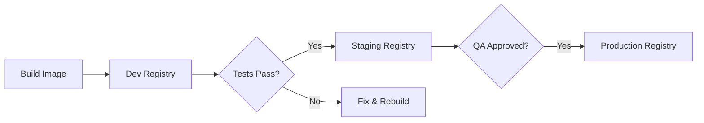

# How to Implement Docker Image Promotion Between Registries

Author: [nawazdhandala](https://github.com/nawazdhandala)

Tags: Docker, Container Registry, CI/CD, Image Promotion, DevOps, Docker Hub

Description: A practical guide to promoting Docker images between registries for dev, staging, and production environments safely.

---

Shipping the same Docker image from development through staging to production is a core practice in container-based deployments. Image promotion means taking a tested, verified image and moving it to the next environment's registry without rebuilding it. This guarantees that the exact binary you tested is the one running in production.

This guide covers multiple strategies for Docker image promotion, from simple tag-based workflows to cross-registry promotion with automated validation gates.

## Why Promote Instead of Rebuild?

Rebuilding an image for each environment introduces risk. Even with identical source code, a rebuild can pull different base image layers, fetch updated dependencies, or produce slightly different binaries. Promotion eliminates this class of problems entirely. You build once, test that artifact, then move it forward.

The promotion workflow typically follows this pattern:



## Strategy 1: Tag-Based Promotion in a Single Registry

The simplest approach uses different tags within the same registry to represent environments.

```bash
# Build and push to dev tag
docker build -t registry.example.com/myapp:dev-abc123 .
docker push registry.example.com/myapp:dev-abc123

# After tests pass, retag for staging
docker tag registry.example.com/myapp:dev-abc123 registry.example.com/myapp:staging-abc123
docker push registry.example.com/myapp:staging-abc123

# After QA approval, retag for production
docker tag registry.example.com/myapp:staging-abc123 registry.example.com/myapp:prod-abc123
docker tag registry.example.com/myapp:staging-abc123 registry.example.com/myapp:latest
docker push registry.example.com/myapp:prod-abc123
docker push registry.example.com/myapp:latest
```

This works for small teams but has limitations. Access control becomes harder because everyone with registry access can push to any tag.

## Strategy 2: Cross-Registry Promotion

Larger organizations use separate registries for each environment. This gives you fine-grained access control and clear audit trails.

```bash
# Build and push to the dev registry
docker build -t dev-registry.example.com/myapp:abc123 .
docker push dev-registry.example.com/myapp:abc123

# Promote to staging by pulling from dev and pushing to staging
docker pull dev-registry.example.com/myapp:abc123
docker tag dev-registry.example.com/myapp:abc123 staging-registry.example.com/myapp:abc123
docker push staging-registry.example.com/myapp:abc123

# Promote to production
docker pull staging-registry.example.com/myapp:abc123
docker tag staging-registry.example.com/myapp:abc123 prod-registry.example.com/myapp:abc123
docker push prod-registry.example.com/myapp:abc123
```

## Strategy 3: Promotion Without Pulling (Using Crane)

The `crane` tool from Google can copy images between registries without downloading them locally. This is faster and uses less bandwidth.

```bash
# Install crane
go install github.com/google/go-containerregistry/cmd/crane@latest

# Copy image directly between registries without pulling locally
crane copy dev-registry.example.com/myapp:abc123 staging-registry.example.com/myapp:abc123

# Copy with digest to guarantee exact image identity
crane copy dev-registry.example.com/myapp@sha256:abcdef1234 prod-registry.example.com/myapp:v1.2.3
```

You can also use `skopeo` for the same purpose.

```bash
# Install skopeo (Ubuntu/Debian)
sudo apt-get install skopeo

# Copy image between registries using skopeo
skopeo copy \
  docker://dev-registry.example.com/myapp:abc123 \
  docker://staging-registry.example.com/myapp:abc123

# Copy with authentication for both source and destination
skopeo copy \
  --src-creds user:password \
  --dest-creds user:password \
  docker://dev-registry.example.com/myapp:abc123 \
  docker://prod-registry.example.com/myapp:abc123
```

## Automating Promotion in CI/CD

Here's a GitHub Actions workflow that automates the full promotion pipeline.

```yaml
# .github/workflows/promote.yml - Image promotion pipeline
name: Image Promotion

on:
  workflow_dispatch:
    inputs:
      image_tag:
        description: 'Image tag to promote'
        required: true
      target_env:
        description: 'Target environment (staging or production)'
        required: true
        type: choice
        options:
          - staging
          - production

env:
  DEV_REGISTRY: dev-registry.example.com
  STAGING_REGISTRY: staging-registry.example.com
  PROD_REGISTRY: prod-registry.example.com

jobs:
  validate:
    runs-on: ubuntu-latest
    steps:
      - name: Verify image exists in source registry
        run: |
          # Determine source registry based on target
          if [ "${{ inputs.target_env }}" == "staging" ]; then
            SOURCE="${DEV_REGISTRY}/myapp:${{ inputs.image_tag }}"
          else
            SOURCE="${STAGING_REGISTRY}/myapp:${{ inputs.image_tag }}"
          fi
          # Check the image manifest exists
          docker manifest inspect $SOURCE

      - name: Run security scan before promotion
        run: |
          docker pull $SOURCE
          docker scout cves $SOURCE --exit-code --only-severity critical,high

  promote:
    needs: validate
    runs-on: ubuntu-latest
    steps:
      - name: Install crane
        run: |
          curl -sL https://github.com/google/go-containerregistry/releases/latest/download/go-containerregistry_Linux_x86_64.tar.gz | tar xz
          sudo mv crane /usr/local/bin/

      - name: Promote image
        run: |
          if [ "${{ inputs.target_env }}" == "staging" ]; then
            crane copy ${DEV_REGISTRY}/myapp:${{ inputs.image_tag }} ${STAGING_REGISTRY}/myapp:${{ inputs.image_tag }}
          else
            crane copy ${STAGING_REGISTRY}/myapp:${{ inputs.image_tag }} ${PROD_REGISTRY}/myapp:${{ inputs.image_tag }}
            crane copy ${STAGING_REGISTRY}/myapp:${{ inputs.image_tag }} ${PROD_REGISTRY}/myapp:latest
          fi

      - name: Verify promotion
        run: |
          # Compare digests to confirm exact match
          SOURCE_DIGEST=$(crane digest ${STAGING_REGISTRY}/myapp:${{ inputs.image_tag }})
          DEST_DIGEST=$(crane digest ${PROD_REGISTRY}/myapp:${{ inputs.image_tag }})
          if [ "$SOURCE_DIGEST" != "$DEST_DIGEST" ]; then
            echo "Digest mismatch! Promotion failed."
            exit 1
          fi
          echo "Promotion verified. Digest: $SOURCE_DIGEST"
```

## Implementing Promotion Gates

Add validation gates between environments to prevent bad images from moving forward.

```bash
#!/bin/bash
# promote.sh - Promotion script with validation gates

set -euo pipefail

IMAGE_TAG=$1
SOURCE_REGISTRY=$2
DEST_REGISTRY=$3
IMAGE_NAME="myapp"

SOURCE="${SOURCE_REGISTRY}/${IMAGE_NAME}:${IMAGE_TAG}"
DEST="${DEST_REGISTRY}/${IMAGE_NAME}:${IMAGE_TAG}"

echo "Promoting ${SOURCE} to ${DEST}"

# Gate 1: Verify the image exists
echo "Checking image exists..."
docker manifest inspect "${SOURCE}" > /dev/null 2>&1 || {
    echo "ERROR: Image ${SOURCE} not found"
    exit 1
}

# Gate 2: Check for critical vulnerabilities
echo "Scanning for vulnerabilities..."
docker pull "${SOURCE}"
SCAN_RESULT=$(docker scout cves "${SOURCE}" --format json 2>/dev/null)
CRITICAL_COUNT=$(echo "${SCAN_RESULT}" | jq '.critical // 0')
if [ "${CRITICAL_COUNT}" -gt 0 ]; then
    echo "ERROR: Image has ${CRITICAL_COUNT} critical vulnerabilities"
    exit 1
fi

# Gate 3: Verify required labels exist
echo "Checking image labels..."
LABELS=$(docker inspect --format '{{json .Config.Labels}}' "${SOURCE}")
for LABEL in "version" "build-date" "commit-sha"; do
    if ! echo "${LABELS}" | jq -e ".\"${LABEL}\"" > /dev/null 2>&1; then
        echo "ERROR: Missing required label: ${LABEL}"
        exit 1
    fi
done

# Gate 4: Run smoke tests against the image
echo "Running smoke tests..."
CONTAINER_ID=$(docker run -d -p 8080:3000 "${SOURCE}")
sleep 5
HTTP_CODE=$(curl -s -o /dev/null -w "%{http_code}" http://localhost:8080/health)
docker stop "${CONTAINER_ID}" > /dev/null
if [ "${HTTP_CODE}" != "200" ]; then
    echo "ERROR: Health check failed with HTTP ${HTTP_CODE}"
    exit 1
fi

# All gates passed, promote the image
echo "All gates passed. Promoting..."
crane copy "${SOURCE}" "${DEST}"
echo "Promotion complete: ${DEST}"
```

## Tracking Promotions with Image Labels

Add metadata to your images during build time so you can trace every promoted image back to its source.

```dockerfile
# Dockerfile with promotion-friendly labels
FROM node:20-alpine AS build
WORKDIR /app
COPY . .
RUN npm ci && npm run build

FROM node:20-alpine
WORKDIR /app

# Build arguments for tracking metadata
ARG BUILD_DATE
ARG COMMIT_SHA
ARG VERSION

# Labels help trace the image back to source code
LABEL build-date="${BUILD_DATE}" \
      commit-sha="${COMMIT_SHA}" \
      version="${VERSION}" \
      maintainer="team@example.com"

COPY --from=build /app/dist ./dist
COPY package.json package-lock.json ./
RUN npm ci --production
CMD ["node", "dist/index.js"]
```

```bash
# Build with metadata labels
docker build \
  --build-arg BUILD_DATE=$(date -u +"%Y-%m-%dT%H:%M:%SZ") \
  --build-arg COMMIT_SHA=$(git rev-parse HEAD) \
  --build-arg VERSION=1.2.3 \
  -t dev-registry.example.com/myapp:abc123 .
```

## Digest-Based Promotion

For maximum safety, always promote by digest rather than by tag. Tags are mutable, but digests are immutable.

```bash
# Get the digest of the image you want to promote
DIGEST=$(crane digest dev-registry.example.com/myapp:abc123)
echo "Promoting digest: ${DIGEST}"

# Promote using digest to guarantee exact image identity
crane copy dev-registry.example.com/myapp@${DIGEST} prod-registry.example.com/myapp:v1.2.3

# Verify the promotion preserved the digest
PROD_DIGEST=$(crane digest prod-registry.example.com/myapp:v1.2.3)
[ "${DIGEST}" = "${PROD_DIGEST}" ] && echo "Verified" || echo "MISMATCH"
```

## Rollback Strategy

When a promoted image causes issues in production, you need a fast rollback path.

```bash
# List recent tags in the production registry
crane ls prod-registry.example.com/myapp | tail -10

# Rollback by retagging the previous known-good image
crane copy prod-registry.example.com/myapp:v1.2.2 prod-registry.example.com/myapp:latest

# Or rollback using a stored digest
crane copy prod-registry.example.com/myapp@sha256:previousdigest prod-registry.example.com/myapp:latest
```

Image promotion is a straightforward concept that pays big dividends in reliability. The key principle is simple: build once, test that exact artifact, then move it forward. Whether you use tags, separate registries, or a combination depends on your team's size and security requirements. Start with the simplest approach that meets your needs and add complexity only when required.
