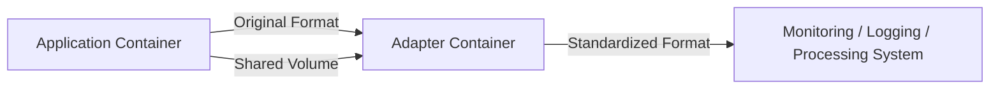

# How to Implement the Adapter Pattern with Docker

Author: [nawazdhandala](https://github.com/nawazdhandala)

Tags: Docker, Adapter Pattern, Design Patterns, Microservices, Container Architecture, DevOps

Description: Implement the Adapter container pattern in Docker to transform, normalize, and standardize interfaces between heterogeneous services.

---

The Adapter pattern in container architecture places a helper container next to your application container to transform its output or interface into a format that other systems expect. Think of it like a power adapter when you travel abroad. Your device has one plug type, the wall socket expects another, and the adapter bridges the gap.

In Docker, the adapter container reads data from the application container and converts it into a standardized format. This is incredibly useful when you have multiple services producing logs, metrics, or data in different formats, and you need to feed them all into a single monitoring or processing system.

## When to Use the Adapter Pattern

The adapter pattern fits several common scenarios. You have multiple services writing logs in different formats, but your centralized logging system expects a single format. Your legacy application exposes metrics in a custom format, but Prometheus needs them in its exposition format. Your service produces output in XML, but downstream consumers need JSON. Different databases have different backup formats, and you need a unified backup pipeline.

The common thread is translation. Whenever you need to bridge the gap between what a container produces and what consumers expect, the adapter pattern is the right tool.

## How the Pattern Works



The application container writes data in its native format. The adapter reads this data (usually through a shared volume or network connection), transforms it, and presents it in the expected format.

## Example 1: Log Format Adapter

Consider a scenario where you have three services: one writes JSON logs, another writes plain text, and a third uses a custom format. Your ELK stack expects structured JSON.

Create a log adapter that converts plain-text Apache logs to structured JSON:

```python
# log-adapter/adapter.py
# Reads Apache-style access logs and converts them to structured JSON

import json
import re
import sys
import time

LOG_FILE = "/var/log/app/access.log"
OUTPUT_FILE = "/var/log/adapted/access.json"

# Apache Combined Log Format regex
LOG_PATTERN = re.compile(
    r'(?P<ip>\S+) \S+ \S+ \[(?P<timestamp>[^\]]+)\] '
    r'"(?P<method>\S+) (?P<path>\S+) (?P<protocol>\S+)" '
    r'(?P<status>\d+) (?P<size>\S+) '
    r'"(?P<referrer>[^"]*)" "(?P<user_agent>[^"]*)"'
)

def parse_line(line):
    """Parse a single Apache log line into a structured dictionary."""
    match = LOG_PATTERN.match(line.strip())
    if not match:
        return None

    data = match.groupdict()
    data["status"] = int(data["status"])
    data["size"] = int(data["size"]) if data["size"] != "-" else 0
    data["service"] = "web-server"
    data["log_type"] = "access"
    return data

def tail_and_adapt():
    """Continuously read new log lines and write adapted JSON output."""
    with open(LOG_FILE, "r") as infile:
        # Seek to end of file
        infile.seek(0, 2)

        while True:
            line = infile.readline()
            if not line:
                time.sleep(0.1)
                continue

            parsed = parse_line(line)
            if parsed:
                with open(OUTPUT_FILE, "a") as outfile:
                    outfile.write(json.dumps(parsed) + "\n")
                print(json.dumps(parsed))

if __name__ == "__main__":
    print("Log adapter started, watching " + LOG_FILE)
    tail_and_adapt()
```

The Dockerfile for the adapter:

```dockerfile
# log-adapter/Dockerfile
FROM python:3.12-alpine
WORKDIR /app
COPY adapter.py .
CMD ["python", "-u", "adapter.py"]
```

Wire everything together with Docker Compose:

```yaml
# docker-compose.yml
version: "3.8"

services:
  # The web server writes Apache-format logs
  web:
    image: httpd:2.4-alpine
    ports:
      - "80:80"
    volumes:
      - app-logs:/usr/local/apache2/logs

  # The adapter converts Apache logs to structured JSON
  log-adapter:
    build: ./log-adapter
    volumes:
      - app-logs:/var/log/app:ro
      - adapted-logs:/var/log/adapted

  # Filebeat ships the adapted JSON logs to Elasticsearch
  filebeat:
    image: elastic/filebeat:8.12.0
    volumes:
      - adapted-logs:/var/log/adapted:ro
      - ./filebeat.yml:/usr/share/filebeat/filebeat.yml:ro

volumes:
  app-logs:
  adapted-logs:
```

The web server writes logs in its native Apache format. The adapter reads them, converts to JSON, and writes them to the adapted-logs volume. Filebeat picks up the clean JSON and ships it to Elasticsearch.

## Example 2: Metrics Adapter for Prometheus

Your legacy application exposes metrics at an HTTP endpoint, but in a custom format, not Prometheus exposition format. An adapter container scrapes these metrics and re-exposes them in the format Prometheus expects.

Create a metrics adapter that converts custom metrics to Prometheus format:

```python
# metrics-adapter/adapter.py
# Scrapes custom metrics from the app and exposes them in Prometheus format

import requests
import time
from http.server import HTTPServer, BaseHTTPRequestHandler
import json

APP_METRICS_URL = "http://localhost:8080/internal/stats"
LISTEN_PORT = 9090

cached_metrics = ""

def fetch_and_convert():
    """Fetch custom metrics from the app and convert to Prometheus format."""
    global cached_metrics

    try:
        response = requests.get(APP_METRICS_URL, timeout=5)
        data = response.json()

        lines = []

        # Convert request count
        if "total_requests" in data:
            lines.append("# HELP app_requests_total Total HTTP requests")
            lines.append("# TYPE app_requests_total counter")
            lines.append(f'app_requests_total {data["total_requests"]}')

        # Convert response time
        if "avg_response_ms" in data:
            lines.append("# HELP app_response_time_seconds Average response time")
            lines.append("# TYPE app_response_time_seconds gauge")
            lines.append(f'app_response_time_seconds {data["avg_response_ms"] / 1000.0}')

        # Convert active connections
        if "active_connections" in data:
            lines.append("# HELP app_active_connections Current active connections")
            lines.append("# TYPE app_active_connections gauge")
            lines.append(f'app_active_connections {data["active_connections"]}')

        # Convert error rates by type
        if "errors" in data:
            lines.append("# HELP app_errors_total Total errors by type")
            lines.append("# TYPE app_errors_total counter")
            for error_type, count in data["errors"].items():
                lines.append(f'app_errors_total{{type="{error_type}"}} {count}')

        cached_metrics = "\n".join(lines) + "\n"

    except Exception as e:
        print(f"Error fetching metrics: {e}")

class MetricsHandler(BaseHTTPRequestHandler):
    def do_GET(self):
        if self.path == "/metrics":
            fetch_and_convert()
            self.send_response(200)
            self.send_header("Content-Type", "text/plain; version=0.0.4")
            self.end_headers()
            self.wfile.write(cached_metrics.encode())
        else:
            self.send_response(404)
            self.end_headers()

    def log_message(self, format, *args):
        pass  # Suppress request logs

if __name__ == "__main__":
    print(f"Metrics adapter listening on port {LISTEN_PORT}")
    server = HTTPServer(("0.0.0.0", LISTEN_PORT), MetricsHandler)
    server.serve_forever()
```

The Compose configuration:

```yaml
version: "3.8"

services:
  legacy-app:
    image: my-legacy-app:latest
    # Exposes custom metrics at :8080/internal/stats

  metrics-adapter:
    build: ./metrics-adapter
    network_mode: "service:legacy-app"
    # Now Prometheus can scrape localhost:9090/metrics

  prometheus:
    image: prom/prometheus:latest
    volumes:
      - ./prometheus.yml:/etc/prometheus/prometheus.yml:ro
    ports:
      - "9090:9090"
```

The Prometheus configuration scrapes the adapter:

```yaml
# prometheus.yml
scrape_configs:
  - job_name: "legacy-app"
    static_configs:
      - targets: ["legacy-app:9090"]
```

## Example 3: Data Format Adapter

Your application exports reports in XML, but the downstream analytics pipeline expects CSV. An adapter container handles the transformation.

A Python adapter that converts XML reports to CSV:

```python
# xml-to-csv/adapter.py
# Watches for XML files and converts them to CSV format

import xml.etree.ElementTree as ET
import csv
import os
import time
import io

INPUT_DIR = "/data/xml"
OUTPUT_DIR = "/data/csv"

def convert_xml_to_csv(xml_path, csv_path):
    """Convert an XML report file to CSV format."""
    tree = ET.parse(xml_path)
    root = tree.getroot()

    # Extract records from XML
    records = []
    headers = set()

    for record in root.findall(".//record"):
        row = {}
        for field in record:
            headers.add(field.tag)
            row[field.tag] = field.text or ""
        records.append(row)

    # Write CSV
    headers = sorted(headers)
    with open(csv_path, "w", newline="") as f:
        writer = csv.DictWriter(f, fieldnames=headers)
        writer.writeheader()
        writer.writerows(records)

    print(f"Converted {xml_path} to {csv_path} ({len(records)} records)")

def watch_and_convert():
    """Watch the input directory for new XML files and convert them."""
    processed = set()

    while True:
        for filename in os.listdir(INPUT_DIR):
            if filename.endswith(".xml") and filename not in processed:
                xml_path = os.path.join(INPUT_DIR, filename)
                csv_filename = filename.replace(".xml", ".csv")
                csv_path = os.path.join(OUTPUT_DIR, csv_filename)

                try:
                    convert_xml_to_csv(xml_path, csv_path)
                    processed.add(filename)
                except Exception as e:
                    print(f"Error converting {filename}: {e}")

        time.sleep(2)

if __name__ == "__main__":
    os.makedirs(OUTPUT_DIR, exist_ok=True)
    print("XML to CSV adapter started")
    watch_and_convert()
```

The Compose file:

```yaml
version: "3.8"

services:
  report-generator:
    image: my-report-app:latest
    volumes:
      - reports-xml:/output

  format-adapter:
    build: ./xml-to-csv
    volumes:
      - reports-xml:/data/xml:ro
      - reports-csv:/data/csv

  analytics:
    image: my-analytics:latest
    volumes:
      - reports-csv:/data/input:ro

volumes:
  reports-xml:
  reports-csv:
```

## Adapter vs Sidecar vs Ambassador

These three patterns often get confused. The adapter transforms the output of a container into a standard format (outbound data transformation). The ambassador proxies outbound network connections to external services. The sidecar extends the functionality of the main container (like adding log shipping or configuration reloading). The adapter pattern is specifically about format translation and standardization.

## Best Practices

Keep adapter logic simple and focused. One adapter should handle one type of transformation. If you need to transform logs and metrics, use separate adapter containers.

Make adapters stateless when possible. They should read input, transform it, and produce output without accumulating state.

Use shared volumes for file-based adapters and shared network namespaces for network-based adapters.

Add error handling and logging to your adapter. If the adapter fails silently, you lose visibility into your services.

Monitor adapter resource usage. A poorly written adapter that polls too aggressively can consume unnecessary CPU.

## Conclusion

The Adapter pattern is a practical way to standardize interfaces across heterogeneous services. Instead of modifying every service to output a common format, you deploy a small adapter container that handles the translation. This keeps your services focused on their primary job and gives you a clean, modular way to integrate with monitoring, logging, and processing systems. Start with log format adapters, as that is the most common use case, and expand to metrics and data format adapters as your needs grow.
