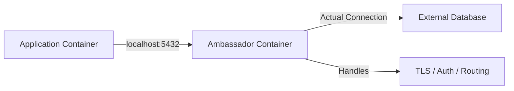

# How to Implement the Ambassador Pattern with Docker

Author: [nawazdhandala](https://github.com/nawazdhandala)

Tags: Docker, Ambassador Pattern, Design Patterns, Proxy, Microservices, Container Architecture

Description: Learn how to implement the Ambassador container pattern in Docker to proxy, route, and manage external service connections transparently.

---

The Ambassador pattern places a proxy container alongside your application container. This proxy handles outbound connections on behalf of the application, managing concerns like service discovery, load balancing, connection pooling, retries, and TLS termination. Your application talks to localhost, and the ambassador handles the complexity of reaching the actual external service.

This pattern decouples your application from the infrastructure it depends on. You can swap databases, add connection encryption, or change routing logic without touching your application code.

## When to Use the Ambassador Pattern

The Ambassador pattern makes sense in several scenarios. Your application connects to an external database, but different environments use different connection strings. Your service needs to talk to a third-party API through a rate-limiting proxy. You want to add TLS encryption to a connection without modifying the application. Your legacy application does not support modern service discovery, but you still need it to find services dynamically.

In all these cases, the ambassador sits between your application and the outside world, translating simple local connections into whatever the external service requires.

## How the Pattern Works



The application container connects to the ambassador on localhost at a well-known port. The ambassador forwards that connection to the real destination, handling any necessary transformations along the way.

## Example 1: Database Connection Ambassador

Suppose your application connects to PostgreSQL. In development it talks to a local database, in staging it talks to a shared server, and in production it connects through PgBouncer with TLS. The ambassador pattern lets the application always connect to `localhost:5432` while the proxy handles the rest.

First, create a custom HAProxy configuration that proxies PostgreSQL connections:

```
# haproxy-pg.cfg
# Proxies local PostgreSQL connections to the actual database server

global
    maxconn 256

defaults
    mode tcp
    timeout connect 5000ms
    timeout client 50000ms
    timeout server 50000ms

frontend pg_frontend
    bind *:5432
    default_backend pg_backend

backend pg_backend
    server db1 production-db.example.com:5432 check
```

Now create a Docker Compose file that pairs your application with the ambassador:

```yaml
# docker-compose.yml
version: "3.8"

services:
  app:
    image: my-app:latest
    environment:
      # Application always connects to localhost
      DATABASE_HOST: localhost
      DATABASE_PORT: 5432
    network_mode: "service:db-ambassador"
    depends_on:
      - db-ambassador

  db-ambassador:
    image: haproxy:2.9-alpine
    volumes:
      - ./haproxy-pg.cfg:/usr/local/etc/haproxy/haproxy.cfg:ro
```

The key here is `network_mode: "service:db-ambassador"`. This makes the application container share the same network namespace as the ambassador. When the app connects to `localhost:5432`, it reaches HAProxy running in the ambassador container.

## Example 2: Redis Ambassador with Sentinel Support

Your application uses a simple Redis client, but your production Redis setup uses Sentinel for high availability. An ambassador can handle Sentinel discovery and present a simple Redis interface to your application.

Create a small Node.js proxy that discovers the Redis master through Sentinel and proxies connections:

```javascript
// redis-ambassador/proxy.js
// Discovers Redis master via Sentinel and proxies connections

const net = require("net");
const Redis = require("ioredis");

const SENTINEL_HOSTS = (
  process.env.SENTINEL_HOSTS || "sentinel-1:26379"
).split(",");
const MASTER_NAME = process.env.REDIS_MASTER_NAME || "mymaster";
const LISTEN_PORT = 6379;

let currentMaster = null;

// Connect to Sentinel to discover the master
async function discoverMaster() {
  const sentinels = SENTINEL_HOSTS.map((h) => {
    const [host, port] = h.split(":");
    return { host, port: parseInt(port) };
  });

  const sentinel = new Redis({
    sentinels: sentinels,
    name: MASTER_NAME,
  });

  sentinel.on("connect", () => {
    const { host, port } = sentinel.options;
    currentMaster = { host, port };
    console.log(`Master discovered: ${host}:${port}`);
  });

  return sentinel;
}

// Create TCP proxy server
const server = net.createServer((clientSocket) => {
  if (!currentMaster) {
    console.error("No master available");
    clientSocket.end();
    return;
  }

  const serverSocket = net.connect(
    currentMaster.port,
    currentMaster.host,
    () => {
      clientSocket.pipe(serverSocket);
      serverSocket.pipe(clientSocket);
    }
  );

  serverSocket.on("error", (err) => {
    console.error(`Server connection error: ${err.message}`);
    clientSocket.end();
  });

  clientSocket.on("error", (err) => {
    console.error(`Client connection error: ${err.message}`);
    serverSocket.end();
  });
});

discoverMaster().then(() => {
  server.listen(LISTEN_PORT, "0.0.0.0", () => {
    console.log(`Redis ambassador listening on port ${LISTEN_PORT}`);
  });
});
```

The Dockerfile for the ambassador:

```dockerfile
# redis-ambassador/Dockerfile
FROM node:20-alpine
WORKDIR /app
COPY package*.json ./
RUN npm ci --production
COPY proxy.js .
CMD ["node", "proxy.js"]
```

The Compose file that ties everything together:

```yaml
# docker-compose.yml
version: "3.8"

services:
  app:
    image: my-app:latest
    environment:
      REDIS_HOST: localhost
      REDIS_PORT: 6379
    network_mode: "service:redis-ambassador"
    depends_on:
      - redis-ambassador

  redis-ambassador:
    build: ./redis-ambassador
    environment:
      SENTINEL_HOSTS: "sentinel-1:26379,sentinel-2:26379,sentinel-3:26379"
      REDIS_MASTER_NAME: mymaster
    networks:
      - redis-net

networks:
  redis-net:
    external: true
```

## Example 3: API Rate-Limiting Ambassador

Your application calls a third-party API with strict rate limits. An Nginx-based ambassador can enforce rate limiting on the client side to prevent hitting the API's limits.

Create an Nginx configuration that rate-limits outgoing requests:

```nginx
# nginx-ratelimit.conf
# Rate-limits requests to an external API at 10 requests per second

limit_req_zone $binary_remote_addr zone=api_limit:10m rate=10r/s;

upstream external_api {
    server api.thirdparty.com:443;
}

server {
    listen 8080;

    location / {
        limit_req zone=api_limit burst=20 nodelay;

        proxy_pass https://external_api;
        proxy_ssl_server_name on;
        proxy_set_header Host api.thirdparty.com;
        proxy_set_header X-Real-IP $remote_addr;
    }
}
```

The Compose setup:

```yaml
version: "3.8"

services:
  app:
    image: my-app:latest
    environment:
      # Point to local ambassador instead of the real API
      EXTERNAL_API_URL: http://localhost:8080
    network_mode: "service:api-ambassador"
    depends_on:
      - api-ambassador

  api-ambassador:
    image: nginx:alpine
    volumes:
      - ./nginx-ratelimit.conf:/etc/nginx/conf.d/default.conf:ro
```

## Example 4: TLS Termination Ambassador

Your application does not support TLS natively, but the database requires encrypted connections. An ambassador with stunnel or socat handles the TLS handshake.

Create a stunnel configuration for TLS-encrypted database connections:

```ini
; stunnel.conf
; Wraps a plain TCP connection in TLS for secure database access

[postgres]
client = yes
accept = 0.0.0.0:5432
connect = secure-db.example.com:5432
verifyChain = yes
CAfile = /etc/ssl/certs/ca-certificates.crt
```

The Compose setup:

```yaml
version: "3.8"

services:
  app:
    image: my-legacy-app:latest
    environment:
      DB_HOST: localhost
      DB_PORT: 5432
    network_mode: "service:tls-ambassador"
    depends_on:
      - tls-ambassador

  tls-ambassador:
    image: alpine:latest
    command: >
      sh -c "apk add --no-cache stunnel &&
             stunnel /etc/stunnel/stunnel.conf &&
             tail -f /dev/null"
    volumes:
      - ./stunnel.conf:/etc/stunnel/stunnel.conf:ro
```

## Ambassador vs Sidecar

These two patterns are similar but have different purposes. The ambassador proxies outbound connections to external services. The sidecar adds functionality to the application itself, like log collection or metrics. When your proxy handles connections going out from the application, that is an ambassador. When your helper container processes data coming from the application (like shipping logs), that is a sidecar.

## Best Practices

Keep ambassadors lightweight. Use Alpine-based images. HAProxy, Nginx, and Envoy are excellent choices for most proxy needs.

Make ambassador configurations environment-specific. Mount different config files in development, staging, and production while keeping the application image identical.

Add health checks to ambassador containers. If the ambassador dies, the application cannot reach its dependencies:

```yaml
services:
  db-ambassador:
    image: haproxy:2.9-alpine
    healthcheck:
      test: ["CMD", "haproxy", "-c", "-f", "/usr/local/etc/haproxy/haproxy.cfg"]
      interval: 10s
      timeout: 5s
      retries: 3
```

Log ambassador traffic for debugging connection issues. Most proxy tools support access logging.

## Conclusion

The Ambassador pattern is a clean way to manage outbound connections from your containers. It separates connection concerns from business logic, makes your application environment-agnostic, and lets you swap infrastructure components without code changes. Start with simple use cases like database proxying, then expand to rate limiting, TLS termination, and service discovery as your architecture grows.
