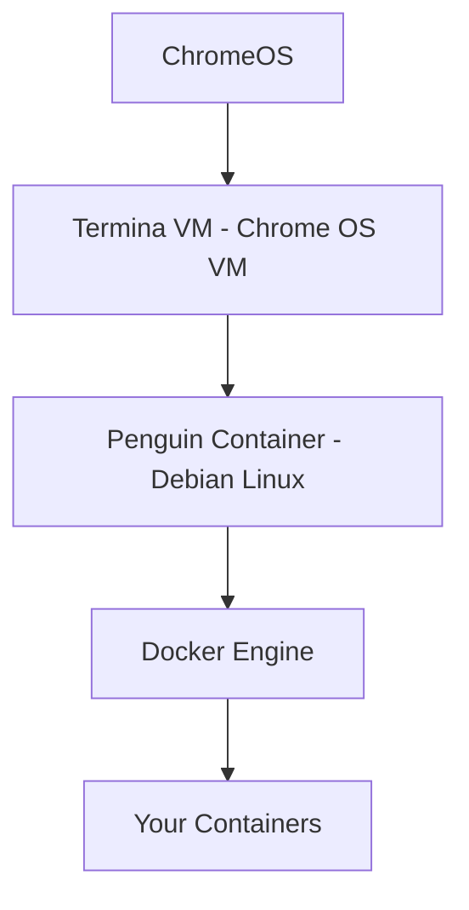

# How to Install Docker on ChromeOS (Chromebook)

Author: [nawazdhandala](https://github.com/nawazdhandala)

Tags: Docker, ChromeOS, Chromebook, Linux, Installation, Containers, Crostini, Development

Description: How to install and run Docker on a Chromebook using the ChromeOS Linux development environment (Crostini), with resource optimization tips for limited hardware.

---

Chromebooks have come a long way from simple web browsers. With ChromeOS's built-in Linux development environment (codenamed Crostini), you can run a full Debian-based Linux container and install Docker inside it. This turns a Chromebook into a surprisingly capable development machine. The setup has some limitations, but for lightweight containerized development, it works well.

## Prerequisites

- A Chromebook with Linux development environment support (most models from 2019 onwards)
- At least 8 GB of storage free (16 GB or more recommended)
- At least 4 GB of RAM (8 GB strongly recommended for Docker)
- ChromeOS updated to the latest version

## Step 1: Enable the Linux Development Environment

If you have not already enabled Linux on your Chromebook, do so first.

1. Open **Settings**
2. Navigate to **Advanced** > **Developers**
3. Click **Turn on** next to "Linux development environment"
4. Choose your disk size (allocate at least 10 GB, more if possible)
5. Wait for the setup to complete

This creates a Debian-based virtual machine (Termina) running a container (Penguin) where you will install Docker.

Once setup completes, a terminal window opens. This is your Linux environment.

## Step 2: Update the Linux Environment

```bash
# Update package lists and upgrade existing packages
sudo apt-get update && sudo apt-get upgrade -y
```

## Step 3: Install Docker Dependencies

```bash
# Install prerequisites for Docker's repository
sudo apt-get install -y ca-certificates curl gnupg lsb-release
```

## Step 4: Add Docker's GPG Key and Repository

The Crostini Linux environment is based on Debian, so use Docker's Debian repository.

```bash
# Create the keyring directory
sudo install -m 0755 -d /etc/apt/keyrings

# Download Docker's official GPG key
sudo curl -fsSL https://download.docker.com/linux/debian/gpg -o /etc/apt/keyrings/docker.asc
sudo chmod a+r /etc/apt/keyrings/docker.asc

# Add Docker's repository
echo "deb [arch=$(dpkg --print-architecture) signed-by=/etc/apt/keyrings/docker.asc] https://download.docker.com/linux/debian $(lsb_release -cs) stable" | sudo tee /etc/apt/sources.list.d/docker.list > /dev/null

# Update package lists
sudo apt-get update
```

## Step 5: Install Docker Engine

```bash
# Install Docker Engine and plugins
sudo apt-get install -y docker-ce docker-ce-cli containerd.io docker-buildx-plugin docker-compose-plugin
```

## Step 6: Start Docker

Crostini does not use systemd by default in all configurations. Try starting Docker with systemctl first.

```bash
# Try starting Docker with systemd
sudo systemctl start docker
```

If systemd is not available, start Docker manually.

```bash
# Start Docker daemon manually if systemd is not active
sudo dockerd &
```

To make this persistent, you can add the command to your shell profile.

```bash
# Auto-start Docker when you open the terminal
echo 'sudo dockerd > /dev/null 2>&1 &' >> ~/.bashrc
```

## Step 7: Configure Non-Root Access

```bash
# Add your user to the docker group
sudo usermod -aG docker $USER

# Apply the group change
newgrp docker
```

## Step 8: Verify the Installation

```bash
# Run the hello-world test
docker run hello-world
```

If you see the greeting message, Docker is operational on your Chromebook.

## Understanding Crostini's Architecture

ChromeOS runs Crostini in a layered architecture:



Docker runs inside the Penguin container, which runs inside the Termina VM, which runs on ChromeOS. This nesting means there is a performance overhead, but for development workloads, it is manageable.

## Resource Management

Chromebooks have limited RAM and CPU compared to typical development machines. Manage Docker's resource consumption carefully.

### Limit Container Memory

```bash
# Run containers with memory limits
docker run -d --memory=512m --memory-swap=1g nginx
```

### Check Available Resources

```bash
# Check memory available to the Linux environment
free -h

# Check CPU information
nproc
```

### Resize the Linux Disk

If you run low on disk space, resize the Linux environment.

1. Go to **Settings** > **Advanced** > **Developers**
2. Click on **Linux development environment**
3. Under **Disk size**, click **Change** and allocate more space

You can also check disk usage from the terminal.

```bash
# Check available disk space
df -h /

# Check Docker-specific disk usage
docker system df
```

### Clean Up Aggressively

On a Chromebook, disk space is precious. Clean up Docker resources frequently.

```bash
# Remove all stopped containers, unused images, and build cache
docker system prune -af

# Remove unused volumes as well
docker system prune -af --volumes
```

## Networking on Crostini

Crostini's networking works through a NAT layer. Containers you run with Docker expose ports to the Linux environment, and ChromeOS forwards certain ports automatically.

```bash
# Run a web server on port 8080
docker run -d -p 8080:80 nginx
```

Access `http://localhost:8080` in the ChromeOS browser. Port forwarding between the Linux container and ChromeOS is handled automatically for common ports.

If a port does not forward automatically, you may need to configure it manually in ChromeOS settings under **Linux development environment** > **Port forwarding**.

## Development Workflow on a Chromebook

### Running a Node.js Development Server

```bash
# Create a project directory
mkdir -p ~/projects/my-app && cd ~/projects/my-app

# Create a simple Dockerfile
cat <<'EOF' > Dockerfile
FROM node:20-alpine
WORKDIR /app
COPY package*.json ./
RUN npm install
COPY . .
EXPOSE 3000
CMD ["npm", "run", "dev"]
EOF

# Create a minimal package.json
cat <<'EOF' > package.json
{
  "name": "my-app",
  "scripts": {
    "dev": "node server.js"
  }
}
EOF

# Create a simple server
cat <<'EOF' > server.js
const http = require('http');
const server = http.createServer((req, res) => {
  res.writeHead(200, {'Content-Type': 'text/plain'});
  res.end('Hello from Docker on ChromeOS!\n');
});
server.listen(3000, () => console.log('Server running on port 3000'));
EOF

# Build and run
docker build -t my-app .
docker run -d -p 3000:3000 my-app
```

Open `http://localhost:3000` in Chrome to see your app.

### Using Docker Compose for Multi-Service Apps

```yaml
# docker-compose.yml - lightweight development stack
services:
  app:
    build: .
    ports:
      - "3000:3000"
    volumes:
      - .:/app
      - /app/node_modules
    environment:
      - NODE_ENV=development

  db:
    image: postgres:16-alpine
    environment:
      POSTGRES_PASSWORD: devpass
      POSTGRES_DB: myapp
    ports:
      - "5432:5432"
    volumes:
      - pgdata:/var/lib/postgresql/data

volumes:
  pgdata:
```

```bash
# Start the stack
docker compose up -d
```

Use Alpine-based images whenever possible to minimize disk usage and memory consumption.

## Performance Tips

### Use Alpine-Based Images

Alpine images are significantly smaller than their Debian or Ubuntu counterparts.

```bash
# Compare image sizes
docker pull node:20          # ~350 MB
docker pull node:20-alpine   # ~50 MB
```

### Avoid Running Too Many Containers

Keep your running container count low. Two or three services is usually the practical limit on a 4 GB Chromebook.

```bash
# Check running containers and their resource usage
docker stats --no-stream
```

### Use .dockerignore

Prevent unnecessary files from being sent to the Docker build context.

```bash
# Create a .dockerignore file
cat <<'EOF' > .dockerignore
node_modules
.git
*.md
.env
EOF
```

## Troubleshooting

### "Cannot connect to the Docker daemon"

If Docker was started manually (not via systemd), it may have stopped. Restart it.

```bash
# Check if Docker is running
ps aux | grep dockerd

# Start it again if needed
sudo dockerd &
```

### Out of memory errors

The Linux environment shares memory with ChromeOS. Close Chrome tabs and Android apps to free memory.

```bash
# Kill containers that are using too much memory
docker stats --no-stream
docker stop <container-id>
```

### Slow image pulls

Chromebook network hardware varies. Large image pulls can take a while on slower Wi-Fi.

```bash
# Pull images before you need them
docker pull node:20-alpine
docker pull postgres:16-alpine
```

### "Error starting daemon: error initializing graphdriver"

This can happen if the Linux environment ran out of disk space. Free up space and try again.

```bash
# Check disk space
df -h /
# Clean up Docker resources
docker system prune -af --volumes
```

## Summary

Running Docker on a Chromebook through Crostini is a viable option for lightweight development work. The key is managing resources carefully: use Alpine images, limit container memory, clean up frequently, and allocate enough disk space to the Linux environment. While a Chromebook will never match a dedicated development machine, Docker turns it into a functional development platform that can handle real containerized workflows.
