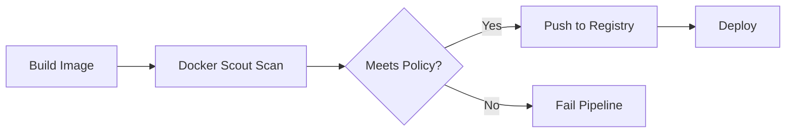

# How to Integrate Docker Scout into CI/CD Pipelines

Author: [nawazdhandala](https://github.com/nawazdhandala)

Tags: Docker, Docker Scout, CI/CD, GitHub Actions, GitLab CI, Security, DevOps

Description: Integrate Docker Scout vulnerability scanning into GitHub Actions, GitLab CI, and Jenkins pipelines to catch security issues before deployment.

---

Scanning Docker images for vulnerabilities on your local machine is a good start, but it relies on developers remembering to run the scan. The real security improvement comes from integrating Docker Scout into your CI/CD pipeline where every image gets scanned automatically. No image reaches your registry or production environment without passing a vulnerability check.

This guide shows you how to add Docker Scout scanning to GitHub Actions, GitLab CI, Jenkins, and generic CI systems, with practical examples for gating deployments and generating reports.

## How CI/CD Integration Works

Docker Scout in CI follows a simple pattern: build the image, scan it with Scout, and fail the pipeline if vulnerabilities exceed your threshold. The scan happens after the build but before the push to a registry.



## Prerequisites

For CI/CD integration, you need:

- A Docker Hub account with Scout access
- A Docker Hub access token (for authentication in CI)
- The Docker Scout CLI plugin available in your CI runner

## GitHub Actions Integration

### Basic Scan on Every Push

```yaml
# .github/workflows/docker-scout.yml
name: Docker Scout Scan

on:
  push:
    branches: [main]
  pull_request:
    branches: [main]

jobs:
  scan:
    runs-on: ubuntu-latest
    steps:
      - uses: actions/checkout@v4

      - name: Set up Docker Buildx
        uses: docker/setup-buildx-action@v3

      - name: Login to Docker Hub
        uses: docker/login-action@v3
        with:
          username: ${{ secrets.DOCKERHUB_USERNAME }}
          password: ${{ secrets.DOCKERHUB_TOKEN }}

      - name: Build Docker image
        run: docker build -t myapp:${{ github.sha }} .

      - name: Docker Scout - Vulnerability Scan
        uses: docker/scout-action@v1
        with:
          command: cves
          image: myapp:${{ github.sha }}
          only-severities: critical,high
          exit-code: true
```

### PR Comments with Scan Results

Add vulnerability information directly to pull request comments so reviewers see security impact.

```yaml
# .github/workflows/scout-pr.yml
name: Docker Scout PR Report

on:
  pull_request:
    branches: [main]

jobs:
  scout-compare:
    runs-on: ubuntu-latest
    steps:
      - uses: actions/checkout@v4

      - name: Login to Docker Hub
        uses: docker/login-action@v3
        with:
          username: ${{ secrets.DOCKERHUB_USERNAME }}
          password: ${{ secrets.DOCKERHUB_TOKEN }}

      - name: Build PR image
        run: docker build -t myapp:pr-${{ github.event.pull_request.number }} .

      - name: Docker Scout - Compare with main
        uses: docker/scout-action@v1
        with:
          command: compare
          image: myapp:pr-${{ github.event.pull_request.number }}
          to: registry.example.com/myapp:latest
          only-severities: critical,high
          # Write results as a PR comment
          write-comment: true
          github-token: ${{ secrets.GITHUB_TOKEN }}
```

### Full Pipeline with Build, Scan, and Push

```yaml
# .github/workflows/full-pipeline.yml
name: Build, Scan, and Deploy

on:
  push:
    branches: [main]
    tags: ['v*']

env:
  REGISTRY: ghcr.io
  IMAGE_NAME: ${{ github.repository }}

jobs:
  build-and-scan:
    runs-on: ubuntu-latest
    permissions:
      contents: read
      packages: write
      security-events: write

    steps:
      - uses: actions/checkout@v4

      - name: Set up Docker Buildx
        uses: docker/setup-buildx-action@v3

      - name: Login to Docker Hub (for Scout)
        uses: docker/login-action@v3
        with:
          username: ${{ secrets.DOCKERHUB_USERNAME }}
          password: ${{ secrets.DOCKERHUB_TOKEN }}

      - name: Login to GHCR
        uses: docker/login-action@v3
        with:
          registry: ${{ env.REGISTRY }}
          username: ${{ github.actor }}
          password: ${{ secrets.GITHUB_TOKEN }}

      - name: Build image
        run: |
          docker build \
            --tag ${{ env.REGISTRY }}/${{ env.IMAGE_NAME }}:${{ github.sha }} \
            --tag ${{ env.REGISTRY }}/${{ env.IMAGE_NAME }}:latest \
            .

      - name: Scout - CVE scan
        uses: docker/scout-action@v1
        with:
          command: cves
          image: ${{ env.REGISTRY }}/${{ env.IMAGE_NAME }}:${{ github.sha }}
          only-severities: critical,high
          exit-code: true
          sarif-file: scout-results.sarif

      - name: Upload SARIF to GitHub Security
        uses: github/codeql-action/upload-sarif@v3
        if: always()
        with:
          sarif_file: scout-results.sarif

      - name: Push image (only if scan passes)
        run: |
          docker push ${{ env.REGISTRY }}/${{ env.IMAGE_NAME }}:${{ github.sha }}
          docker push ${{ env.REGISTRY }}/${{ env.IMAGE_NAME }}:latest
```

## GitLab CI Integration

```yaml
# .gitlab-ci.yml - Docker Scout scanning in GitLab CI
stages:
  - build
  - scan
  - push
  - deploy

variables:
  IMAGE_TAG: $CI_REGISTRY_IMAGE:$CI_COMMIT_SHORT_SHA

build:
  stage: build
  image: docker:24
  services:
    - docker:24-dind
  script:
    - docker build -t $IMAGE_TAG .
    # Save the image as an artifact for the scan stage
    - docker save $IMAGE_TAG -o image.tar
  artifacts:
    paths:
      - image.tar
    expire_in: 1 hour

scout-scan:
  stage: scan
  image: docker:24
  services:
    - docker:24-dind
  before_script:
    # Install Docker Scout CLI
    - curl -fsSL https://raw.githubusercontent.com/docker/scout-cli/main/install.sh | sh
    # Login to Docker Hub for Scout access
    - echo "$DOCKERHUB_TOKEN" | docker login -u "$DOCKERHUB_USERNAME" --password-stdin
  script:
    # Load the image built in the previous stage
    - docker load -i image.tar
    # Run vulnerability scan
    - docker scout cves $IMAGE_TAG --only-severity critical,high --exit-code
    # Generate a detailed report
    - docker scout cves $IMAGE_TAG --format json > scout-report.json
  artifacts:
    paths:
      - scout-report.json
    reports:
      # GitLab can display container scanning results natively
      container_scanning: scout-report.json
    expire_in: 30 days

push:
  stage: push
  image: docker:24
  services:
    - docker:24-dind
  script:
    - docker load -i image.tar
    - echo "$CI_REGISTRY_PASSWORD" | docker login -u "$CI_REGISTRY_USER" --password-stdin $CI_REGISTRY
    - docker push $IMAGE_TAG
  only:
    - main
```

## Jenkins Integration

```groovy
// Jenkinsfile - Docker Scout scanning in Jenkins
pipeline {
    agent any

    environment {
        IMAGE_TAG = "myapp:${env.BUILD_NUMBER}"
        DOCKERHUB_CREDS = credentials('dockerhub-credentials')
    }

    stages {
        stage('Build') {
            steps {
                sh "docker build -t ${IMAGE_TAG} ."
            }
        }

        stage('Scout Scan') {
            steps {
                // Login to Docker Hub for Scout access
                sh "echo ${DOCKERHUB_CREDS_PSW} | docker login -u ${DOCKERHUB_CREDS_USR} --password-stdin"

                // Run vulnerability scan with exit code
                sh """
                    docker scout cves ${IMAGE_TAG} \
                        --only-severity critical,high \
                        --exit-code \
                        --format json > scout-results.json
                """
            }
            post {
                always {
                    // Archive scan results
                    archiveArtifacts artifacts: 'scout-results.json', allowEmptyArchive: true
                }
                failure {
                    echo "Vulnerability scan failed! Critical or high severity CVEs detected."
                }
            }
        }

        stage('Push') {
            when {
                branch 'main'
            }
            steps {
                sh """
                    docker tag ${IMAGE_TAG} registry.example.com/${IMAGE_TAG}
                    docker push registry.example.com/${IMAGE_TAG}
                """
            }
        }
    }

    post {
        always {
            sh "docker logout"
            sh "docker rmi ${IMAGE_TAG} || true"
        }
    }
}
```

## Generic CI Script

For any CI system, use this shell script.

```bash
#!/bin/bash
# ci-scout-scan.sh - Generic Docker Scout CI scanning script

set -euo pipefail

IMAGE="${1:?Usage: $0 <image:tag>}"
SEVERITY_THRESHOLD="${2:-critical,high}"
REPORT_DIR="${3:-./scout-reports}"

mkdir -p "$REPORT_DIR"

echo "=== Docker Scout CI Scan ==="
echo "Image: $IMAGE"
echo "Severity threshold: $SEVERITY_THRESHOLD"

# Login to Docker Hub (credentials from environment variables)
echo "${DOCKERHUB_TOKEN}" | docker login -u "${DOCKERHUB_USERNAME}" --password-stdin

# Generate SBOM
echo "Generating SBOM..."
docker scout sbom "$IMAGE" --format json > "$REPORT_DIR/sbom.json"

# Run vulnerability scan and save report
echo "Scanning for vulnerabilities..."
docker scout cves "$IMAGE" --format json > "$REPORT_DIR/cves.json" || true

# Count vulnerabilities by severity
echo "=== Results ==="
for sev in critical high medium low; do
    count=$(jq "[.vulnerabilities[] | select(.severity == \"$sev\")] | length" "$REPORT_DIR/cves.json" 2>/dev/null || echo "0")
    echo "  $sev: $count"
done

# Check against threshold
echo ""
echo "Checking against threshold: $SEVERITY_THRESHOLD"
docker scout cves "$IMAGE" --only-severity "$SEVERITY_THRESHOLD" --exit-code

echo "Scan passed. Image approved for deployment."
```

```bash
# Use in any CI system
chmod +x ci-scout-scan.sh
./ci-scout-scan.sh myapp:latest "critical,high"
```

## Scheduled Scanning

Images that passed scanning at build time can become vulnerable later when new CVEs are disclosed. Set up scheduled scans for deployed images.

```yaml
# .github/workflows/scheduled-scan.yml
name: Scheduled Vulnerability Scan

on:
  schedule:
    # Scan every day at 6 AM UTC
    - cron: '0 6 * * *'
  workflow_dispatch:

jobs:
  scan-deployed-images:
    runs-on: ubuntu-latest
    strategy:
      matrix:
        image:
          - registry.example.com/myapp:latest
          - registry.example.com/api:latest
          - registry.example.com/worker:latest
    steps:
      - name: Login to Docker Hub
        uses: docker/login-action@v3
        with:
          username: ${{ secrets.DOCKERHUB_USERNAME }}
          password: ${{ secrets.DOCKERHUB_TOKEN }}

      - name: Login to private registry
        uses: docker/login-action@v3
        with:
          registry: registry.example.com
          username: ${{ secrets.REGISTRY_USER }}
          password: ${{ secrets.REGISTRY_PASSWORD }}

      - name: Scan ${{ matrix.image }}
        uses: docker/scout-action@v1
        with:
          command: cves
          image: ${{ matrix.image }}
          only-severities: critical
          exit-code: true

      - name: Alert on new vulnerabilities
        if: failure()
        run: |
          curl -X POST "${{ secrets.SLACK_WEBHOOK }}" \
            -H 'Content-Type: application/json' \
            -d "{\"text\": \"New critical vulnerability found in ${{ matrix.image }}. Check the scan results.\"}"
```

Integrating Docker Scout into your CI/CD pipeline turns security scanning from an optional manual step into an automated gate. Every image gets scanned. Every vulnerability gets reported. Critical issues block deployment automatically. The effort to set this up is minimal, and the security improvement is significant.
