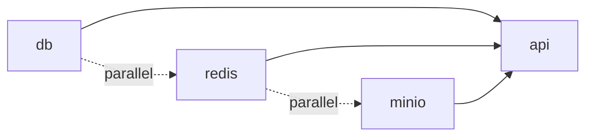

# How to Optimize Docker Compose Startup Speed

Author: [nawazdhandala](https://github.com/nawazdhandala)

Tags: docker, docker compose, startup optimization, healthchecks, depends_on, development

Description: Speed up Docker Compose startup times with parallel execution, healthchecks, and smart configuration

---

Docker Compose is the standard tool for running multi-container applications during development. But as your stack grows, `docker compose up` can take minutes. Services wait for each other in chains, images get pulled sequentially, volumes mount slowly, and health checks add delays. Most of this waiting is avoidable. Here are the techniques that cut Compose startup times from minutes to seconds.

## Diagnosing Slow Startups

Before optimizing, measure what is actually slow:

```bash
# Time the full startup
time docker compose up -d

# Watch service startup in real time
docker compose up -d && docker compose ps --format "table {{.Name}}\t{{.Status}}\t{{.Health}}"

# Check which services are waiting on dependencies
docker compose logs --follow
```

The usual culprits are:

1. Image pulls (downloading large images on first run)
2. Build steps (compiling code inside Docker)
3. Dependency chains (services waiting for other services)
4. Health check intervals (slow polling for readiness)
5. Volume synchronization (file system overhead)

## Technique 1: Use Pre-Built Images Where Possible

Building images during `docker compose up` is the single biggest time sink. Use pre-built images for databases, caches, and other infrastructure services:

```yaml
# docker-compose.yml - Use official images instead of building
services:
  db:
    image: postgres:16-alpine  # Pre-built, pulls in seconds
    environment:
      POSTGRES_PASSWORD: devpass
      POSTGRES_DB: myapp
    volumes:
      - pgdata:/var/lib/postgresql/data

  redis:
    image: redis:7-alpine  # Pre-built, tiny image

  elasticsearch:
    image: elasticsearch:8.12.0  # Pre-built
    environment:
      - discovery.type=single-node
      - "ES_JAVA_OPTS=-Xms256m -Xmx256m"

  # Only build your application service
  app:
    build:
      context: .
      dockerfile: Dockerfile
    ports:
      - "3000:3000"

volumes:
  pgdata:
```

Alpine-based images download faster because they are smaller. `postgres:16-alpine` is about 80MB compared to 400MB for `postgres:16`.

## Technique 2: Optimize depends_on with Health Checks

The default `depends_on` only waits for the container to start, not for the service inside it to be ready. Use health checks to avoid race conditions without adding unnecessary delays:

```yaml
services:
  db:
    image: postgres:16-alpine
    environment:
      POSTGRES_PASSWORD: devpass
    healthcheck:
      # Check if PostgreSQL is accepting connections
      test: ["CMD-SHELL", "pg_isready -U postgres"]
      interval: 2s      # Check every 2 seconds (not the default 30s)
      timeout: 3s
      retries: 5
      start_period: 5s   # Give it 5 seconds before first check

  redis:
    image: redis:7-alpine
    healthcheck:
      test: ["CMD", "redis-cli", "ping"]
      interval: 2s
      timeout: 3s
      retries: 3
      start_period: 2s

  app:
    build: .
    depends_on:
      db:
        condition: service_healthy  # Wait for actual readiness
      redis:
        condition: service_healthy
    ports:
      - "3000:3000"
```

The key settings for fast startup:

- **interval: 2s** instead of the default 30s. Check readiness frequently.
- **start_period: 5s** for databases. This gives the service time to initialize before the first check.
- **retries: 3-5** to handle brief startup delays without waiting too long.

## Technique 3: Pull Images in Parallel

Docker Compose v2 pulls images in parallel by default, but you can explicitly pre-pull to avoid mixing pull and start operations:

```bash
# Pull all images before starting (parallel downloads)
docker compose pull

# Then start with pre-pulled images
docker compose up -d
```

```bash
# Or combine in a single command for CI/CD
docker compose pull --parallel && docker compose up -d --wait
```

The `--wait` flag tells Compose to wait until all services are healthy before returning, which is useful in CI/CD scripts.

## Technique 4: Use Build Cache Effectively

When you must build images, make sure the Docker build cache works for you:

```yaml
services:
  app:
    build:
      context: .
      dockerfile: Dockerfile
      cache_from:
        - myapp:latest  # Use previous build as cache source
      args:
        BUILDKIT_INLINE_CACHE: 1

  worker:
    build:
      context: .
      dockerfile: Dockerfile.worker
      cache_from:
        - myworker:latest
```

```bash
# Build with BuildKit for faster builds
COMPOSE_DOCKER_CLI_BUILD=1 DOCKER_BUILDKIT=1 docker compose build
```

## Technique 5: Reduce Service Count

Every additional service adds startup time. Consolidate services that do not need separate containers during development:

```yaml
# BEFORE: 6 services, slow to start
services:
  api:
    build: ./api
  worker:
    build: ./worker
  scheduler:
    build: ./scheduler
  db:
    image: postgres:16-alpine
  redis:
    image: redis:7-alpine
  mailhog:
    image: mailhog/mailhog
```

```yaml
# AFTER: 4 services, use profiles for optional ones
services:
  api:
    build: ./api
    # Run worker and scheduler as processes inside the same container
    command: ["supervisord", "-c", "/etc/supervisord.conf"]

  db:
    image: postgres:16-alpine
    healthcheck:
      test: ["CMD-SHELL", "pg_isready"]
      interval: 2s
      retries: 5

  redis:
    image: redis:7-alpine
    healthcheck:
      test: ["CMD", "redis-cli", "ping"]
      interval: 2s

  # Only start mailhog when explicitly needed
  mailhog:
    image: mailhog/mailhog
    profiles: ["debug"]
```

```bash
# Normal startup: only 3 services
docker compose up -d

# When you need email testing, include the debug profile
docker compose --profile debug up -d
```

Profiles prevent optional services from starting unless you ask for them. This is perfect for tools like monitoring dashboards, admin panels, and testing utilities.

## Technique 6: Optimize Volume Mounts

Volume mounts add overhead, especially on macOS and Windows where file sharing goes through a VM:

```yaml
services:
  app:
    build: .
    volumes:
      # Only mount what you need for development
      - ./src:/app/src          # Source code for hot reload
      - ./config:/app/config    # Configuration files
      # Do NOT mount node_modules or build output
      - /app/node_modules       # Anonymous volume - prevents host override

    # On Docker Desktop, use specific consistency settings
    # volumes:
    #   - ./src:/app/src:cached    # Relax consistency for read-heavy mounts
```

The anonymous volume trick (`/app/node_modules` without a source path) tells Docker to use a Docker-managed volume for `node_modules` instead of syncing from the host. This avoids the overhead of mounting thousands of small files.

## Technique 7: Database Initialization

Database initialization scripts run on every fresh start and can be slow. Use named volumes to persist data:

```yaml
services:
  db:
    image: postgres:16-alpine
    volumes:
      - pgdata:/var/lib/postgresql/data  # Persist across restarts
      - ./init.sql:/docker-entrypoint-initdb.d/init.sql  # Only runs once
    environment:
      POSTGRES_PASSWORD: devpass

volumes:
  pgdata:  # Named volume persists between compose up/down cycles
```

The initialization scripts in `/docker-entrypoint-initdb.d/` only run when the data volume is empty. On subsequent starts, PostgreSQL skips initialization entirely and starts in 1-2 seconds.

## Technique 8: Parallel Service Startup

Docker Compose starts independent services in parallel. Structure your dependency graph to maximize parallelism:

```yaml
services:
  # These three start simultaneously (no depends_on)
  db:
    image: postgres:16-alpine
    healthcheck:
      test: ["CMD-SHELL", "pg_isready"]
      interval: 2s
      retries: 5
      start_period: 3s

  redis:
    image: redis:7-alpine
    healthcheck:
      test: ["CMD", "redis-cli", "ping"]
      interval: 2s
      retries: 3

  minio:
    image: minio/minio
    command: server /data
    healthcheck:
      test: ["CMD", "curl", "-f", "http://localhost:9000/minio/health/live"]
      interval: 2s
      retries: 5

  # API waits for all infrastructure (which started in parallel)
  api:
    build: .
    depends_on:
      db:
        condition: service_healthy
      redis:
        condition: service_healthy
      minio:
        condition: service_healthy
```



All three infrastructure services start at the same time. The API service only waits for whichever one takes the longest to become healthy.

## Technique 9: Use Docker Compose Watch

For development, Compose Watch automatically syncs file changes without rebuilding:

```yaml
services:
  app:
    build: .
    develop:
      watch:
        # Sync source files directly - no rebuild
        - action: sync
          path: ./src
          target: /app/src

        # Rebuild only when dependencies change
        - action: rebuild
          path: package.json
```

```bash
# Start with file watching enabled
docker compose watch
```

This eliminates the "rebuild and restart" cycle for code changes. File syncs happen in under a second, while full rebuilds only trigger when dependency files change.

## Measuring the Improvement

```bash
# Before optimization
time docker compose down && time docker compose up -d --wait
# Typical: 45-90 seconds

# After optimization
time docker compose down && time docker compose up -d --wait
# Target: 10-20 seconds
```

The biggest wins come from eliminating unnecessary builds (use pre-built images), shortening health check intervals (2s instead of 30s), and maximizing parallel startup. Apply these techniques progressively and measure after each change. Most teams can cut their Compose startup time by 50-75% with just the health check and parallel startup optimizations.
