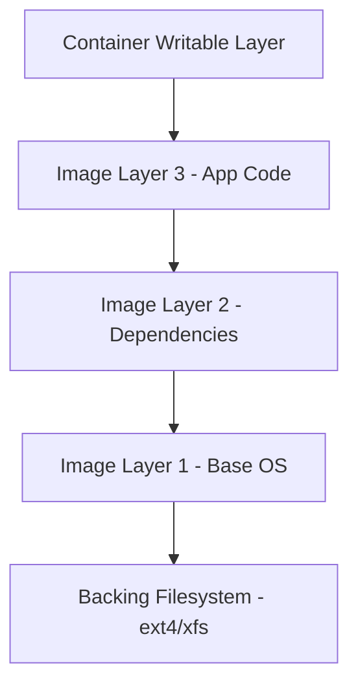

# How to Optimize Docker Overlay2 Storage Driver Performance

Author: [nawazdhandala](https://github.com/nawazdhandala)

Tags: Docker, Performance, Overlay2, Storage, Linux, Filesystem, DevOps, Optimization

Description: Learn how to tune the overlay2 storage driver for better Docker performance, including filesystem selection, mount options, and cleanup strategies.

---

Overlay2 is Docker's default and recommended storage driver on modern Linux systems. It provides a union filesystem that layers image and container data efficiently. While it works well out of the box, production workloads benefit from careful tuning. The filesystem underneath overlay2, the mount options, the backing store, and cleanup policies all affect performance. Let's get into the specifics.

## How Overlay2 Works

Overlay2 layers multiple directories on top of each other to create a unified view. When Docker runs a container, it stacks the image layers (read-only) and adds a thin writable layer on top. File reads go through the layers from top to bottom until the file is found. Writes go to the top writable layer using copy-on-write.



Performance bottlenecks happen at two points: the copy-on-write operation when a container first modifies an existing file, and metadata operations when the container creates many small files.

## Choosing the Right Backing Filesystem

Overlay2 runs on top of a regular filesystem. The choice between ext4 and xfs has real performance implications.

### ext4 vs xfs

For most Docker workloads, xfs performs better:

```bash
# Check your current filesystem
df -T /var/lib/docker
# Look at the Type column

# If you need to switch, back up and reformat
# WARNING: This erases all Docker data
sudo systemctl stop docker
sudo umount /var/lib/docker
sudo mkfs.xfs -f /dev/your-device
sudo mount /dev/your-device /var/lib/docker
sudo systemctl start docker
```

xfs advantages for Docker:
- Better performance with many concurrent writes
- More efficient metadata handling
- d_type support enabled by default (required by overlay2)
- Better behavior under high inode pressure

Verify d_type support (overlay2 requires it):

```bash
# Check if the filesystem supports d_type
xfs_info /var/lib/docker | grep ftype
# Output should show ftype=1

# For ext4, check the mount options
tune2fs -l /dev/your-device | grep -i dir_index
```

## Mount Options for Performance

The mount options on the backing filesystem significantly affect overlay2 performance.

### For xfs

```bash
# Optimized xfs mount options for Docker
# Add to /etc/fstab
/dev/your-device /var/lib/docker xfs defaults,noatime,nodiratime,logbufs=8,logbsize=256k 0 0
```

Explanation of each option:
- `noatime`: Disables updating file access timestamps on reads. Every read without this option triggers a metadata write.
- `nodiratime`: Same as noatime but for directory access times.
- `logbufs=8`: Increases the number of in-memory log buffers for better write throughput.
- `logbsize=256k`: Increases the log buffer size for better write batching.

### For ext4

```bash
# Optimized ext4 mount options for Docker
/dev/your-device /var/lib/docker ext4 defaults,noatime,nodiratime,discard,errors=remount-ro 0 0
```

Apply changes without rebooting:

```bash
# Remount with new options
sudo mount -o remount,noatime,nodiratime /var/lib/docker
```

## Overlay2 Specific Options

Docker's overlay2 driver accepts configuration options through the daemon.json:

```json
{
  "storage-driver": "overlay2",
  "storage-opts": [
    "overlay2.size=20G"
  ]
}
```

The `overlay2.size` option limits the writable layer size per container. This prevents runaway containers from filling the disk but adds a small overhead for quota management.

For xfs backing stores, you can use project quotas:

```bash
# Enable project quotas on xfs (required for overlay2.size on xfs)
# Add prjquota to mount options
sudo mount -o remount,prjquota /var/lib/docker
```

## Reducing Copy-on-Write Overhead

Copy-on-write (CoW) is overlay2's biggest performance cost. When a container modifies a file from a lower layer, overlay2 copies the entire file to the writable layer before applying the change. For large files, this is expensive.

### Use Volumes for Write-Heavy Paths

Volumes bypass overlay2 entirely. They mount directly on the backing filesystem:

```bash
# Instead of writing to the container filesystem...
docker run -d mydb:latest
# The database writes go through overlay2 CoW

# Use a volume for write-heavy directories
docker run -d -v pgdata:/var/lib/postgresql/data mydb:latest
# Database writes go directly to the volume, bypassing CoW
```

In Docker Compose:

```yaml
services:
  database:
    image: postgres:16-alpine
    volumes:
      # Bypass overlay2 for write-heavy paths
      - pgdata:/var/lib/postgresql/data
      - logs:/var/log/postgresql
    tmpfs:
      # Use tmpfs for temporary files
      - /tmp:size=256M

volumes:
  pgdata:
    driver: local
  logs:
    driver: local
```

### Use tmpfs for Temporary Data

Temporary files that do not need persistence should use tmpfs:

```bash
# Mount tmpfs for scratch space
docker run -d \
  --tmpfs /tmp:size=256m,noexec,nosuid \
  --tmpfs /app/cache:size=512m \
  myapp:latest
```

## Managing Inode Usage

Docker images with many small files consume inodes quickly. Each file in every layer needs its own inode. Running out of inodes crashes Docker even if you have free disk space.

```bash
# Check inode usage
df -i /var/lib/docker

# If inode usage is high, find which images consume the most
docker system df -v | head -30
```

Reduce inode pressure by:

```bash
# 1. Use smaller base images (fewer files = fewer inodes)
# Alpine has ~14k files vs Ubuntu's ~30k files

# 2. Merge layers to reduce duplicate inode metadata
# BAD: Many layers, many inode entries
RUN apt-get update
RUN apt-get install -y curl
RUN apt-get install -y git
RUN apt-get clean

# GOOD: Single layer, fewer inode entries
RUN apt-get update && \
    apt-get install -y curl git && \
    apt-get clean && \
    rm -rf /var/lib/apt/lists/*

# 3. Create the filesystem with more inodes if needed
sudo mkfs.xfs -n ftype=1 -i maxpct=50 /dev/your-device
```

## Cleanup Strategies

Unused layers, dangling images, and stopped containers accumulate. Regular cleanup keeps overlay2 performing well.

```bash
# Remove all unused data (images, containers, volumes, build cache)
docker system prune -a -f

# More targeted cleanup commands:
# Remove only dangling images (no tag, no container reference)
docker image prune -f

# Remove images not used in the last 24 hours
docker image prune -a --filter "until=24h" -f

# Remove stopped containers older than 12 hours
docker container prune --filter "until=12h" -f

# Remove unused build cache older than 7 days
docker builder prune --filter "until=168h" -f
```

Automate cleanup with a systemd timer:

```ini
# /etc/systemd/system/docker-cleanup.service
[Unit]
Description=Docker Cleanup
Requires=docker.service

[Service]
Type=oneshot
ExecStart=/usr/bin/docker system prune -a -f --filter "until=48h"

# /etc/systemd/system/docker-cleanup.timer
[Unit]
Description=Run Docker cleanup daily

[Timer]
OnCalendar=daily
RandomizedDelaySec=3600
Persistent=true

[Install]
WantedBy=timers.target
```

```bash
# Enable the timer
sudo systemctl enable docker-cleanup.timer
sudo systemctl start docker-cleanup.timer
```

## Monitoring Overlay2 Performance

Track key metrics to detect performance degradation:

```bash
#!/bin/bash
# monitor-overlay2.sh
# Collects overlay2 performance metrics

echo "=== Disk Usage ==="
df -h /var/lib/docker

echo ""
echo "=== Inode Usage ==="
df -i /var/lib/docker

echo ""
echo "=== Docker Disk Usage ==="
docker system df

echo ""
echo "=== Layer Count ==="
find /var/lib/docker/overlay2 -maxdepth 1 -type d | wc -l

echo ""
echo "=== Overlay Mount Count ==="
mount | grep -c overlay

echo ""
echo "=== I/O Stats ==="
# Check disk I/O for the Docker partition
iostat -xh $(df /var/lib/docker | tail -1 | awk '{print $1}') 1 3
```

## Performance Benchmarking

Measure your overlay2 performance to establish a baseline:

```bash
# File creation benchmark inside a container
docker run --rm alpine sh -c "
    time sh -c 'for i in \$(seq 1 10000); do echo test > /tmp/file_\$i; done'
"

# File read benchmark
docker run --rm alpine sh -c "
    dd if=/dev/zero of=/tmp/testfile bs=1M count=100 2>&1
    time dd if=/tmp/testfile of=/dev/null bs=1M 2>&1
"

# Compare with a volume-mounted path
docker run --rm -v testbench:/data alpine sh -c "
    dd if=/dev/zero of=/data/testfile bs=1M count=100 2>&1
    time dd if=/data/testfile of=/dev/null bs=1M 2>&1
"
docker volume rm testbench
```

## Wrapping Up

Overlay2 works well by default, but production workloads deserve optimization. Use xfs as the backing filesystem, enable noatime, move write-heavy paths to volumes, clean up regularly, and monitor inode usage. These changes add up to noticeably faster container operations and fewer midnight pages about full disks.
