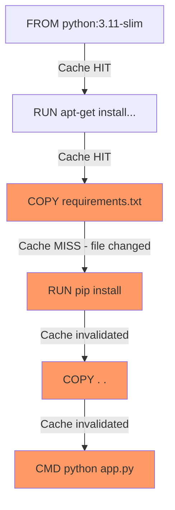

# How to Order Dockerfile Instructions for Optimal Caching

Author: [nawazdhandala](https://github.com/nawazdhandala)

Tags: Docker, Dockerfile, Build Cache, Optimization, CI/CD, DevOps

Description: Learn how to structure Dockerfile instructions to maximize build cache hits and dramatically speed up your Docker builds.

---

Docker builds images layer by layer. Each instruction in a Dockerfile creates a layer, and Docker caches these layers. When you rebuild an image, Docker checks each instruction from top to bottom. If an instruction and all instructions before it have not changed, Docker reuses the cached layer instead of rebuilding it. The moment an instruction changes, Docker invalidates the cache for that instruction and everything that follows.

This caching behavior means the order of instructions in your Dockerfile has a direct impact on build speed. A well-ordered Dockerfile can rebuild in seconds after a code change. A poorly ordered one rebuilds from scratch every time.

## How Docker's Build Cache Works

Docker evaluates each instruction sequentially:

1. For each instruction, Docker checks if there is a cached layer from a previous build
2. If the instruction text is identical AND the cache of the previous instruction was used, Docker reuses the cached layer
3. For COPY and ADD instructions, Docker also checks if the file contents have changed (using checksums)
4. Once a cache miss occurs, all subsequent instructions are rebuilt from scratch



In this example, when `requirements.txt` changes, layers C through F are rebuilt. But layers A and B are reused from cache.

## The Golden Rule

Put instructions that change least frequently at the top, and instructions that change most frequently at the bottom. This maximizes the number of cached layers that can be reused on each build.

A typical change frequency ranking, from least to most frequent:

1. Base image (FROM) - almost never changes
2. System package installation (RUN apt-get) - changes rarely
3. Dependency file copy (COPY package.json) - changes when dependencies change
4. Dependency installation (RUN npm install) - changes when dependencies change
5. Application code copy (COPY . .) - changes with every commit
6. Build commands that depend on source (RUN npm build) - changes with every commit

## Bad Ordering Example

Here is a Dockerfile that rebuilds dependencies on every code change:

```dockerfile
FROM node:20-alpine
WORKDIR /app

# Copying everything first means ANY file change invalidates the cache
COPY . .

# This runs on every build because COPY . . changes constantly
RUN npm ci

# This also runs on every build
RUN npm run build

EXPOSE 3000
CMD ["node", "dist/server.js"]
```

Every time you change a single line of code, Docker invalidates the cache at `COPY . .` and rebuilds `npm ci` and `npm run build`. On a project with hundreds of dependencies, `npm ci` alone can take minutes.

## Good Ordering Example

Separate the dependency files from the source code:

```dockerfile
FROM node:20-alpine
WORKDIR /app

# Step 1: Copy only dependency-related files
# These files change infrequently
COPY package.json package-lock.json ./

# Step 2: Install dependencies
# This layer is cached unless package.json or package-lock.json changed
RUN npm ci

# Step 3: Copy the rest of the source code
# This changes frequently, but it comes AFTER the expensive npm ci step
COPY . .

# Step 4: Build the application
RUN npm run build

EXPOSE 3000
CMD ["node", "dist/server.js"]
```

Now when you change application code, Docker reuses the cached `npm ci` layer and only rebuilds from `COPY . .` onward. The dependency installation step, which might take 30-60 seconds, is skipped entirely.

## Ordering for Python Projects

The same principle applies to Python:

```dockerfile
FROM python:3.11-slim

# System dependencies change very rarely
RUN apt-get update && \
    apt-get install -y --no-install-recommends libpq-dev && \
    rm -rf /var/lib/apt/lists/*

WORKDIR /app

# Python dependencies change occasionally
COPY requirements.txt .
RUN pip install --no-cache-dir -r requirements.txt

# Application code changes frequently
COPY . .

EXPOSE 8000
CMD ["gunicorn", "--bind", "0.0.0.0:8000", "app:app"]
```

If you only change Python source files, Docker skips the system package installation and pip install layers.

## Ordering for Go Projects

Go projects benefit from separating module download from compilation:

```dockerfile
FROM golang:1.22 AS builder

WORKDIR /app

# Go module files change when dependencies change
COPY go.mod go.sum ./

# Download dependencies (cached unless go.mod or go.sum changed)
RUN go mod download

# Source code changes frequently
COPY . .

# Build the binary
RUN CGO_ENABLED=0 go build -o /app/server ./cmd/server

FROM alpine:3.19
COPY --from=builder /app/server /usr/local/bin/
CMD ["server"]
```

The `go mod download` step is expensive because it fetches all dependencies from the internet. Caching it separately means rebuilds after code changes only need to recompile, not re-download.

## Ordering for Java/Maven Projects

Maven projects follow the same pattern:

```dockerfile
FROM maven:3.9-eclipse-temurin-17 AS builder

WORKDIR /app

# Copy the POM file first (defines dependencies)
COPY pom.xml .

# Download all dependencies (cached unless pom.xml changes)
RUN mvn dependency:go-offline -B

# Copy source code
COPY src/ src/

# Build the application
RUN mvn package -DskipTests -B

FROM eclipse-temurin:17-jre
COPY --from=builder /app/target/*.jar /app/app.jar
CMD ["java", "-jar", "/app/app.jar"]
```

## Ordering for Multi-Stage Builds

In multi-stage builds, cache efficiency matters even more because the build stage often involves heavy compilation:

```dockerfile
# syntax=docker/dockerfile:1
FROM rust:1.75 AS builder

WORKDIR /app

# Copy Cargo files for dependency caching
COPY Cargo.toml Cargo.lock ./

# Create a dummy main.rs to build dependencies
RUN mkdir src && echo "fn main() {}" > src/main.rs

# Build dependencies only (cached unless Cargo files change)
RUN cargo build --release

# Remove the dummy source
RUN rm -rf src

# Copy actual source code
COPY src/ src/

# Touch main.rs to force recompilation of our code (not dependencies)
RUN touch src/main.rs

# Build the actual application (dependencies are already compiled)
RUN cargo build --release

FROM debian:bookworm-slim
COPY --from=builder /app/target/release/myapp /usr/local/bin/
CMD ["myapp"]
```

This Rust example uses a clever trick: it builds dependencies with a dummy source file first, caches that layer, then compiles the real source code. Dependency compilation can take 5-10 minutes for large Rust projects, so this cache optimization saves significant time.

## Handling Configuration Files

If your application uses configuration files that change independently from code, separate them:

```dockerfile
FROM python:3.11-slim
WORKDIR /app

# Dependencies (change rarely)
COPY requirements.txt .
RUN pip install --no-cache-dir -r requirements.txt

# Configuration (changes occasionally)
COPY config/ config/

# Application code (changes frequently)
COPY src/ src/
COPY app.py .

CMD ["python", "app.py"]
```

## Cache Busting When Needed

Sometimes you want to invalidate the cache intentionally. For example, to force a fresh `apt-get update`:

```dockerfile
# Using a build argument as a cache buster
ARG CACHE_BUST=1
RUN apt-get update && apt-get install -y curl
```

```bash
# Force cache invalidation by changing the argument
docker build --build-arg CACHE_BUST=$(date +%s) -t myapp .
```

Only use this when necessary. Unnecessary cache busting slows down builds.

## Cache Mounts for Package Managers

BuildKit cache mounts let package managers reuse their download caches across builds without storing them in image layers:

```dockerfile
# syntax=docker/dockerfile:1
FROM node:20-alpine

WORKDIR /app
COPY package.json package-lock.json ./

# Cache npm downloads across builds (not stored in the image)
RUN --mount=type=cache,target=/root/.npm \
    npm ci

COPY . .
RUN npm run build

CMD ["node", "dist/server.js"]
```

Cache mounts complement instruction ordering. The instruction order determines which layers need to rebuild, and cache mounts speed up the rebuild by reusing downloaded packages.

## Verifying Cache Behavior

Monitor whether your builds are hitting the cache:

```bash
# Build with progress output to see cache hits
docker build --progress=plain -t myapp . 2>&1 | grep -E "CACHED|RUN|COPY"
```

Cached steps show `CACHED` in the output. If you see steps rebuilding that should be cached, check if an earlier instruction changed or if file contents differ.

## Common Cache-Busting Mistakes

**Copying a timestamp file or build artifact before dependencies**:

```dockerfile
# Bad - VERSION file changes with every release, invalidating npm ci cache
COPY VERSION package.json package-lock.json ./
RUN npm ci
```

```dockerfile
# Good - VERSION comes after npm ci
COPY package.json package-lock.json ./
RUN npm ci
COPY VERSION .
```

**Using ADD with a remote URL** (ADD always fetches, potentially invalidating cache):

```dockerfile
# Bad - ADD with URL may invalidate cache unpredictably
ADD https://example.com/config.tar.gz /app/

# Better - use RUN with curl for predictable caching
RUN curl -fsSL https://example.com/config.tar.gz | tar -xz -C /app/
```

## Summary

Dockerfile instruction order directly controls build cache effectiveness. Place instructions that change least frequently at the top and most frequently at the bottom. Separate dependency files from source code so that dependency installation is cached independently. Use cache mounts with BuildKit for even faster rebuilds. Monitor cache behavior with `--progress=plain` and fix any instructions that invalidate the cache unnecessarily. A well-ordered Dockerfile turns minute-long rebuilds into seconds, which compounds into significant time savings over the life of a project.
