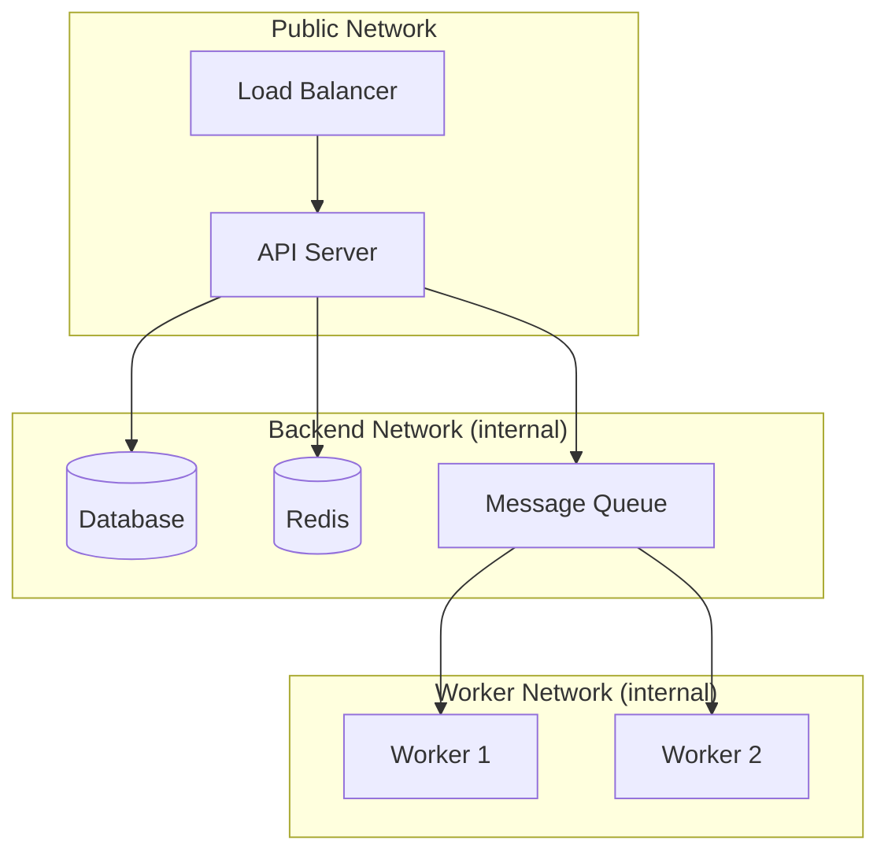

# How to Plan Docker Container Communication Architecture

Author: [nawazdhandala](https://github.com/nawazdhandala)

Tags: Docker, Container Communication, Networking, Service Discovery, Microservices, Architecture

Description: Plan container communication architectures in Docker covering DNS resolution, network segmentation, and inter-service communication patterns.

---

When you decompose an application into multiple containers, they need to talk to each other. Planning how containers communicate is one of the most important architectural decisions you will make. Poor communication design leads to brittle systems, security gaps, and debugging nightmares. A well-planned communication architecture makes your system reliable, secure, and observable.

This guide covers the communication patterns available in Docker and helps you choose the right ones for your architecture.

## Communication Methods

Docker containers can communicate through several mechanisms. Each has different characteristics.

**DNS-based discovery on custom networks** is the primary method. Containers on the same user-defined network can resolve each other by name. This is simple, reliable, and works for most use cases.

**Published ports** expose container ports to the host. Other containers or external clients connect through the host's IP. Use this for services that need to be reachable from outside Docker.

**Shared networks** let containers across different Compose projects communicate. Create an external network and attach services from different projects to it.

**Shared volumes** enable file-based communication between containers. One container writes data, another reads it. This works well for log processing and data pipelines.

**Unix sockets** provide fast, local communication. Mount a volume containing a socket file into multiple containers.

## DNS Resolution on Custom Networks

Docker's built-in DNS is the foundation of container communication. When you create a custom bridge network, Docker runs an embedded DNS server that resolves container names to IP addresses.

Demonstrate DNS-based container communication:

```bash
# Create a custom network
docker network create app-net

# Start a web server
docker run -d --name api --network app-net nginx:alpine

# Test DNS resolution from another container
docker run --rm --network app-net alpine ping -c 3 api
```

The key word here is "custom" network. The default bridge network does NOT provide DNS resolution. Always create and use named networks.

Docker Compose creates a default network for each project automatically. Services within the same Compose file can always reach each other by service name:

```yaml
# Services can reach each other by name: "api", "db", "redis"
version: "3.8"

services:
  api:
    image: my-api:latest
    environment:
      # "db" resolves to the database container's IP
      DATABASE_URL: postgresql://postgres:secret@db:5432/myapp
      # "redis" resolves to the Redis container's IP
      REDIS_URL: redis://redis:6379

  db:
    image: postgres:16-alpine
    environment:
      POSTGRES_PASSWORD: secret

  redis:
    image: redis:7-alpine
```

## Network Segmentation

Not every container should be able to reach every other container. Network segmentation limits the blast radius of a compromise.



Implement network segmentation with Docker Compose:

```yaml
version: "3.8"

services:
  traefik:
    image: traefik:v3.0
    ports:
      - "80:80"
      - "443:443"
    networks:
      - public

  api:
    image: my-api:latest
    networks:
      - public    # Reachable by Traefik
      - backend   # Can reach database and cache

  db:
    image: postgres:16-alpine
    networks:
      - backend   # Only reachable from backend network

  redis:
    image: redis:7-alpine
    networks:
      - backend

  rabbitmq:
    image: rabbitmq:3.13-alpine
    networks:
      - backend
      - workers

  worker:
    image: my-worker:latest
    networks:
      - workers   # Can reach RabbitMQ
      - backend   # Can reach database

networks:
  public:
    # Containers can access the internet
  backend:
    internal: true  # No internet access
  workers:
    internal: true  # No internet access
```

In this setup, Traefik can reach the API but not the database. The database is completely isolated on the internal backend network. Workers can reach the message queue and database but not the public network.

## Service Discovery Patterns

### Static Discovery

The simplest approach. Service addresses are known at deployment time and passed as environment variables.

```yaml
services:
  api:
    environment:
      DB_HOST: db
      DB_PORT: 5432
      CACHE_HOST: redis
      CACHE_PORT: 6379
```

This works well for Compose-based deployments where service names are stable.

### DNS-Based Discovery

For dynamic environments, use DNS SRV records or tools like Consul.

Run Consul as a service registry in Docker:

```yaml
services:
  consul:
    image: hashicorp/consul:1.18
    ports:
      - "8500:8500"
    command: agent -server -bootstrap -ui -client=0.0.0.0
    networks:
      - discovery

  api:
    image: my-api:latest
    environment:
      CONSUL_HTTP_ADDR: http://consul:8500
    networks:
      - discovery
      - backend

  worker:
    image: my-worker:latest
    environment:
      CONSUL_HTTP_ADDR: http://consul:8500
    networks:
      - discovery
      - backend
```

Services register themselves with Consul on startup and discover other services by querying the registry.

## Communication Patterns

### Synchronous Request-Response

The API calls another service and waits for a response. This is the simplest pattern but creates tight coupling.

```yaml
services:
  api-gateway:
    image: my-gateway:latest
    environment:
      USER_SERVICE_URL: http://user-service:3001
      ORDER_SERVICE_URL: http://order-service:3002
      PRODUCT_SERVICE_URL: http://product-service:3003
    networks:
      - services

  user-service:
    image: my-user-service:latest
    networks:
      - services
      - backend

  order-service:
    image: my-order-service:latest
    networks:
      - services
      - backend

  product-service:
    image: my-product-service:latest
    networks:
      - services
      - backend

networks:
  services:
  backend:
    internal: true
```

### Asynchronous Messaging

Services communicate through a message broker. The sender does not wait for a response. This decouples services and improves resilience.

```yaml
services:
  order-service:
    image: my-order-service:latest
    environment:
      RABBITMQ_URL: amqp://rabbitmq:5672
    networks:
      - messaging

  inventory-service:
    image: my-inventory-service:latest
    environment:
      RABBITMQ_URL: amqp://rabbitmq:5672
    networks:
      - messaging

  notification-service:
    image: my-notification-service:latest
    environment:
      RABBITMQ_URL: amqp://rabbitmq:5672
    networks:
      - messaging

  rabbitmq:
    image: rabbitmq:3.13-alpine
    networks:
      - messaging

networks:
  messaging:
    internal: true
```

### Shared Volume Communication

For data-intensive pipelines, containers share data through volumes instead of network calls.

```yaml
services:
  data-collector:
    image: my-collector:latest
    volumes:
      - pipeline-data:/data/output

  data-processor:
    image: my-processor:latest
    volumes:
      - pipeline-data:/data/input:ro
      - processed-data:/data/output

  data-loader:
    image: my-loader:latest
    volumes:
      - processed-data:/data/input:ro

volumes:
  pipeline-data:
  processed-data:
```

## Connection Resilience

Containers can restart and change IP addresses. Your communication architecture must handle this gracefully.

Implement retry logic in your service connections:

```javascript
// connection-helper.js
// Retries failed connections with exponential backoff

async function connectWithRetry(connectFn, options = {}) {
  const maxRetries = options.maxRetries || 10;
  const baseDelay = options.baseDelay || 1000;

  for (let attempt = 1; attempt <= maxRetries; attempt++) {
    try {
      const connection = await connectFn();
      console.log(`Connected successfully on attempt ${attempt}`);
      return connection;
    } catch (err) {
      if (attempt === maxRetries) {
        throw new Error(`Failed to connect after ${maxRetries} attempts: ${err.message}`);
      }

      const delay = baseDelay * Math.pow(2, attempt - 1);
      console.log(`Connection attempt ${attempt} failed, retrying in ${delay}ms`);
      await new Promise(resolve => setTimeout(resolve, delay));
    }
  }
}

module.exports = { connectWithRetry };
```

## Debugging Communication Issues

When containers cannot communicate, use these diagnostic commands.

Verify containers share a network:

```bash
docker network inspect backend --format '{{range .Containers}}{{.Name}} {{end}}'
```

Test DNS resolution between containers:

```bash
docker run --rm --network backend alpine nslookup api
```

Test TCP connectivity to a specific port:

```bash
docker run --rm --network backend alpine nc -zv db 5432
```

Capture traffic on a Docker network for debugging:

```bash
# Find the network interface
NETWORK_ID=$(docker network inspect backend --format '{{.Id}}')
IFACE="br-${NETWORK_ID:0:12}"

# Capture packets
sudo tcpdump -i "$IFACE" -nn port 5432
```

## Conclusion

Planning container communication architecture upfront saves enormous debugging time later. Use custom networks with DNS resolution as your default. Segment networks by security zone. Choose synchronous communication for simple request-response flows and asynchronous messaging for decoupled, resilient systems. Add connection retry logic to handle container restarts gracefully. Start with the simplest pattern that meets your requirements, and evolve toward more sophisticated patterns as your system grows.
