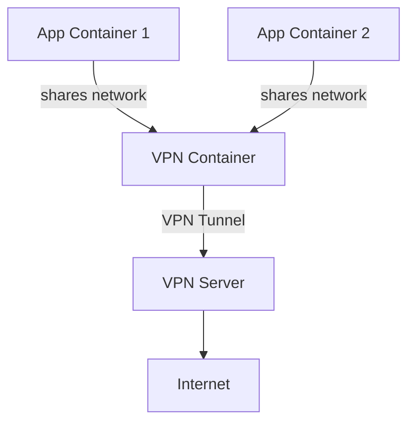

# How to Route Docker Container Traffic Through a VPN Container

Author: [nawazdhandala](https://github.com/nawazdhandala)

Tags: Docker, VPN, Networking, Containers, Security, DevOps

Description: Learn how to route all network traffic from Docker containers through a dedicated VPN container for privacy and security.

---

Sometimes you need certain containers to send all their traffic through a VPN. Maybe you are scraping data and need to rotate exit IPs. Maybe you need to reach services inside a corporate network. Or maybe you want to isolate traffic from specific containers for compliance reasons. Docker makes this possible by letting one container share another container's network stack using the `--network container:` mode.

## How It Works

Docker's `--network container:<name>` flag tells a container to share the network namespace of another container. The second container does not get its own network interfaces. Instead, it uses the first container's interfaces, routes, and IP address. If the first container has a VPN tunnel active, all traffic from the second container flows through that tunnel.

Here is the high-level architecture:



The app containers share the VPN container's network. All their traffic exits through the VPN tunnel.

## Setting Up the VPN Container

We will use WireGuard as the VPN protocol because it is fast, simple, and well-supported in containers. First, create a WireGuard configuration file.

Create the directory structure:

```bash
# Create a directory for the VPN configuration
mkdir -p /opt/vpn/config
```

Create the WireGuard configuration:

```ini
# /opt/vpn/config/wg0.conf
# WireGuard client configuration for VPN container
[Interface]
PrivateKey = YOUR_PRIVATE_KEY_HERE
Address = 10.66.66.2/32
DNS = 1.1.1.1

[Peer]
PublicKey = VPN_SERVER_PUBLIC_KEY_HERE
AllowedIPs = 0.0.0.0/0
Endpoint = vpn.example.com:51820
PersistentKeepalive = 25
```

Replace the keys and endpoint with values from your VPN provider or your own WireGuard server.

Now start the VPN container:

```bash
# Start the WireGuard VPN container with required capabilities
docker run -d \
  --name vpn \
  --cap-add NET_ADMIN \
  --cap-add SYS_MODULE \
  --sysctl net.ipv4.conf.all.src_valid_mark=1 \
  -v /opt/vpn/config:/config \
  -p 8080:8080 \
  linuxserver/wireguard
```

Key flags explained:
- `--cap-add NET_ADMIN` grants permission to configure network interfaces
- `--cap-add SYS_MODULE` allows loading kernel modules (needed for WireGuard)
- The `-p 8080:8080` publishes a port that app containers behind the VPN will use

Verify the VPN is connected:

```bash
# Check the VPN container's public IP
docker exec vpn curl -s ifconfig.me
```

This should show the VPN server's IP address, not your host's real IP.

## Routing App Containers Through the VPN

Now start application containers that use the VPN container's network:

```bash
# Start an app container that routes all traffic through the VPN
docker run -d \
  --name private-app \
  --network container:vpn \
  alpine sleep infinity
```

Verify the app container is using the VPN:

```bash
# Check the app container's apparent public IP
docker exec private-app wget -qO- ifconfig.me
```

This should show the same VPN IP address. The app container's traffic is going through the VPN tunnel.

## Port Publishing Considerations

When a container uses `--network container:vpn`, it shares the VPN container's network namespace entirely. This means:

1. You cannot use `-p` on the app container. Port publishing must be done on the VPN container.
2. The app container accesses services using `localhost` because it shares the same network namespace.

If your app container runs a web server on port 8080, publish that port on the VPN container:

```bash
# VPN container publishes ports for all app containers behind it
docker run -d \
  --name vpn \
  --cap-add NET_ADMIN \
  -v /opt/vpn/config:/config \
  -p 8080:8080 \
  -p 3000:3000 \
  linuxserver/wireguard

# App container's port 8080 is accessible through the VPN container's published port
docker run -d \
  --name web-app \
  --network container:vpn \
  -e PORT=8080 \
  my-web-app
```

Now `http://localhost:8080` on the host reaches the web app, and the web app's outbound traffic goes through the VPN.

## Using OpenVPN Instead

If your VPN provider uses OpenVPN instead of WireGuard, the approach is the same but with a different VPN container:

```bash
# Start an OpenVPN container
docker run -d \
  --name vpn \
  --cap-add NET_ADMIN \
  --device /dev/net/tun \
  -v /opt/vpn/openvpn:/vpn \
  dperson/openvpn-client \
  -f ""

# Route app traffic through it
docker run -d \
  --name private-app \
  --network container:vpn \
  my-app
```

The `--device /dev/net/tun` flag gives the container access to the TUN device needed for VPN tunneling.

## Docker Compose Setup

For a complete setup with Docker Compose:

```yaml
# docker-compose.yml - App traffic routed through WireGuard VPN
services:
  vpn:
    image: linuxserver/wireguard
    container_name: vpn
    cap_add:
      - NET_ADMIN
      - SYS_MODULE
    sysctls:
      - net.ipv4.conf.all.src_valid_mark=1
    volumes:
      - ./vpn-config:/config
    ports:
      # Publish ports for all services behind the VPN
      - "8080:8080"
      - "9090:9090"
    restart: unless-stopped

  app:
    image: my-app:latest
    network_mode: "service:vpn"
    depends_on:
      - vpn
    restart: unless-stopped

  monitoring:
    image: my-monitoring:latest
    network_mode: "service:vpn"
    depends_on:
      - vpn
    restart: unless-stopped
```

The `network_mode: "service:vpn"` line in Docker Compose is equivalent to `--network container:vpn` in the CLI.

## Adding a Kill Switch

A kill switch prevents traffic from leaking outside the VPN tunnel if the connection drops. Add iptables rules inside the VPN container:

```bash
# Add kill switch rules to prevent traffic leaks
docker exec vpn sh -c '
  # Allow traffic on the VPN interface only
  iptables -I OUTPUT ! -o wg0 -m mark ! --mark $(wg show wg0 fwmark) -m addrtype ! --dst-type LOCAL -j REJECT

  # Allow DNS through the VPN
  iptables -I OUTPUT -o wg0 -p udp --dport 53 -j ACCEPT
  iptables -I OUTPUT -o wg0 -p tcp --dport 53 -j ACCEPT
'
```

With these rules, if the WireGuard tunnel goes down, all outbound traffic is blocked instead of leaking through the host's default route.

## Health Checking the VPN Connection

Add a health check to the VPN container so dependent containers can wait for the VPN to be ready:

```yaml
# docker-compose.yml with VPN health check
services:
  vpn:
    image: linuxserver/wireguard
    cap_add:
      - NET_ADMIN
    volumes:
      - ./vpn-config:/config
    ports:
      - "8080:8080"
    healthcheck:
      # Verify the VPN tunnel is active by checking the interface
      test: ["CMD", "wg", "show", "wg0"]
      interval: 30s
      timeout: 10s
      retries: 3
    restart: unless-stopped

  app:
    image: my-app:latest
    network_mode: "service:vpn"
    depends_on:
      vpn:
        condition: service_healthy
```

## Debugging VPN Routing

If traffic is not flowing through the VPN as expected, here are some diagnostic commands:

```bash
# Check the routing table inside the VPN container
docker exec vpn ip route

# Verify the WireGuard interface is up
docker exec vpn wg show

# Check the app container sees the VPN's network interfaces
docker exec private-app ip addr

# Test DNS resolution through the VPN
docker exec private-app nslookup google.com

# Trace the route to verify traffic path
docker exec private-app traceroute -n 8.8.8.8
```

## Multiple VPN Containers for Different Exit Points

You can run multiple VPN containers, each connected to a different VPN server, and route different app containers through different tunnels:

```bash
# VPN container exiting through US
docker run -d --name vpn-us --cap-add NET_ADMIN -v ./vpn-us:/config linuxserver/wireguard

# VPN container exiting through EU
docker run -d --name vpn-eu --cap-add NET_ADMIN -v ./vpn-eu:/config linuxserver/wireguard

# App using US exit
docker run -d --name app-us --network container:vpn-us my-app

# App using EU exit
docker run -d --name app-eu --network container:vpn-eu my-app
```

## Performance Considerations

Routing traffic through a VPN container adds overhead. WireGuard is very efficient, typically adding less than 5% overhead. OpenVPN is heavier. If performance matters, prefer WireGuard and make sure the VPN container has enough CPU resources allocated.

## Summary

Routing Docker container traffic through a VPN container is a powerful pattern for privacy, security, and network isolation. The key mechanism is Docker's `--network container:` mode, which lets containers share a network namespace. Set up a VPN container with WireGuard or OpenVPN, then point your app containers at it. Add a kill switch to prevent leaks, and use health checks to ensure the VPN is ready before apps start sending traffic.
