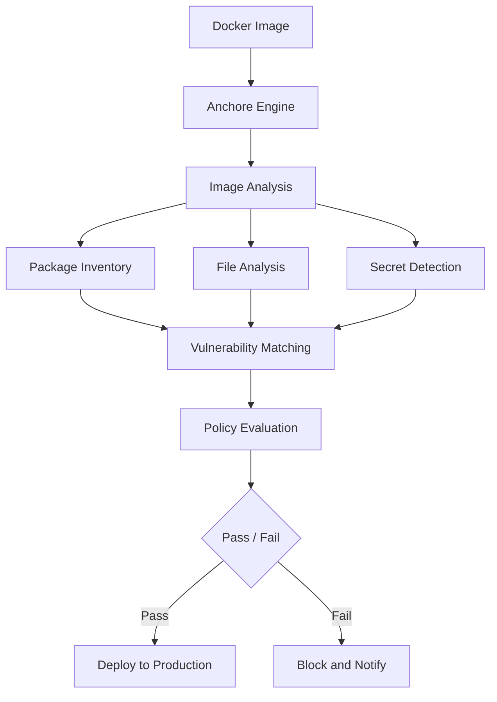

# How to Run Anchore Engine in Docker for Image Compliance

Author: [nawazdhandala](https://github.com/nawazdhandala)

Tags: docker, anchore, image scanning, compliance, vulnerability scanning, container security, DevSecOps

Description: Deploy Anchore Engine in Docker to scan container images for vulnerabilities, enforce compliance policies, and secure your CI/CD pipeline.

---

Container images can carry vulnerabilities, misconfigurations, and compliance violations that propagate across every deployment. Anchore Engine is an open-source tool that scans Docker images against vulnerability databases and custom policy rules. It integrates into CI/CD pipelines to catch problems before they reach production. Running Anchore itself in Docker keeps your scanning infrastructure containerized and easy to manage.

This guide covers deploying Anchore Engine, scanning images, writing custom policies, and integrating it into your build pipeline.

## How Anchore Engine Works

Anchore Engine pulls a container image, breaks it apart layer by layer, and catalogs everything inside: OS packages, language-specific libraries, configuration files, secrets, and file permissions. It then compares this inventory against vulnerability databases like the National Vulnerability Database (NVD) and distribution-specific advisories.

The policy engine evaluates images against customizable rules. You define what is acceptable and what should fail. For example: no images with critical CVEs, no images running as root, no images based on unsupported OS versions.



## Prerequisites

- Docker Engine 20.10+
- Docker Compose v2
- At least 4 GB RAM available
- 20 GB free disk space (vulnerability databases are large)

## Deploying Anchore Engine

Anchore Engine consists of several microservices: the API, a catalog service, a policy engine, analyzers, and a PostgreSQL database.

```yaml
# docker-compose.yml - Anchore Engine deployment
version: "3.8"

services:
  anchore-db:
    image: postgres:13-alpine
    container_name: anchore-db
    environment:
      POSTGRES_PASSWORD: anchore-db-pass
      POSTGRES_USER: anchore
      POSTGRES_DB: anchore
    volumes:
      - anchore_db:/var/lib/postgresql/data
    networks:
      - anchore-net
    restart: unless-stopped
    healthcheck:
      test: ["CMD-SHELL", "pg_isready -U anchore"]
      interval: 10s
      timeout: 5s
      retries: 5

  anchore-engine:
    image: anchore/anchore-engine:latest
    container_name: anchore-engine
    depends_on:
      anchore-db:
        condition: service_healthy
    ports:
      # Anchore API endpoint
      - "8228:8228"
    environment:
      # Database connection string
      ANCHORE_DB_HOST: anchore-db
      ANCHORE_DB_USER: anchore
      ANCHORE_DB_PASSWORD: anchore-db-pass
      ANCHORE_DB_NAME: anchore
      # Admin credentials for the API
      ANCHORE_ADMIN_PASSWORD: foobar
      # Enable all services in a single container
      ANCHORE_ENABLE_METRICS: "true"
    volumes:
      - anchore_data:/analysis_scratch
    networks:
      - anchore-net
    restart: unless-stopped

volumes:
  anchore_db:
  anchore_data:

networks:
  anchore-net:
    driver: bridge
```

Start the engine and wait for vulnerability database synchronization.

```bash
# Start Anchore Engine
docker compose up -d

# Watch the logs during initial startup
docker compose logs -f anchore-engine
```

The first startup takes 10 to 20 minutes because Anchore downloads vulnerability data from NVD, Alpine, Debian, Ubuntu, Red Hat, and other sources. You can check the sync status.

```bash
# Install the Anchore CLI
pip install anchorecli

# Set connection variables
export ANCHORE_CLI_URL=http://localhost:8228/v1
export ANCHORE_CLI_USER=admin
export ANCHORE_CLI_PASS=foobar

# Check feed sync status
anchore-cli system feeds list

# Wait until all feeds show a recent sync date before scanning
anchore-cli system wait
```

## Scanning Your First Image

Once the feeds are synchronized, add an image for analysis.

```bash
# Add an image to Anchore for scanning
anchore-cli image add docker.io/library/nginx:latest

# Check the analysis status
anchore-cli image get docker.io/library/nginx:latest

# Wait for analysis to complete
anchore-cli image wait docker.io/library/nginx:latest

# View discovered vulnerabilities
anchore-cli image vuln docker.io/library/nginx:latest os

# View all vulnerability types including libraries
anchore-cli image vuln docker.io/library/nginx:latest all
```

You can also use the REST API directly.

```bash
# Add an image via the API
curl -X POST http://localhost:8228/v1/images \
  -u admin:foobar \
  -H "Content-Type: application/json" \
  -d '{"tag": "docker.io/library/python:3.11-slim"}'

# Get vulnerability listing
curl http://localhost:8228/v1/images/docker.io/library/python:3.11-slim/vuln/all \
  -u admin:foobar | python3 -m json.tool
```

## Understanding Scan Results

Anchore categorizes vulnerabilities by severity: Critical, High, Medium, Low, and Negligible. Each finding includes the CVE identifier, affected package, installed version, and the fixed version if a patch is available.

```bash
# Get a count of vulnerabilities by severity
anchore-cli image vuln docker.io/library/nginx:latest all \
  | awk '{print $3}' | sort | uniq -c | sort -rn

# List only Critical and High findings
anchore-cli image vuln docker.io/library/nginx:latest all \
  | grep -E "Critical|High"
```

## Creating Custom Policies

Policies let you define what constitutes an acceptable image. Anchore evaluates images against policies and returns a pass or fail result.

```bash
# Get the current active policy bundle
anchore-cli policy get active --detail > policy.json
```

Edit the policy to add custom rules. Here is an example policy that blocks critical CVEs and images running as root.

```json
{
  "id": "custom-security-policy",
  "name": "Production Security Policy",
  "version": "1.0",
  "policies": [
    {
      "id": "critical-vulns",
      "name": "No Critical Vulnerabilities",
      "rules": [
        {
          "gate": "vulnerabilities",
          "trigger": "package",
          "action": "stop",
          "params": [
            {"name": "severity", "value": "critical"},
            {"name": "fix_available", "value": "true"}
          ]
        },
        {
          "gate": "vulnerabilities",
          "trigger": "package",
          "action": "warn",
          "params": [
            {"name": "severity", "value": "high"}
          ]
        }
      ]
    },
    {
      "id": "dockerfile-checks",
      "name": "Dockerfile Best Practices",
      "rules": [
        {
          "gate": "dockerfile",
          "trigger": "effective_user",
          "action": "stop",
          "params": [
            {"name": "users", "value": "root"},
            {"name": "type", "value": "whitelist"}
          ]
        },
        {
          "gate": "dockerfile",
          "trigger": "instruction",
          "action": "warn",
          "params": [
            {"name": "instruction", "value": "HEALTHCHECK"},
            {"name": "check", "value": "not_exists"}
          ]
        }
      ]
    }
  ]
}
```

Apply the policy.

```bash
# Upload the custom policy
anchore-cli policy add policy.json

# Activate it
anchore-cli policy activate custom-security-policy

# Evaluate an image against the policy
anchore-cli evaluate check docker.io/library/nginx:latest --detail
```

## CI/CD Pipeline Integration

Add Anchore scanning to your build pipeline. Here is an example for GitLab CI.

```yaml
# .gitlab-ci.yml - Anchore scan stage
scan_image:
  stage: security
  image: anchore/engine-cli:latest
  variables:
    ANCHORE_CLI_URL: "http://anchore-engine:8228/v1"
    ANCHORE_CLI_USER: "admin"
    ANCHORE_CLI_PASS: "foobar"
  script:
    # Add the newly built image to Anchore
    - anchore-cli image add ${CI_REGISTRY_IMAGE}:${CI_COMMIT_SHA}
    # Wait for analysis to finish
    - anchore-cli image wait ${CI_REGISTRY_IMAGE}:${CI_COMMIT_SHA}
    # Evaluate against the active policy - this fails the build if the image does not pass
    - anchore-cli evaluate check ${CI_REGISTRY_IMAGE}:${CI_COMMIT_SHA}
  allow_failure: false
```

For GitHub Actions, use the Anchore scan action.

```yaml
# .github/workflows/scan.yml
name: Container Security Scan
on: [push]

jobs:
  anchore-scan:
    runs-on: ubuntu-latest
    steps:
      - uses: actions/checkout@v4

      - name: Build image
        run: docker build -t myapp:${{ github.sha }} .

      - name: Scan with Anchore
        uses: anchore/scan-action@v3
        with:
          image: myapp:${{ github.sha }}
          fail-build: true
          severity-cutoff: high

      - name: Upload SARIF report
        uses: github/codeql-action/upload-sarif@v3
        with:
          sarif_file: results.sarif
```

## Scanning Local Images

You do not always need the full Anchore Engine running. For quick local scans, use Grype, the standalone vulnerability scanner from Anchore.

```bash
# Install Grype
curl -sSfL https://raw.githubusercontent.com/anchore/grype/main/install.sh | sh -s -- -b /usr/local/bin

# Scan a local image
grype docker.io/library/node:18-alpine

# Scan with specific output format
grype docker.io/library/node:18-alpine -o json > scan-results.json

# Fail on critical or high vulnerabilities
grype docker.io/library/node:18-alpine --fail-on high
```

## Maintaining Anchore Engine

```bash
# Update vulnerability databases manually
anchore-cli system feeds sync

# Check system status
anchore-cli system status

# Prune old image analyses to reclaim storage
anchore-cli image del docker.io/library/nginx:1.20

# Back up the database
docker exec anchore-db pg_dump -U anchore anchore > anchore_backup_$(date +%Y%m%d).sql
```

## Conclusion

Anchore Engine in Docker provides automated vulnerability scanning and policy compliance checking for your container images. Deploy it once, connect it to your CI/CD pipeline, and every image gets scanned before it reaches production. Custom policies let you enforce your organization's security requirements consistently across all teams and projects. Whether you use the full engine for centralized scanning or Grype for quick local checks, Anchore gives you visibility into what is inside your container images before attackers find out first.
