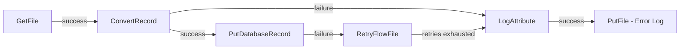

# How to Run Apache NiFi in Docker for Data Flow

Author: [nawazdhandala](https://github.com/nawazdhandala)

Tags: Docker, Apache NiFi, Data Flow, ETL, Data Integration, Docker Compose, Streaming

Description: Deploy Apache NiFi in Docker to build visual data flow pipelines for ingesting, routing, and transforming data between systems.

---

Apache NiFi is a data integration platform built for automating the flow of data between systems. Its drag-and-drop web interface lets you design data pipelines visually, connecting processors that ingest, route, transform, and deliver data. NiFi handles backpressure, data provenance, and error routing out of the box. Running NiFi in Docker simplifies deployment and lets you spin up a fully functional instance in minutes.

## What Makes NiFi Different

While tools like Airflow and Prefect focus on task orchestration, NiFi focuses on data flow. It excels at scenarios where data streams continuously between systems: pulling files from SFTP, reading from message queues, calling REST APIs, writing to databases, and routing data based on content. Every piece of data (called a FlowFile) is tracked through the system, giving you complete provenance and lineage.

NiFi is also built for backpressure. When a downstream system slows down, NiFi automatically throttles the upstream flow instead of dropping data or crashing.

## Quick Start with Docker

Launch NiFi with a single command:

```bash
# Start Apache NiFi with the web UI exposed on port 8443
docker run -d \
  --name nifi \
  -p 8443:8443 \
  -e SINGLE_USER_CREDENTIALS_USERNAME=admin \
  -e SINGLE_USER_CREDENTIALS_PASSWORD=adminpassword123 \
  apache/nifi:latest
```

NiFi takes about 30-60 seconds to start. Once ready, open `https://localhost:8443/nifi` in your browser and log in with the credentials you set.

Note that NiFi uses HTTPS by default. Your browser will show a certificate warning for the self-signed certificate, which is expected for local development.

## Docker Compose Setup

For a production-like configuration with persistent state:

```yaml
# docker-compose.yml - Apache NiFi with persistent storage and ZooKeeper
version: "3.8"

services:
  nifi:
    image: apache/nifi:latest
    container_name: nifi
    ports:
      - "8443:8443"
    environment:
      # Authentication credentials for single-user mode
      SINGLE_USER_CREDENTIALS_USERNAME: admin
      SINGLE_USER_CREDENTIALS_PASSWORD: adminpassword123
      # JVM memory settings
      NIFI_JVM_HEAP_INIT: 1g
      NIFI_JVM_HEAP_MAX: 2g
    volumes:
      # Persist NiFi state across container restarts
      - nifi-conf:/opt/nifi/nifi-current/conf
      - nifi-state:/opt/nifi/nifi-current/state
      - nifi-db:/opt/nifi/nifi-current/database_repository
      - nifi-flowfile:/opt/nifi/nifi-current/flowfile_repository
      - nifi-content:/opt/nifi/nifi-current/content_repository
      - nifi-provenance:/opt/nifi/nifi-current/provenance_repository
      # Mount a directory for file-based data ingestion
      - ./data/input:/data/input
      - ./data/output:/data/output
    restart: unless-stopped
    networks:
      - nifi-net

volumes:
  nifi-conf:
  nifi-state:
  nifi-db:
  nifi-flowfile:
  nifi-content:
  nifi-provenance:

networks:
  nifi-net:
    driver: bridge
```

Start the stack:

```bash
# Launch NiFi with persistent volumes
docker compose up -d

# Watch the startup logs to know when NiFi is ready
docker compose logs -f nifi
```

Look for the message "NiFi has started" in the logs before trying to access the UI.

## NiFi with External Services

Most data flows involve connecting NiFi to databases, message queues, or cloud services. Here is a Docker Compose setup that includes common integration targets:

```yaml
# docker-compose.yml - NiFi with PostgreSQL and Kafka for data integration
version: "3.8"

services:
  nifi:
    image: apache/nifi:latest
    ports:
      - "8443:8443"
    environment:
      SINGLE_USER_CREDENTIALS_USERNAME: admin
      SINGLE_USER_CREDENTIALS_PASSWORD: adminpassword123
      NIFI_JVM_HEAP_INIT: 1g
      NIFI_JVM_HEAP_MAX: 2g
    volumes:
      - nifi-conf:/opt/nifi/nifi-current/conf
      - nifi-state:/opt/nifi/nifi-current/state
      - nifi-db:/opt/nifi/nifi-current/database_repository
      - nifi-flowfile:/opt/nifi/nifi-current/flowfile_repository
      - nifi-content:/opt/nifi/nifi-current/content_repository
      - nifi-provenance:/opt/nifi/nifi-current/provenance_repository
      - ./data:/data
      # Mount custom NAR files (NiFi plugins)
      - ./nars:/opt/nifi/nifi-current/extensions
    networks:
      - nifi-net

  postgres:
    image: postgres:16
    environment:
      POSTGRES_DB: analytics
      POSTGRES_USER: nifi
      POSTGRES_PASSWORD: nifipass
    volumes:
      - pgdata:/var/lib/postgresql/data
      - ./sql/init.sql:/docker-entrypoint-initdb.d/init.sql
    ports:
      - "5432:5432"
    networks:
      - nifi-net

  kafka:
    image: confluentinc/cp-kafka:7.5.3
    environment:
      KAFKA_NODE_ID: 1
      KAFKA_LISTENER_SECURITY_PROTOCOL_MAP: CONTROLLER:PLAINTEXT,PLAINTEXT:PLAINTEXT
      KAFKA_ADVERTISED_LISTENERS: PLAINTEXT://kafka:9092
      KAFKA_PROCESS_ROLES: broker,controller
      KAFKA_CONTROLLER_QUORUM_VOTERS: 1@kafka:29093
      KAFKA_LISTENERS: PLAINTEXT://kafka:9092,CONTROLLER://kafka:29093
      KAFKA_CONTROLLER_LISTENER_NAMES: CONTROLLER
      KAFKA_OFFSETS_TOPIC_REPLICATION_FACTOR: 1
      CLUSTER_ID: MkU3OEVBNTcwNTJENDM2Qk
    ports:
      - "9092:9092"
    networks:
      - nifi-net

volumes:
  nifi-conf:
  nifi-state:
  nifi-db:
  nifi-flowfile:
  nifi-content:
  nifi-provenance:
  pgdata:

networks:
  nifi-net:
    driver: bridge
```

## Building a Data Flow with the NiFi API

While the web UI is great for visual design, you can also manage flows programmatically through NiFi's REST API. Here is a script that creates a simple file-based ETL flow:

```bash
#!/bin/bash
# scripts/create-flow.sh - Create a basic file ingestion flow via the NiFi API

NIFI_URL="https://localhost:8443"
USERNAME="admin"
PASSWORD="adminpassword123"

# Get an access token for API authentication
TOKEN=$(curl -sk -X POST "${NIFI_URL}/nifi-api/access/token" \
  -d "username=${USERNAME}&password=${PASSWORD}")

# Get the root process group ID
ROOT_PG=$(curl -sk -H "Authorization: Bearer ${TOKEN}" \
  "${NIFI_URL}/nifi-api/flow/process-groups/root" | jq -r '.processGroupFlow.id')

echo "Root Process Group: ${ROOT_PG}"

# Create a GetFile processor to read files from the input directory
curl -sk -X POST "${NIFI_URL}/nifi-api/process-groups/${ROOT_PG}/processors" \
  -H "Authorization: Bearer ${TOKEN}" \
  -H "Content-Type: application/json" \
  -d '{
    "revision": {"version": 0},
    "component": {
      "type": "org.apache.nifi.processors.standard.GetFile",
      "name": "Read Input Files",
      "config": {
        "properties": {
          "Input Directory": "/data/input",
          "Keep Source File": "false"
        },
        "autoTerminatedRelationships": []
      },
      "position": {"x": 200, "y": 200}
    }
  }'

echo "Flow created. Open the NiFi UI to connect processors."
```

## Common Data Flow Patterns

Here are typical patterns you can build in NiFi:

**File Ingestion to Database:** GetFile reads files from a directory. SplitText breaks them into individual records. ConvertRecord transforms CSV to JSON. PutDatabaseRecord writes to PostgreSQL.

**API Polling to Kafka:** InvokeHTTP calls a REST API on a schedule. EvaluateJsonPath extracts relevant fields. PublishKafka sends records to a Kafka topic.

**Database CDC to File:** QueryDatabaseTable incrementally reads new rows. ConvertAvroToJSON transforms the records. PutFile writes JSON files to an output directory.

**Error Routing:** Every processor in NiFi has relationship outputs (success, failure, retry). Route failures to a separate queue for manual inspection or automatic retry:



## NiFi Registry for Version Control

Use NiFi Registry to version control your flows:

```yaml
# Add to docker-compose.yml - NiFi Registry for flow version control
  nifi-registry:
    image: apache/nifi-registry:latest
    ports:
      - "18080:18080"
    volumes:
      - nifi-registry-data:/opt/nifi-registry/nifi-registry-current/database
      - nifi-registry-flow:/opt/nifi-registry/nifi-registry-current/flow_storage
    networks:
      - nifi-net
```

Connect NiFi to the Registry through the NiFi UI under Controller Settings > Registry Clients.

## Performance Tuning

Optimize NiFi for your workload:

```yaml
# Environment variables for NiFi performance tuning
environment:
  # Increase JVM heap for large data volumes
  NIFI_JVM_HEAP_INIT: 2g
  NIFI_JVM_HEAP_MAX: 4g
  # Increase the number of threads for concurrent processing
  NIFI_WEB_THREADS: 200
```

For high-throughput scenarios, tune these NiFi properties:

```properties
# nifi.properties overrides for high throughput
nifi.queue.backpressure.count=100000
nifi.queue.backpressure.size=1 GB
nifi.content.repository.implementation=org.apache.nifi.controller.repository.FileSystemRepository
nifi.provenance.repository.max.storage.time=24 hours
nifi.provenance.repository.max.storage.size=1 GB
```

## Monitoring NiFi Health

Check NiFi system diagnostics:

```bash
# Query NiFi system diagnostics via the API
curl -sk -H "Authorization: Bearer ${TOKEN}" \
  "${NIFI_URL}/nifi-api/system-diagnostics" | jq '.systemDiagnostics.aggregateSnapshot'
```

Monitor bulletin board for errors:

```bash
# Check for error bulletins in the last hour
curl -sk -H "Authorization: Bearer ${TOKEN}" \
  "${NIFI_URL}/nifi-api/flow/bulletin-board" | jq '.bulletinBoard.bulletins'
```

## Wrapping Up

Apache NiFi in Docker provides a visual, drag-and-drop data integration platform that handles the complexities of data routing, transformation, and delivery. Its built-in backpressure, data provenance, and error handling make it well-suited for production data flows. Docker Compose packages NiFi with its dependencies into a reproducible stack, and persistent volumes ensure your flow definitions and data survive container restarts. For teams that need to move data between many systems reliably, NiFi is a powerful addition to the toolchain.
