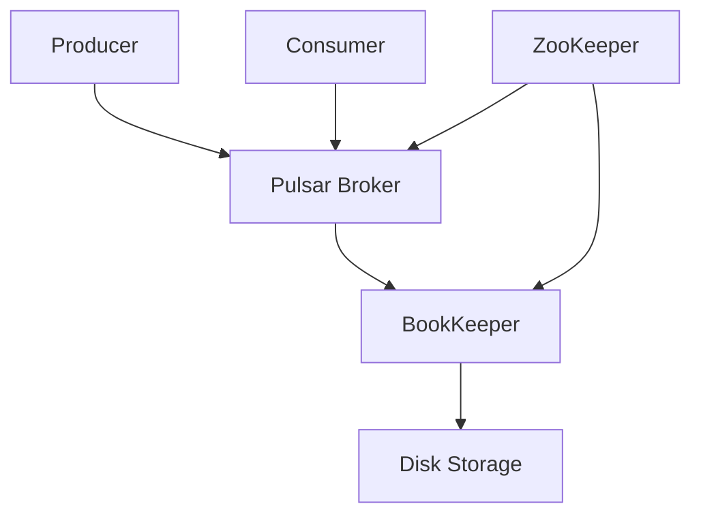

# How to Run Apache Pulsar in Docker

Author: [nawazdhandala](https://github.com/nawazdhandala)

Tags: Docker, Apache Pulsar, Message Queues, Streaming, Pub/Sub, DevOps

Description: Deploy Apache Pulsar in Docker for local development with topics, subscriptions, and multi-tenant messaging configurations.

---

Apache Pulsar is a distributed messaging and streaming platform originally developed at Yahoo. It combines the best features of traditional message queues and pub/sub systems into a single platform. Pulsar supports multi-tenancy, geo-replication, and tiered storage out of the box, making it a strong choice for organizations that need flexible messaging at scale.

Running Pulsar in Docker is the fastest way to get started with local development and testing without installing Java, ZooKeeper, or BookKeeper manually.

## Pulsar Architecture Basics

Pulsar separates message serving from message storage. Brokers handle producer and consumer connections while BookKeeper stores the actual messages. ZooKeeper manages metadata and coordination. In standalone mode, all three components run inside a single process, which is perfect for development.



## Running Pulsar Standalone in Docker

The standalone mode bundles everything into one container. Start here for local development.

```bash
# Run Pulsar standalone with persistent data
docker run -d \
  --name pulsar \
  -p 6650:6650 \
  -p 8080:8080 \
  -v pulsar_data:/pulsar/data \
  apachepulsar/pulsar:3.3.0 \
  bin/pulsar standalone
```

Port 6650 is the binary protocol port for producers and consumers. Port 8080 is the REST API and admin interface.

Verify Pulsar is running:

```bash
# Check the cluster status through the admin API
docker exec pulsar bin/pulsar-admin clusters list

# Create a test topic and produce a message
docker exec pulsar bin/pulsar-client produce my-topic --messages "Hello Pulsar"

# Consume the message
docker exec pulsar bin/pulsar-client consume my-topic -s "test-sub" -n 1
```

## Docker Compose Setup

For a more manageable setup, use Docker Compose:

```yaml
# docker-compose.yml - Pulsar standalone for development
version: "3.8"

services:
  pulsar:
    image: apachepulsar/pulsar:3.3.0
    command: bin/pulsar standalone
    ports:
      # Binary protocol port for client connections
      - "6650:6650"
      # HTTP port for admin API and REST endpoints
      - "8080:8080"
    volumes:
      # Persist topic data and metadata
      - pulsar_data:/pulsar/data
      # Persist configuration
      - pulsar_conf:/pulsar/conf
    environment:
      # Set JVM memory limits to prevent container OOM
      PULSAR_MEM: "-Xms256m -Xmx512m"
    healthcheck:
      test: ["CMD", "bin/pulsar-admin", "brokers", "healthcheck"]
      interval: 30s
      timeout: 10s
      retries: 5
      start_period: 30s
    restart: unless-stopped

volumes:
  pulsar_data:
  pulsar_conf:
```

## Adding Pulsar Manager (Web UI)

Pulsar Manager provides a web interface for managing topics, namespaces, and tenants:

```yaml
# docker-compose.yml - Pulsar with Manager UI
version: "3.8"

services:
  pulsar:
    image: apachepulsar/pulsar:3.3.0
    command: bin/pulsar standalone
    ports:
      - "6650:6650"
      - "8080:8080"
    volumes:
      - pulsar_data:/pulsar/data
    environment:
      PULSAR_MEM: "-Xms256m -Xmx512m"
    healthcheck:
      test: ["CMD", "bin/pulsar-admin", "brokers", "healthcheck"]
      interval: 30s
      timeout: 10s
      retries: 5
      start_period: 30s

  pulsar-manager:
    image: apachepulsar/pulsar-manager:latest
    ports:
      # Web UI port
      - "9527:9527"
      # Backend API port
      - "7750:7750"
    environment:
      SPRING_CONFIGURATION_FILE: /pulsar-manager/pulsar-manager/application.properties
    depends_on:
      pulsar:
        condition: service_healthy

volumes:
  pulsar_data:
```

After starting the stack, initialize the Pulsar Manager admin account:

```bash
# Create the initial admin user for Pulsar Manager
curl -X PUT http://localhost:7750/pulsar-manager/users/superuser \
  -H "Content-Type: application/json" \
  -d '{"name": "admin", "password": "apachepulsar", "description": "Admin user", "email": "admin@example.com"}'
```

Then open `http://localhost:9527` and log in with `admin` / `apachepulsar`.

## Working with Topics and Subscriptions

Pulsar organizes topics under tenants and namespaces. Here is how to create and manage them:

```bash
# Create a new tenant
docker exec pulsar bin/pulsar-admin tenants create my-company \
  --admin-roles admin \
  --allowed-clusters standalone

# Create a namespace within the tenant
docker exec pulsar bin/pulsar-admin namespaces create my-company/events

# Set retention policy: keep messages for 7 days or up to 1GB
docker exec pulsar bin/pulsar-admin namespaces set-retention my-company/events \
  --size 1G \
  --time 7d

# Create a partitioned topic with 4 partitions for parallel consumption
docker exec pulsar bin/pulsar-admin topics create-partitioned-topic \
  persistent://my-company/events/orders \
  --partitions 4

# List all topics in the namespace
docker exec pulsar bin/pulsar-admin topics list my-company/events
```

## Python Producer and Consumer Example

Install the Pulsar Python client and test message flow:

```python
# producer.py - Send messages to a Pulsar topic
import pulsar

# Connect to the Pulsar broker
client = pulsar.Client('pulsar://localhost:6650')

# Create a producer for the orders topic
producer = client.create_producer('persistent://my-company/events/orders')

# Send 100 test messages
for i in range(100):
    message = f'{{"order_id": {i}, "amount": {i * 10.5}}}'
    producer.send(message.encode('utf-8'))
    print(f'Sent: {message}')

# Clean up resources
producer.close()
client.close()
```

```python
# consumer.py - Receive messages from a Pulsar topic
import pulsar

client = pulsar.Client('pulsar://localhost:6650')

# Subscribe to the orders topic with a shared subscription
# Shared subscriptions allow multiple consumers to process in parallel
consumer = client.subscribe(
    'persistent://my-company/events/orders',
    subscription_name='order-processor',
    consumer_type=pulsar.ConsumerType.Shared
)

# Process messages in a loop
while True:
    msg = consumer.receive(timeout_millis=5000)
    try:
        data = msg.data().decode('utf-8')
        print(f'Received: {data}')
        # Acknowledge successful processing
        consumer.acknowledge(msg)
    except Exception as e:
        # Negative acknowledge triggers redelivery
        consumer.negative_acknowledge(msg)
        print(f'Error processing message: {e}')
```

## Full Cluster Setup for Integration Testing

When you need a setup closer to production, deploy separate components:

```yaml
# docker-compose-cluster.yml - Multi-node Pulsar cluster
version: "3.8"

services:
  zookeeper:
    image: apachepulsar/pulsar:3.3.0
    command: bin/pulsar zookeeper
    ports:
      - "2181:2181"
    volumes:
      - zk_data:/pulsar/data/zookeeper
    environment:
      PULSAR_MEM: "-Xms128m -Xmx256m"

  init-cluster:
    image: apachepulsar/pulsar:3.3.0
    command: >
      bin/pulsar initialize-cluster-metadata
        --cluster docker-cluster
        --zookeeper zookeeper:2181
        --configuration-store zookeeper:2181
        --web-service-url http://broker:8080
        --broker-service-url pulsar://broker:6650
    depends_on:
      - zookeeper

  bookkeeper:
    image: apachepulsar/pulsar:3.3.0
    command: bin/bookkeeper bookie
    ports:
      - "3181:3181"
    environment:
      clusterName: docker-cluster
      zkServers: zookeeper:2181
      PULSAR_MEM: "-Xms256m -Xmx512m"
    volumes:
      - bk_data:/pulsar/data/bookkeeper
    depends_on:
      - zookeeper
      - init-cluster

  broker:
    image: apachepulsar/pulsar:3.3.0
    command: bin/pulsar broker
    ports:
      - "6650:6650"
      - "8080:8080"
    environment:
      zookeeperServers: zookeeper:2181
      configurationStoreServers: zookeeper:2181
      clusterName: docker-cluster
      managedLedgerDefaultEnsembleSize: 1
      managedLedgerDefaultWriteQuorum: 1
      managedLedgerDefaultAckQuorum: 1
      PULSAR_MEM: "-Xms256m -Xmx512m"
    depends_on:
      - zookeeper
      - bookkeeper

volumes:
  zk_data:
  bk_data:
```

## Useful Admin Commands

```bash
# Check broker health and load
docker exec pulsar bin/pulsar-admin brokers healthcheck

# View topic statistics including message rates
docker exec pulsar bin/pulsar-admin topics stats persistent://my-company/events/orders

# View subscription backlog (unprocessed messages)
docker exec pulsar bin/pulsar-admin topics stats-internal persistent://my-company/events/orders

# Peek at messages without consuming them
docker exec pulsar bin/pulsar-admin topics peek-messages \
  persistent://my-company/events/orders \
  -s order-processor -n 5

# Skip all backlog messages for a subscription
docker exec pulsar bin/pulsar-admin topics skip-all \
  persistent://my-company/events/orders \
  -s order-processor
```

## Summary

Apache Pulsar in Docker gives you a powerful messaging platform for local development and testing. The standalone mode makes it easy to get started, while the multi-node cluster configuration lets you test closer to production conditions. Pulsar's multi-tenancy model with tenants and namespaces is useful for organizing topics by team or application, and its flexible subscription types support both queuing and pub/sub patterns. Start with the standalone Docker Compose setup and expand to the cluster mode when your testing requirements grow.
