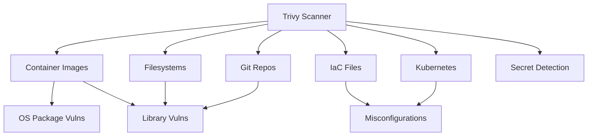

# How to Run Aqua Security Scanner in Docker

Author: [nawazdhandala](https://github.com/nawazdhandala)

Tags: docker, aqua security, trivy, container scanning, vulnerability detection, DevSecOps, security

Description: Use Aqua Security's Trivy scanner in Docker to detect vulnerabilities in container images, filesystems, and infrastructure as code.

---

Container security starts with knowing what vulnerabilities exist in your images before they reach production. Aqua Security produces Trivy, a comprehensive open-source vulnerability scanner that has become the industry standard for container image scanning. Trivy detects vulnerabilities in OS packages, language-specific dependencies, IaC misconfigurations, and even exposed secrets. Running it in Docker means you can scan anywhere without installing anything on the host.

This guide covers using Trivy in Docker for various scanning scenarios, integrating it into CI/CD pipelines, and configuring it for your security requirements.

## What Trivy Scans

Trivy is not just an image scanner. It handles multiple target types:

- **Container images** - OS packages and application dependencies
- **Filesystems** - scan your project directory for vulnerable libraries
- **Git repositories** - scan a remote repo without cloning
- **Kubernetes** - scan cluster configurations for misconfigurations
- **Infrastructure as Code** - Terraform, CloudFormation, Dockerfiles, Helm charts
- **SBOM** - generate and scan Software Bills of Materials

It checks against multiple vulnerability databases including NVD, Red Hat, Debian, Ubuntu, Alpine, and language-specific advisories for Python, Node.js, Go, Java, Ruby, Rust, and PHP.



## Quick Start: Scanning an Image

Pull an image through Docker and scan it immediately.

```bash
# Scan a public image for vulnerabilities
docker run --rm aquasec/trivy:latest image nginx:latest

# Scan with only high and critical severity results
docker run --rm aquasec/trivy:latest image --severity HIGH,CRITICAL nginx:latest

# Scan and output in JSON format for processing
docker run --rm aquasec/trivy:latest image --format json nginx:latest > scan-results.json
```

## Scanning Local Images

To scan images that exist on your local Docker daemon, mount the Docker socket.

```bash
# Scan a locally built image
docker run --rm \
  -v /var/run/docker.sock:/var/run/docker.sock \
  aquasec/trivy:latest image myapp:latest

# Scan a local image and fail if critical vulnerabilities are found
docker run --rm \
  -v /var/run/docker.sock:/var/run/docker.sock \
  aquasec/trivy:latest image \
  --exit-code 1 \
  --severity CRITICAL \
  myapp:latest
```

## Caching the Vulnerability Database

Trivy downloads the vulnerability database on every run by default. For repeated scans, cache the database locally to speed things up.

```bash
# Create a persistent cache directory
mkdir -p ~/trivy-cache

# Scan with a persistent cache - subsequent scans will be much faster
docker run --rm \
  -v ~/trivy-cache:/root/.cache/trivy \
  -v /var/run/docker.sock:/var/run/docker.sock \
  aquasec/trivy:latest image python:3.11-slim
```

## Scanning Filesystems and Projects

Scan your project directory for vulnerable dependencies without building an image first.

```bash
# Scan a Node.js project for vulnerable npm packages
docker run --rm \
  -v $(pwd):/project \
  aquasec/trivy:latest fs /project

# Scan a Python project
docker run --rm \
  -v $(pwd):/project \
  aquasec/trivy:latest fs \
  --scanners vuln \
  /project

# Scan only specific file types
docker run --rm \
  -v $(pwd):/project \
  aquasec/trivy:latest fs \
  --scanners vuln \
  --skip-dirs node_modules \
  /project
```

## Infrastructure as Code Scanning

Trivy can catch misconfigurations in your Terraform, Dockerfiles, and Kubernetes manifests.

```bash
# Scan Terraform files for misconfigurations
docker run --rm \
  -v $(pwd)/terraform:/iac \
  aquasec/trivy:latest config /iac

# Scan a Dockerfile for best practice violations
docker run --rm \
  -v $(pwd):/project \
  aquasec/trivy:latest config \
  --file-patterns "dockerfile:Dockerfile*" \
  /project

# Scan Kubernetes manifests
docker run --rm \
  -v $(pwd)/k8s:/manifests \
  aquasec/trivy:latest config /manifests
```

Example output for a Dockerfile scan might flag issues like running as root, using latest tags, or missing health checks.

## Secret Detection

Trivy can find exposed secrets like API keys, passwords, and tokens in your images and filesystems.

```bash
# Scan for secrets in a filesystem
docker run --rm \
  -v $(pwd):/project \
  aquasec/trivy:latest fs \
  --scanners secret \
  /project

# Scan an image for embedded secrets
docker run --rm \
  -v /var/run/docker.sock:/var/run/docker.sock \
  aquasec/trivy:latest image \
  --scanners secret \
  myapp:latest
```

## Generating SBOM Reports

Software Bill of Materials (SBOM) lists every component in your image. This is increasingly required for compliance.

```bash
# Generate an SBOM in CycloneDX format
docker run --rm \
  -v /var/run/docker.sock:/var/run/docker.sock \
  aquasec/trivy:latest image \
  --format cyclonedx \
  nginx:latest > sbom.json

# Generate an SBOM in SPDX format
docker run --rm \
  -v /var/run/docker.sock:/var/run/docker.sock \
  aquasec/trivy:latest image \
  --format spdx-json \
  nginx:latest > sbom-spdx.json

# Scan an existing SBOM for vulnerabilities
docker run --rm \
  -v $(pwd):/data \
  aquasec/trivy:latest sbom /data/sbom.json
```

## CI/CD Pipeline Integration

### GitHub Actions

```yaml
# .github/workflows/trivy.yml
name: Container Security Scan
on:
  push:
    branches: [main]
  pull_request:
    branches: [main]

jobs:
  trivy-scan:
    runs-on: ubuntu-latest
    steps:
      - uses: actions/checkout@v4

      - name: Build image
        run: docker build -t myapp:${{ github.sha }} .

      - name: Run Trivy vulnerability scanner
        uses: aquasecurity/trivy-action@master
        with:
          image-ref: myapp:${{ github.sha }}
          format: sarif
          output: trivy-results.sarif
          severity: CRITICAL,HIGH
          exit-code: 1

      - name: Upload scan results to GitHub Security
        uses: github/codeql-action/upload-sarif@v3
        if: always()
        with:
          sarif_file: trivy-results.sarif
```

### GitLab CI

```yaml
# .gitlab-ci.yml
container_scan:
  stage: security
  image: docker:latest
  services:
    - docker:dind
  variables:
    DOCKER_TLS_CERTDIR: ""
    TRIVY_CACHE_DIR: ".trivycache/"
  cache:
    paths:
      - .trivycache/
  script:
    # Build the application image
    - docker build -t $CI_REGISTRY_IMAGE:$CI_COMMIT_SHA .
    # Run Trivy scan
    - |
      docker run --rm \
        -v /var/run/docker.sock:/var/run/docker.sock \
        -v $TRIVY_CACHE_DIR:/root/.cache/trivy \
        aquasec/trivy:latest image \
        --exit-code 1 \
        --severity CRITICAL,HIGH \
        --format template \
        --template "@/contrib/gitlab.tpl" \
        $CI_REGISTRY_IMAGE:$CI_COMMIT_SHA > gl-container-scanning-report.json
  artifacts:
    reports:
      container_scanning: gl-container-scanning-report.json
```

### Jenkins Pipeline

```groovy
// Jenkinsfile - Trivy scanning stage
pipeline {
    agent any

    stages {
        stage('Build') {
            steps {
                sh 'docker build -t myapp:${BUILD_NUMBER} .'
            }
        }

        stage('Security Scan') {
            steps {
                // Run Trivy and generate HTML report
                sh '''
                docker run --rm \
                  -v /var/run/docker.sock:/var/run/docker.sock \
                  -v ${WORKSPACE}:/output \
                  aquasec/trivy:latest image \
                  --format template \
                  --template "@/contrib/html.tpl" \
                  --output /output/trivy-report.html \
                  myapp:${BUILD_NUMBER}
                '''
                // Publish the HTML report
                publishHTML(target: [
                    reportName: 'Trivy Scan Report',
                    reportDir: '.',
                    reportFiles: 'trivy-report.html'
                ])

                // Fail the build on critical vulnerabilities
                sh '''
                docker run --rm \
                  -v /var/run/docker.sock:/var/run/docker.sock \
                  aquasec/trivy:latest image \
                  --exit-code 1 \
                  --severity CRITICAL \
                  myapp:${BUILD_NUMBER}
                '''
            }
        }
    }
}
```

## Running Trivy as a Server

For teams that scan frequently, run Trivy as a persistent server to avoid downloading the database on every scan.

```yaml
# docker-compose.yml - Trivy server mode
version: "3.8"

services:
  trivy-server:
    image: aquasec/trivy:latest
    container_name: trivy-server
    ports:
      - "4954:4954"
    volumes:
      - trivy_cache:/root/.cache/trivy
    command: server --listen 0.0.0.0:4954
    restart: unless-stopped

volumes:
  trivy_cache:
```

Then scan using the server from any client.

```bash
# Scan using the Trivy server (no local database needed)
docker run --rm \
  -v /var/run/docker.sock:/var/run/docker.sock \
  aquasec/trivy:latest image \
  --server http://trivy-server:4954 \
  nginx:latest
```

## Custom Ignore Policies

Suppress known false positives or accepted risks with a `.trivyignore` file.

```bash
# .trivyignore - Vulnerabilities to suppress
# Format: CVE-ID

# Accepted risk: low severity, no fix available
CVE-2023-12345

# False positive in our environment
CVE-2023-67890

# Waiting for upstream fix, tracked in JIRA-456
CVE-2024-11111
```

```bash
# Scan with ignore file
docker run --rm \
  -v $(pwd)/.trivyignore:/root/.trivyignore \
  -v /var/run/docker.sock:/var/run/docker.sock \
  aquasec/trivy:latest image myapp:latest
```

## Conclusion

Trivy in Docker provides fast, comprehensive vulnerability scanning without any installation. Scan container images, filesystems, IaC templates, and detect secrets all with a single tool. The Docker-based approach works everywhere, from developer laptops to CI/CD pipelines, with no dependencies beyond Docker itself. Run it as a one-off command for quick checks or as a persistent server for team-wide scanning. Paired with exit codes and CI integration, Trivy becomes the security gate that prevents vulnerable images from reaching production.
