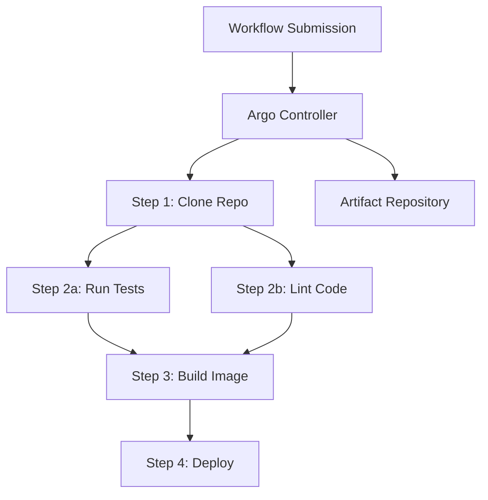

# How to Run Argo Workflows in Docker

Author: [nawazdhandala](https://github.com/nawazdhandala)

Tags: Docker, Argo Workflows, CI/CD, Kubernetes, DevOps, Workflow Orchestration

Description: Set up Argo Workflows with Docker to orchestrate complex CI/CD pipelines, data processing jobs, and multi-step workflows.

---

Argo Workflows is a container-native workflow engine for orchestrating parallel jobs. Each step in a workflow runs as a separate container, making it naturally suited for CI/CD pipelines, data processing, machine learning workflows, and infrastructure automation. While Argo Workflows is designed for Kubernetes, you can run it locally using Docker with a lightweight Kubernetes distribution like k3s for development and testing.

This guide covers setting up Argo Workflows in a Docker-based environment, creating and running workflows, and building practical CI/CD pipelines.

## Architecture

Argo Workflows consists of a controller that manages workflow execution, a server that provides the web UI and API, and an artifact repository for passing data between workflow steps. Each workflow step runs as a Kubernetes pod, with each pod running one or more containers.



## Prerequisites

Since Argo Workflows is a Kubernetes-native tool, we need a lightweight Kubernetes cluster. We will use k3d, which runs k3s (a minimal Kubernetes distribution) inside Docker containers.

```bash
# Install k3d (runs k3s in Docker)
curl -s https://raw.githubusercontent.com/k3d-io/k3d/main/install.sh | bash

# Install kubectl
curl -LO "https://dl.k8s.io/release/$(curl -L -s https://dl.k8s.io/release/stable.txt)/bin/linux/amd64/kubectl"
chmod +x kubectl && sudo mv kubectl /usr/local/bin/

# Install the Argo CLI
curl -sLO https://github.com/argoproj/argo-workflows/releases/download/v3.5.5/argo-linux-amd64.gz
gunzip argo-linux-amd64.gz
chmod +x argo-linux-amd64 && sudo mv argo-linux-amd64 /usr/local/bin/argo
```

## Creating the Kubernetes Cluster

Create a k3d cluster that runs entirely in Docker.

```bash
# Create a k3d cluster with port mappings for the Argo UI
k3d cluster create argo-dev \
  --port "2746:30746@server:0" \
  --port "9000:30900@server:0" \
  --agents 2 \
  --wait

# Verify the cluster is running
kubectl get nodes
```

This creates a Kubernetes cluster running as Docker containers, with two agent nodes for running workflow pods.

## Installing Argo Workflows

Install Argo Workflows into the cluster.

```bash
# Create the argo namespace
kubectl create namespace argo

# Install Argo Workflows
kubectl apply -n argo -f https://github.com/argoproj/argo-workflows/releases/download/v3.5.5/install.yaml

# Wait for the deployment to be ready
kubectl wait --for=condition=available deployment/argo-server -n argo --timeout=120s
kubectl wait --for=condition=available deployment/workflow-controller -n argo --timeout=120s
```

Expose the Argo UI through a NodePort service so we can access it from outside the cluster.

```bash
# Patch the argo-server service to use NodePort
kubectl patch svc argo-server -n argo -p '{"spec": {"type": "NodePort", "ports": [{"port": 2746, "nodePort": 30746}]}}'

# Set the auth mode to server (simplifies local development)
kubectl patch deployment argo-server -n argo --type='json' \
  -p='[{"op": "replace", "path": "/spec/template/spec/containers/0/args", "value": ["server", "--auth-mode=server"]}]'
```

Access the Argo UI at `https://localhost:2746`. Accept the self-signed certificate warning.

## Your First Workflow

Create a simple workflow to verify everything works.

```yaml
# hello-world.yaml - Simple Argo workflow
apiVersion: argoproj.io/v1alpha1
kind: Workflow
metadata:
  generateName: hello-world-
  namespace: argo
spec:
  entrypoint: say-hello
  templates:
    - name: say-hello
      container:
        image: alpine:3.19
        command: ["echo"]
        args: ["Hello from Argo Workflows running in Docker!"]
```

Submit and watch the workflow.

```bash
# Submit the workflow
argo submit -n argo hello-world.yaml --watch

# Or use kubectl
kubectl apply -f hello-world.yaml
```

## Multi-Step CI/CD Pipeline

Here is a realistic CI/CD pipeline workflow with parallel steps, artifact passing, and conditional execution.

```yaml
# ci-pipeline.yaml - Multi-step CI/CD workflow
apiVersion: argoproj.io/v1alpha1
kind: Workflow
metadata:
  generateName: ci-pipeline-
  namespace: argo
spec:
  entrypoint: ci-pipeline
  # Store artifacts in the built-in artifact repository
  artifactRepositoryRef:
    configMap: artifact-repositories
    key: default-v1

  # Input parameters for the pipeline
  arguments:
    parameters:
      - name: repo-url
        value: "https://github.com/your-org/your-app.git"
      - name: branch
        value: "main"
      - name: image-tag
        value: "latest"

  templates:
    # Main pipeline DAG
    - name: ci-pipeline
      dag:
        tasks:
          # Step 1: Clone the repository
          - name: clone
            template: git-clone
            arguments:
              parameters:
                - name: repo-url
                  value: "{{workflow.parameters.repo-url}}"
                - name: branch
                  value: "{{workflow.parameters.branch}}"

          # Step 2a: Run tests (parallel with lint)
          - name: test
            template: run-tests
            depends: "clone"

          # Step 2b: Lint code (parallel with tests)
          - name: lint
            template: run-lint
            depends: "clone"

          # Step 3: Build Docker image (only after tests and lint pass)
          - name: build
            template: docker-build
            depends: "test && lint"
            arguments:
              parameters:
                - name: image-tag
                  value: "{{workflow.parameters.image-tag}}"

    # Template: Clone git repository
    - name: git-clone
      inputs:
        parameters:
          - name: repo-url
          - name: branch
      container:
        image: alpine/git:2.43.0
        command: ["sh", "-c"]
        args:
          - |
            git clone --branch {{inputs.parameters.branch}} \
              --depth 1 {{inputs.parameters.repo-url}} /work/repo
            echo "Cloned successfully"
            ls -la /work/repo
        volumeMounts:
          - name: work
            mountPath: /work

    # Template: Run tests
    - name: run-tests
      container:
        image: node:20-alpine
        command: ["sh", "-c"]
        args:
          - |
            cd /work/repo
            npm ci
            npm test
        volumeMounts:
          - name: work
            mountPath: /work

    # Template: Lint code
    - name: run-lint
      container:
        image: node:20-alpine
        command: ["sh", "-c"]
        args:
          - |
            cd /work/repo
            npm ci
            npm run lint
        volumeMounts:
          - name: work
            mountPath: /work

    # Template: Build Docker image
    - name: docker-build
      inputs:
        parameters:
          - name: image-tag
      container:
        image: gcr.io/kaniko-project/executor:latest
        args:
          - "--context=/work/repo"
          - "--destination=myregistry/myapp:{{inputs.parameters.image-tag}}"
          - "--no-push"
          - "--tarPath=/work/image.tar"
        volumeMounts:
          - name: work
            mountPath: /work

  # Shared volume for passing data between steps
  volumeClaimTemplates:
    - metadata:
        name: work
      spec:
        accessModes: ["ReadWriteOnce"]
        resources:
          requests:
            storage: 1Gi
```

Submit the pipeline.

```bash
# Submit the CI pipeline
argo submit -n argo ci-pipeline.yaml --watch

# List running workflows
argo list -n argo

# Get detailed workflow status
argo get -n argo @latest
```

## Cron Workflows

Schedule workflows to run on a cron schedule, useful for nightly builds or periodic data processing.

```yaml
# nightly-build.yaml - Scheduled workflow
apiVersion: argoproj.io/v1alpha1
kind: CronWorkflow
metadata:
  name: nightly-build
  namespace: argo
spec:
  # Run every night at 2 AM UTC
  schedule: "0 2 * * *"
  timezone: "UTC"
  concurrencyPolicy: "Replace"
  startingDeadlineSeconds: 0
  workflowSpec:
    entrypoint: build
    templates:
      - name: build
        container:
          image: alpine:3.19
          command: ["sh", "-c"]
          args: ["echo 'Running nightly build at $(date)'"]
```

```bash
# Create the cron workflow
kubectl apply -f nightly-build.yaml

# List cron workflows
argo cron list -n argo
```

## Monitoring Workflows

Use the Argo CLI to monitor workflow execution.

```bash
# Watch a workflow in real time
argo watch -n argo @latest

# View workflow logs
argo logs -n argo @latest

# View logs for a specific step
argo logs -n argo @latest --step-name test
```

## Cleanup

```bash
# Delete the k3d cluster (removes all Docker containers)
k3d cluster delete argo-dev
```

## Conclusion

Argo Workflows brings Kubernetes-native workflow orchestration to your Docker-based development environment. Using k3d, you can develop and test complex multi-step pipelines locally before deploying them to production Kubernetes clusters. The DAG-based execution model handles parallelism, dependencies, and retries cleanly. For monitoring the health and performance of your Argo Workflows deployments, [OneUptime](https://oneuptime.com) can track workflow success rates, execution times, and resource utilization.
