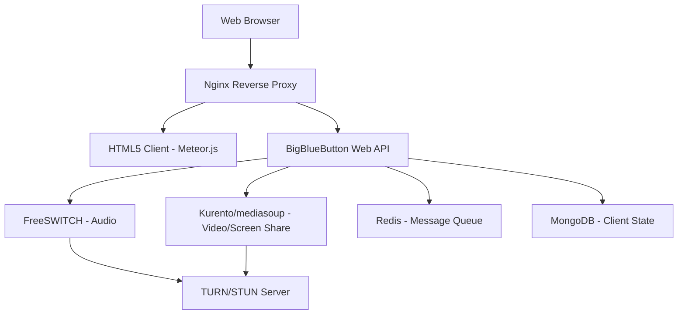

# How to Run BigBlueButton in Docker for Online Learning

Author: [nawazdhandala](https://github.com/nawazdhandala)

Tags: Docker, BigBlueButton, Video Conferencing, Online Learning, WebRTC, Self-Hosted

Description: Deploy BigBlueButton in Docker containers for self-hosted online learning with video conferencing, screen sharing, and whiteboard features.

---

BigBlueButton is an open-source web conferencing system designed specifically for online learning. It provides real-time video, audio, screen sharing, a multi-user whiteboard, breakout rooms, polls, and shared notes. Schools, universities, and training organizations use it as a self-hosted alternative to proprietary platforms like Zoom or Microsoft Teams.

Running BigBlueButton in Docker streamlines what is traditionally a complex installation process. This guide covers the full setup, from container configuration to production-ready deployment.

## Why BigBlueButton?

BigBlueButton was built with education in mind. Unlike general-purpose video conferencing tools, it includes features tailored for teaching: a presentation mode with slide uploads, a multi-user whiteboard for collaborative drawing, breakout rooms for small group work, and built-in polling for instant feedback. The platform also records sessions automatically, producing playback files that students can review later.

## Architecture Overview

BigBlueButton consists of several interconnected components. Understanding this architecture helps when debugging Docker deployments.



The system uses FreeSWITCH for audio processing, Kurento or mediasoup for WebRTC video, Redis for pub/sub messaging, and MongoDB for maintaining client state. Nginx sits in front as a reverse proxy handling SSL termination.

## Prerequisites

BigBlueButton is resource-intensive. Plan for the following:

- A dedicated server with at least 4 CPU cores and 8 GB RAM (16 GB recommended)
- Docker and Docker Compose installed
- A public domain name with DNS configured
- Ports 80, 443, and 16384-32768 (UDP, for WebRTC media) open
- A valid SSL certificate (BigBlueButton requires HTTPS)

## Setting Up with Docker Compose

The BigBlueButton community maintains Docker images that bundle the necessary components. Here is a production-ready Compose file.

```yaml
# docker-compose.yml for BigBlueButton
# This runs all BBB components as separate services with proper networking
version: "3.8"

services:
  # Core BigBlueButton application server
  bbb-web:
    image: bigbluebutton/bbb-web:v2.7
    container_name: bbb-web
    restart: unless-stopped
    environment:
      - DOMAIN=bbb.example.com
      - SHARED_SECRET=your_shared_secret_here
      - TURN_SERVER=turns:turn.example.com:443?transport=tcp
      - TURN_SECRET=your_turn_secret
    ports:
      - "8090:8090"
    volumes:
      - bbb-web-data:/var/bigbluebutton
      - bbb-recordings:/var/bigbluebutton/published
    depends_on:
      - redis
      - mongodb
    networks:
      - bbb-net

  # HTML5 client served to browsers
  bbb-html5:
    image: bigbluebutton/bbb-html5:v2.7
    container_name: bbb-html5
    restart: unless-stopped
    environment:
      - MONGO_URL=mongodb://mongodb:27017/html5client
      - ROOT_URL=https://bbb.example.com/html5client
    depends_on:
      - mongodb
      - redis
    networks:
      - bbb-net

  # FreeSWITCH handles all audio processing
  freeswitch:
    image: bigbluebutton/bbb-freeswitch:v2.7
    container_name: bbb-freeswitch
    restart: unless-stopped
    network_mode: host
    volumes:
      - freeswitch-data:/var/freeswitch/meetings

  # Kurento media server for WebRTC video
  kurento:
    image: kurento/kurento-media-server:6.18
    container_name: bbb-kurento
    restart: unless-stopped
    network_mode: host
    environment:
      - KMS_STUN_IP=stun.l.google.com
      - KMS_STUN_PORT=19302

  # Redis message broker
  redis:
    image: redis:7-alpine
    container_name: bbb-redis
    restart: unless-stopped
    volumes:
      - redis-data:/data
    networks:
      - bbb-net

  # MongoDB for HTML5 client state
  mongodb:
    image: mongo:5.0
    container_name: bbb-mongodb
    restart: unless-stopped
    volumes:
      - mongodb-data:/data/db
    networks:
      - bbb-net

  # Nginx reverse proxy with SSL
  nginx:
    image: nginx:alpine
    container_name: bbb-nginx
    restart: unless-stopped
    ports:
      - "80:80"
      - "443:443"
    volumes:
      - ./nginx.conf:/etc/nginx/conf.d/default.conf:ro
      - ./certs:/etc/nginx/certs:ro
    depends_on:
      - bbb-web
      - bbb-html5
    networks:
      - bbb-net

volumes:
  bbb-web-data:
  bbb-recordings:
  freeswitch-data:
  redis-data:
  mongodb-data:

networks:
  bbb-net:
    driver: bridge
```

## Nginx Configuration

Create an nginx.conf file that routes traffic to the correct BigBlueButton services.

```nginx
# nginx.conf - Reverse proxy configuration for BigBlueButton
# Handles SSL termination and routes requests to backend services

server {
    listen 80;
    server_name bbb.example.com;
    # Redirect all HTTP traffic to HTTPS
    return 301 https://$server_name$request_uri;
}

server {
    listen 443 ssl http2;
    server_name bbb.example.com;

    ssl_certificate /etc/nginx/certs/fullchain.pem;
    ssl_certificate_key /etc/nginx/certs/privkey.pem;
    ssl_protocols TLSv1.2 TLSv1.3;

    # BigBlueButton API endpoints
    location /bigbluebutton {
        proxy_pass http://bbb-web:8090;
        proxy_set_header Host $host;
        proxy_set_header X-Real-IP $remote_addr;
        proxy_set_header X-Forwarded-For $proxy_add_x_forwarded_for;
        proxy_set_header X-Forwarded-Proto $scheme;
    }

    # HTML5 client
    location /html5client {
        proxy_pass http://bbb-html5:3000;
        proxy_http_version 1.1;
        proxy_set_header Upgrade $http_upgrade;
        proxy_set_header Connection "upgrade";
        proxy_set_header Host $host;
    }

    # WebSocket connections for real-time communication
    location /bbb-webrtc-sfu {
        proxy_pass http://bbb-html5:3008;
        proxy_http_version 1.1;
        proxy_set_header Upgrade $http_upgrade;
        proxy_set_header Connection "upgrade";
    }

    # Serve recorded sessions
    location /playback {
        alias /var/bigbluebutton/published;
        autoindex off;
    }
}
```

## Generating the Shared Secret

BigBlueButton uses a shared secret for API authentication. Generate a strong one before starting your deployment.

```bash
# Generate a random 32-character shared secret for the BBB API
openssl rand -hex 16
```

Replace `your_shared_secret_here` in the Compose file with the generated value.

## Starting the Deployment

```bash
# Launch all BigBlueButton services in detached mode
docker compose up -d

# Watch the logs to verify everything starts correctly
docker compose logs -f bbb-web bbb-html5

# Check the status of all containers
docker compose ps
```

## Setting Up a TURN Server

WebRTC connections sometimes fail when users are behind restrictive firewalls. A TURN server relays media traffic in those cases. You can run coturn alongside BigBlueButton.

```yaml
  # Add this service to your docker-compose.yml
  # coturn provides TURN/STUN relay for users behind NAT
  coturn:
    image: coturn/coturn:latest
    container_name: bbb-coturn
    restart: unless-stopped
    network_mode: host
    volumes:
      - ./turnserver.conf:/etc/turnserver.conf:ro
    command: -c /etc/turnserver.conf
```

Create the turnserver.conf file with the following settings.

```bash
# turnserver.conf - TURN server configuration for BigBlueButton
# Handles NAT traversal for WebRTC connections

listening-port=3478
tls-listening-port=443
alt-listening-port=0
alt-tls-listening-port=0

# Use your public IP address here
external-ip=YOUR_PUBLIC_IP

# Realm must match your domain
realm=bbb.example.com

# Authentication credentials
use-auth-secret
static-auth-secret=your_turn_secret

# Certificate paths (mount these into the container)
cert=/etc/turnserver/fullchain.pem
pkey=/etc/turnserver/privkey.pem

# Logging
log-file=stdout
verbose
```

## API Integration

BigBlueButton exposes a REST API for creating and managing meetings programmatically. You can integrate it with your learning management system or custom application.

```bash
# Create a meeting using the BigBlueButton API
# The checksum is calculated from the API call parameters and shared secret
BBB_SECRET="your_shared_secret_here"
BBB_URL="https://bbb.example.com/bigbluebutton/api"

# Calculate the checksum for the create call
CALL="createname=Test+Meeting&meetingID=test001&attendeePW=ap&moderatorPW=mp"
CHECKSUM=$(echo -n "${CALL}${BBB_SECRET}" | sha1sum | awk '{print $1}')

# Create the meeting
curl "${BBB_URL}/create?name=Test+Meeting&meetingID=test001&attendeePW=ap&moderatorPW=mp&checksum=${CHECKSUM}"
```

## Managing Recordings

BigBlueButton records sessions automatically when configured. Recordings are stored in the published volume.

```bash
# List all recordings in the container
docker exec bbb-web ls -la /var/bigbluebutton/published/

# Check recording processing status
docker exec bbb-web bbb-record --list

# Delete old recordings to free disk space (older than 30 days)
docker exec bbb-web find /var/bigbluebutton/published -maxdepth 1 -mtime +30 -exec rm -rf {} \;
```

## Performance Tuning

BigBlueButton benefits from specific system-level tuning. Apply these settings on your Docker host.

```bash
# Increase the maximum number of open files for media handling
echo "* soft nofile 65536" >> /etc/security/limits.conf
echo "* hard nofile 65536" >> /etc/security/limits.conf

# Optimize network buffers for WebRTC traffic
sysctl -w net.core.rmem_max=16777216
sysctl -w net.core.wmem_max=16777216
sysctl -w net.core.rmem_default=1048576
sysctl -w net.core.wmem_default=1048576
```

## Health Checks and Monitoring

Add health checks to your Compose file to automatically restart failed services.

```yaml
    # Health check for the BigBlueButton web API
    healthcheck:
      test: ["CMD", "curl", "-f", "http://localhost:8090/bigbluebutton/api"]
      interval: 30s
      timeout: 10s
      retries: 5
      start_period: 60s
```

For ongoing monitoring, integrate with tools like OneUptime to track server health, meeting counts, and user capacity. Set up alerts for high CPU usage, which indicates the media servers are under pressure.

## Production Checklist

Before going live, run through these items. Change all default passwords and secrets. Enable SSL with a valid certificate from Let's Encrypt or your CA. Configure firewall rules to allow only the required ports. Set up log rotation so disk space does not fill up. Test with multiple concurrent users to verify your server can handle the expected load. Configure automatic backups for the MongoDB and recording volumes.

BigBlueButton in Docker gives you a fully featured online learning platform that you control. The containerized setup makes upgrades manageable, and the modular architecture lets you scale individual components as your user base grows.
