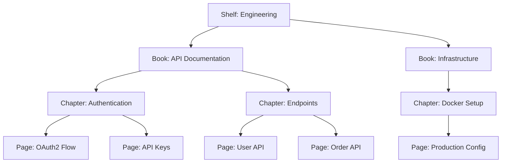

# How to Run Bookstack in Docker for Documentation

Author: [nawazdhandala](https://github.com/nawazdhandala)

Tags: docker, bookstack, documentation, wiki, self-hosted, knowledge-management

Description: Set up BookStack in Docker as a self-hosted documentation platform with organized shelves, books, chapters, and pages.

---

BookStack is a self-hosted documentation platform that organizes content into a clear hierarchy of shelves, books, chapters, and pages. This structure mirrors how physical libraries work, making it intuitive for anyone who needs to find or contribute documentation. Docker deployment gets BookStack running quickly with a MariaDB backend and persistent storage for all your content.

## Why BookStack?

Documentation tools range from simple wikis to complex content management systems. BookStack sits in a sweet spot. It is more organized than a flat wiki because content lives in a defined hierarchy. It is simpler than Confluence because it does not try to be a project management tool. The editor supports both WYSIWYG and Markdown modes, image uploads work out of the box, and full-text search helps you find anything quickly.

## Content Hierarchy

BookStack organizes documentation in four levels:



Shelves contain books. Books contain chapters. Chapters contain pages. You can also put pages directly in books without chapters for simpler documentation.

## Prerequisites

- A Linux server with Docker and Docker Compose installed
- At least 1 GB of RAM
- A domain name if you want external access
- Optional: an SMTP server for email notifications

## Project Setup

```bash
# Create the BookStack project directory
mkdir -p ~/bookstack/{db,uploads,storage}
cd ~/bookstack
```

## Docker Compose Configuration

```yaml
# docker-compose.yml - BookStack Documentation Platform
version: "3.8"

services:
  db:
    image: mariadb:11
    container_name: bookstack-db
    restart: unless-stopped
    environment:
      MYSQL_ROOT_PASSWORD: root_password_change_me
      MYSQL_DATABASE: bookstack
      MYSQL_USER: bookstack
      MYSQL_PASSWORD: db_password_change_me
    volumes:
      # Persist database files
      - ./db:/var/lib/mysql
    networks:
      - bookstack-net

  bookstack:
    image: lscr.io/linuxserver/bookstack:latest
    container_name: bookstack
    restart: unless-stopped
    depends_on:
      - db
    ports:
      # Web interface
      - "6875:80"
    environment:
      # Application URL (change to your domain for production)
      - APP_URL=http://192.168.1.100:6875
      # Database connection
      - DB_HOST=db
      - DB_PORT=3306
      - DB_DATABASE=bookstack
      - DB_USERNAME=bookstack
      - DB_PASSWORD=db_password_change_me
      # Timezone
      - TZ=America/New_York
      # User/group IDs for file permissions
      - PUID=1000
      - PGID=1000
    volumes:
      # Application configuration
      - ./config:/config
    networks:
      - bookstack-net

networks:
  bookstack-net:
    driver: bridge
```

## Starting BookStack

```bash
# Start the BookStack stack in detached mode
docker compose up -d
```

Monitor the startup:

```bash
# Watch initialization progress
docker compose logs -f bookstack
```

Wait until you see "Starting PHP" and "nginx entered RUNNING state." Then open `http://<your-server-ip>:6875` in your browser.

## Default Login

BookStack creates a default admin account:

- **Email:** admin@admin.com
- **Password:** password

Log in with these credentials immediately and change the password. Go to your profile settings to update the email and password.

## Initial Configuration

After logging in, configure BookStack for your team:

### Application Settings

Navigate to Settings > Application:

- Set your application name (displayed in the header and page titles)
- Upload a logo
- Set the default language
- Choose the homepage layout (shelves list, books list, or custom)

### Registration Settings

Under Settings > Registration, decide whether users can self-register or if an admin must create accounts. For internal documentation, disable public registration:

```
# In the Settings > Registration panel:
Registration Enabled: No
```

### Authentication

BookStack supports multiple authentication methods. For teams already using LDAP or SAML, configure single sign-on under Settings > Authentication. Here is an example LDAP configuration added to the environment:

```yaml
# Add LDAP authentication to the bookstack service environment
- AUTH_METHOD=ldap
- LDAP_SERVER=ldap://your-ldap-server:389
- LDAP_BASE_DN=dc=company,dc=com
- LDAP_DN=cn=readonly,dc=company,dc=com
- LDAP_PASS=ldap_password
- LDAP_USER_FILTER=(&(uid=${user}))
- LDAP_VERSION=3
```

## Creating Content

### Shelves

Shelves are the top-level containers. Create one for each department or project area:

1. Click "Shelves" in the navigation
2. Click "Create New Shelf"
3. Name it (e.g., "Engineering," "Operations," "Product")
4. Add a description and optional cover image

### Books

Within a shelf, create books for major topics:

1. Navigate to a shelf
2. Click "Create New Book"
3. Name it (e.g., "API Documentation," "Runbook," "Onboarding Guide")

### Chapters and Pages

Chapters organize pages within a book. Create chapters for logical sections, then add pages with your actual content.

The page editor supports:

- Rich text (WYSIWYG) editing
- Markdown mode (toggle in editor settings)
- Code blocks with syntax highlighting
- Image uploads and embedding
- Tables
- Callout blocks for warnings and tips
- Drawing diagrams

## Using the API

BookStack has a comprehensive REST API for automation. Generate an API token in your profile settings, then use it to create and manage content programmatically:

```bash
# List all books via the API
curl -s "http://localhost:6875/api/books" \
  -H "Authorization: Token YOUR_TOKEN_ID:YOUR_TOKEN_SECRET" | python3 -m json.tool

# Create a new page in a specific book
curl -X POST "http://localhost:6875/api/pages" \
  -H "Authorization: Token YOUR_TOKEN_ID:YOUR_TOKEN_SECRET" \
  -H "Content-Type: application/json" \
  -d '{
    "book_id": 1,
    "name": "Deployment Checklist",
    "markdown": "# Deployment Checklist\n\n- [ ] Run tests\n- [ ] Update changelog\n- [ ] Deploy to staging\n- [ ] Verify staging\n- [ ] Deploy to production"
  }'
```

## Configuring Email Notifications

BookStack can send email notifications when pages are updated. Add SMTP settings to your environment:

```yaml
# Email configuration for BookStack
- MAIL_DRIVER=smtp
- MAIL_HOST=smtp.gmail.com
- MAIL_PORT=587
- MAIL_USERNAME=your-email@gmail.com
- MAIL_PASSWORD=your-app-password
- MAIL_ENCRYPTION=tls
- MAIL_FROM=bookstack@your-domain.com
- MAIL_FROM_NAME=BookStack
```

Users can then subscribe to books or pages and receive notifications about changes.

## Search and Navigation

BookStack includes full-text search across all content. Press `/` or click the search bar to search. The search indexes page content, titles, tags, and even text within uploaded images (if OCR is enabled).

Use tags to cross-reference content across books. Add tags to any page, and users can click a tag to find all related pages regardless of which book they are in.

## Backup Strategy

```bash
# Back up the database
docker exec bookstack-db mysqldump -u bookstack -pdb_password_change_me bookstack > ~/bookstack-backup/db_$(date +%Y%m%d).sql

# Back up uploaded files and configuration
tar czf ~/bookstack-backup/config_$(date +%Y%m%d).tar.gz ~/bookstack/config/
```

## Updating BookStack

```bash
# Pull the latest image and restart
docker compose pull bookstack
docker compose up -d bookstack
```

BookStack runs migrations automatically on startup. Check the release notes for any breaking changes before major version updates.

## Monitoring with OneUptime

Monitor BookStack's availability with OneUptime. Set up an HTTP monitor pointing to the login page and configure alerts for downtime. Documentation access is critical during incidents, so knowing your docs platform is down before your team needs it saves valuable time.

## Wrapping Up

BookStack in Docker provides a clean, well-organized documentation platform that scales from a small team to an entire organization. The shelf-book-chapter-page hierarchy keeps content structured, while full-text search and tagging make everything findable. With Docker handling deployment, you focus on writing good documentation rather than managing infrastructure.
