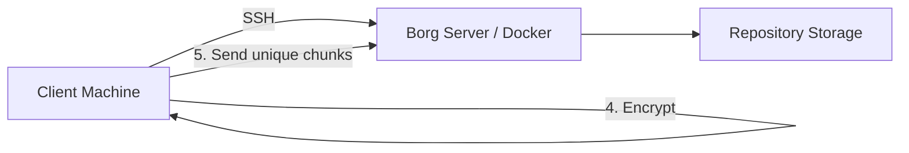

# How to Run Borg Backup in Docker

Author: [nawazdhandala](https://github.com/nawazdhandala)

Tags: docker, borg, borgbackup, backup, deduplication, self-hosted, encryption

Description: Deploy BorgBackup in Docker as a centralized backup server with encryption, deduplication, and efficient storage management.

---

BorgBackup (Borg) is a deduplicating backup program with support for compression and encryption. It is one of the most storage-efficient backup tools available, often achieving deduplication ratios that save 50-90% of storage compared to full backups. Running a Borg server in Docker lets you centralize backup storage and accept connections from multiple client machines over SSH.

## Why Borg?

Borg excels at space efficiency. Its chunking algorithm breaks files into variable-size blocks and stores each unique block only once. If you back up a 10 GB database that changes by 100 MB between backups, Borg stores only the new 100 MB, not another 10 GB copy. Compression further reduces storage requirements. Combined with AES-256 encryption, Borg provides a complete backup solution that is both efficient and secure.

## How Borg Works



The client does all the heavy lifting: chunking, deduplication, compression, and encryption happen on the client side. The server just stores and retrieves encrypted chunks. This means the server never sees your unencrypted data.

## Prerequisites

- A Linux server with Docker and Docker Compose installed
- At least 1 GB of RAM
- Sufficient storage for backup repositories
- SSH key pairs for client authentication
- Borg client installed on machines you want to back up

## Project Setup

```bash
# Create the Borg server project directory
mkdir -p ~/borg-server/{data,ssh}
cd ~/borg-server
```

## Docker Compose Configuration

There is no official Borg Docker image, but the community maintains solid options. We will use a setup based on the borgmatic image that includes the Borg server:

```yaml
# docker-compose.yml - Borg Backup Server
version: "3.8"

services:
  borg-server:
    image: ghcr.io/borgmatic-collective/borgmatic:latest
    container_name: borg-server
    restart: unless-stopped
    ports:
      # SSH port for Borg connections
      - "2222:22"
    environment:
      - TZ=America/New_York
    volumes:
      # Backup repository storage
      - ./data:/backup
      # SSH host keys and authorized keys
      - ./ssh:/root/.ssh
      # Borg configuration
      - ./borgmatic.d:/etc/borgmatic.d
    entrypoint: /bin/sh
    command: >
      -c "
      apk add --no-cache openssh-server &&
      ssh-keygen -A &&
      echo 'PermitRootLogin prohibit-password' >> /etc/ssh/sshd_config &&
      echo 'PasswordAuthentication no' >> /etc/ssh/sshd_config &&
      /usr/sbin/sshd -D
      "
```

Alternatively, use a purpose-built Borg server image for a cleaner setup:

```yaml
# docker-compose.yml - Dedicated Borg Server
version: "3.8"

services:
  borg-server:
    image: nold360/borgserver:latest
    container_name: borg-server
    restart: unless-stopped
    ports:
      - "2222:22"
    environment:
      # Restrict clients to borg commands only
      - BORG_SERVE_ARGS=--restrict-to-repository /backup
      - PUID=1000
      - PGID=1000
    volumes:
      # Backup repositories
      - ./data:/backup
      # SSH authorized keys for clients
      - ./ssh/authorized_keys:/home/borg/.ssh/authorized_keys:ro
      # SSH host keys (persist across restarts)
      - ./ssh/host_keys:/etc/ssh/host_keys
```

## Setting Up Client Authentication

Each client machine needs an SSH key pair. Generate one on the client:

```bash
# On the client machine, generate an SSH key for Borg
ssh-keygen -t ed25519 -f ~/.ssh/borg_backup -N "" -C "borg-backup-client"
```

Copy the public key to the server's authorized keys file:

```bash
# On the server, add the client's public key
mkdir -p ~/borg-server/ssh
echo "command=\"borg serve --restrict-to-repository /backup/clientname\",restrict $(cat client_public_key.pub)" >> ~/borg-server/ssh/authorized_keys
```

The `command=` prefix in the authorized_keys entry restricts the key to only running `borg serve` commands, preventing SSH shell access. The `--restrict-to-repository` flag limits the client to its own backup repository.

## Starting the Server

```bash
# Start the Borg server
docker compose up -d
```

Verify SSH is accepting connections:

```bash
# Test SSH connectivity from a client
ssh -p 2222 -i ~/.ssh/borg_backup borg@your-server
```

You should see a Borg-specific message rather than a shell prompt, confirming the command restriction is working.

## Initializing a Repository

On the client machine, initialize the backup repository on the server:

```bash
# Initialize a new Borg repository on the remote server
export BORG_REPO="ssh://borg@your-server:2222/backup/clientname"
export BORG_PASSPHRASE="a_strong_encryption_passphrase"
export BORG_RSH="ssh -i ~/.ssh/borg_backup"

borg init --encryption=repokey-blake2
```

The `repokey-blake2` encryption mode stores the encryption key in the repository (encrypted with your passphrase) and uses the BLAKE2b hash for better performance. Alternative modes:

- `repokey` - Same as repokey-blake2 but uses SHA-256
- `keyfile` - Stores the key on the client instead of the repository
- `none` - No encryption (not recommended)

## Running Backups

Create a backup with specific directories:

```bash
# Run a backup with compression and exclusions
export BORG_REPO="ssh://borg@your-server:2222/backup/clientname"
export BORG_PASSPHRASE="your_passphrase"
export BORG_RSH="ssh -i ~/.ssh/borg_backup"

borg create \
  --stats --progress \
  --compression zstd,6 \
  --exclude '*.pyc' \
  --exclude '__pycache__' \
  --exclude 'node_modules' \
  --exclude '.git' \
  --exclude '*.log' \
  ::'{hostname}-{now:%Y-%m-%d_%H:%M}' \
  /home /etc /var/www
```

The `::` prefix names the archive. The pattern creates names like `myserver-2026-02-08_02:00`. Zstd compression at level 6 provides a good balance between speed and compression ratio.

## Automating Backups with a Script

Create a comprehensive backup script:

```bash
#!/bin/bash
# /usr/local/bin/borg-backup.sh - Automated Borg backup

export BORG_REPO="ssh://borg@your-server:2222/backup/$(hostname)"
export BORG_PASSPHRASE="your_passphrase"
export BORG_RSH="ssh -i /root/.ssh/borg_backup"

# Create the backup
echo "Starting backup at $(date)"
borg create \
  --stats \
  --compression zstd,6 \
  --exclude-caches \
  --exclude '*.pyc' \
  --exclude 'node_modules' \
  --exclude '.cache' \
  ::'{hostname}-{now:%Y-%m-%d_%H:%M}' \
  /home /etc /var/www /opt

# Prune old archives according to retention policy
echo "Pruning old archives"
borg prune \
  --keep-daily 7 \
  --keep-weekly 4 \
  --keep-monthly 6 \
  --keep-yearly 2

# Compact the repository to free disk space
borg compact

echo "Backup completed at $(date)"
```

Schedule it with cron:

```bash
# Run nightly at 3 AM
chmod +x /usr/local/bin/borg-backup.sh
(crontab -l 2>/dev/null; echo "0 3 * * * /usr/local/bin/borg-backup.sh >> /var/log/borg-backup.log 2>&1") | crontab -
```

## Listing and Restoring Archives

View available archives:

```bash
# List all archives in the repository
borg list

# List contents of a specific archive
borg list ::myserver-2026-02-08_02:00

# Show archive statistics
borg info ::myserver-2026-02-08_02:00
```

Restore files:

```bash
# Restore an entire archive to a target directory
cd /tmp/restore
borg extract ::myserver-2026-02-08_02:00

# Restore a specific path
borg extract ::myserver-2026-02-08_02:00 home/user/documents

# Mount an archive for browsing (requires FUSE)
mkdir /tmp/borg-mount
borg mount ::myserver-2026-02-08_02:00 /tmp/borg-mount
```

## Checking Repository Integrity

Run periodic integrity checks:

```bash
# Verify repository consistency
borg check --repository-only

# Full check including archive data (slower but thorough)
borg check --verify-data
```

## Storage Monitoring

Track repository size and deduplication effectiveness:

```bash
# Show repository statistics including deduplication ratio
borg info
```

This displays total size, compressed size, and deduplicated size, letting you see exactly how much storage Borg is saving.

## Monitoring with OneUptime

Monitor your Borg server with OneUptime by setting up a TCP monitor on port 2222 (SSH). If the backup server becomes unreachable, scheduled backups from all client machines will fail silently. Proactive monitoring ensures you catch issues before they compound into data loss.

## Wrapping Up

BorgBackup in Docker provides enterprise-grade backup infrastructure with exceptional storage efficiency. The combination of deduplication, compression, and encryption makes it suitable for backing up everything from small configuration files to multi-terabyte databases. With SSH-based authentication and repository restrictions, each client gets secure, isolated access to its own backup storage.
