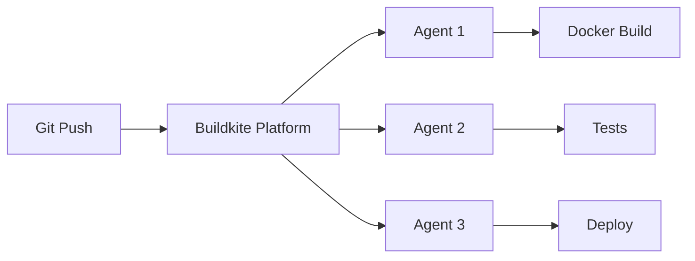

# How to Run Buildkite Agent in Docker

Author: [nawazdhandala](https://github.com/nawazdhandala)

Tags: Docker, Buildkite, CI/CD, Build Agents, DevOps, Continuous Integration

Description: Deploy Buildkite agents in Docker to run CI/CD pipelines with full Docker support, auto-scaling, and isolated build environments.

---

Buildkite is a CI/CD platform that takes a unique approach: the control plane runs in the cloud, but your builds execute on your own infrastructure using agents. This gives you the reliability of a managed service with the security and performance of self-hosted runners. Running Buildkite agents in Docker is one of the cleanest ways to deploy them, especially when your builds themselves need Docker.

This guide covers deploying Buildkite agents in Docker, configuring Docker-in-Docker for builds that need it, scaling agents with Docker Compose, and setting up proper build caching.

## How Buildkite Works

Buildkite's architecture splits into two parts. The Buildkite platform (cloud-hosted) manages pipelines, stores build logs, and provides the web interface. Agents (self-hosted) poll the Buildkite API for jobs, execute them, and stream results back. The agents are lightweight Go binaries that can run anywhere.



## Prerequisites

You need a Buildkite account and an agent token. Find your agent token at Settings > Agents in the Buildkite web interface.

```bash
# Store your Buildkite agent token
export BUILDKITE_AGENT_TOKEN="your-agent-token-here"

docker --version
docker compose version
```

## Single Agent with Docker Run

The simplest deployment runs one agent that can execute Docker commands from within builds.

```bash
# Run a Buildkite agent with Docker socket access
docker run -d \
  --name buildkite-agent \
  --restart unless-stopped \
  -e BUILDKITE_AGENT_TOKEN=${BUILDKITE_AGENT_TOKEN} \
  -e BUILDKITE_AGENT_NAME="docker-agent-%n" \
  -e BUILDKITE_AGENT_TAGS="queue=default,docker=true" \
  -v /var/run/docker.sock:/var/run/docker.sock \
  -v buildkite-builds:/buildkite/builds \
  buildkite/agent:3
```

The agent will register with Buildkite and start polling for jobs within a few seconds.

## Scaling with Docker Compose

Run multiple agents to process builds in parallel.

```yaml
# docker-compose.yml - Buildkite agent pool
version: "3.8"

services:
  # Primary build agent with Docker access
  agent:
    image: buildkite/agent:3
    restart: unless-stopped
    environment:
      - BUILDKITE_AGENT_TOKEN=${BUILDKITE_AGENT_TOKEN}
      # Use %n to auto-number multiple instances
      - BUILDKITE_AGENT_NAME=docker-agent-%hostname-%n
      # Tags determine which pipelines this agent can run
      - BUILDKITE_AGENT_TAGS=queue=default,docker=true,os=linux
      # Set the number of parallel jobs per agent container
      - BUILDKITE_AGENT_SPAWN=1
      # Build directory
      - BUILDKITE_BUILD_PATH=/buildkite/builds
      # Hooks directory for custom lifecycle scripts
      - BUILDKITE_HOOKS_PATH=/buildkite/hooks
      # Plugins directory
      - BUILDKITE_PLUGINS_PATH=/buildkite/plugins
      # Experiment flags
      - BUILDKITE_AGENT_EXPERIMENT=normalised-upload-paths
    volumes:
      # Docker socket for running Docker commands in builds
      - /var/run/docker.sock:/var/run/docker.sock
      # Persistent build cache
      - buildkite-builds:/buildkite/builds
      # Custom hooks
      - ./hooks:/buildkite/hooks
    # Scale this service to run multiple agents
    deploy:
      replicas: 3
      resources:
        limits:
          cpus: "2"
          memory: 4G
    networks:
      - buildkite

  # Dedicated agent for deployment jobs
  deploy-agent:
    image: buildkite/agent:3
    restart: unless-stopped
    environment:
      - BUILDKITE_AGENT_TOKEN=${BUILDKITE_AGENT_TOKEN}
      - BUILDKITE_AGENT_NAME=deploy-agent-%hostname
      # This agent only picks up deploy jobs
      - BUILDKITE_AGENT_TAGS=queue=deploy
      - BUILDKITE_BUILD_PATH=/buildkite/builds
    volumes:
      - /var/run/docker.sock:/var/run/docker.sock
      - buildkite-deploy-builds:/buildkite/builds
      # Mount deployment credentials
      - ./deploy-keys:/root/.ssh:ro
    deploy:
      replicas: 1
    networks:
      - buildkite

volumes:
  buildkite-builds:
  buildkite-deploy-builds:

networks:
  buildkite:
    driver: bridge
```

```bash
# Start 3 build agents and 1 deploy agent
docker compose up -d

# Scale build agents dynamically
docker compose up -d --scale agent=5
```

## Agent Hooks

Hooks let you customize the agent's behavior at various points in the build lifecycle. Create a hooks directory with scripts that run before and after builds.

```bash
#!/bin/bash
# hooks/environment - Set up environment variables for all builds
# This runs before every build step

# Configure Docker BuildKit for faster builds
export DOCKER_BUILDKIT=1
export COMPOSE_DOCKER_CLI_BUILD=1

# Set up Docker registry authentication
echo "${DOCKER_REGISTRY_PASSWORD}" | docker login -u "${DOCKER_REGISTRY_USER}" --password-stdin

# Configure Go cache if Go projects are being built
export GOPATH=/buildkite/cache/go
export GOCACHE=/buildkite/cache/go-build
```

```bash
#!/bin/bash
# hooks/pre-exit - Clean up after every build
# This runs after each build step completes (success or failure)

# Remove dangling Docker images to save disk space
docker image prune -f --filter "until=24h" 2>/dev/null || true

# Clean up any containers left behind by the build
docker container prune -f --filter "until=1h" 2>/dev/null || true
```

Make the hooks executable.

```bash
chmod +x hooks/environment hooks/pre-exit
```

## Docker-in-Docker Builds

When your CI pipeline needs to build Docker images, mounting the host Docker socket (as shown above) is the most common approach. The builds use the host's Docker daemon, which means built images are available on the host and caching works naturally.

For stronger isolation, you can run Docker-in-Docker with a DinD sidecar.

```yaml
# docker-compose.dind.yml - Agent with Docker-in-Docker
services:
  agent-dind:
    image: buildkite/agent:3
    environment:
      - BUILDKITE_AGENT_TOKEN=${BUILDKITE_AGENT_TOKEN}
      - BUILDKITE_AGENT_NAME=dind-agent-%hostname
      - BUILDKITE_AGENT_TAGS=queue=isolated
      # Point Docker CLI at the DinD daemon
      - DOCKER_HOST=tcp://docker:2376
      - DOCKER_TLS_CERTDIR=/certs
      - DOCKER_CERT_PATH=/certs/client
      - DOCKER_TLS_VERIFY=1
    volumes:
      - dind-certs-client:/certs/client:ro
      - buildkite-builds:/buildkite/builds

  docker:
    image: docker:dind
    privileged: true
    environment:
      - DOCKER_TLS_CERTDIR=/certs
    volumes:
      - dind-certs-ca:/certs/ca
      - dind-certs-client:/certs/client
      - dind-data:/var/lib/docker

volumes:
  dind-certs-ca:
  dind-certs-client:
  dind-data:
  buildkite-builds:
```

## Build Caching

Efficient caching speeds up your builds dramatically. Use Docker volume mounts to persist caches between builds.

```yaml
agent:
  volumes:
    # Persist Docker layer cache
    - docker-cache:/var/lib/docker
    # Persist dependency caches
    - npm-cache:/root/.npm
    - pip-cache:/root/.cache/pip
    - go-cache:/root/go
```

In your Buildkite pipeline, use the Docker Compose plugin or cache plugin for more control.

```yaml
# .buildkite/pipeline.yml - Example pipeline with caching
steps:
  - label: ":docker: Build"
    command: "docker build --cache-from myapp:cache -t myapp:latest ."
    plugins:
      - docker-compose#v5.1.0:
          build: app
          cache-from:
            - app:myregistry/myapp:cache

  - label: ":pytest: Test"
    command: "pytest tests/"
    plugins:
      - docker-compose#v5.1.0:
          run: app
          volumes:
            - "./test-results:/app/test-results"
```

## Monitoring Agent Health

Keep an eye on your agents with the Buildkite API or the web interface.

```bash
# Check agent status via the Buildkite API
curl -s -H "Authorization: Bearer ${BUILDKITE_API_TOKEN}" \
  "https://api.buildkite.com/v2/organizations/YOUR_ORG/agents" | \
  python3 -m json.tool | head -40
```

## Cleanup

```bash
docker compose down -v
```

## Conclusion

Running Buildkite agents in Docker gives you flexible, scalable CI/CD infrastructure that you control. The agent-based architecture lets you scale horizontally by adding more agent containers, use tags to route specific jobs to specific agents, and keep your build environments isolated and reproducible. For monitoring the health of your CI/CD pipeline, including build times, failure rates, and agent availability, [OneUptime](https://oneuptime.com) can help you track these metrics and alert your team when builds start failing.
