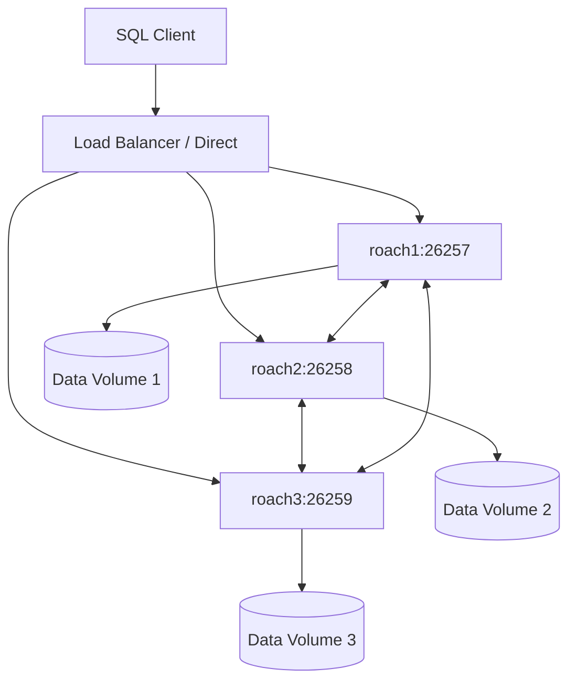

# How to Run CockroachDB in Docker with Clustering

Author: [nawazdhandala](https://github.com/nawazdhandala)

Tags: Docker, CockroachDB, Database, Clustering, DevOps, Distributed Systems, Docker Compose

Description: Step-by-step guide to running a CockroachDB cluster in Docker with multi-node setup, replication, monitoring, and production best practices.

---

CockroachDB is a distributed SQL database that survives node failures without losing data or availability. Running it in Docker simplifies local development and testing of distributed database scenarios. This guide covers setting up a multi-node CockroachDB cluster with Docker, from a single node for development to a three-node cluster that demonstrates fault tolerance.

## Prerequisites

Docker and Docker Compose must be installed. Basic SQL knowledge is needed. Understanding of distributed systems concepts (replication, consensus, partitioning) is helpful but not required. CockroachDB handles the complexity internally.

## Single Node for Development

Start with a single node for local development:

```bash
# Run a single CockroachDB node for development
docker run -d \
  --name cockroach-single \
  -p 26257:26257 \
  -p 8080:8080 \
  -v cockroach-data:/cockroach/cockroach-data \
  cockroachdb/cockroach:v23.2.3 \
  start-single-node \
  --insecure \
  --advertise-addr=localhost
```

This starts CockroachDB with:
- Port 26257 for SQL client connections
- Port 8080 for the web admin UI
- A persistent volume for data
- Insecure mode (no TLS) for local development

Access the admin UI at `http://localhost:8080` and connect with SQL:

```bash
# Connect to CockroachDB using the built-in SQL client
docker exec -it cockroach-single cockroach sql --insecure

# Or use any PostgreSQL-compatible client
psql "postgresql://root@localhost:26257/defaultdb?sslmode=disable"
```

## Three-Node Cluster with Docker Compose

A realistic cluster needs at least three nodes for fault tolerance. CockroachDB uses the Raft consensus protocol, which requires a majority of nodes to be available.

```yaml
# docker-compose.yml - three-node CockroachDB cluster
version: "3.8"

services:
  roach1:
    image: cockroachdb/cockroach:v23.2.3
    container_name: roach1
    hostname: roach1
    command: >
      start
      --insecure
      --advertise-addr=roach1:26357
      --http-addr=roach1:8080
      --listen-addr=roach1:26357
      --sql-addr=roach1:26257
      --join=roach1:26357,roach2:26357,roach3:26357
      --store=/cockroach/cockroach-data
    ports:
      - "26257:26257"
      - "8080:8080"
    volumes:
      - roach1-data:/cockroach/cockroach-data
    networks:
      - cockroachnet
    healthcheck:
      test: ["CMD", "cockroach", "node", "status", "--insecure", "--host=roach1:26257"]
      interval: 10s
      timeout: 5s
      retries: 5
      start_period: 30s

  roach2:
    image: cockroachdb/cockroach:v23.2.3
    container_name: roach2
    hostname: roach2
    command: >
      start
      --insecure
      --advertise-addr=roach2:26357
      --http-addr=roach2:8081
      --listen-addr=roach2:26357
      --sql-addr=roach2:26257
      --join=roach1:26357,roach2:26357,roach3:26357
      --store=/cockroach/cockroach-data
    ports:
      - "26258:26257"
      - "8081:8081"
    volumes:
      - roach2-data:/cockroach/cockroach-data
    networks:
      - cockroachnet

  roach3:
    image: cockroachdb/cockroach:v23.2.3
    container_name: roach3
    hostname: roach3
    command: >
      start
      --insecure
      --advertise-addr=roach3:26357
      --http-addr=roach3:8082
      --listen-addr=roach3:26357
      --sql-addr=roach3:26257
      --join=roach1:26357,roach2:26357,roach3:26357
      --store=/cockroach/cockroach-data
    ports:
      - "26259:26257"
      - "8082:8082"
    volumes:
      - roach3-data:/cockroach/cockroach-data
    networks:
      - cockroachnet

  # Initialization container - runs once to initialize the cluster
  init:
    image: cockroachdb/cockroach:v23.2.3
    container_name: roach-init
    command: >
      init --insecure --host=roach1:26357
    networks:
      - cockroachnet
    depends_on:
      roach1:
        condition: service_healthy

volumes:
  roach1-data:
  roach2-data:
  roach3-data:

networks:
  cockroachnet:
    driver: bridge
```

Start the cluster:

```bash
# Start all nodes and initialize the cluster
docker compose up -d

# Wait for initialization, then check cluster status
sleep 10
docker exec -it roach1 cockroach node status --insecure --host=roach1:26257
```

## Understanding the Cluster Architecture



Each node communicates with every other node over the internal port (26357). SQL clients connect on port 26257. Data is automatically replicated across nodes.

## Initializing the Cluster

The `init` container runs the cluster initialization command. This needs to happen only once, after all nodes have started:

```bash
# Manual initialization if the init container didn't run
docker exec -it roach1 cockroach init --insecure --host=roach1:26357
```

Verify the cluster status:

```bash
# Check that all 3 nodes are live
docker exec -it roach1 cockroach node status --insecure --host=roach1:26257
```

You should see all three nodes listed as "live."

## Creating a Database and Tables

Connect to any node and create your schema:

```bash
# Connect to the SQL shell
docker exec -it roach1 cockroach sql --insecure --host=roach1:26257
```

```sql
-- Create a database
CREATE DATABASE myapp;
USE myapp;

-- Create a table with automatic ID generation
CREATE TABLE users (
    id UUID PRIMARY KEY DEFAULT gen_random_uuid(),
    email STRING UNIQUE NOT NULL,
    name STRING NOT NULL,
    created_at TIMESTAMPTZ DEFAULT now(),
    INDEX idx_email (email)
);

-- Insert sample data
INSERT INTO users (email, name) VALUES
    ('alice@example.com', 'Alice'),
    ('bob@example.com', 'Bob'),
    ('charlie@example.com', 'Charlie');

-- Verify data
SELECT * FROM users;
```

## Testing Fault Tolerance

The real value of a CockroachDB cluster is fault tolerance. Let's test it.

First, confirm data is replicated:

```bash
# Check replication status
docker exec -it roach1 cockroach sql --insecure --host=roach1:26257 \
  -e "SHOW RANGES FROM TABLE myapp.users;"
```

Now stop one node:

```bash
# Stop roach2 to simulate a node failure
docker stop roach2
```

Verify the cluster still works:

```bash
# Connect to roach1 and query data - should still work
docker exec -it roach1 cockroach sql --insecure --host=roach1:26257 \
  -e "SELECT * FROM myapp.users;"

# Insert new data - should still work
docker exec -it roach1 cockroach sql --insecure --host=roach1:26257 \
  -e "INSERT INTO myapp.users (email, name) VALUES ('dave@example.com', 'Dave');"
```

The cluster continues to operate because 2 out of 3 nodes (a majority) are still running. Bring the node back:

```bash
# Restart the stopped node
docker start roach2

# Check cluster status - roach2 should rejoin and catch up
sleep 5
docker exec -it roach1 cockroach node status --insecure --host=roach1:26257
```

The recovered node automatically catches up with any changes it missed.

## Adding a Load Balancer

For production-like setups, add HAProxy to distribute connections:

```yaml
# Add to docker-compose.yml
  haproxy:
    image: haproxy:2.9-alpine
    container_name: haproxy
    ports:
      - "26000:26257"
      - "8404:8404"
    volumes:
      - ./haproxy.cfg:/usr/local/etc/haproxy/haproxy.cfg:ro
    networks:
      - cockroachnet
    depends_on:
      - roach1
      - roach2
      - roach3
```

Create the HAProxy configuration:

```
# haproxy.cfg - load balancer for CockroachDB cluster
global
    maxconn 4096

defaults
    mode tcp
    timeout connect 10s
    timeout client 30m
    timeout server 30m
    option clitcpka

# Stats page accessible at http://localhost:8404/stats
listen stats
    bind :8404
    mode http
    stats enable
    stats uri /stats
    stats refresh 10s

# CockroachDB SQL frontend
listen cockroachdb
    bind :26257
    mode tcp
    balance roundrobin
    option httpchk GET /health?ready=1
    server roach1 roach1:26257 check port 8080
    server roach2 roach2:26257 check port 8081
    server roach3 roach3:26257 check port 8082
```

Connect through the load balancer:

```bash
# Connect via HAProxy
cockroach sql --insecure --host=localhost --port=26000

# Or with psql
psql "postgresql://root@localhost:26000/defaultdb?sslmode=disable"
```

## Secure Cluster with TLS

For environments closer to production, enable TLS:

```yaml
# docker-compose.secure.yml - TLS-enabled cluster
version: "3.8"

services:
  certs-init:
    image: cockroachdb/cockroach:v23.2.3
    container_name: certs-init
    volumes:
      - certs:/certs
      - ca-key:/ca-key
    command: >
      bash -c "
        cockroach cert create-ca --certs-dir=/certs --ca-key=/ca-key/ca.key &&
        cockroach cert create-node roach1 roach2 roach3 localhost
          --certs-dir=/certs --ca-key=/ca-key/ca.key &&
        cockroach cert create-client root
          --certs-dir=/certs --ca-key=/ca-key/ca.key
      "

  roach1:
    image: cockroachdb/cockroach:v23.2.3
    command: >
      start
      --certs-dir=/certs
      --advertise-addr=roach1:26357
      --listen-addr=roach1:26357
      --sql-addr=roach1:26257
      --join=roach1:26357,roach2:26357,roach3:26357
    volumes:
      - certs:/certs:ro
      - roach1-data:/cockroach/cockroach-data
    ports:
      - "26257:26257"
      - "8080:8080"
    networks:
      - cockroachnet
    depends_on:
      certs-init:
        condition: service_completed_successfully

  # ... roach2 and roach3 follow the same pattern

volumes:
  certs:
  ca-key:
  roach1-data:
  roach2-data:
  roach3-data:

networks:
  cockroachnet:
```

## CockroachDB with an Application

Here is how to connect an application to the cluster:

```yaml
# Add an application service to docker-compose.yml
  app:
    build: ./app
    ports:
      - "3000:3000"
    environment:
      - DATABASE_URL=postgresql://root@roach1:26257/myapp?sslmode=disable
    networks:
      - cockroachnet
    depends_on:
      roach1:
        condition: service_healthy
```

Connection string format for different languages:

```bash
# PostgreSQL-compatible connection string
# Node.js / Python / Go
postgresql://root@localhost:26257/myapp?sslmode=disable

# With load balancer
postgresql://root@localhost:26000/myapp?sslmode=disable

# Java JDBC
jdbc:postgresql://localhost:26257/myapp?sslmode=disable
```

## Backup and Restore

CockroachDB supports SQL-level backup:

```bash
# Create a full backup to local storage
docker exec -it roach1 cockroach sql --insecure --host=roach1:26257 \
  -e "BACKUP DATABASE myapp TO 'nodelocal://1/backup/myapp';"

# Restore from backup
docker exec -it roach1 cockroach sql --insecure --host=roach1:26257 \
  -e "RESTORE DATABASE myapp FROM 'nodelocal://1/backup/myapp';"
```

## Performance Tuning

Adjust CockroachDB settings for your workload:

```sql
-- Increase the default replication factor
ALTER DATABASE myapp CONFIGURE ZONE USING num_replicas = 3;

-- Set GC TTL for faster cleanup
ALTER DATABASE myapp CONFIGURE ZONE USING gc.ttlseconds = 600;

-- View current zone configuration
SHOW ZONE CONFIGURATION FOR DATABASE myapp;
```

Resource limits in Docker:

```yaml
# Resource limits per node
services:
  roach1:
    deploy:
      resources:
        limits:
          cpus: "2"
          memory: 4G
        reservations:
          cpus: "1"
          memory: 2G
```

## Monitoring the Cluster

CockroachDB's built-in admin UI (port 8080) provides excellent cluster monitoring. For external monitoring, [OneUptime](https://oneuptime.com) can check the health endpoint at `http://localhost:8080/health?ready=1`. This endpoint returns HTTP 200 when the node is ready to accept connections, and 503 otherwise. Monitor all three nodes independently to detect partial cluster failures.

```bash
# Check node health programmatically
curl -s http://localhost:8080/health?ready=1
```

## Useful Admin Commands

```bash
# View cluster node status
docker exec -it roach1 cockroach node status --insecure --host=roach1:26257

# Decommission a node gracefully before removal
docker exec -it roach1 cockroach node decommission 2 --insecure --host=roach1:26257

# View active queries
docker exec -it roach1 cockroach sql --insecure --host=roach1:26257 \
  -e "SELECT * FROM [SHOW QUERIES];"

# View range distribution
docker exec -it roach1 cockroach sql --insecure --host=roach1:26257 \
  -e "SELECT * FROM crdb_internal.ranges_no_leases WHERE database_name = 'myapp';"
```

## Summary

Running CockroachDB in Docker gives you a distributed SQL database for local development and testing. A three-node cluster with Docker Compose demonstrates real fault tolerance: stop any single node and the cluster continues serving reads and writes. The `--join` flag connects nodes into a cluster, and the `init` command bootstraps the first time. HAProxy provides load balancing across nodes. For production, enable TLS and set appropriate resource limits. CockroachDB's PostgreSQL compatibility means your existing tools and drivers work without modification, making it straightforward to test distributed database scenarios locally before deploying to production infrastructure.
