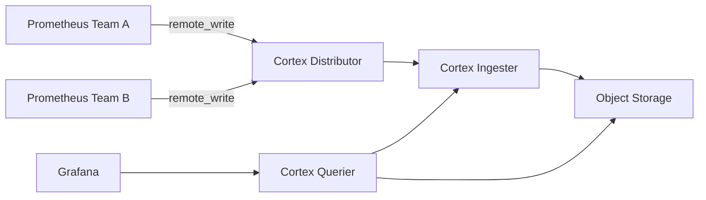

# How to Run Cortex in Docker for Multi-Tenant Metrics

Author: [nawazdhandala](https://github.com/nawazdhandala)

Tags: Docker, Cortex, Prometheus, Monitoring, Multi-Tenant, Observability, DevOps

Description: Deploy Cortex in Docker to provide horizontally scalable, multi-tenant Prometheus metric storage and querying.

---

When your organization runs multiple teams or customers on shared infrastructure, each group needs its own isolated view of metrics. Cortex is a horizontally scalable, multi-tenant, long-term storage system for Prometheus. It accepts metrics via the Prometheus remote write API and serves them back through a Prometheus-compatible query interface, making it a drop-in backend for Prometheus without changing your existing workflows.

This guide walks you through deploying Cortex in Docker using the single-process mode for development and testing, then expands into a more realistic microservices deployment using Docker Compose.

## How Cortex Works

Cortex consists of several internal components: the distributor receives incoming metrics, the ingester batches and stores them, the querier handles PromQL queries, and various other components handle compaction and storage. In single-process mode, all these components run inside one binary, which simplifies initial setup.



## Prerequisites

Make sure Docker and Docker Compose are available.

```bash
# Verify Docker is running
docker info --format '{{.ServerVersion}}'

# Verify Compose is available
docker compose version
```

## Cortex Configuration

Create a `cortex-config.yml` file. This configuration runs Cortex in single-process mode with local filesystem storage, suitable for testing.

```yaml
# cortex-config.yml - Single-process Cortex configuration
# All components run in one process for simplicity

# Enable all components in a single target
target: all

# Authentication is enabled by default - each request needs an X-Scope-OrgID header
auth_enabled: true

server:
  http_listen_port: 9009
  grpc_listen_port: 9095

distributor:
  ring:
    kvstore:
      store: memberlist
    instance_addr: 127.0.0.1

ingester:
  ring:
    kvstore:
      store: memberlist
    instance_addr: 127.0.0.1
    replication_factor: 1

  lifecycler:
    ring:
      kvstore:
        store: memberlist

memberlist:
  join_members: []

# Store configuration using local filesystem (use S3/GCS in production)
blocks_storage:
  backend: filesystem
  filesystem:
    dir: /cortex/tsdb
  tsdb:
    dir: /cortex/tsdb-ingester
    ship_interval: 1m

  bucket_store:
    sync_dir: /cortex/tsdb-sync

# Use filesystem for ruler storage as well
ruler_storage:
  backend: filesystem
  filesystem:
    dir: /cortex/rules

compactor:
  data_dir: /cortex/compactor
  sharding_ring:
    kvstore:
      store: memberlist

store_gateway:
  sharding_ring:
    kvstore:
      store: memberlist
```

## Docker Compose Setup

Create the `docker-compose.yml` file with Cortex, two Prometheus instances representing different tenants, and Grafana.

```yaml
# docker-compose.yml - Multi-tenant Cortex stack
version: "3.8"

services:
  # Cortex - multi-tenant metrics backend
  cortex:
    image: cortexproject/cortex:v1.16.1
    command:
      - "-config.file=/etc/cortex/config.yml"
    volumes:
      - ./cortex-config.yml:/etc/cortex/config.yml
      - cortex-data:/cortex
    ports:
      - "9009:9009"
    networks:
      - cortex-net

  # Prometheus instance for Team A
  prometheus-team-a:
    image: prom/prometheus:v2.51.0
    volumes:
      - ./prometheus-team-a.yml:/etc/prometheus/prometheus.yml
    depends_on:
      - cortex
    networks:
      - cortex-net

  # Prometheus instance for Team B
  prometheus-team-b:
    image: prom/prometheus:v2.51.0
    volumes:
      - ./prometheus-team-b.yml:/etc/prometheus/prometheus.yml
    depends_on:
      - cortex
    networks:
      - cortex-net

  # Node exporter for generating test metrics
  node-exporter:
    image: prom/node-exporter:v1.7.0
    networks:
      - cortex-net

  # Grafana for visualization
  grafana:
    image: grafana/grafana:10.4.0
    environment:
      - GF_SECURITY_ADMIN_PASSWORD=admin
      - GF_AUTH_ANONYMOUS_ENABLED=true
    ports:
      - "3000:3000"
    depends_on:
      - cortex
    networks:
      - cortex-net

volumes:
  cortex-data:

networks:
  cortex-net:
    driver: bridge
```

## Prometheus Tenant Configurations

Each Prometheus instance sends metrics to Cortex with a different tenant ID specified in the `X-Scope-OrgID` header.

Create `prometheus-team-a.yml` for the first tenant.

```yaml
# prometheus-team-a.yml - Sends metrics to Cortex with tenant ID "team-a"
global:
  scrape_interval: 15s
  external_labels:
    team: "team-a"

scrape_configs:
  - job_name: "node-exporter"
    static_configs:
      - targets: ["node-exporter:9100"]

  - job_name: "prometheus-self"
    static_configs:
      - targets: ["localhost:9090"]

# Remote write sends all scraped metrics to Cortex
remote_write:
  - url: http://cortex:9009/api/v1/push
    headers:
      X-Scope-OrgID: "team-a"
```

Create `prometheus-team-b.yml` for the second tenant.

```yaml
# prometheus-team-b.yml - Sends metrics to Cortex with tenant ID "team-b"
global:
  scrape_interval: 15s
  external_labels:
    team: "team-b"

scrape_configs:
  - job_name: "node-exporter"
    static_configs:
      - targets: ["node-exporter:9100"]

  - job_name: "prometheus-self"
    static_configs:
      - targets: ["localhost:9090"]

remote_write:
  - url: http://cortex:9009/api/v1/push
    headers:
      X-Scope-OrgID: "team-b"
```

## Starting and Verifying the Stack

Launch everything and confirm Cortex is accepting data.

```bash
# Start the stack
docker compose up -d

# Wait a few seconds, then check Cortex is running
curl -s http://localhost:9009/ready
```

Once the ready endpoint returns `ready`, test querying metrics for each tenant.

```bash
# Query metrics for team-a - note the required OrgID header
curl -s -H "X-Scope-OrgID: team-a" \
  'http://localhost:9009/prometheus/api/v1/query?query=up' | python3 -m json.tool

# Query metrics for team-b
curl -s -H "X-Scope-OrgID: team-b" \
  'http://localhost:9009/prometheus/api/v1/query?query=up' | python3 -m json.tool
```

Each tenant only sees its own metrics. Team A cannot access Team B's data, and vice versa. This isolation happens at the Cortex level without any network segmentation.

## Configuring Grafana for Multi-Tenancy

In Grafana, you can set up separate data sources for each tenant. Navigate to `http://localhost:3000`, log in with admin/admin, and add two Prometheus data sources.

For Team A, set the URL to `http://cortex:9009/prometheus` and add a custom header `X-Scope-OrgID` with value `team-a`. For Team B, use the same URL but set the header value to `team-b`. Each team's dashboards will only show their own metrics.

## Setting Per-Tenant Limits

Cortex supports per-tenant rate limits and retention settings through runtime configuration. Create a `runtime-config.yml` file.

```yaml
# runtime-config.yml - Per-tenant overrides
overrides:
  team-a:
    # Team A gets higher ingestion limits
    ingestion_rate: 50000
    ingestion_burst_size: 100000
    max_series_per_metric: 50000
    max_series_per_query: 100000

  team-b:
    # Team B has lower limits
    ingestion_rate: 10000
    ingestion_burst_size: 20000
    max_series_per_metric: 10000
    max_series_per_query: 20000
```

Mount this file into the Cortex container and reference it in the config by adding `runtime_config: { file: /etc/cortex/runtime.yml }` to your `cortex-config.yml`.

## Production Recommendations

For production use, switch from filesystem storage to a managed object store like S3 or GCS. Run Cortex in microservices mode, where each component (distributor, ingester, querier, compactor, store-gateway) runs as a separate service that can be scaled independently. Use a proper KV store like Consul or etcd instead of memberlist for ring coordination in larger deployments.

Monitor Cortex itself by scraping its `/metrics` endpoint. Key metrics to watch include `cortex_ingester_memory_series` (number of active series in memory), `cortex_distributor_received_samples_total` (ingestion throughput), and `cortex_request_duration_seconds` (query latency).

## Cleanup

Remove everything when done.

```bash
# Tear down the stack and remove stored data
docker compose down -v
```

## Conclusion

Cortex gives you a production-grade, multi-tenant metrics backend that speaks native Prometheus. The Docker setup in this guide demonstrates tenant isolation, per-tenant limits, and the basic architecture. As your needs grow, you can transition to microservices mode and scale each component independently. For monitoring the health of your Cortex deployment, consider integrating with [OneUptime](https://oneuptime.com) to track ingestion rates, query performance, and component availability.
