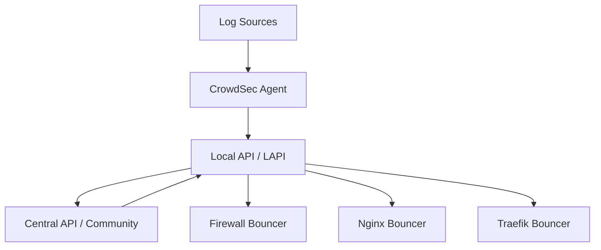

# How to Run Crowdsec in Docker for Intrusion Detection

Author: [nawazdhandala](https://github.com/nawazdhandala)

Tags: Docker, CrowdSec, Security, Intrusion Detection, Firewall, Docker Compose, Home Lab

Description: Deploy CrowdSec in Docker to detect and block malicious traffic using community-driven threat intelligence and behavioral analysis.

---

Every server connected to the internet gets hammered with brute force attempts, vulnerability scans, and bot traffic. CrowdSec is an open-source intrusion detection system that reads your logs, identifies malicious behavior, and blocks offending IPs. What makes it different from traditional tools like fail2ban is its crowd-sourced approach. When one CrowdSec user detects an attacker, that information gets shared across the entire community, so everyone benefits.

Running CrowdSec in Docker keeps it isolated from your host system and makes it easy to deploy alongside other containerized services. This guide walks through the full setup, from initial deployment to integrating with bouncers that actually block traffic.

## Architecture Overview

CrowdSec has three main components. The agent reads logs and detects attacks. The local API (LAPI) stores decisions about which IPs to block. Bouncers enforce those decisions by modifying firewall rules, returning 403 errors, or presenting CAPTCHAs.



## Prerequisites

You need Docker and Docker Compose installed. CrowdSec itself is lightweight, using around 100-200 MB of RAM. The firewall bouncer runs on the host, outside Docker, since it needs access to iptables or nftables.

```bash
# Verify Docker installation
docker --version
docker compose version
```

## Basic Setup with Docker Compose

Start with a compose file that runs the CrowdSec agent and LAPI.

```yaml
# docker-compose.yml - CrowdSec intrusion detection
version: "3.8"

services:
  crowdsec:
    image: crowdsecurity/crowdsec:latest
    container_name: crowdsec
    restart: unless-stopped
    environment:
      # Collections to install on first run
      COLLECTIONS: "crowdsecurity/linux crowdsecurity/sshd crowdsecurity/nginx crowdsecurity/http-cve"
      # Register with the CrowdSec Central API for community blocklists
      GID: "1000"
    volumes:
      # CrowdSec configuration persistence
      - crowdsec-config:/etc/crowdsec
      # CrowdSec database persistence
      - crowdsec-data:/var/lib/crowdsec/data
      # Mount log files that CrowdSec should analyze
      - /var/log:/var/log:ro
      # If you run Nginx or Traefik in Docker, mount their logs too
      - traefik-logs:/var/log/traefik:ro
    ports:
      # Local API port for bouncers to connect
      - "8080:8080"
    networks:
      - crowdsec

networks:
  crowdsec:
    name: crowdsec

volumes:
  crowdsec-config:
  crowdsec-data:
  traefik-logs:
    external: true
```

Start CrowdSec.

```bash
# Launch the container
docker compose up -d

# Check that collections were installed
docker exec crowdsec cscli collections list
```

## Configuring Log Sources

CrowdSec needs to know which log files to watch and how to parse them. The acquis.yaml file defines log sources. Create a custom acquisition config.

```yaml
# acquis.yaml - Define which logs CrowdSec should monitor

# SSH authentication logs
filenames:
  - /var/log/auth.log
labels:
  type: syslog

---
# Nginx access logs (if mounted from another container)
filenames:
  - /var/log/nginx/access.log
labels:
  type: nginx

---
# Traefik access logs
filenames:
  - /var/log/traefik/access.log
labels:
  type: traefik
```

Mount this file into the container.

```yaml
# Add to the volumes section of the crowdsec service
volumes:
  - ./acquis.yaml:/etc/crowdsec/acquis.yaml:ro
```

If your reverse proxy runs in Docker, make sure its logs are written to a shared volume that CrowdSec can read. For Traefik, enable access logging in your Traefik configuration.

```yaml
# traefik.yml - Enable access logs for CrowdSec to analyze
accessLog:
  filePath: "/var/log/traefik/access.log"
  format: json
```

## Installing and Configuring the Firewall Bouncer

The bouncer is what actually blocks malicious IPs. The firewall bouncer modifies iptables or nftables rules on the host. Since it needs host-level access, it typically runs outside Docker.

```bash
# Install the firewall bouncer on the host (Debian/Ubuntu)
curl -s https://install.crowdsec.net | sudo bash
sudo apt install crowdsec-firewall-bouncer-iptables

# Register the bouncer with CrowdSec's LAPI
docker exec crowdsec cscli bouncers add firewall-bouncer

# Copy the API key from the output and add it to the bouncer config
sudo nano /etc/crowdsec/bouncers/crowdsec-firewall-bouncer.yaml
```

Update the bouncer configuration to point to the LAPI.

```yaml
# /etc/crowdsec/bouncers/crowdsec-firewall-bouncer.yaml
mode: iptables
api_url: http://localhost:8080/
api_key: your-api-key-from-cscli-output
disable_ipv6: false
deny_action: DROP
```

Start the bouncer.

```bash
# Start and enable the bouncer service
sudo systemctl start crowdsec-firewall-bouncer
sudo systemctl enable crowdsec-firewall-bouncer

# Verify the bouncer is connected
docker exec crowdsec cscli bouncers list
```

## Using the Traefik Bouncer

If you run Traefik as your reverse proxy, you can use the Traefik bouncer plugin instead of the firewall bouncer. This blocks malicious requests at the application layer before they reach your services.

```yaml
# Add the Traefik bouncer as a service in your compose file
services:
  traefik-bouncer:
    image: fbonalair/traefik-crowdsec-bouncer:latest
    container_name: traefik-bouncer
    restart: unless-stopped
    environment:
      CROWDSEC_BOUNCER_API_KEY: your-bouncer-api-key
      CROWDSEC_AGENT_HOST: crowdsec:8080
    networks:
      - crowdsec
      - proxy
```

Then configure Traefik to forward requests through the bouncer using middleware.

```yaml
# Traefik labels for the bouncer middleware
- "traefik.http.middlewares.crowdsec.forwardauth.address=http://traefik-bouncer:8080/api/v1/forwardAuth"
- "traefik.http.middlewares.crowdsec.forwardauth.trustForwardHeader=true"
```

## Monitoring and Alerting

CrowdSec provides several commands to check what it has detected and blocked.

```bash
# View recent alerts (detected attacks)
docker exec crowdsec cscli alerts list

# View active decisions (blocked IPs)
docker exec crowdsec cscli decisions list

# Check CrowdSec metrics (parsers, scenarios, etc.)
docker exec crowdsec cscli metrics
```

The metrics command shows you how many log lines were parsed, how many matched attack scenarios, and how many decisions were made. This is useful for verifying that CrowdSec is actually reading your logs.

## Custom Scenarios

CrowdSec comes with community-maintained scenarios for common attacks, but you can write your own. Here is a simple scenario that triggers when an IP makes more than 100 requests in 10 seconds.

```yaml
# /etc/crowdsec/scenarios/high-request-rate.yaml
type: leaky
name: custom/high-request-rate
description: "Detect high request rate from a single IP"
filter: "evt.Meta.log_type == 'nginx' || evt.Meta.log_type == 'traefik'"
groupby: evt.Meta.source_ip
capacity: 100
leakspeed: 100ms
blackhole: 5m
labels:
  remediation: true
```

Mount custom scenarios into the container.

```yaml
volumes:
  - ./scenarios:/etc/crowdsec/scenarios:ro
```

## Whitelisting Trusted IPs

You do not want CrowdSec blocking your own IP or your monitoring service. Add whitelists for trusted addresses.

```yaml
# /etc/crowdsec/parsers/s02-enrich/whitelist.yaml
name: custom/whitelist
description: "Whitelist trusted IPs"
whitelist:
  reason: "Trusted local network and monitoring"
  ip:
    - "192.168.1.0/24"
    - "10.0.0.0/8"
  # You can also whitelist by expression
  expression:
    - "evt.Meta.source_ip startsWith '172.16.'"
```

## Enabling Community Blocklists

One of CrowdSec's strongest features is the community blocklist. By enrolling your instance, you receive a curated list of known malicious IPs.

```bash
# Enroll your instance with the CrowdSec Central API
docker exec crowdsec cscli console enroll your-enrollment-key

# Restart the container to apply
docker compose restart crowdsec
```

You get your enrollment key from the CrowdSec Console at https://app.crowdsec.net after creating a free account.

## Backup and Recovery

CrowdSec's configuration and local decisions database should be backed up regularly.

```bash
# Backup the config and data volumes
docker run --rm \
  -v crowdsec-config:/source/config:ro \
  -v crowdsec-data:/source/data:ro \
  -v $(pwd)/backups:/backup \
  alpine tar czf /backup/crowdsec-backup-$(date +%Y%m%d).tar.gz -C /source .
```

## Summary

CrowdSec in Docker gives you a modern, collaborative intrusion detection system that goes beyond what tools like fail2ban can offer. The combination of local log analysis and community-shared threat intelligence means your home lab benefits from the collective experience of thousands of other operators. Pair it with a firewall bouncer or Traefik bouncer to automatically block detected threats, and set up monitoring through OneUptime to get alerts when attack patterns spike.
