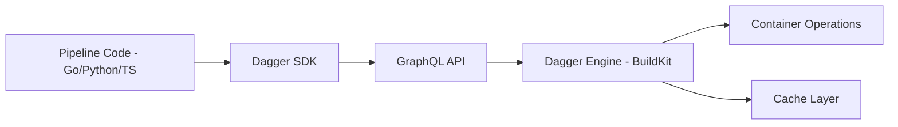

# How to Run Dagger CI Pipelines in Docker

Author: [nawazdhandala](https://github.com/nawazdhandala)

Tags: Docker, Dagger, CI/CD, DevOps, Build Pipelines, Continuous Integration

Description: Use Dagger to write CI/CD pipelines as code in Go, Python, or TypeScript that run identically in Docker locally and in any CI system.

---

Dagger is a programmable CI/CD engine that lets you write build pipelines in real programming languages instead of YAML. Your pipeline code runs inside containers, which means it behaves identically on your laptop, in GitHub Actions, in GitLab CI, or in any other CI system. You write your pipeline once, test it locally, and deploy it everywhere.

The core insight behind Dagger is that CI/CD pipelines should be regular programs. Instead of debugging YAML syntax and CI-specific quirks, you write Go, Python, or TypeScript code that calls Dagger's API to build containers, run tests, and push artifacts. Dagger handles caching, parallelism, and execution.

## How Dagger Works

Dagger runs a BuildKit-based engine inside a Docker container. Your pipeline code communicates with this engine through a GraphQL API. Each operation (pulling an image, running a command, copying files) creates a node in a directed acyclic graph. Dagger executes this graph with automatic caching and parallelism.



## Prerequisites

Install the Dagger CLI and ensure Docker is running.

```bash
# Install the Dagger CLI
curl -fsSL https://dl.dagger.io/dagger/install.sh | sh
sudo mv ./bin/dagger /usr/local/bin/

# Verify the installation
dagger version

# Ensure Docker is running (Dagger needs it for the engine)
docker info --format '{{.ServerVersion}}'
```

## Your First Pipeline in Python

Initialize a Dagger project with the Python SDK.

```bash
# Create a project directory
mkdir my-dagger-project && cd my-dagger-project

# Initialize a Python Dagger module
dagger init --sdk=python --name=ci
```

This creates a `dagger.json` config file and a `dagger/` directory with the SDK scaffolding. Now write your pipeline.

```python
# dagger/src/main.py - CI pipeline using Dagger Python SDK
import dagger
from dagger import dag, function, object_type

@object_type
class Ci:

    @function
    async def build(self, source: dagger.Directory) -> str:
        """Build the application and return the image reference"""
        # Start from a Python base image
        builder = (
            dag.container()
            .from_("python:3.12-slim")
            # Set the working directory
            .with_workdir("/app")
            # Copy dependency files first for better caching
            .with_file("/app/requirements.txt", source.file("requirements.txt"))
            # Install dependencies (this layer is cached if requirements.txt hasn't changed)
            .with_exec(["pip", "install", "--no-cache-dir", "-r", "requirements.txt"])
            # Copy the rest of the source code
            .with_directory("/app", source)
        )

        # Return the build output
        return await builder.with_exec(["python", "-c", "print('Build successful')"]).stdout()

    @function
    async def test(self, source: dagger.Directory) -> str:
        """Run the test suite"""
        return await (
            dag.container()
            .from_("python:3.12-slim")
            .with_workdir("/app")
            .with_file("/app/requirements.txt", source.file("requirements.txt"))
            .with_exec(["pip", "install", "--no-cache-dir", "-r", "requirements.txt"])
            .with_directory("/app", source)
            # Run pytest
            .with_exec(["python", "-m", "pytest", "tests/", "-v"])
            .stdout()
        )

    @function
    async def lint(self, source: dagger.Directory) -> str:
        """Run linting checks"""
        return await (
            dag.container()
            .from_("python:3.12-slim")
            .with_workdir("/app")
            .with_exec(["pip", "install", "ruff"])
            .with_directory("/app", source)
            # Run ruff linter
            .with_exec(["ruff", "check", "."])
            .stdout()
        )

    @function
    async def all(self, source: dagger.Directory) -> str:
        """Run the full CI pipeline: lint, test, build"""
        # These run with Dagger's automatic parallelism
        lint_result = await self.lint(source)
        test_result = await self.test(source)
        build_result = await self.build(source)

        return f"Lint: {lint_result}\nTest: {test_result}\nBuild: {build_result}"
```

Run the pipeline locally.

```bash
# Run the build function
dagger call build --source=.

# Run tests
dagger call test --source=.

# Run the full pipeline
dagger call all --source=.
```

## Pipeline in Go

For Go projects, Dagger's Go SDK feels natural.

```bash
# Initialize a Go Dagger module
dagger init --sdk=go --name=ci
```

```go
// dagger/main.go - CI pipeline using Dagger Go SDK
package main

import (
	"context"
	"dagger/ci/internal/dagger"
)

type Ci struct{}

// Build compiles the Go application and returns a container with the binary
func (m *Ci) Build(ctx context.Context, source *dagger.Directory) *dagger.Container {
	// Use a Go base image for building
	builder := dag.Container().
		From("golang:1.22-alpine").
		WithWorkdir("/app").
		// Mount the source code
		WithDirectory("/app", source).
		// Download dependencies (cached separately)
		WithExec([]string{"go", "mod", "download"}).
		// Build the binary
		WithExec([]string{"go", "build", "-o", "/app/server", "./cmd/server"})

	// Create a minimal runtime image
	runtime := dag.Container().
		From("alpine:3.19").
		WithFile("/usr/local/bin/server", builder.File("/app/server")).
		WithEntrypoint([]string{"/usr/local/bin/server"})

	return runtime
}

// Test runs the Go test suite
func (m *Ci) Test(ctx context.Context, source *dagger.Directory) (string, error) {
	return dag.Container().
		From("golang:1.22-alpine").
		WithWorkdir("/app").
		WithDirectory("/app", source).
		WithExec([]string{"go", "mod", "download"}).
		// Run tests with verbose output and race detector
		WithExec([]string{"go", "test", "-v", "-race", "./..."}).
		Stdout(ctx)
}

// Publish builds and pushes the container image to a registry
func (m *Ci) Publish(ctx context.Context, source *dagger.Directory, registry string, tag string) (string, error) {
	container := m.Build(ctx, source)
	addr := registry + ":" + tag

	// Push the image and return the digest
	return container.Publish(ctx, addr)
}
```

```bash
# Run the Go pipeline
dagger call build --source=.
dagger call test --source=.
dagger call publish --source=. --registry=myregistry/myapp --tag=v1.0.0
```

## Using Dagger in Existing CI Systems

The real power of Dagger is that the same pipeline works in any CI system. Here is how to call your Dagger pipeline from GitHub Actions.

```yaml
# .github/workflows/ci.yml - GitHub Actions calling Dagger
name: CI
on:
  push:
    branches: [main]
  pull_request:

jobs:
  ci:
    runs-on: ubuntu-latest
    steps:
      - uses: actions/checkout@v4

      - name: Install Dagger
        run: |
          curl -fsSL https://dl.dagger.io/dagger/install.sh | sh
          sudo mv ./bin/dagger /usr/local/bin/

      # The exact same commands you run locally
      - name: Run CI Pipeline
        run: dagger call all --source=.
```

And in GitLab CI.

```yaml
# .gitlab-ci.yml - GitLab CI calling Dagger
stages:
  - ci

ci:
  stage: ci
  image: docker:latest
  services:
    - docker:dind
  before_script:
    - curl -fsSL https://dl.dagger.io/dagger/install.sh | sh
    - export PATH="$PWD/bin:$PATH"
  script:
    # Same commands as local development
    - dagger call all --source=.
```

## Caching Strategies

Dagger automatically caches container layers and operation results. You can also create explicit cache volumes for dependencies.

```python
# Explicit cache volume for pip packages
@function
async def build_with_cache(self, source: dagger.Directory) -> str:
    # Create a persistent cache for pip downloads
    pip_cache = dag.cache_volume("pip-cache")

    return await (
        dag.container()
        .from_("python:3.12-slim")
        .with_workdir("/app")
        # Mount the pip cache for faster installs
        .with_mounted_cache("/root/.cache/pip", pip_cache)
        .with_file("/app/requirements.txt", source.file("requirements.txt"))
        .with_exec(["pip", "install", "-r", "requirements.txt"])
        .with_directory("/app", source)
        .with_exec(["python", "-c", "print('Build with cache successful')"])
        .stdout()
    )
```

## Secrets Management

Dagger supports secrets that are never written to the cache or logs.

```python
# Using secrets safely in Dagger
@function
async def deploy(self, source: dagger.Directory, token: dagger.Secret) -> str:
    return await (
        dag.container()
        .from_("alpine:3.19")
        .with_workdir("/app")
        .with_directory("/app", source)
        # The secret is mounted securely and never cached
        .with_secret_variable("DEPLOY_TOKEN", token)
        .with_exec(["sh", "-c", "echo 'Deploying with token...' && deploy.sh"])
        .stdout()
    )
```

```bash
# Pass a secret from an environment variable
dagger call deploy --source=. --token=env:DEPLOY_TOKEN
```

## Cleanup

Dagger manages its own engine container. To clean up.

```bash
# Stop the Dagger engine
docker stop dagger-engine-*

# Prune unused Dagger data
docker volume prune -f --filter label=com.docker.compose.project=dagger
```

## Conclusion

Dagger eliminates the gap between local development and CI. You write pipelines in a real programming language, test them on your laptop with Docker, and run the identical code in production CI systems. The automatic caching and parallelism make builds fast without manual optimization. For monitoring your CI/CD pipelines and tracking build health over time, [OneUptime](https://oneuptime.com) can integrate with your deployment workflow to provide visibility into build success rates and deployment frequency.
