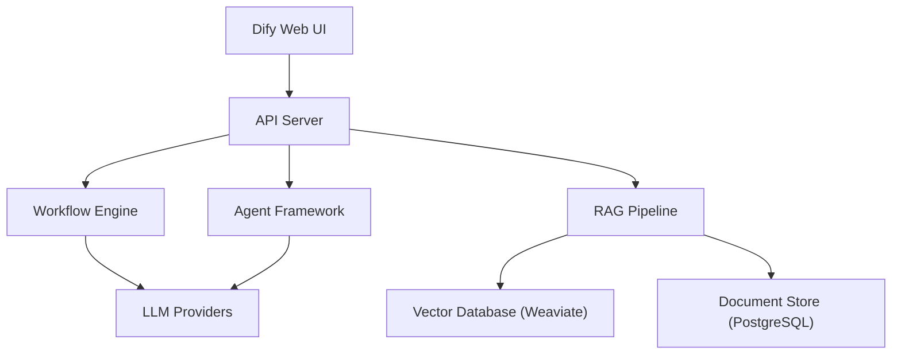

# How to Run Dify in Docker for LLM Application Building

Author: [nawazdhandala](https://github.com/nawazdhandala)

Tags: docker, dify, llm, ai applications, rag, chatbot, docker compose, self-hosted

Description: Deploy Dify in Docker to build LLM-powered applications with a visual workflow editor, RAG pipelines, chatbots, and agent capabilities.

---

Dify is an open-source platform for building LLM-powered applications. It provides a visual workflow editor, built-in RAG pipeline, agent capabilities, and a prompt management system. Think of it as a development platform where non-technical users can build AI applications through a drag-and-drop interface, while developers get a powerful API for integration. Docker is the recommended deployment method, and the project provides a complete Docker Compose setup.

## What Dify Includes

Dify bundles several components into a single platform:

- **Workflow Editor**: Visual drag-and-drop builder for LLM pipelines
- **RAG Engine**: Document ingestion, chunking, embedding, and retrieval
- **Agent Framework**: Build autonomous AI agents with tool access
- **Prompt IDE**: Test and iterate on prompts with version control
- **API Backend**: REST API for integrating Dify apps into your products
- **Multi-Model Support**: Connect to OpenAI, Anthropic, Ollama, and many others



## Prerequisites

- Docker and Docker Compose (v2) installed
- At least 4 GB of RAM available
- 10 GB of free disk space
- An LLM API key (OpenAI, Anthropic, etc.) or a local Ollama instance

```bash
# Verify Docker and Docker Compose versions
docker --version
docker compose version
```

## Deploying Dify with Docker Compose

Dify provides an official Docker Compose configuration in their repository.

```bash
# Clone the Dify repository
git clone https://github.com/langgenius/dify.git
cd dify/docker

# Copy the example environment file
cp .env.example .env
```

Review and customize the environment file:

```bash
# Edit the .env file to configure your deployment
# Key settings to review:

# Secret key for session encryption (change this in production)
# SECRET_KEY=your-random-secret-key-here

# Database configuration
# DB_USERNAME=postgres
# DB_PASSWORD=difyai123456
# DB_HOST=db
# DB_PORT=5432
# DB_DATABASE=dify

# Redis configuration
# REDIS_HOST=redis
# REDIS_PORT=6379

# Vector database selection (weaviate, qdrant, milvus, pgvector)
# VECTOR_STORE=weaviate
```

Start the deployment:

```bash
# Start all Dify services
docker compose up -d

# Watch the startup progress
docker compose logs -f
```

Dify starts several containers:
- **api**: The backend API server
- **worker**: Background task processor (Celery)
- **web**: The frontend web application
- **db**: PostgreSQL database
- **redis**: Redis for caching and task queues
- **weaviate**: Vector database for RAG
- **sandbox**: Code execution sandbox
- **nginx**: Reverse proxy

```bash
# Verify all services are running
docker compose ps

# The web UI is available at http://localhost/install
# Follow the setup wizard to create your admin account
```

## Custom Docker Compose Configuration

If you want to build a minimal Dify setup or customize it, here is a simplified configuration.

```yaml
# docker-compose-custom.yml
# Simplified Dify deployment
version: "3.8"

services:
  api:
    image: langgenius/dify-api:latest
    container_name: dify-api
    ports:
      - "5001:5001"
    environment:
      - MODE=api
      - SECRET_KEY=change-this-to-a-random-string
      - DB_USERNAME=postgres
      - DB_PASSWORD=securepassword
      - DB_HOST=db
      - DB_PORT=5432
      - DB_DATABASE=dify
      - REDIS_HOST=redis
      - REDIS_PORT=6379
      - VECTOR_STORE=weaviate
      - WEAVIATE_ENDPOINT=http://weaviate:8080
    depends_on:
      - db
      - redis
      - weaviate
    restart: unless-stopped

  worker:
    image: langgenius/dify-api:latest
    container_name: dify-worker
    environment:
      - MODE=worker
      - SECRET_KEY=change-this-to-a-random-string
      - DB_USERNAME=postgres
      - DB_PASSWORD=securepassword
      - DB_HOST=db
      - DB_PORT=5432
      - DB_DATABASE=dify
      - REDIS_HOST=redis
      - REDIS_PORT=6379
      - VECTOR_STORE=weaviate
      - WEAVIATE_ENDPOINT=http://weaviate:8080
    depends_on:
      - db
      - redis
    restart: unless-stopped

  web:
    image: langgenius/dify-web:latest
    container_name: dify-web
    ports:
      - "3000:3000"
    environment:
      - CONSOLE_API_URL=http://localhost:5001
      - APP_API_URL=http://localhost:5001
    restart: unless-stopped

  db:
    image: postgres:15-alpine
    container_name: dify-db
    volumes:
      - dify_db_data:/var/lib/postgresql/data
    environment:
      - POSTGRES_USER=postgres
      - POSTGRES_PASSWORD=securepassword
      - POSTGRES_DB=dify
    healthcheck:
      test: ["CMD-SHELL", "pg_isready -U postgres"]
      interval: 10s
      timeout: 5s
      retries: 5
    restart: unless-stopped

  redis:
    image: redis:7-alpine
    container_name: dify-redis
    volumes:
      - dify_redis_data:/data
    restart: unless-stopped

  weaviate:
    image: semitechnologies/weaviate:latest
    container_name: dify-weaviate
    volumes:
      - dify_weaviate_data:/var/lib/weaviate
    environment:
      - QUERY_DEFAULTS_LIMIT=25
      - AUTHENTICATION_ANONYMOUS_ACCESS_ENABLED=true
      - PERSISTENCE_DATA_PATH=/var/lib/weaviate
      - DEFAULT_VECTORIZER_MODULE=none
    restart: unless-stopped

volumes:
  dify_db_data:
  dify_redis_data:
  dify_weaviate_data:
```

## Connecting LLM Providers

After the initial setup, configure your LLM providers through the web interface.

### OpenAI

Navigate to Settings > Model Provider > OpenAI and enter your API key.

### Local Ollama

To use a local Ollama instance with Dify:

```yaml
# Add Ollama to your Docker Compose file
  ollama:
    image: ollama/ollama:latest
    container_name: dify-ollama
    volumes:
      - ollama_data:/root/.ollama
    ports:
      - "11434:11434"
    restart: unless-stopped
```

Then in the Dify web UI, go to Settings > Model Provider > Ollama and set the endpoint to `http://ollama:11434`.

```bash
# Pull a model for Ollama
docker exec dify-ollama ollama pull llama3.1
```

## Building a RAG Application

Once Dify is running, you can build a RAG application through the web UI:

1. Go to Knowledge and create a new knowledge base
2. Upload your documents (PDF, TXT, Markdown, etc.)
3. Configure chunking strategy and embedding model
4. Create a new application and connect it to the knowledge base
5. Configure the system prompt and LLM model

You can also interact with the RAG pipeline via the API:

```bash
# Upload a document to a knowledge base via API
curl -X POST http://localhost:5001/v1/datasets/<dataset-id>/document/create_by_text \
  -H "Authorization: Bearer <your-api-key>" \
  -H "Content-Type: application/json" \
  -d '{
    "name": "Docker Best Practices",
    "text": "Use multi-stage builds to reduce image size. Always pin specific base image versions. Never run containers as root in production.",
    "indexing_technique": "high_quality",
    "process_rule": {
      "mode": "automatic"
    }
  }'
```

## Using the Dify API

Every application you create in Dify gets its own API endpoint.

```bash
# Send a message to a chatbot application
curl -X POST http://localhost:5001/v1/chat-messages \
  -H "Authorization: Bearer app-your-api-key" \
  -H "Content-Type: application/json" \
  -d '{
    "inputs": {},
    "query": "How should I optimize my Docker images?",
    "user": "user-123",
    "response_mode": "blocking"
  }' | python3 -m json.tool
```

```python
# dify_client.py
# Python client for interacting with Dify applications
import requests

DIFY_URL = "http://localhost:5001/v1"
API_KEY = "app-your-api-key"

headers = {
    "Authorization": f"Bearer {API_KEY}",
    "Content-Type": "application/json"
}

# Send a chat message
response = requests.post(
    f"{DIFY_URL}/chat-messages",
    headers=headers,
    json={
        "inputs": {},
        "query": "What are Docker best practices for production?",
        "user": "user-123",
        "response_mode": "blocking"
    }
)

data = response.json()
print(f"Answer: {data['answer']}")
```

## Backup and Restore

```bash
# Backup the PostgreSQL database
docker exec dify-db pg_dump -U postgres dify > dify_backup.sql

# Backup all volumes
docker run --rm \
  -v dify_db_data:/data \
  -v $(pwd):/backup \
  alpine tar czf /backup/dify-db-backup.tar.gz -C /data .

# Restore the database
cat dify_backup.sql | docker exec -i dify-db psql -U postgres dify
```

## Monitoring

```bash
# Check all service statuses
docker compose ps

# Monitor resource usage
docker stats

# View API server logs
docker compose logs -f api

# View worker logs for background tasks
docker compose logs -f worker
```

## Updating Dify

```bash
# Pull the latest images
docker compose pull

# Recreate containers with the new images
docker compose up -d

# Check the version after update
docker compose logs api | head -20
```

## Summary

Dify in Docker provides a complete platform for building LLM-powered applications. The visual workflow editor makes it accessible to non-developers, while the comprehensive API enables deep integration for engineers. Docker Compose handles the complex multi-service architecture, including the database, cache, vector store, and application servers. Whether you are building chatbots, RAG pipelines, or autonomous agents, Dify gives you the tools in a self-hosted package that keeps your data under your control.
