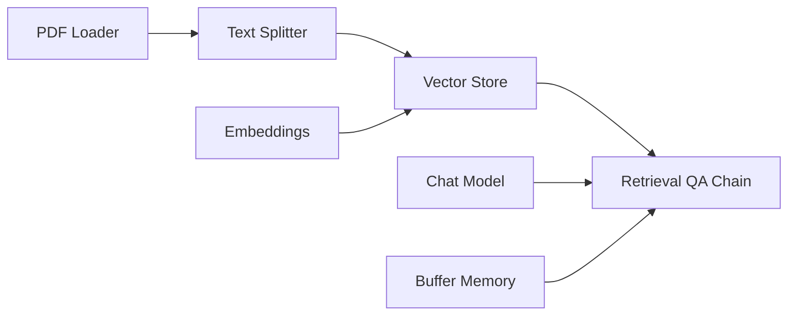

# How to Run Flowise in Docker for LLM Workflows

Author: [nawazdhandala](https://github.com/nawazdhandala)

Tags: docker, flowise, llm, langchain, workflows, chatbot, ai, docker compose

Description: Deploy Flowise in Docker to build LLM workflows and chatbots with a visual drag-and-drop interface powered by LangChain and LlamaIndex.

---

Flowise is an open-source tool that lets you build LLM workflows through a visual drag-and-drop interface. Under the hood, it uses LangChain and LlamaIndex to connect components like language models, vector stores, document loaders, and memory modules. You drag nodes onto a canvas, connect them, and get a working LLM pipeline with an API endpoint. Running Flowise in Docker makes the deployment quick and keeps the Node.js dependencies isolated.

## What Makes Flowise Useful

Flowise simplifies LLM application development by providing:

- Visual workflow builder with drag-and-drop nodes
- Pre-built components for common LLM tasks
- Automatic API generation for every workflow
- Support for multiple LLM providers (OpenAI, Anthropic, Ollama, etc.)
- Built-in vector store integrations (Pinecone, Chroma, Qdrant, etc.)
- Chat memory for conversational applications
- Document loaders for PDFs, web pages, APIs, and databases

## Quick Start

Get Flowise running with a single command.

```bash
# Run Flowise with persistent data storage
docker run -d \
  --name flowise \
  -p 3000:3000 \
  -v flowise_data:/root/.flowise \
  flowiseai/flowise:latest
```

Open `http://localhost:3000` to access the visual editor.

## Docker Compose Setup

For a production deployment with proper configuration.

```yaml
# docker-compose.yml
# Flowise with persistent storage and environment configuration
version: "3.8"

services:
  flowise:
    image: flowiseai/flowise:latest
    container_name: flowise
    ports:
      - "3000:3000"
    volumes:
      # Persist flows, credentials, and chat history
      - flowise_data:/root/.flowise
    environment:
      # Database configuration (SQLite by default, PostgreSQL for production)
      - DATABASE_TYPE=sqlite
      - DATABASE_PATH=/root/.flowise
      # API security
      - FLOWISE_USERNAME=admin
      - FLOWISE_PASSWORD=changethispassword
      # Secret key for credential encryption
      - FLOWISE_SECRETKEY_OVERWRITE=your-secret-key-here
      # Enable CORS for API access
      - CORS_ORIGINS=*
      # Log level
      - LOG_LEVEL=info
    restart: unless-stopped

volumes:
  flowise_data:
```

```bash
# Start Flowise
docker compose up -d

# Check the logs
docker compose logs -f flowise
```

## Production Setup with PostgreSQL

For production environments, use PostgreSQL instead of SQLite.

```yaml
# docker-compose-prod.yml
# Production Flowise with PostgreSQL and proper security
version: "3.8"

services:
  flowise:
    image: flowiseai/flowise:latest
    container_name: flowise
    ports:
      - "3000:3000"
    volumes:
      - flowise_data:/root/.flowise
    environment:
      # Use PostgreSQL for production
      - DATABASE_TYPE=postgres
      - DATABASE_HOST=postgres
      - DATABASE_PORT=5432
      - DATABASE_USER=flowise
      - DATABASE_PASSWORD=securepassword123
      - DATABASE_NAME=flowise
      # Security settings
      - FLOWISE_USERNAME=admin
      - FLOWISE_PASSWORD=your-secure-admin-password
      - FLOWISE_SECRETKEY_OVERWRITE=a-long-random-secret-key
      # API rate limiting
      - APIKEY_PATH=/root/.flowise
      # Logging
      - LOG_LEVEL=info
    depends_on:
      postgres:
        condition: service_healthy
    restart: unless-stopped

  postgres:
    image: postgres:16-alpine
    container_name: flowise-db
    volumes:
      - flowise_pg_data:/var/lib/postgresql/data
    environment:
      - POSTGRES_USER=flowise
      - POSTGRES_PASSWORD=securepassword123
      - POSTGRES_DB=flowise
    healthcheck:
      test: ["CMD-SHELL", "pg_isready -U flowise"]
      interval: 10s
      timeout: 5s
      retries: 5
    restart: unless-stopped

volumes:
  flowise_data:
  flowise_pg_data:
```

```bash
# Start the production stack
docker compose -f docker-compose-prod.yml up -d

# Verify both services are running
docker compose -f docker-compose-prod.yml ps
```

## Connecting to Ollama for Local LLMs

Run Flowise alongside Ollama for a fully local setup with no external API calls.

```yaml
# docker-compose-local.yml
# Flowise with local Ollama LLM backend
version: "3.8"

services:
  flowise:
    image: flowiseai/flowise:latest
    container_name: flowise
    ports:
      - "3000:3000"
    volumes:
      - flowise_data:/root/.flowise
    environment:
      - FLOWISE_USERNAME=admin
      - FLOWISE_PASSWORD=changeme
    depends_on:
      - ollama
    restart: unless-stopped

  ollama:
    image: ollama/ollama:latest
    container_name: flowise-ollama
    volumes:
      - ollama_data:/root/.ollama
    ports:
      - "11434:11434"
    restart: unless-stopped

  # ChromaDB for vector storage
  chromadb:
    image: chromadb/chroma:latest
    container_name: flowise-chroma
    volumes:
      - chroma_data:/chroma/chroma
    ports:
      - "8000:8000"
    restart: unless-stopped

volumes:
  flowise_data:
  ollama_data:
  chroma_data:
```

```bash
# Start the full local stack
docker compose -f docker-compose-local.yml up -d

# Pull a model for Ollama
docker exec flowise-ollama ollama pull llama3.1

# Pull an embedding model
docker exec flowise-ollama ollama pull nomic-embed-text
```

In the Flowise UI, add a ChatOllama node and set the base URL to `http://ollama:11434`.

## Building a RAG Chatbot

Here is a step-by-step walkthrough for building a RAG chatbot in Flowise:

1. Open the Flowise UI at `http://localhost:3000`
2. Click "Add New" to create a new chatflow
3. Drag these nodes onto the canvas:

**Nodes to add:**
- **ChatOpenAI** (or ChatOllama for local) - the language model
- **PDF File Loader** - to ingest PDF documents
- **Recursive Character Text Splitter** - to chunk documents
- **OpenAI Embeddings** (or Ollama Embeddings) - for vector embeddings
- **Chroma** (or In-Memory Vector Store) - to store embeddings
- **Conversational Retrieval QA Chain** - ties everything together
- **Buffer Memory** - for chat history

4. Connect the nodes following this flow:



5. Click "Save" and then "Use as API"

## Using the Flowise API

Every chatflow in Flowise gets an automatic API endpoint.

```bash
# Get the chatflow ID from the Flowise UI
# Send a message to the chatbot API
curl -X POST http://localhost:3000/api/v1/prediction/<chatflow-id> \
  -H "Content-Type: application/json" \
  -d '{"question": "What does this document say about Docker networking?"}' | python3 -m json.tool
```

With API key authentication:

```bash
# If you configured API keys in Flowise
curl -X POST http://localhost:3000/api/v1/prediction/<chatflow-id> \
  -H "Content-Type: application/json" \
  -H "Authorization: Bearer <your-api-key>" \
  -d '{"question": "Summarize the key points from the uploaded documents."}' | python3 -m json.tool
```

## Python Client Integration

```python
# flowise_client.py
# Client for interacting with Flowise chatflows
import requests

FLOWISE_URL = "http://localhost:3000"
CHATFLOW_ID = "your-chatflow-id"  # From the Flowise UI

def chat(message, session_id="default"):
    """Send a message to a Flowise chatflow and get the response."""
    response = requests.post(
        f"{FLOWISE_URL}/api/v1/prediction/{CHATFLOW_ID}",
        json={
            "question": message,
            "overrideConfig": {
                "sessionId": session_id
            }
        }
    )
    return response.json()

# Have a conversation with memory
result1 = chat("What is Docker?", session_id="user-123")
print(f"Bot: {result1['text']}")

result2 = chat("How does it compare to virtual machines?", session_id="user-123")
print(f"Bot: {result2['text']}")
```

## Exporting and Importing Flows

Flowise supports exporting flows as JSON for backup and sharing.

```bash
# Export all chatflows via the API
curl http://localhost:3000/api/v1/chatflows \
  -H "Authorization: Bearer <api-key>" | python3 -m json.tool > chatflows_backup.json

# You can also export individual flows through the Flowise UI
# Click the flow menu > Export Chatflow
```

## Backup Strategy

```bash
# Backup all Flowise data
docker run --rm \
  -v flowise_data:/data \
  -v $(pwd):/backup \
  alpine tar czf /backup/flowise-backup.tar.gz -C /data .

# Backup PostgreSQL if using it
docker exec flowise-db pg_dump -U flowise flowise > flowise-db-backup.sql

# Restore from backup
docker run --rm \
  -v flowise_data:/data \
  -v $(pwd):/backup \
  alpine sh -c "cd /data && tar xzf /backup/flowise-backup.tar.gz"
```

## Monitoring

```bash
# Check Flowise health
curl http://localhost:3000/api/v1/ping

# Monitor resource usage
docker stats flowise

# View logs for debugging
docker compose logs -f flowise
```

## Updating Flowise

```bash
# Pull the latest version
docker compose pull

# Recreate with the new image
docker compose up -d

# Verify the update
docker compose logs flowise | head -20
```

## Summary

Flowise in Docker gives you a visual way to build LLM workflows without writing code. The drag-and-drop interface makes it accessible to build chatbots, RAG pipelines, and multi-step AI workflows. Every flow automatically gets an API endpoint for integration. Docker handles the Node.js runtime and dependencies, while PostgreSQL provides reliable data persistence. Paired with Ollama for local inference and ChromaDB for vector storage, you get a fully self-hosted AI application platform.
