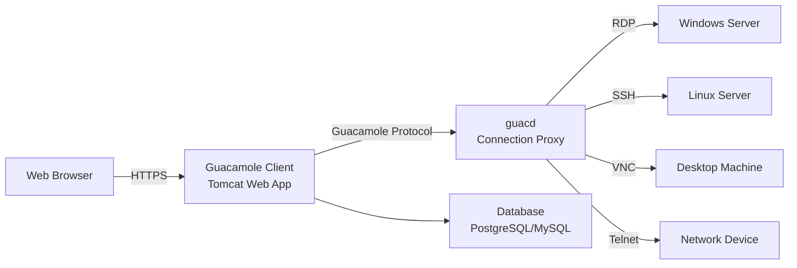

# How to Run Guacamole in Docker for Remote Access

Author: [nawazdhandala](https://github.com/nawazdhandala)

Tags: Docker, Guacamole, Remote Access, RDP, SSH, VNC, Remote Desktop, Self-Hosted

Description: Deploy Apache Guacamole in Docker for clientless remote desktop access through your browser using RDP, SSH, VNC, and Telnet.

---

Apache Guacamole is a clientless remote desktop gateway. It lets you access remote machines through RDP, VNC, SSH, and Telnet directly from a web browser, with no client software to install. Your users open a URL, log in, and get a full remote desktop or terminal session right in their browser tab. This makes it invaluable for help desks, jump servers, lab environments, and any situation where you need centralized remote access.

Running Guacamole in Docker simplifies what would otherwise be a multi-component installation involving a Java servlet container, a native proxy daemon, and a database. This guide covers the complete Docker deployment, from basic setup to production configuration with LDAP authentication and two-factor security.

## Architecture

Guacamole has three main components that work together to deliver remote access through the browser.



- **Guacamole Client**: The Java web application that serves the HTML5 interface
- **guacd**: The native proxy daemon that translates between the Guacamole protocol and remote desktop protocols (RDP, VNC, SSH, Telnet)
- **Database**: Stores connection definitions, user accounts, and session history

## Docker Compose Setup

Here is a complete Docker Compose configuration with PostgreSQL as the backend database.

```yaml
# docker-compose.yml - Apache Guacamole remote access gateway
# Includes the web app, connection proxy, and PostgreSQL database
version: "3.8"

services:
  # guacd - the connection proxy that handles remote desktop protocols
  guacd:
    image: guacamole/guacd:latest
    container_name: guacamole-guacd
    restart: unless-stopped
    volumes:
      - guacd-drive:/drive
      - guacd-record:/record
    networks:
      - guac-net

  # PostgreSQL database for storing connections and users
  postgres:
    image: postgres:15-alpine
    container_name: guacamole-postgres
    restart: unless-stopped
    environment:
      POSTGRES_DB: guacamole_db
      POSTGRES_USER: guacamole
      POSTGRES_PASSWORD: guac_db_password
    volumes:
      - postgres-data:/var/lib/postgresql/data
      - ./initdb.sql:/docker-entrypoint-initdb.d/initdb.sql:ro
    healthcheck:
      test: ["CMD-SHELL", "pg_isready -U guacamole"]
      interval: 10s
      timeout: 5s
      retries: 5
    networks:
      - guac-net

  # Guacamole web application
  guacamole:
    image: guacamole/guacamole:latest
    container_name: guacamole-web
    restart: unless-stopped
    ports:
      - "8080:8080"
    environment:
      GUACD_HOSTNAME: guacd
      GUACD_PORT: 4822
      POSTGRES_HOSTNAME: postgres
      POSTGRES_DATABASE: guacamole_db
      POSTGRES_USER: guacamole
      POSTGRES_PASSWORD: guac_db_password
    depends_on:
      postgres:
        condition: service_healthy
      guacd:
        condition: service_started
    networks:
      - guac-net

volumes:
  postgres-data:
  guacd-drive:     # Shared drive for file transfer
  guacd-record:    # Session recordings

networks:
  guac-net:
    driver: bridge
```

## Database Initialization

Before starting Guacamole for the first time, you need to create the database schema. Generate the initialization SQL file.

```bash
# Generate the PostgreSQL schema from the Guacamole image
# This creates all necessary tables for users, connections, and permissions
docker run --rm guacamole/guacamole /opt/guacamole/bin/initdb.sh --postgresql > initdb.sql

# Verify the SQL file was generated
head -20 initdb.sql
```

## Starting Guacamole

```bash
# Launch all services
docker compose up -d

# Verify all containers are running and healthy
docker compose ps

# Check guacd logs for protocol support information
docker compose logs guacd

# Check the web application logs
docker compose logs guacamole
```

Access Guacamole at http://your-server:8080/guacamole. The default credentials are:
- Username: guacadmin
- Password: guacadmin

Change the default password immediately after your first login.

## Adding Connections

### Through the Web Interface

Log in as guacadmin, navigate to Settings > Connections, and click "New Connection." Fill in the connection details based on the protocol.

### Through the API

Automate connection creation with the REST API.

```bash
# Authenticate and get a session token
TOKEN=$(curl -s -X POST "http://localhost:8080/guacamole/api/tokens" \
  -d "username=guacadmin&password=guacadmin" | python3 -c "import sys,json; print(json.load(sys.stdin)['authToken'])")

# Create an RDP connection to a Windows server
curl -s -X POST "http://localhost:8080/guacamole/api/session/data/postgresql/connections" \
  -H "Content-Type: application/json" \
  -H "Guacamole-Token: ${TOKEN}" \
  -d '{
    "parentIdentifier": "ROOT",
    "name": "Windows Server 2022",
    "protocol": "rdp",
    "parameters": {
      "hostname": "192.168.1.50",
      "port": "3389",
      "username": "Administrator",
      "password": "WindowsPassword123",
      "security": "nla",
      "ignore-cert": "true",
      "enable-wallpaper": "true",
      "enable-font-smoothing": "true",
      "resize-method": "display-update"
    },
    "attributes": {
      "max-connections": "5",
      "max-connections-per-user": "2"
    }
  }'

# Create an SSH connection to a Linux server
curl -s -X POST "http://localhost:8080/guacamole/api/session/data/postgresql/connections" \
  -H "Content-Type: application/json" \
  -H "Guacamole-Token: ${TOKEN}" \
  -d '{
    "parentIdentifier": "ROOT",
    "name": "Ubuntu Production Server",
    "protocol": "ssh",
    "parameters": {
      "hostname": "192.168.1.51",
      "port": "22",
      "username": "admin",
      "private-key": "",
      "color-scheme": "green-black",
      "font-size": "14",
      "scrollback": "5000"
    }
  }'

# Create a VNC connection
curl -s -X POST "http://localhost:8080/guacamole/api/session/data/postgresql/connections" \
  -H "Content-Type: application/json" \
  -H "Guacamole-Token: ${TOKEN}" \
  -d '{
    "parentIdentifier": "ROOT",
    "name": "Developer Workstation",
    "protocol": "vnc",
    "parameters": {
      "hostname": "192.168.1.52",
      "port": "5900",
      "password": "vncpassword",
      "color-depth": "24"
    }
  }'
```

## Session Recording

Guacamole can record remote desktop sessions for audit and compliance purposes.

```bash
# Enable session recording by adding parameters to a connection
# Through the API, add these recording parameters:
# "recording-path": "/record"
# "recording-name": "${GUAC_USERNAME}-${GUAC_DATE}-${GUAC_TIME}"
# "recording-include-keys": "true"

# View recorded sessions (stored in the guacd-record volume)
docker exec guacamole-guacd ls -la /record/

# Convert a recording to video format for playback
# Guacamole recordings use a custom format that needs conversion
docker exec guacamole-guacd guacenc -s 1280x720 /record/session-file.guac
```

## LDAP Authentication

Integrate Guacamole with Active Directory or LDAP for centralized authentication.

```yaml
  guacamole:
    image: guacamole/guacamole:latest
    container_name: guacamole-web
    restart: unless-stopped
    ports:
      - "8080:8080"
    environment:
      GUACD_HOSTNAME: guacd
      GUACD_PORT: 4822
      # PostgreSQL for connection storage
      POSTGRES_HOSTNAME: postgres
      POSTGRES_DATABASE: guacamole_db
      POSTGRES_USER: guacamole
      POSTGRES_PASSWORD: guac_db_password
      # LDAP authentication settings
      LDAP_HOSTNAME: ldap.example.com
      LDAP_PORT: 389
      LDAP_ENCRYPTION_METHOD: starttls
      LDAP_USER_BASE_DN: "ou=users,dc=example,dc=com"
      LDAP_GROUP_BASE_DN: "ou=groups,dc=example,dc=com"
      LDAP_SEARCH_BIND_DN: "cn=guacamole,ou=services,dc=example,dc=com"
      LDAP_SEARCH_BIND_PASSWORD: "ldap_bind_password"
      LDAP_USERNAME_ATTRIBUTE: sAMAccountName
      LDAP_GROUP_NAME_ATTRIBUTE: cn
      LDAP_MEMBER_ATTRIBUTE: member
```

## Two-Factor Authentication

Add TOTP (time-based one-time passwords) for an extra layer of security.

```yaml
    environment:
      # Add TOTP to existing environment variables
      TOTP_ENABLED: "true"
      TOTP_ISSUER: "Guacamole"
      TOTP_DIGITS: "6"
      TOTP_PERIOD: "30"
      TOTP_MODE: "sha1"
```

Users will be prompted to scan a QR code with their authenticator app on their next login.

## Adding a Reverse Proxy with SSL

Place Nginx in front of Guacamole for TLS termination.

```yaml
  nginx:
    image: nginx:alpine
    container_name: guacamole-nginx
    restart: unless-stopped
    ports:
      - "443:443"
    volumes:
      - ./nginx.conf:/etc/nginx/conf.d/default.conf:ro
      - ./certs:/etc/nginx/certs:ro
    depends_on:
      - guacamole
    networks:
      - guac-net
```

```nginx
# nginx.conf - Reverse proxy for Guacamole with WebSocket support
server {
    listen 443 ssl http2;
    server_name guac.example.com;

    ssl_certificate /etc/nginx/certs/fullchain.pem;
    ssl_certificate_key /etc/nginx/certs/privkey.pem;

    location /guacamole/ {
        proxy_pass http://guacamole-web:8080/guacamole/;
        proxy_buffering off;
        proxy_http_version 1.1;
        proxy_set_header Upgrade $http_upgrade;
        proxy_set_header Connection $http_connection;
        proxy_set_header X-Real-IP $remote_addr;
        proxy_set_header X-Forwarded-For $proxy_add_x_forwarded_for;
        proxy_set_header X-Forwarded-Proto $scheme;
        # Required for long-running remote desktop sessions
        proxy_read_timeout 86400s;
        proxy_send_timeout 86400s;
    }
}
```

## Backup and Restore

Back up the connection definitions and user configurations.

```bash
# Back up the Guacamole database
docker exec guacamole-postgres pg_dump -U guacamole guacamole_db | gzip > guac-backup-$(date +%Y%m%d).sql.gz

# Back up session recordings
docker run --rm -v guacd-record:/source:ro -v $(pwd):/backup alpine \
  tar czf /backup/guac-recordings-$(date +%Y%m%d).tar.gz -C /source .

# Restore from database backup
gunzip < guac-backup-20260208.sql.gz | docker exec -i guacamole-postgres psql -U guacamole guacamole_db
```

## Production Tips

For production Guacamole deployments, always use HTTPS - browsers behave differently with unencrypted WebSocket connections and some features may not work over plain HTTP. Set connection limits per user to prevent resource exhaustion. Enable session recording for compliance-sensitive environments. Use LDAP or SAML for authentication instead of local database accounts. Monitor guacd resource usage since each active connection consumes CPU for protocol translation. Integrate with OneUptime for uptime monitoring and alerting when the gateway becomes unresponsive.

Apache Guacamole in Docker provides a secure, centralized remote access gateway that works from any modern browser. It eliminates the need for VPN clients or dedicated remote desktop software, making it an excellent choice for IT teams, managed service providers, and lab environments.
