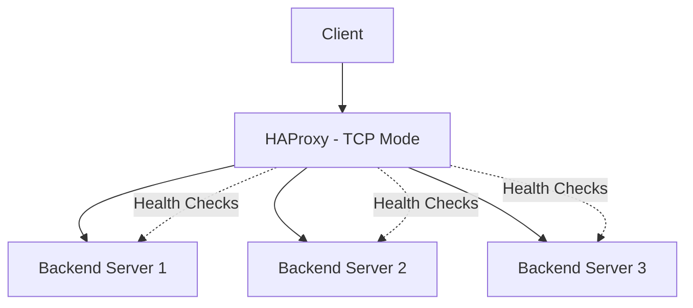

# How to Run HAProxy in Docker for TCP Load Balancing

Author: [nawazdhandala](https://github.com/nawazdhandala)

Tags: Docker, HAProxy, Load Balancing, TCP, Networking, Reverse Proxy, High Availability

Description: Configure HAProxy in Docker for TCP load balancing across backend services with health checks, sticky sessions, and TLS termination.

---

HAProxy is one of the most widely deployed load balancers in the world. It powers the infrastructure behind major websites and handles millions of concurrent connections with minimal resource usage. While many people know HAProxy for HTTP load balancing, its TCP mode is equally powerful for load balancing databases, message queues, mail servers, and any other TCP-based service.

This guide focuses specifically on running HAProxy in Docker for TCP (Layer 4) load balancing. You will learn how to distribute connections across multiple backend servers, configure health checks, enable sticky sessions, and set up TLS passthrough.

## TCP vs HTTP Load Balancing

HTTP load balancing operates at Layer 7 and can inspect request headers, URLs, and cookies to make routing decisions. TCP load balancing operates at Layer 4 and works with raw TCP connections. TCP mode is the right choice when you need to load balance non-HTTP protocols, or when you want the load balancer to pass encrypted traffic through without terminating TLS.



## Quick Start

Get HAProxy running in TCP mode with a minimal configuration.

```bash
# Create a directory for HAProxy configuration
mkdir -p /opt/haproxy

# Start HAProxy with a bind-mounted configuration file
docker run -d \
  --name haproxy \
  -p 3306:3306 \
  -v /opt/haproxy/haproxy.cfg:/usr/local/etc/haproxy/haproxy.cfg:ro \
  haproxy:2.9-alpine
```

## Basic TCP Configuration

Create a haproxy.cfg file that distributes MySQL connections across three database replicas.

```bash
# haproxy.cfg - TCP load balancing for MySQL replicas
# This configuration distributes read queries across three MySQL servers

global
    # Run HAProxy in the foreground (required for Docker)
    daemon
    maxconn 4096
    log stdout format raw local0

defaults
    mode tcp
    log global
    option tcplog
    timeout connect 10s
    timeout client 30m
    timeout server 30m
    retries 3

# Frontend receives incoming MySQL connections on port 3306
frontend mysql_frontend
    bind *:3306
    default_backend mysql_servers

# Backend defines the pool of MySQL servers to balance across
backend mysql_servers
    balance roundrobin
    option mysql-check user haproxy
    server mysql1 192.168.1.10:3306 check inter 5s rise 2 fall 3
    server mysql2 192.168.1.11:3306 check inter 5s rise 2 fall 3
    server mysql3 192.168.1.12:3306 check inter 5s rise 2 fall 3

# Stats page for monitoring (accessible via HTTP)
listen stats
    bind *:8404
    mode http
    stats enable
    stats uri /stats
    stats refresh 10s
    stats admin if LOCALHOST
```

## Docker Compose with Multiple Frontends

A real deployment usually balances several services at once. This Compose file runs HAProxy alongside a stats dashboard.

```yaml
# docker-compose.yml for HAProxy TCP load balancing
# Balances MySQL, Redis, and PostgreSQL across backend pools
version: "3.8"

services:
  haproxy:
    image: haproxy:2.9-alpine
    container_name: haproxy-lb
    restart: unless-stopped
    ports:
      - "3306:3306"    # MySQL
      - "6379:6379"    # Redis
      - "5432:5432"    # PostgreSQL
      - "8404:8404"    # Stats dashboard
    volumes:
      - ./haproxy.cfg:/usr/local/etc/haproxy/haproxy.cfg:ro
    sysctls:
      # Allow HAProxy to handle a large number of simultaneous connections
      - net.ipv4.ip_local_port_range=1024 65535
      - net.core.somaxconn=4096
    healthcheck:
      test: ["CMD", "haproxy", "-c", "-f", "/usr/local/etc/haproxy/haproxy.cfg"]
      interval: 30s
      timeout: 5s
      retries: 3
    networks:
      - lb-net

networks:
  lb-net:
    driver: bridge
```

## Multi-Service TCP Configuration

Here is a comprehensive configuration that handles multiple TCP services.

```bash
# haproxy.cfg - Multi-service TCP load balancer
# Balances MySQL, Redis, and PostgreSQL traffic

global
    maxconn 10000
    log stdout format raw local0
    # Run in non-daemon mode for Docker
    stats socket /var/run/haproxy.sock mode 660 level admin

defaults
    mode tcp
    log global
    option tcplog
    option dontlognull
    timeout connect 5s
    timeout client 60m
    timeout server 60m
    timeout check 5s
    retries 3

# ---- MySQL Load Balancing ----
frontend mysql_front
    bind *:3306
    default_backend mysql_back

backend mysql_back
    balance roundrobin
    # MySQL-specific health check using a dedicated haproxy user
    option mysql-check user haproxy
    server mysql-primary 10.0.1.10:3306 check inter 3s rise 2 fall 3
    server mysql-replica1 10.0.1.11:3306 check inter 3s rise 2 fall 3
    server mysql-replica2 10.0.1.12:3306 check inter 3s rise 2 fall 3

# ---- Redis Load Balancing ----
frontend redis_front
    bind *:6379
    default_backend redis_back

backend redis_back
    balance roundrobin
    # Redis health check sends PING and expects +PONG
    option tcp-check
    tcp-check send PING\r\n
    tcp-check expect string +PONG
    server redis1 10.0.2.10:6379 check inter 3s rise 2 fall 3
    server redis2 10.0.2.11:6379 check inter 3s rise 2 fall 3
    server redis3 10.0.2.12:6379 check inter 3s rise 2 fall 3

# ---- PostgreSQL Load Balancing ----
frontend postgres_front
    bind *:5432
    default_backend postgres_back

backend postgres_back
    balance leastconn
    # PostgreSQL health check validates that the server is accepting connections
    option pgsql-check user haproxy
    server pg-primary 10.0.3.10:5432 check inter 3s rise 2 fall 3
    server pg-replica1 10.0.3.11:5432 check inter 3s rise 2 fall 3
    server pg-replica2 10.0.3.12:5432 check inter 3s rise 2 fall 3

# ---- Statistics Dashboard ----
listen stats
    bind *:8404
    mode http
    stats enable
    stats uri /stats
    stats refresh 5s
    stats show-legends
    stats show-node
```

## Load Balancing Algorithms

HAProxy supports several algorithms for TCP mode. Choose based on your workload pattern.

**roundrobin** distributes connections sequentially across servers. It works well when all backends have similar capacity.

**leastconn** sends new connections to the server with the fewest active connections. This is ideal for long-lived connections like database sessions.

**source** hashes the client's IP address to always route the same client to the same server. Useful for basic session persistence without protocol-level stickiness.

```bash
# Example: source-based sticky routing for database connections
backend db_sticky
    balance source
    hash-type consistent
    server db1 10.0.1.10:3306 check weight 100
    server db2 10.0.1.11:3306 check weight 100
```

## TCP Health Checks

HAProxy can perform protocol-aware health checks. Here are examples for common services.

```bash
# Generic TCP connection check (works with any service)
backend generic_tcp
    option tcp-check
    server app1 10.0.1.10:8080 check inter 5s

# SMTP mail server health check
backend smtp_servers
    option tcp-check
    tcp-check expect string 220
    server mail1 10.0.4.10:25 check

# LDAP server health check
backend ldap_servers
    option tcp-check
    tcp-check connect
    tcp-check send-binary 300c0201 01600702 01030400 8000
    tcp-check expect binary 0a0100
    server ldap1 10.0.5.10:389 check
```

## TLS Passthrough

When you want end-to-end encryption without terminating TLS at the load balancer, use TCP mode with SNI-based routing.

```bash
# TLS passthrough configuration
# HAProxy inspects the SNI header to route to the correct backend
# without decrypting the traffic

frontend tls_passthrough
    bind *:443
    mode tcp
    # Wait briefly to capture the SNI header from the TLS ClientHello
    tcp-request inspect-delay 5s
    tcp-request content accept if { req_ssl_hello_type 1 }

    # Route based on the SNI hostname
    use_backend web_servers if { req_ssl_sni -i web.example.com }
    use_backend api_servers if { req_ssl_sni -i api.example.com }
    default_backend web_servers

backend web_servers
    mode tcp
    server web1 10.0.6.10:443 check
    server web2 10.0.6.11:443 check

backend api_servers
    mode tcp
    server api1 10.0.7.10:443 check
    server api2 10.0.7.11:443 check
```

## Connection Draining

When removing a backend server for maintenance, drain connections gracefully.

```bash
# Use the HAProxy runtime API to drain a server
# This stops new connections but lets existing ones finish
docker exec haproxy-lb sh -c "echo 'set server mysql_back/mysql-replica2 state drain' | socat stdio /var/run/haproxy.sock"

# Check the server status
docker exec haproxy-lb sh -c "echo 'show servers state' | socat stdio /var/run/haproxy.sock"

# Disable the server completely after connections drain
docker exec haproxy-lb sh -c "echo 'set server mysql_back/mysql-replica2 state maint' | socat stdio /var/run/haproxy.sock"
```

## Reloading Configuration Without Downtime

HAProxy supports graceful reloads, which is critical for production environments.

```bash
# Validate the configuration before reloading
docker exec haproxy-lb haproxy -c -f /usr/local/etc/haproxy/haproxy.cfg

# Reload HAProxy with zero downtime
# The -sf flag tells HAProxy to gracefully replace the running process
docker kill -s HUP haproxy-lb
```

## Monitoring and Observability

The stats page gives you real-time visibility into your load balancer. Access it at http://your-server:8404/stats after starting HAProxy. For programmatic monitoring, use the CSV stats endpoint.

```bash
# Fetch backend stats in CSV format for processing
curl -s "http://localhost:8404/stats;csv"

# Extract just the backend server statuses
curl -s "http://localhost:8404/stats;csv" | grep "mysql_back" | cut -d',' -f2,18
```

Integrate these stats with monitoring tools like OneUptime, Prometheus, or Grafana for alerting and historical analysis.

## Production Tips

Run HAProxy with appropriate system tuning on the Docker host. Increase the file descriptor limit to handle thousands of concurrent connections. Use the `leastconn` algorithm for database load balancing where connection durations vary widely. Enable logging to track connection patterns and troubleshoot issues. Always validate your configuration file before applying changes. Set meaningful timeouts - overly long timeouts waste resources, while short ones cause spurious disconnections.

HAProxy in Docker gives you enterprise-grade TCP load balancing in a portable, reproducible package. Whether you are distributing database reads, balancing message queue consumers, or routing encrypted traffic, HAProxy handles it efficiently and reliably.
